[24.4 <--- ](24_4.md) [   Зміст   ](README.md) [--> 24.6](24_6.md)

## 24.5 EXAMPLE: PRESSURE-CONTROLLED SERVO VALVE

### 24.5.1 Model Definition

This section demonstrates the derivation and implementation in the MathWorks Simulink® [16] product of a hybrid-system model for the hydraulic circuit shown in Figure 24.2. The circuit consists of a two-stage servo valve controlling the pressure in a 6 m long hydraulic pipe that is terminated at one end. The first stage in the servo valve consists of a flapper mechanism driven by a torque motor. The second stage spool is acted upon by a pilot pressure from the first stage as well as a spring force to center the spool when not under load. In addition, there is a small internal volume of fluid within the valve that acts on the spool and provides a feedback mechanism to control the pressure at the output port. A more detailed description of the operation and use of the servo valve is provided in Ref. [17].

У цьому розділі демонструється створення та реалізація в продукті MathWorks Simulink® [16] моделі гібридної системи для гідравлічного контуру, показаного на малюнку 24.2. Контур складається з двоступеневого сервоклапана, який контролює тиск у гідравлічній трубі довжиною 6 м, яка закінчується на одному кінці. Перший ступінь сервоклапана складається з механізму заслінки, що приводиться в рух моментним двигуном. На золотник другого ступеня діє керуючий тиск від першого ступеня, а також сила пружини, щоб центрувати золотник, коли він не під навантаженням. Крім того, усередині клапана є невеликий внутрішній об’єм рідини, який діє на золотник і забезпечує механізм зворотного зв’язку для контролю тиску у вихідному порту. Більш детальний опис роботи та використання сервоклапана наведено в Ref. [17].

The signal flow diagram in [Figure 24.3 ](#_bookmark150)shows the fluid flow into the four internal junctions (circles) due to either flow through connecting orifices (solid lines) or the motion of the spool itself (dashed lines). The aim is to simulate the dynamics of the servo valve when the fluid within these small connecting volumes is assumed to be incompressible.

Діаграма потоку сигналу на [Рисунок 24.3 ](#_bookmark150) показує потік рідини в чотирьох внутрішніх з’єднаннях (кола) або через потік через з’єднувальні отвори (суцільні лінії), або через рух самого золотника (пунктирні лінії). Мета полягає в тому, щоб змоделювати динаміку сервоклапана, коли рідина в цих малих сполучних об’ємах вважається нестисливою.

[Table 24.1 ](#_bookmark149)provides a description of each of the parameters within the model, along with representative numerical values. The level of detail within this model is typical of an initial system-level definition before more detailed performance models are developed.

[Таблиця 24.1 ](#_bookmark149) надає опис кожного параметра в моделі разом із типовими числовими значеннями. Рівень деталізації в цій моделі типовий для початкового визначення системного рівня до того, як будуть розроблені більш детальні моделі продуктивності.

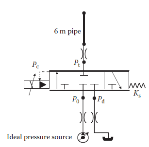

**FIGURE 24.2** Circuit schematic for pressure-controlled servo valve.

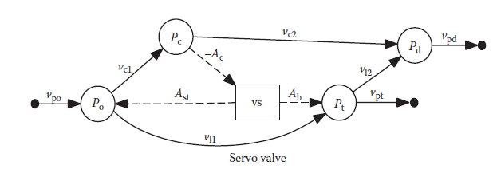

**FIGURE 24.3** Signal flow diagram for pressure-controlled servo valve.

 

**TABLE** **24.1**  **Description** **of** **Servo** **Valve** **Parameters** 

| **Parameter**       | **Description**                        | **Value**  |
| ------------------- | -------------------------------------- | ---------- |
| *A*b                | Spool  feedback pressure area          | 2.10 mm2   |
| *A*c                | Spool control  pressure area           | 4.19 mm2   |
| *A*c1, *A*c2        | Flapper  nozzle areas                  | —          |
| *A*l1, *A*l2        | Flow areas  of second-stage orifices   | —          |
| *A*smax             | Maximum orifice area                   | 1.64 mm2   |
| *A*n                | Maximum  nozzle area                   | 0.0341 mm2 |
| *A*po, *A*pt, *A*pd | Flow areas  at servo ports             | 230 mm2    |
| *A*st               | Spool stub area                        | 0.261 mm2  |
| *R*p                | Pipe radius                            | 8.56 mm    |
| βe                  | Fluid bulk  modulus                    | 580 MPa    |
| ρ                   | Fluid density                          | 860  kg/m3 |
| *g*f                | Flapper current gain                   | 0.003 mm/A |
| *K*f                | Flapper stiffness constant             | 23.5  N/mm |
| *K*s                | Spool spring constant                  | 14.2  N/mm |
| *P*c                | Internal  junction pressure            | —          |
| *P*d                | Pressure at return port                | —          |
| *P*o                | Pressure at supply port                | —          |
| *P*r                | Return pressure                        | 5 bar      |
| *P*s                | Supply pressure                        | 210 bar    |
| *P*t                | Pressure at output port                | —          |
| *v*c1, *v*c2        | Velocity of fluid through  first stage | —          |
| *v*l1, *v*l2        | Velocity of fluid through second stage | —          |
| *v*po, *v*pt, *v*pd | Velocity of fluid through servo ports  | —          |
| *v*s                | Spool velocity                         | —          |
| *x*d                | Flapper displacement                   | —          |
| *x*f                | Flapper  displacement at nozzle        | —          |
| *x*l                | Lapped region                          | 0.0254 mm  |
| *x*fmax             | Maximum flapper  displacement          | 0.0305 mm  |
| *x*s                | Spool displacement                     | —          |
| *x*smax             | Maximum spool  displacement            | 0.381 mm   |
| τm                  | Torque motor  time constant            | 1 ms       |

### 24.5.2 Model Dynamics

Some parts of the model are represented by systems of ODEs that are simulated using standard solvers. The response of the flapper (*x*d) in Figure 24.4 to a change in input current (*i*y) to the torque motor is assumed to be first order with a time constant equal to τm. The transfer function is given in Equation 24.46, where *g*f provides the steady-state gain between the current input and the achieved flapper displacement.

Деякі частини моделі представлені системами ODE, які моделюються за допомогою стандартних вирішувачів. Припускається, що реакція заслінки (*x*d) на малюнку 24.4 на зміну вхідного струму (*i*y) для моментного двигуна має перший порядок із постійною часу, що дорівнює τm. Передавальна функція наведена в рівнянні 24.46, де *g*f забезпечує стабільний коефіцієнт підсилення між поточним входом і досягнутим переміщенням заслінки.

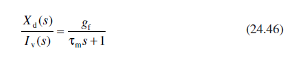 

The displacement of the flapper *x*f at the nozzle is then given in Equation 24.47, where *K*f is the flapper spring constant, *A*n is the null position area, and *X*fb is a bias. The resulting flapper nozzle areas are given by Equation 24.48.

Потім переміщення заслінки *x*f на соплі вказується у рівнянні 24.47, де *K*f — постійна пружини заслінки, *A*n — площа нульового положення, а *X*fb — зсув. Результуюча площа сопла заслінки задана рівнянням 24.48.

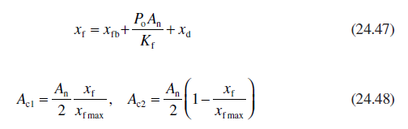 

Although the fluid within the servo is treated as incompressible, the fluid within the connected pipe is treated as compressible as the volume of fluid is significantly greater than that within the servo valve. The compressibility also provides an important memory of the fluid pressure when the valve is centered, and the pipe is effectively isolated from the rest of the system. For this example, the fluid pressure *P* within the pipe is determined from Equation 24.49, where βe is the effective bulk modulus, *V*p is the volume of fluid within the pipe, and the flow rate *Q*t is determined in Equation 24.50. Treating the fluid in this case as a single lumped volume is a simplistic representation used to demonstrate the methodology. More detailed transmission line dynamic models described in Ref. [17] could equally have been used to investigate pressure peaking and oscillations following step inputs from the valve.

Незважаючи на те, що рідина всередині сервоприводу вважається нестисливою, рідина всередині підключеної труби вважається стисливою, оскільки об’єм рідини значно більший, ніж об’єм у сервоклапані. Стисливість також забезпечує важливу пам’ять про тиск рідини, коли клапан відцентровано, а труба ефективно ізольована від решти системи. Для цього прикладу тиск рідини *P* у трубі визначається за рівнянням 24.49, де βe — ефективний об’ємний модуль, *V*p — об’єм рідини в трубі, а швидкість потоку *Q*t визначається у рівнянні 24.50. Розгляд рідини в цьому випадку як єдиного зосередженого об’єму є спрощеним уявленням, яке використовується для демонстрації методології. Більш детальні динамічні моделі лінії електропередач описані в Ref. [17] також можна було б використати для дослідження піків тиску та коливань після ступінчастих входів від клапана.

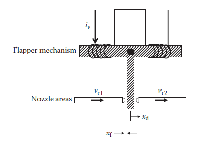

**FIGURE 24.4** First-stage flapper displacement and nozzle area.

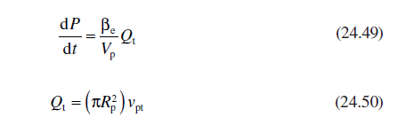

### 24.5.3 Mode Transition (Finite State Machine)

The discrete modes of operation must be established before the model dynamics can be derived. The modes can be defined by the relationship between the orifice areas and the position of the flapper or spool. The fluid flows through the second stage of the valve at speeds *v*l1 and *v*l2, and the respective orifice areas *A*l1 and *A*l2 are functions of the spool position shown in Figure 24.5. The figure shows that there are five discrete modes depending on whether the spool has reached its end stops (in which case *v*s = 0), or whether the orifices are fully closed in which case either *v*l1 = 0 or *v*l2 = 0. The flapper mechanism provides three additional modes depending on whether the flapper blocks one of the nozzle areas. In total, there are 15 discrete modes, and each has its own defined set of minimal order dynamic equations.

Дискретні режими роботи повинні бути встановлені до того, як можна буде отримати динаміку моделі. Режими можна визначити співвідношенням між площами отворів і положенням заслінки або золотника. Рідина протікає через другий ступінь клапана зі швидкостями *v*l1 і *v*l2, а відповідні площі отворів *A*l1 і *A*l2 є функціями положення золотника, показаного на малюнку 24.5. На малюнку показано, що існує п’ять дискретних режимів залежно від того, чи досягла золотника кінцевих упорів (у цьому випадку *v*s = 0), або чи повністю закриті отвори, у цьому випадку або *v*l1 = 0, або * v*l2 = 0. Механізм заслінки забезпечує три додаткові режими в залежності від того, чи блокує заслінка одну з зон сопла. Загалом існує 15 дискретних режимів, і кожен має власний набір динамічних рівнянь мінімального порядку.

Control over switching between sets of dynamic equations is governed by the finite state machine implemented using the MathWorks Stateflow® product [18] and shown in [Figure 24.6](#_bookmark151). The flapper and the spool are controlled through two independent parallel states. The transition between modes is governed by events triggered by a zero-crossing signal in the model. Events can occur because of either an orifice opening or closing or contact between a physical object and its end-stop. In the case of contact occurring, the subsequent release of the object is triggered by a change in sign of the calculated reaction force.

Контроль над перемиканням між наборами динамічних рівнянь регулюється кінцевим автоматом, реалізованим за допомогою продукту MathWorks Stateflow® [18] і показаним на [Рис. 24.6] (#_bookmark151). Заслонка та золотник керуються двома незалежними паралельними станами. Перехід між режимами регулюється подіями, викликаними сигналом перетину нуля в моделі. Події можуть відбуватися через відкриття або закриття отвору або через контакт між фізичним об’єктом і його кінцевим упором. У разі виникнення контакту наступне звільнення об'єкта викликається зміною знака розрахункової сили реакції.

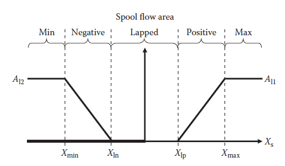

**FIGURE 24.5** Second-stage orifice areas versus spool position.

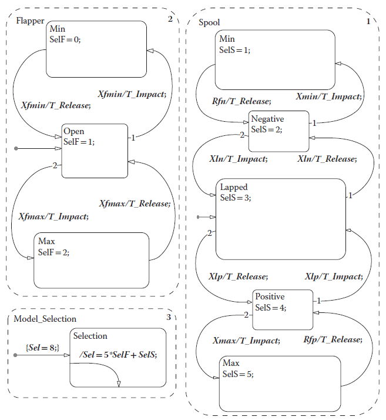

**FIGURE 24.6** Finite state machine for pressure-controlled servo valve.

The very nature of the finite state machine representation means that it is ideal for including additional features that are of interest to the control engineer. In particular, the effect on the system behavior of introducing faults into the system is easily investigated by introducing trigger signals that force the model to transition into a failure state. An example where this would be appropriate is the case where a valve becomes stuck open or closed and cannot move until the failure is cleared.

Сама природа представлення кінцевого автомата означає, що воно ідеально підходить для включення додаткових функцій, які цікавлять інженера з управління. Зокрема, вплив на поведінку системи внесення несправностей у систему легко досліджувати шляхом введення тригерних сигналів, які змушують модель переходити в стан відмови. Прикладом, коли це було б доцільно, є випадок, коли клапан застряг у відкритому або закритому стані і не може рухатися, доки несправність не буде усунена.

### 24.5.4 DAE E quations (“Positive” Mode)

This section defines the system of DAEs when the spool is in the *Positive* mode where the orifice between the return line and the outlet port (*A*l2) is fully closed. The full velocity state vector and the internal junction pressures are defined in Equation 24.51. Two mass cases are considered for comparison. The first assumes that that there is a small mass of fluid in each line and in the second case all the mass elements are assumed to be negligible and are set to zero. If there is a zero mass matrix, then the dynamics of the flow through the servo valve reduces to a system of algebraic equations that must be solved at each time step for the reduced order state vector.

У цьому розділі визначено систему DAE, коли золотник знаходиться в режимі *Positive*, де отвір між зворотною лінією та випускним портом (*A*l2) повністю закрито. Вектор стану повної швидкості та тиск у внутрішньому з’єднанні визначено у рівнянні 24.51. Для порівняння розглядаються два масових випадки. Перший передбачає, що в кожній лінії є невелика маса рідини, а в другому випадку всі елементи маси вважаються незначними та встановлюються рівними нулю. Якщо є матриця нульової маси, то динаміка потоку через сервоклапан зводиться до системи алгебраїчних рівнянь, які необхідно розв’язувати на кожному кроці за часом для вектора стану приведеного порядку.

 

The flow constraints at the junctions are defined by the matrix **WJ** given in Equation 24.52. These constraints are maintained for all modes of operation and can be considered to be configuration constraints. The additional constraint (**WC**) introduced because of the closed orifice *A*l2 is given in Equation 24.53.

Обмеження потоку на стиках визначаються матрицею **WJ**, наведеною у рівнянні 24.52. Ці обмеження зберігаються для всіх режимів роботи і можуть вважатися обмеженнями конфігурації. Додаткове обмеження (**WC**), введене через закритий отвір *A*l2, подано в рівнянні 24.53.

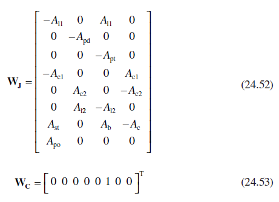

In this mode, there are eight velocity states and five linear constraints. This leads to a minimum order system consisting of three independent states. The selection of the independent states from the full state vector is made by direct inspection of the symbolically derived basis vectors for the null space of the constraint matrix. The derived symbolic matrix is shown in Equation 24.54, with the rows and columns rearranged so that the order of the states is consistent with that in Equation 24.11.

У цьому режимі є вісім станів швидкості та п’ять лінійних обмежень. Це призводить до системи мінімального порядку, що складається з трьох незалежних станів. Вибір незалежних станів із повного вектора стану здійснюється шляхом прямого перегляду символічно отриманих базисних векторів для нульового простору матриці обмежень. Отриману символічну матрицю показано у рівнянні 24.54, у якому рядки та стовпці переставлено таким чином, щоб порядок станів відповідав порядку в рівнянні 24.11.

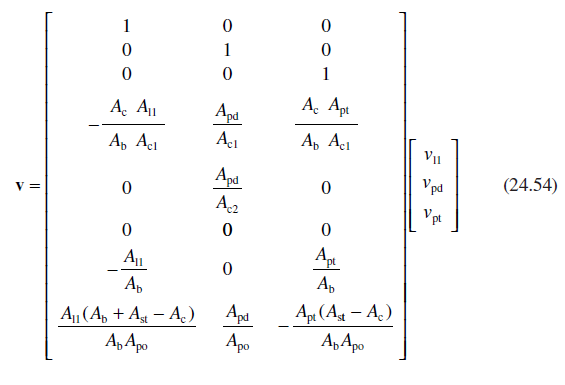

### 24.5.5 Simulation Results

The simulated responses to a series of step changes in demanded output pressure are shown in [Figures 24.7 ](#_bookmark152)and 24.8. Each figure shows the simulation results from the following four model implementations:

1. An incompressible fluid model with a full mass matrix

2. An incompressible fluid model with all masses within the servo made equal to zero

3. A purely compressible fluid model, simulated using a “stiff” solver

4. An incompressible fluid model with a zero mass matrix running in discrete time (updated at 1000 Hz)

Змодельовані відповіді на серію ступінчастих змін необхідного вихідного тиску показано на [Рис. 24.7 ](#_bookmark152) і 24.8. На кожному малюнку показано результати моделювання за такими реалізаціями моделі:

1. Модель нестисливої рідини з повною матрицею мас

2. Модель нестисливої рідини, у якій усі маси в сервоприводі дорівнюють нулю

3. Модель чисто стисливої рідини, змодельована за допомогою «жорсткого» вирішувача

4. Модель нестисливої рідини з матрицею нульової маси, що працює в дискретному часі (оновлена на 1000 Гц)

Figure 24.7 shows for each of the above models the pressure at the internal junction within the servo valve and the controlled pressure at the output port. [Figure 24.8](#_bookmark152) shows the spool position and the resulting flow into the pipe. The dynamic response of each model implementation is very close, demonstrating that little accuracy has been lost by making the assumption that small volumes of fluid within the servo valve act instantaneously.

На малюнку 24.7 для кожної з наведених вище моделей показано тиск у внутрішньому з’єднанні в сервоклапані та контрольований тиск на вихідному порту. [Малюнок 24.8](#_bookmark152) показує положення золотника та кінцевий потік у трубу. Динамічний відгук кожної реалізації моделі дуже близький, демонструючи, що було втрачено незначну точність через припущення, що невеликі об’єми рідини всередині сервоклапана діють миттєво.

The transition between systems of reduced order dynamic equations is demonstrated in [Figure 24.9](#_bookmark154), which shows the spool position and the identification number for the model that is being executed. The plot demonstrates that all five modes relating to the second-stage spool have been entered during the simulation.

Перехід між системами динамічних рівнянь приведеного порядку демонструється на [Рисунок 24.9] (#_bookmark154), де показано положення котушки та ідентифікаційний номер для моделі, яка виконується. Графік демонструє, що під час моделювання було введено всі п’ять режимів, пов’язаних із золотником другого ступеня.

A comparison of the average time taken to run each of the Simulink models is shown in [Table 24.2](#_bookmark153). The models were simulated using MathWorks MATLAB® version R2006b, running on a PC with an Intel® Dual Core2 CPU running at 2.13 GHz. Model (1) clearly takes the longest time to simulate, demonstrating the detrimental effect of introducing small masses of fluid to act as connecting elements. By comparison, the simulation time of Model (3) is significantly faster, demonstrating that current “stiff” solvers are very efficient. Simulating this model using the default variable step solver (ODE45) proved to be prohibitively slow by comparison. The simulation time of Model (2) is less than half that of Model (3), which demonstrates the proposed aim of this work, namely that being able to take larger time steps during the simulation because of the removal of the high-frequency modes outweighs the additional computational overhead to implement a DAE solver. The greatest improvement in runtime is achieved with Model (4) where all the continuous time integrators were replaced with discrete time states, and the very fast dynamics of the torque motor were replaced by a constant gain.

Порівняння середнього часу, необхідного для запуску кожної з моделей Simulink, показано в [таблиці 24.2] (#_bookmark153). Моделі були змодельовані за допомогою MathWorks MATLAB® версії R2006b, що працює на ПК з двоядерним процесором Intel® Dual Core2, що працює на частоті 2,13 ГГц. Модель (1) явно займає найбільше часу для моделювання, демонструючи згубний ефект введення малих мас рідини, які діють як сполучні елементи. Для порівняння, час моделювання моделі (3) значно швидший, демонструючи, що поточні «жорсткі» розв’язувачі є дуже ефективними. Симуляція цієї моделі за допомогою стандартного розв’язувача змінних кроків (ODE45) виявилася надзвичайно повільною порівняно з цим. Час моделювання моделі (2) менше половини часу моделювання моделі (3), що демонструє запропоновану мету цієї роботи, а саме можливість робити більші часові кроки під час моделювання через видалення високочастотних мод. переважує додаткові обчислювальні витрати для реалізації розв’язувача DAE. Найбільше покращення часу роботи досягається за допомогою моделі (4), де всі інтегратори безперервного часу були замінені на дискретні часові стани, а дуже швидку динаміку моментного двигуна було замінено постійним посиленням.

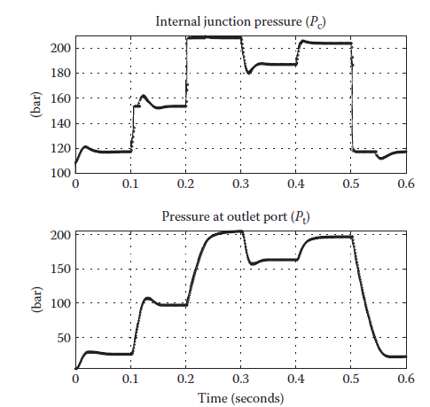

**FIGURE 24.7** Simulated junction pressures: incompressible with a full mass matrix (solid line); incompressible with a singular mass matrix (dashdot line); compressible (dashed line); incompressible with a singular mass matrix and discrete time (dotted line).

**МАЛЮНОК 24.7** Змодельований тиск у з’єднанні: нестислива з матрицею повної маси (суцільна лінія); нестислива з особливою матрицею мас (штрихпунктирна лінія); стисливий (штрихова лінія); нестислива з сингулярною матрицею мас і дискретним часом (пунктир).

 

**FIGURE 24.8** Simulated servo valve spool position and resulting flow rate into pipe.

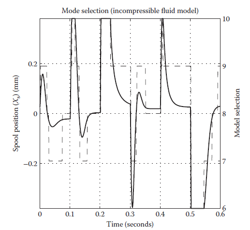

**FIGURE 24.9** Simulated switching behavior of the spool position (solid line) and the corresponding model selection (dashed line).

**TABLE** **24.2** **Average** **Simulink** **Runtime** **(Simulated** **Time** **=** **0.6** **s)**

| **Model** | **Fluid** **Type** | **Mass** **Matrix** | **Solver** | **Time** **(s)** |
| --------- | ------------------ | ------------------- | ---------- | ---------------- |
| 1         | Incompressible     | Full                | ODE45      | 37.76            |
| 2         | Incompressible     | Singular            | ODE45      | 0.79             |
| 3         | Compressible       | —                   | ODE23tb    | 1.90             |
| 4         | Incompressible     | Singular            | Discrete   | 0.31             |

[24.4 <--- ](24_4.md) [   Зміст   ](README.md) [--> 24.6](24_6.md)