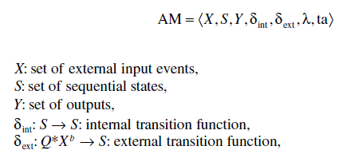
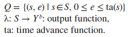
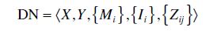
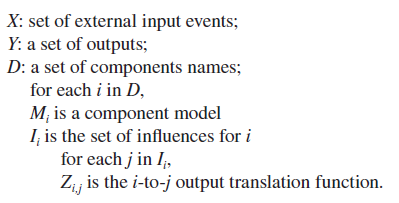
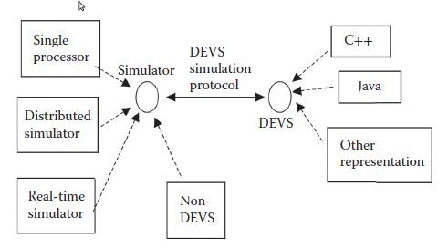
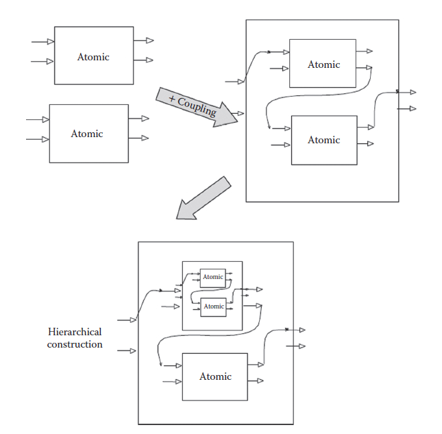
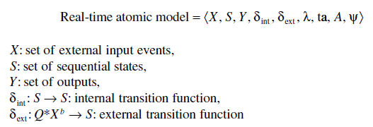
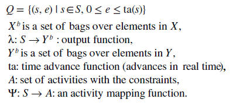
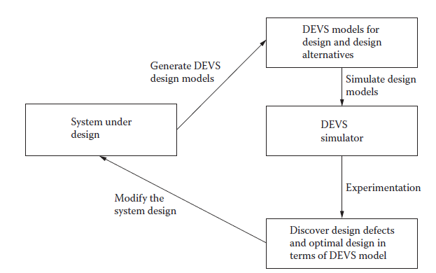

[2.2 <--- ](2_2.md) [   Зміст   ](README.md) [--> 2.4](2_4.md)

## 2.3. DEVS ЯК ІНСТРУМЕНТ ФОРМАЛІЗАЦІЇ ПРОЕКТУ НА ОСНОВІ МОДЕЛІ

Як ми представили, DEVS відокремлює системні моделі від їхніх симуляторів, таким чином, він ізначально підтримує формальний підхід до системного проектування на основі моделі. У цьому розділі ми обговоримо деякі передумови DEVS як ефективного інструменту моделе-базованого системного проектування. Щоб підготувати основу для обговорення DEVS, ми розглядаємо моделе-базоване системне проектування. 

### 2.3.1 Моделе-базоване системне проектування 

Зі швидким розвитком сучасних комп’ютерних систем все більшої ролі набуває формалізований процес проектування системи, зокрема, для проектування розподілених комп’ютерних систем реального часу. Традиційно проектування таких систем не залежить від їх впровадження, тестування та перевірки проекту. Таким чином, загальна практика проектування займає багато часу та схильна до помилок. Моделе-базоване проектування є одним із сучасних підходів до проектування складних систем. Він заснований на проектних моделях, які намагаються зафіксувати ключові параметри проекту системи, і, як правило, вимагає використання формальних мов специфікації системи, таких як автомати з синхронізацією та DEVS. Наприклад, Шульц і Розенбліт [1] запропонували новий метод кодування системи з використанням формальної мови специфікації, такої як DEVS, для допомоги при проектуванні вбудованих систем. Hu та Zeigler [2] запропонували структуру проектування на основі моделі для динамічних розподілених систем реального часу, яка вводить концепцію «безперервності моделі», яку вона широко використовує. Дійсно, вбудовані системи та розподілені системи реального часу не є єдиними областями, в яких застосовувався формальний підхід моделе-базового проектування. 

На проектування сучасних VE (virtual environment) також впливає концепція моделе-базованого підходу. Була досліджена доцільність і ефективність використання цього підходу для проектування систем VE. Наприклад, VR-WISE (фреймворк моделювання віртуальної реальності) використовувався як інструмент для специфікації та розвитку поведінки [3]. Насправді це моделе-базований метод проектування, який робить проектування VE більш інтуїтивно зрозумілим. Однією з ключових переваг VR-WISE є те, що він потребує менше досвіду у віртуальної реальності та може використовуватися більшою аудиторією [3]. Подібним чином була представлена моделе-базована методологія проектування з використанням складових моделей [4], яка використовує тісно інтегроване середовище проектування для розроблення як форми, так і поведінки компонентів системи.

Дійсно, моделе-базваний підхід до проектування відкриває новий напрямок до вирішення складних розподілених комп’ютерних систем реального часу. Сфери застосування були розширені до VE, P2P-мереж у реальному часі та розподілених систем, що підтримують QoS, і це лише деякі з них. У порівнянні з традиційними підходами, моделе-базоване проектування, включає не тільки побудову точних моделей проектування, але також імітаційне моделювання для цієї моделі в попередньо визначених експериментальних рамках (**EF** experimental frame), за допомогою яких дефекти проекту можна легко зафіксувати на ранніх етапах проектування. Крім того, оптимальна конструкція системи можна легко виявити шляхом імітаційного моделювання альтернатив конструкцій. Тим часом перевірка моделі стає легкою завдяки використанню формальної мови специфікації.

### 2.3.2 DEVS and RT-DEVS

DEVS [5] — це математичний формалізм, спочатку розроблений для означення систем дискретних подій. DEVS є добре відомим теоретичним підходом до M&S (modeling and simulation), який залучив багатьох дослідників до надійної та ефективної системи M&S. Ключова ідея DEVS полягає у використанні «атомарних» моделей для вираження поведінки окремих компонентів і використання «зв’язаних» моделей для представлення взаємодії між компонентами в системі. Структура моделювання DEVS фундаментально підтримує повторне використання окремих моделей, а також забезпечує ефективну методологію для побудови ієрархічної моделі, яка, у свою чергу, може забезпечити максимальну гнучкість для системи M&S. Як новаторська формальна методологія M&S, DEVS забезпечує конкретну теоретичну основу моделювання, яка сприяє повністю об’єктно-орієнтованим методам M&S для вирішення сучасних складних задач M&S.

Таким чином, стандартний і базовий формалізм DEVS складається з двох формалізмів, одного для атомарних моделей (**AM**) і одного для пов’язаних моделей (coupled models). Атомний DEVS виражається наступним чином:

 

де

По суті, AM є будівельним блоком для більш складної пов’язаної моделі, яка означує нову модель, побудовану шляхом з’єднання основних компонентів моделі. Дві основні дії, пов’язані з означенням пов’язаної моделі, — це означення її компонентних моделей і означення зв’язків, які створюють бажані комунікаційні мережі. Таким чином, DEVS-зв’язана модель означується таким чином:

 

де

**РИСУНОК 2.1** Специфікація системи дискретних подій (DEVS) для каркасу моделювання та імітаційного моделювання. (Від Zhang, M., *До гнучкого та реконфігурованого розподіленого моделювання: новий підхід до розподіленого DEVS*, докторська дисертація, кафедра електротехніки та комп’ютерної інженерії, Університет Арізони, весна 2007 р. З дозволу.)

Каркас DEVS M&S дуже відрізняється від традиційних модульних і функціональних-базованих. Він забезпечує дуже гнучку та масштабовану основу M&S, розділяючи моделі та симулятори. На рисунку 2.1 показано, як компоненти моделі DEVS взаємодіють із симуляторами DEVS і не-DEVS за допомогою протоколу імітаційного моделювання DEVS. Ми також бачимо, що моделі DEVS взаємодіють одна з одною через симулятори DEVS. Відокремлення моделей від симуляторів є ключовим аспектом у DEVS, який має вирішальне значення для масштабованого моделювання та розподіленого моделювання, що підтримується проміжним програмним забезпеченням, наприклад із використанням CORBA (Common Object Request Broker Architecture), HLA (high-level architecture) і MPI (Message Passing Interface). 

Переваги такої структури очевидні, оскільки на розробку моделі фактично не впливають базові обчислювальні ресурси для виконання моделі. Таким чином, моделі зберігають можливість повторного використання та можуть бути збережені або отримані зі сховища моделей. Одна і та ж модельна система може бути виконана різними способами з використанням різних протоколів моделювання DEVS. У таких умовах зазвичай використовувані технології проміжного програмного забезпечення для паралельних і розподілених обчислень можуть бути легко застосовані на окремо розроблених моделях DEVS. Таким чином, у структурі DEVS компоненти моделі можна легко перенести з одного процесора на багатопроцесорний і навпаки.

Якщо ми ближче подивимося на структуру моделювання на основі DEVS, то виявимо, що вона базується на техніці побудови ієрархічної моделі, як показано на рис. 2.2. Наприклад, пов’язану модель отримують шляхом додавання до набору AM специфікації зв’язку. Потім цю пов’язану модель можна використовувати як компонент у більшій системі з новими компонентами. Ієрархічна пов’язана модель може бути створена рівень за рівнем шляхом додавання набору компонентів моделі (або атомарних, або пов’язаних), а також інформації про зв’язок між цими компонентами. Отже, створюється багаторазове сховище моделей для розробників. Структура моделювання на основі DEVS також підтримує компонент моделі як «чорний ящик», де внутрішні елементи моделі приховані, а через порти введення/виведення доступні лише її поведінка.

**Рис. 2.2** З’єднані модулі, утворені за допомогою з’єднання, і їх використання як компонентів. (Від Zhang, M., *До гнучкого та реконфігурованого розподіленого моделювання: новий підхід до розподіленого DEVS*, докторська дисертація, кафедра електротехніки та комп’ютерної інженерії, Університет Арізони, весна 2007 р. З дозволу.)

Один цікавий аспект формалізму DEVS полягає в тому, що пов’язану модель DEVS можна виразити як еквівалентну базову модель (або AM), і тому моделі DEVS дотримуються замкненості під зв’язком (closure under coupling). Така еквівалентна базова модель, отримана з пов’язаної моделі, може бути використана у більшій пов’язаній моделі. Таким чином, формалізм DEVS забезпечує надійну структуру композиції, яка підтримує замикання під зв’язком та ієрархічну побудову.

RT-DEVS розширює вищезазначені базові DEVS для застосувань M&S у реальному часі. Він відрізняється від базового DEVS тим, що до існуючого атомарного DEVS додаються набір дій *A* і пов’язана з ним функція відображення $ψ$. Це потрібно для того, щоб для моделей DEVS у їхньому середовищі забезпечити можливості взаємодії в реальному часі. Таким чином, різні компоненти моделі в системі реального часу можуть бути однорідно інкапсульовані цим новим формалізмом. Дійсно, формалізм RT-DEVS спрямований на вирішення дискретних системних задач, заснованих на подіях, через вимогу реального часу та здатний означити розподілені системи реального часу як моделі DEVS. Формалізм RT-DEVS означено Хонгом і Кімом [26], а атомарна модель RT-DEVS може бути виражена таким чином:

де

 

Як розширення стандартного DEVS у реальному часі, RT-DEVS закладає основу для використання DEVS для проектування системи, коли питання реального часу є ключовими для успішного проектування. Насправді RT-DEVS був прийнятий багатьма дослідниками як фундаментальний метод для дослідження важкопрогнозованої поведінки складних розподілених систем реального часу. Порівняно з іншими мовами формальних специфікацій реального часу, RT-DEVS розширює всі переваги стандартного DEVS, що робить методи проектування системи більш ефективними та надійними.

### 2.3.3 DEVS як формалізована допомога для проектування системи

Як обговорювалося раніше, в останні роки багато формальних мов використовувалися для допомоги в проектуванні системи, включаючи UML [27], часові автомати [28], мережі Петрі [29] і діаграми станів [30]. Однак значною мірою ці формальні мови не дуже підходять для проектування великомасштабних і складних систем через відсутність ефективних керованих моделями рушіїв (симуляторів), багаторазових репозиторіїв моделей, гнучкої композиції моделей тощо.

DEVS [5] відрізнявся від цих формалізованих підходів проектування системи тим, що він може забезпечити більш ефективний каркас моделювання проектування системи, в якій альтернативи кснструкцій можна легко створити та змоделювати, як показано на рис. 2.3. Дійсно, моделе-базоване проектування DEVS використовувалося багатьма дослідниками для вирішення складних задач проектування системи. Ключові відмінності між DEVS та іншими формальними підходами полягають у тому, що DEVS підтримує багаторазову розробку ієрархічної моделі, а модель проектування DEVS можна моделювати в одній уніфікованій структурі для швидкого виявлення проблем проектування системи. Іншими словами, DEVS може значно полегшити виявлення проблем проектування, перевірку конструкції системи та визначення оптимальної конструкції системи.       

**Рисунок 2.3** Специфікація системи дискретних подій (DEVS) для моделе-базового проектування системи н.

[2.2 <--- ](2_2.md) [   Зміст   ](README.md) [--> 2.4](2_4.md)