[2.3 <--- ](2_3.md) [   Зміст   ](README.md) [--> 2.5](2_5.md)

## 2.4. DEVS-BASED FORMAL DESIGN APPROACHES FOR REAL-TIME DISTRIBUTED COMPUTING SYSTEMS

In this section, we will present how DEVS and RT-DEVS are used for aiding the design of real-time distributed computer systems. Several different types of distrib- uted systems are involved, and we will see that the DEVS approach is not affected by particular system types. As such, it has great potential to be applied to any of today’s distributed real-time systems when other formal approaches are limited in their functionality.

### 2.4.1 Design Aid for Real-Time Distributed VE

Employing a VE is one of the leading computer techniques that has many applica- tion areas. Compared to other computer techniques, it can essentially provide a very attractive and user-friendly human–computer interaction platform by which the end users can play with the computer systems in a “like-real” fashion. Indeed, VE has been widely used in training, gaming, E-learning, and many other related areas [31–33]. It is worth mentioning that modern VE design is a complex process considering the many different components and their interactions in the system. Moreover, the design of modern VE systems involves many different novel computer techniques including object-oriented design, object-oriented programming languages, scripting languages, HTML- and XML-based web technology, and three-dimensional (3D) graphic rendering, just to name a few. In particular, the techniques for real-time 3D graphic rendering and distributing VE components in real time are playing impor- tant roles in today’s VE applications. Therefore, how to effectively apply the 3D tech- nique into a distributed real-time computing environment brings a lot of challenges that are not faced in traditional VE approaches.

Indeed, designing an effective real-time distributed VE is a complex practice that involves using many different system design approaches. Compared to common soft- ware components, the interconnected and interacting virtual objects in a VE system must be precisely defined in terms of both visual effects and the behavior specifications. The real-time performance in a distributed computing environment, in fact, increases the complexity for specifying and implementing the visual object–based virtual world. This holds particularly true for traditional design techniques for VE, as they do not separate the design of visual objects and their behaviors, and moreover, they make lit- tle use of formalized methods as integrative design approaches. The problems brought about by nonformalized VE design are significant and include among many others: nonreusability of components, difficulty in behavior validation, and time-consuming implementation. Therefore, nonformalized VE design is not suitable for designing a large-scale and/or a complex VE system, in particular when it is distributed and will operate in real time. Instead, an integrative design platform to address the usability, performance, load balancing, etc. is required. Meanwhile, requirement specifications can also be an issue in the nonformalized VE design. Note that although substantial research is available on using formalized design practices for VE design [34–36], this work mainly focuses on the behavior design of the visual components/objects.

Traditionally, VE system design separates visual objects design from their behavior implementation. Visual objects design is directly manipulated by some visual model- ing tools such as 3ds Max [37], AC3D [38], etc. However, the design of the behavior and implementation for a visual object is distinctly more difficult than the design of the visual object appearance because of the complexity of the behaviors of visual objects and their interactions. Furthermore, the real-time performance of the visual objects in a distributed environment is relatively difficult to predict in the design phase, which increases the necessity of a formalized design approach. Indeed, many formalized designs have been investigated by researchers to achieve a more efficient VE system design. These formalized design approaches use system specification languages to ease the design. For example, state-transition diagrams [34], FlowNet [35], HyNet [36], Tufts [39], Petri nets [29], and statecharts [30] have all been used for this purpose.

The drawbacks of these formal methods for the design of a complex VE system were introduced in Section 2.3.3 and have been gradually recognized in recent years. For example, FlowNet uses a graphical notation to specify the behavior of components, and when the specified VE system becomes large and complex, the resulting “FlowNet” is very difficult to understand and manage. Moreover, there exists no mapping of the specification created by these formalisms to the implemented visual objects, which makes design validation and optimization difficult to achieve. As we have discussed earlier, the DEVS-based M&S framework is a model-based system approach that is able to provide an integrated platform for aiding VE design. In the following paragraph, we discuss a practical example of using DEVS as an efficient tool for aiding the design of a web-based 3D VE system. We will see how a DEVS-based system design model can be easily realized in a simulation software environment, and how design validation and design optimization can be achieved through simulating a DEVS design model.

In recent research [32,33], a DEVS model-based approach for aiding the design of a 3D VE system, a virtual hospital, was discussed. This “virtual hospital” is a web-based distributed E-learning VE involving the design and implementation of many visual objects (such as “patient,” “x-ray scanner,” “touch sensor,” etc.) and system components (such as web components, database, user interface, etc.). The visual objects in the system are specified and designed using an X3D tool, while the interactions between these visual objects are defined and implemented using a scripting language. The behavior validation of the visual objects and the visual objects optimization are two key aspects in the design of this real-time distributed VE system. The authors used DEVS as the basic formalized tool to model the key visual objects and their interactions to validate their behavior specification and to find an optimal design. In fact, the behavior validation was conducted by running the DEVS model under a specified EF. This use of DEVS allows for the validation visual components’ behaviors quickly at an earlier stage of the system design. Thus, for example, some redundant or inefficient visual components can be removed in the final system implementation without losing any necessary system’s functionalities.

As shown in Figure 2.4, the key visual objects are realized in a DEVS integrated software framework, which is able to show models and their interaction using DEVS formalism. Here, the behavior of individual visual objects is defined using DEVS

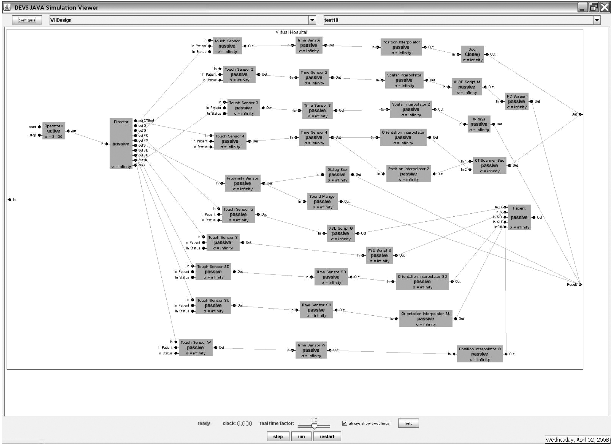

**FIGURE 2.4** DEVSJAVA representation of a virtual hospital. (From Boukerche, A. et al., *Concurrency & Computation: Practice & Experience*, 21, 1422, 2009. With permission.)

AM formalism, while the interaction of these individual visual object models are described by DEVS-coupled model specifications, or more specifically, the interac- tions are modeled by constructing messaging channels through individual input and output ports of the model.

As stated previously, each DEVS model component has strictly defined “states,” input and output “event” ports, as well as how the model responds to internal and external events. As an example, the “Touch Sensor” visual object is described as an atomic DEVS as follows [24]:

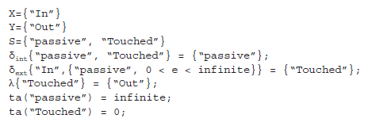

All other individual AMs are described similarly as the above “touch sensor” model. In terms of the behavior validation of each individual visual object, the repre- senting DEVS model is tested under DEVSJAVA with different injected initial states. For instance, the “patient” visual object is modeled as an atomic DEVS “patient” model, and simulating this DEVS model can validate whether the behavior of the “patient” component defined in X3D is correct or not. Through testing and vali- dating all these individual visual object DEVS models, any design error (in terms of visual objects’ behavior) can be discovered and eradicated easily. As a next step, the design inefficiency can also be identified by simulating a modeled subsystem of the virtual hospital. As an example, the authors examined the image animation of the “CT Scanner PC” component by simulating a corresponding DEVS design model (a coupled DEVS model in DEVS representation). As shown in Figures 2.5 and 2.6, a sequential operation steps of system components and their driving scripts (X3D Script) were presented, in which “X3D Scripts” take the data from “Scalar Interpolator” to generate the image file used in “PC Screen” (a visual component in the VE system being designed). Through mapping such operations to the DEVS model and then simulating them, it is discovered that the two “X3D Script” can be replaced by a new one as a better design. This is achieved by simulating the representing DEVS models to find a more efficient design alternative. Here, we can see that DEVS works smoothly as a guiding tool for design optimization. It is worth mentioning that DEVS models are easy to build, and simulation of DEVS models can help predict the performance of the designed VE system. Therefore, DEVS can not only be used as a design validation tool but also as a guiding tool for design optimization.

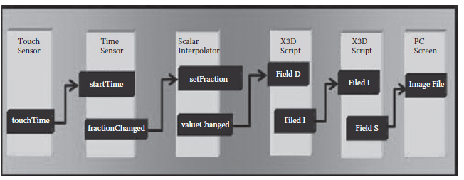

**FIGURE 2.5** Image animation of CT scanner PC in the original X3D design. (From Boukerche, A. et al., *Concurrency & Computation: Practice & Experience*, 21, 1422, 2009. With permission.)

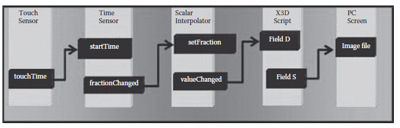

**FIGURE 2.6** Image animation of CT scanner PC in the improved X3D design. (From Boukerche, A. et al., *Concurrency & Computation: Practice & Experience*, 21, 1422, 2009. With permission.) 

### 2.4.2 Design Aid and Verification for Real-Time Distributed Systems

Indeed, VE-based systems can benefit from DEVS in terms of design validation and optimization. Real-time distributed computer systems, including real-time distrib- uted simulation systems and QoS-aware distributed real-time computing systems, can also take advantage of using DEVS as the fundamental system design aiding tool. Indeed, the capability of precisely defining system components and their inter- action makes DEVS a unique approach for effectively designing real-time distributed computer systems.

Real-time-based formal system specification languages have been widely studied, including UML-RT [27], timed automata [28], and others. For instance, UML-RT is quite suitable for the high-level formal description of a system (software, hardware, and the embedded system level), whereas timed automata can be used to precisely model the components of a system. As an extension of standard DEVS, RT-DEVS opens a wide area of specifying real-time computer systems, including distributed real-time systems and QoS-aware distributed systems. Compared to UML-RT and timed automata, RT-DEVS inherits the basic DEVS methodology and can also provide specification of real-time parameters, which can greatly help the design of a real-time distributed system in a unified platform (for example, the DEVSJAVA software platform).

As a well-known distributed simulation standard, HLA [40] has been widely adopted in the simulation community. Real-time interface (RTI) is the core in a HLA-based distributed simulation system. Therefore, the study of HLA-RTI has been attracting many researchers for a better RTI design. As a matter of fact, a real-time RTI (RT-RTI) system generally requires the participating simulation components to be deterministic, which exactly suits the DEVS formalism-based approach because DEVS and RT-DEVS are ideal for expressing the deterministic model behaviors to satisfy the requirements of designing a RT-RTI system. There exists very limited research that uses DEVS to aid a novel HLA-RTI design. In the following example, we will show how RT-DEVS is used to predict the key system design factors that can affect the overall performance of a RT-RTI system.

Other work [41] proposed a novel HLA-RTI design and used DEVS to validate their proposed real-time HLA/RTI [42] system design. RT-DEVS was used to spec- ify the key RTI components, and the key performance parameters were captured by simulating the corresponding DEVS RTI models. As shown in Figure 2.7, the RTI design was realized as a DEVSJAVA simulation model, which represented the pro- posed new RTI design. The individual AMs were specified by RT-DEVS formalism. The overall real-time HLA/RTI system was modeled basically in three layers: task generation and task director (the “taskGen” and “director” models), HLA/RTI ser- vices (the six key HLA/RTI services are modeled as “DDM,” “DM,” “FM,” “OM,” “ObjM,” and “TM,” respectively), and the thread pools (five regular pools and one bigger pool). Thus, the dynamic behaviors of a designed HLA/RTI system can then be simulated by DEVSJAVA simulators.

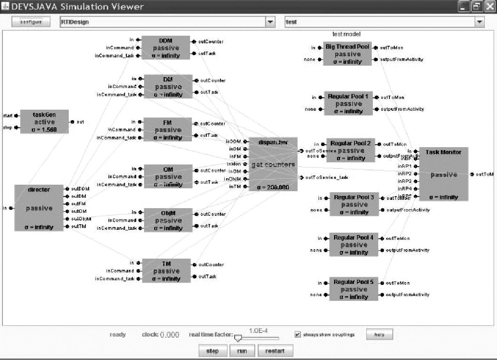

**FIGURE 2.7** Real-time interface (RTI) design models in DEVSJAVA. (From Boukerche, A. et al., *Simulation*, 84, 231, 2008. With permission.)

For instance, the “service queue” AM is described with RT-DEVS as [41]

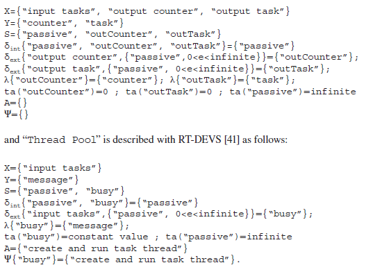

As shown in the above RT-DEVS formalism, each model component (AM) has strictly defined “states,” input and output “events,” as well as how the model responds to internal and external events (transition functions). Different from standard DEVS, the real-time activity of the model is also defined using an activity set and an activity mapping function. Therefore, the overall system behaviors can be modeled and simulated in an integrated framework. Given that the key aspect of RT-RTI is its real-time performance (or, say, “task satisfactory rate”), the performance of a proposed novel RT-RTI core system must be evalu- ated and validated. In this research, the authors effectively used RT-DEVS as the design validation tool.

[Figure 2.8 ](#_bookmark6)shows simulation on the DEVSJAVA platform of both the RT-DEVS models of the original RT-RTI and proposed novel RT-RTI designs. Indeed, the DEVSJAVA models in [Figure 2.7 ](#_bookmark5)captured the key RT-RTI components and their real-time interactions so that the key performance parameters can be obtained. Consequently, the simulation results can be compared to the experimental results obtained from the executions in a physical RT-RTI environment. In particular, the key concern here is how dynamic thread pool management in the new RT-RTI design can benefit the performance of the overall RT-RTI system in terms of the tasks that are served to meet their deadlines. The experimental results, obtained from both the real RT-RTI execution and the DEVS model simulation, validated that the proposed novel RT-RTI design outperformed the original RTI system in terms of providing a better task serving rate in a real-time distributed simulation scenario. The DEVS simulation result, shown in Figure 2.8, provides a solid and consistent result that supports the proposed new RT-RTI design. In this example, we saw that the DEVS component-based design approach is able to discover, predict, and validate the key design concerns for a real-time distributed simulation system.

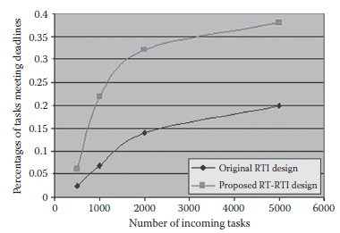

**FIGURE 2.8** Discrete Event System Specification (DEVS) simulation result for real-time interface (RTI) design. (From Boukerche, A. et al., *Simulation*, 84, 231, 2008. With permission.)

In other work [43], RT-DEVS has been used to validate a design of a QoS-aware distributed real-time system. The design of such systems is a new area to explore with DEVS and the research created and implemented DEVS design models for both a tree-based (hierarchical) and a flat service management systems. These DEVS design models were then simulated in a real-time fashion, and the DEVS simula- tion results conform very well with the experimental results obtained in an actual P2P-based distributed cluster environment. Meanwhile, the “states” and “state tran- sitions” of each component in the designed system were also validated by using a DEVS-based unit test method. It is worth mentioning that a QoS-aware system has many time-sensitive real-time parameters that must be considered during the design process, but how these parameters affect the overall real-time performance of the final designed system is generally very difficult to evaluate or predict. DEVS and RT-DEVS indeed provide a powerful system tool to facilitate the evaluation of such complex design processes in a quick and accurate way.

Another example demonstrates how RT-DEVS was used as a formalization tech- nique toward aiding the algorithm design and validation of a P2P-based distributed system. In particular, a novel load-balancing algorithm in a P2P-based network was designed in which both dynamic QoS and service migration play key roles in terms of affecting the overall system performance [44]. The proposed load-balancing algorithm was based on a genetic algorithm [45], and the design of this algorithm was validated by a DEVS-based formal approach. The algorithm was modeled in a DEVSJAVA environment, which represents the key components and the behaviors of the algorithm in detail. Thus, the proposed algorithm can be simulated in terms of how it satisfies the user requirement in a dynamic distributed service-oriented sys- tem. The concept of DEVS “variable structure” was used to fulfill the requirement of modeling the variations of components in a dynamic system, which is actually one of the most important features for analyzing a service migration scheme in the proposed algorithm design.

The DEVSJAVA integrated environment provides the capability of visualizing the hierarchical system structure, which helps build the design models quickly. In terms of experimental evaluations, the proposed load-balancing algorithm (based on a genetic algorithm) was compared with two other systems: one only using task scheduling and one using no load-balancing algorithm. The proposed algorithm used a load-balancing manager that has dynamic QoS parameters implemented, and these parameters can be updated using a genetic algorithm. The three experimental dis- tributed systems were also modeled in DEVSJAVA as shown in Figure 2.9, in which the computing services on hosted machines were modeled as “service nodes” and the multiple threads on one service were modeled as “node-i-thread-i” models. There is also a “task generation” model to generate tasks to the modeled system as well as a “MigrationManager” for task migrations. Two sets of experimental scenarios were created. In the first scenario, tasks were fed to the system using a fixed interval of 100 ms, whereas in the second scenario, the tasks were sent to the system using a different feeding rate so that the adaptability of the system could be evaluated. For both scenarios, experiments were conducted in both a practical P2P network and the DEVS model-based EF. As shown in Figures 2.10 and 2.11, the results obtained from DEVS models conforms well with the results captured in the practical P2P network. We can see that the DEVS simulations predicted higher task success rates when compared to the experiments in practice (conducted in real P2P-enabled computer networks) in both scenarios. This is because of the different experimental settings, and the key concern here is to validate the differences in the algorithms, not to exactly predict the performance of the algorithms in practice. Indeed, the experi- mental results imply that DEVS can provide accurate prediction of the performance of complex load-balancing algorithms for dynamic P2P-based distributed real-time systems. In the case where practical experiments are difficult to capture, DEVS and RT-DEVS can still provide effective prediction of the system performance using easy-to-build simulation-based models.

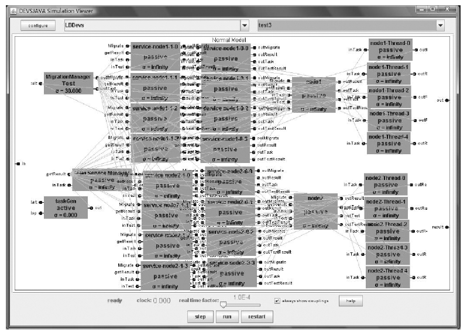   

**FIGURE 2.9** System design view in DEVSJAVA. (From Xie, H. et al., *Concurrency & Computation: Practice & Experience*. Vol. 22, P1223–1239, 2010. With permission.)

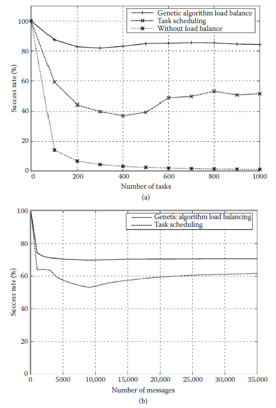

**FIGURE** **2.10** Simulation result obtained for the first scenario (a) in a real-world experiment; (b) in a Discrete Event System Specification (DEVS) simulation. (From Xie, H. et al., *Concurrency* *& Computation: Practice & Experience*. Vol. 22, P1223–1239, 2010. With permission.)

 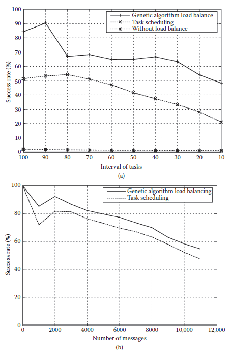

**FIGURE** **2.11** Simulation result obtained for the second scenario (a) in a real-world experiment; (b) in a Discrete Event System Specification (DEVS) simulation. (From Xie, H. et al., *Concurrency* *& Computation: Practice & Experience*. Vol. 22, P1223–1239, 2010. With permission.)

### 2.4.3 DE VS Approach to the Design of Distributed Real-Time Cooperative Robotic Systems

In the previous discussion, we demonstrated some examples that use DEVS as a formal design validation tool to assist the design of complex real-time distributed systems. In this section, we will demonstrate how the DEVS formal approach can provide an integrative M&S environment to aid the design of distributed real-time cooperative robotic systems. In this subsection, we show how a physical robot can interact with a DEVS-based robot model in a simulation-based VE [46,47].

The DEVS approach presented in this section is based on an architecture pro- posed and implemented by one of the authors (Hu), which employs the following four steps for the design and testing of a cooperative robotic system [46]:

1.   Centralized simulation to analyze the system under test within a model of the environment linked by abstract sensor/actuator interfaces on a single computer.

2.    Distributed simulation, in which models are deployed to the real network that the system will be executed on and simulated by distributed real-time simulators.

3.    Hardware-in-the-loop simulation, in which the environment model is simu- lated by a DEVS real-time simulator on one computer, whereas the control model under test is executed by a DEVS real-time execution engine on the real hardware.

4.    Deployed execution, in which a real-time execution engine executes the control model that interacts with the physical environment through the ear- lier sensor/actuator interfaces that have been appropriately instantiated.

As the technology of robotic systems advances rapidly, systematic development methods and integrative development environments play increasingly important roles in handling the complexity of these systems. Compared to the conventional approach, the system architecture of Hu and Zeigler [46] supports robot-in-the-loop type of simulation, which can effectively overcome the difficulties of traditional approaches when the experimental environment confines the use of physical robots. One of the key ideas of this approach is to constitute an incremental study and measurement process for cooperative robotic systems combined with a simulation-based VE to support systematic analysis and measurement of large-scale cooperative robotic systems. Another highlight in this approach lies in the support of dynamic system reconfiguration in a real-time simulation of cooperative robotic systems. To enable this feature, “variable structure” DEVS [48] is used. This capability indeed makes dealing with the evolving cooperative robotic systems much easier. The concept of “experimental frame” is explored to form an integrative environment for studying the behaviors of large-scale cooperative robotic systems. In other words, the system architecture can be treated with a hybrid approach that allows real robots as well as virtual ones to be studied together in a simulation-based VE. This simulation-based VE was originally developed in the context of mobile robot applications; however, it can also be applied to other robotic applications such as object transportation and material handling. In the sequel, we demonstrate how physical robots can interact with the VE to form a cooperative real-time robotic system.

In general, robotic systems can be viewed as a particular form of real-time sys- tems that monitor and respond to, or control, an external environment. This envi- ronment is connected to the computer system through sensors, actuators, and other input–output interfaces [6]. A robotic system from this point of view consists of sen- sors, actuators, and the decision-making unit. Thus, a cooperative robotic system is composed of a collection of robots that communicate with one another and interact with an environment. This view of robotic systems suggests a basic architecture for the simulation-based VE that we developed: an environment model and a collection of robot models, which include decision-making models, sensors, and actuators. The environment model represents the physical environment within which a robotic sys- tem will be operated. It forms a VE for the robots and may include virtual obstacles, virtual robots, or any other entities that are useful for simulation-based study. The robot model represents the control software that governs the decision making and communication of a robot. It also includes sensor and actuator interfaces to sup- port interactions between the robot and its environment. In the approach by Hu, the “model continuity” methodology is used, which clearly separates the decision- making unit of a robot (which is modeled as a DEVS atomic or coupled model) from the sensors and actuators (which are modeled as DEVS abstractActivities). The decision-making model defines the control logic while the sensor/actuator abstractActivities represent the sensors or actuators, including their behav- iors, interfaces, and properties of uncertainty and inaccuracy. DEVS-based model couplings are added between sensor/actuator abstractActivities and the environment model; therefore, messages can be passed between the decision-making model and the environment model through sensor/actuator abstractActivities. It is worth noting that such separation between the decision-making model of a robot and its sensor/actuator interfaces can bring several advantages: First, it sepa- rates the decision making of a robot from hardware interaction. This makes it easier for the designer to focus on the decision-making model, which is the main design interest. Second, the existence of a sensor/actuator interface layer makes it possible for the decision-making model to interact with different types of sensors/actuators as long as the interface functions between them remain the same. Thus depending on dif- ferent experimental and study objectives, a decision-making model can be equipped with different types of sensors and actuators. As a matter of fact, in this cooperative robotic system, models of sensors/actuators (modeled as abstractActivities, also referred to as virtual sensors/actuators hereafter) are developed to simulate the behavior of physical sensors/actuators. Meanwhile, physical sensor/actuator inter- faces (implemented as RTActivities) are developed to drive the physical sensor/ actuators of a robot. A virtual sensor/actuator and its corresponding physical sen- sor/actuator interface share the same interface functions with the decision-making model. During simulation, a decision-making model uses virtual sensors/actuators to interact with a VE; during operation, the same decision-making model, which resides on a real robot, uses physical sensor/actuator interfaces to interact with a physical environment.

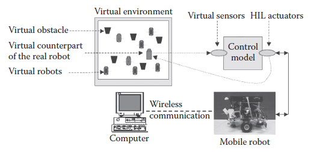

**FIGURE 2.12** Robot-in-the-loop simulation. (From Hu, X., and Zeigler B. P., *Integrated Computer-Aided Engineering*, 12, 353, 2005. With permission.)

Figure 2.12 shows an example of the aforementioned cooperative robotic system, in which one physical mobile robot operates in a VE. In this example, the mobile robot uses its virtual sensors to get sensory input from the VE and uses its real motor interface to move the robot. As a result, the physical robot moves in a physical space based on the sensory input from a VE. Within this VE, the robot “sees” vir- tual obstacles that are simulated by computers and makes decisions based on those inputs. Meanwhile, virtual robots (robot models) can also be added into the environ- ment so the physical robot can sense them and communicate/coordinate with them. This capability of robot-in-the-loop simulation brings simulation-based study one step closer to the physical world. Furthermore, for large-scale cooperative robotic systems that include hundreds of robots, it makes it possible to conduct system-wide tests and measurements without waiting for all physical robots to be available. In this latter case, the robots not yet physically available can be provided by the simulation- based VE.

[Figure 2.13](#_bookmark7) illustrates how EFs, models/systems, and simulation methods can play together to carry out simulation-based measurement. This process includes three lines of development and integration: the “models/system” that will be tested and measured, the “EFs” that specify the measurement, and the “methods” that are employed to carry out the measurement. The process starts from the system specifi- cation that is formulated as DEVS-expressible formalisms. The system specification is further divided into two specifications: the design specification that guides the development of models/system and the measurement specification that guides the development of EFs. Three methods, corresponding to three stages of study, are used to carry out the measurement incrementally. These methods are conventional simulation, VE-based simulation, and real-time execution. Similarly, three types of EFs exist: EF for model-world study, EF for virtual-world study, and EF for physical- world study. Techniques are under development to derive EF development from the measurement specification in automated or semiautomated ways.

As a summary, the simulation-based VE supports a powerful hybrid approach that allows physical robots as well as virtual ones to be studied together. As the technology of robotic systems advances rapidly, systematic development methods and integrative development environments play an increasingly important role in handling the complexity of these systems. We can clearly see that DEVS is key to making it possible to build such a hybrid simulation framework, which can then aid the design of cooperation robotic systems more easily and effectively.

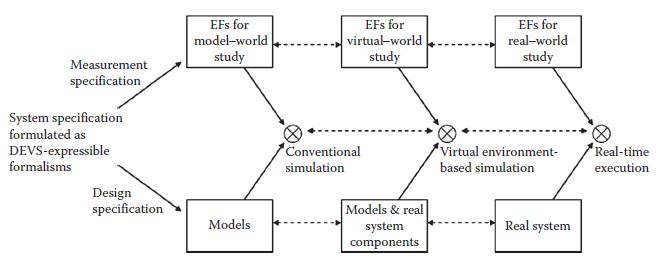

**FIGURE 2.13** Experimental frames (EFs), models, and study methods. (From Hu, X., and Zeigler B. P., *Integrated Computer-Aided Engineering*, 12, 353, 2005. With permission.)

[2.3 <--- ](2_3.md) [   Зміст   ](README.md) [--> 2.5](2_5.md)