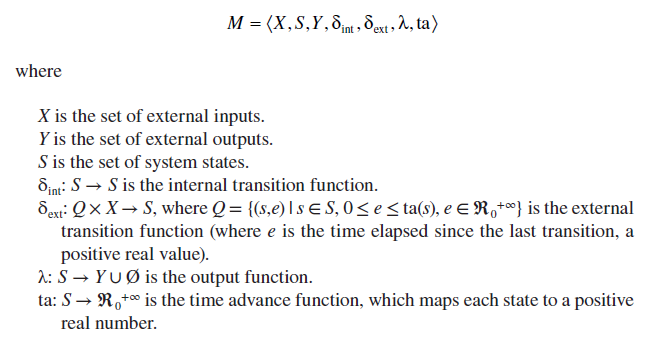
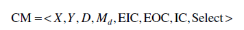
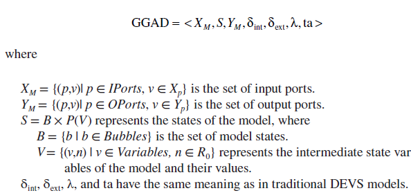
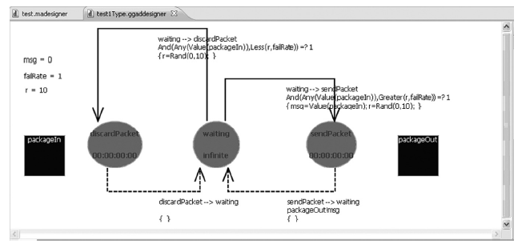
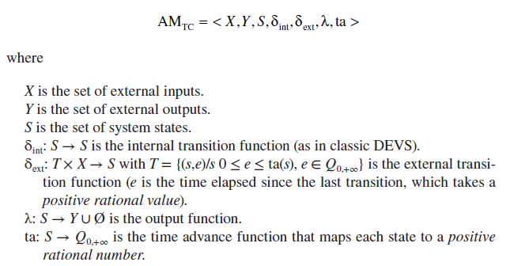
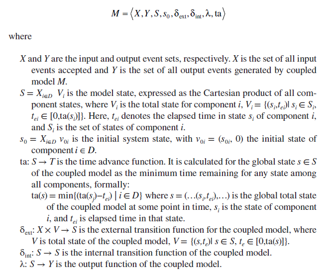

[3.1 <--- ](3_1.md) [   Зміст   ](README.md) [--> 3.3](3_3.md)

## 3.2. BACKGROUND

DEVS was originally defined in the 1970s as a mechanism for specifying discrete event models specification [3]. It is based on dynamic systems theory, and it allows one to define hierarchical modular models. A system modeled with DEVS is described as a composite of submodels, each of them being behavioral (atomic) or structural (coupled). Each model is defined by a time base, inputs, states, outputs, and functions to compute the next states and outputs. A DEVS atomic model is for- mally described by

 

A DEVS atomic model is the most basic DEVS component. The behavior of a DEVS model is defined by transition functions in atomic components. An atomic model M can be affected by external input events *X* and can generate output events

*Y*. The state set *S* represents the state variables of the model. The internal transition function δint and the external transition function δext compute the next state of the model. When an external event arrives at elapsed time *e* (which is less than or equal to ta(*s*) specified by the time advance function), a new state *s*′ is computed by the external transition function. Otherwise, if ta(*s*) finishes without input interruption, the new state *s*′ is computed by the internal transition function. In this case, an output

specified by the output function λ can be produced based on the state *s*. After a state transition, a new ta(*s*′) is computed, and the elapsed time *e* is set to zero. A DEVS coupled model is composed of several atomic or coupled submodels. The property of closure under coupling allows atomic and coupled models to be inte- grated to form a model hierarchy. Coupled models are formally defined as follows:

 

where 

*X* is the set of input ports and values.

*Y* is the set of output ports and values.

*D* is the set of the component names (an index of submodels).

EIC is the set of External Input Couplings, which connects the input events of the coupled model itself to one or more of the input events of its components.

EOC is the set of External Output Couplings, which connects the output events of the components to the output events of the coupled model itself.

IC is the set of Internal Couplings, which connects the output events of the components to the input events of other components.

Select: 2*D* → *D* is a tie-breaking function, which defines how to select an event from a set of simultaneous events.

CD++ [10] allows defining models following these specifications. The tool is built as a hierarchy of models, and each of the models is related to a simulation entity. CD++ includes a graphical specification language, based on DEVS Graphs [11], to enhance interaction with stakeholders during system specification while having the advantage of allowing the modeler to think about the problem in a more abstract way. DEVS graphs can be formally defined as [12]

 

CD++ uses this formal notation to define atomic models, as seen in [Figure 3.1](#_bookmark8). A unique identifier defines each model, which can be completely specified using a

graphical specification based on the formal definition above. That is, states are rep- resented by bubbles including an identifier and a state lifetime, state variables can be associated with the transitions, and there are two types of transitions: external and internal.



**FIGURE 3.1** An atomic model defined as a DEVS graph.

The DEVS graph in Figure 3.1 shows a simple component for a packet routing model. As we can see, there are three states in this DEVS atomic model: *waiting*, *dis- cardPacket*, and *sendPacket.* The model uses two input/output ports (corresponding to the *XM* and *YM* sets in the formal specification): *packageIn* and *packetOut*. Three variables are defined for this model and initialized: *msg*, *failRate*, and *r*. Internal transitions are shown with dashed arrow lines. The internal transition *sendPacket* → *waiting* uses the output function, which is defined to send the value of the vari- able *msg* to output port *packetOut.* The external transitions are shown with solid arrow lines, with a condition that would enable that transition only if it is evaluated to true, and an expression to update some of the model variables (when needed). For instance, the transition from *waiting* to *sendPacket* is activated when a packet is received on *packageIn* (*Any(Value(packageIn, 1))*) and the *failRate* is greater than a random value *r* (*Greater(r, failRate)*). In that case, the model changes to state *send- Packet* and also assigns the value of the packet to the *msg* intermediate variable. It also computes a new random value.

Each DEVS graph is translated into an analytical definition that the runtime engines use to execute. The internal transitions employ the following syntax:

```c
int: source destination [outport!value]* ( { (action;)* } )
```

Here, *source* and *destination* represent the initial and final states associated with the execution of the transition function. As the output function should also execute before the internal transition, an *output* value can be associated with the internal transition. One or more *actions* can be triggered during the execution of the tran- sition (changing the values of state variables). External transitions are defined as follows:

```
ext : source destination ( { (action;)* } )? expression
```

In this case, when the expression is true (which includes inputs arriving from input ports), the model will change from state *source* to state *destination*, while also executing one or more actions. These notations are generated as a direct translation from the graph represented in [Figure 3.1](#_bookmark8).

### 3.2.1 Difficulties of DEVS Formal Verification

DEVS formal definitions for atomic models are the most generic DEVS [3]. The first difficulty in DEVS formal verification, is that model-checking techniques are only decidable for finite state systems. In case of infinite-state systems, irrelevant details must be abstracted to obtain a finite state system before applying model-checking techniques. Another difficulty is the nondeterminism in DEVS behavior. This can be caused by stochastic behavior in a DEVS model due to the use of a probabilistic function in the definition of the external transition function δext or time advance function δint [13]. Another major difficulty in applying automatic formal verification techniques such as model checking to DEVS models is that the DEVS time advance function can take values of irrational real numbers. These values cannot be repre- sented in a finite reachability graph that is used in model-checking algorithms, and thus, the algorithm will not be able to terminate, hence rendering the verification problem undecidable.

Several techniques have been introduced to overcome these problems and pro- vide reasonable approximation to DEVS while enabling formal verification. As will be discussed in the following paragraphs, the techniques range from formal model checking of restricted classes of DEVS, the generation of test traces from DEVS models for simulation testing, the specification of high-level system requirements in TA and verifying DEVS model against those requirements, and introducing clock constructs to DEVS to conform with TA.

One approach, called *real-time DEVS* (RT-DEVS) introduces a time advance function that maps each state to a range with maximum and minimum time val- ues and introduces an activity associated with every system state [14]. This work also introduced an RT-DEVS *executive* that executes these models in RT. RT-DEVS was also used to design RT controllers as shown in Ref. [15] for a train-gate sys- tem. Further work on verifying RT-DEVS was introduced in Refs. [16,17], where the authors relied on TA as used by UPPAAL and defined (although not formally proved) a transformation method from RT-DEVS to UPPAAL. This transformation allows weak synchronization between components of the TA model as RT-DEVS semantics uses weak synchronization.

Other approaches use a limited version of DEVS that can be verified. For instance, a method based on Finite and Deterministic DEVS (FD-DEVS) was introduced [8] where the time advance function maps states into rational numbers and the exter- nal transition function cannot use the elapsed time value. The verification relies on reachability analysis, similar to TA algorithms. FD-DEVS is limited, thus it may not fit some applications that require the full expressiveness of DEVS. Likewise, although reachability analysis algorithms have been defined (and verification is pos- sible), there are no tools available that implement these algorithms.

To avoid these limitations, other approaches tried to map DEVS models to TA [18]. The conversion method mapped a DEVS model through its components and its simulator. The approach suggests trace equivalence as the basis for parallel DEVS and TA model equivalence. This work did not consider some DEVS features that may not map to TA, such as irrational values in DEVS transition functions. Moreover, some limitations also exist for relying on trace equivalence between DEVS and TA, as we will show in Section 3.3. A similar approach presented in Ref. [19] uses TA to specify the high-level system requirements, after which these requirements are mod- eled as a DEVS model. The system requirements are then verified through simula- tion of the DEVS model.

The work by Hernandez and Giambiasi [20] showed that the verification of gen- eral DEVS models through reachability analysis is undecidable. The authors based their deduction on building a DEVS simulation Turing machine. Since the halting problem in Turing machines is undecidable (i.e., with analysis only, we cannot know in which state a Turing machine would be), they concluded that this is also true for DEVS models. In other words, we cannot recognize if we have reached a particular state starting from an initial state, and consequently, reachability analysis for general DEVS is impossible. Based on this result, reachability analysis may be possible only for restricted classes of DEVS. This result was based on introducing state variables with infinite number of values into the DEVS formalism. Therefore, limiting the number of states of a DEVS model is mandatory for decidable reachability. Hence, further work [21] introduced a new class of DEVS called time-constrained DEVS (TC-DEVS), which expanded the definition of DEVS atomic models with multiple clocks incremented independently of other clocks. Classic DEVS atomic models can be seen as having only one clock that keeps track of the elapsed time in a state and is reset on each transition. TC-DEVS also added clock constraints similar to TA (to function as guards on external and internal transitions). However, it is different from UPPAAL TA in that it allows clock constraints in state invariants to include clock differences. TC-DEVS is then transformed into an UPPAAL TA model. This work, however, did not include a transformation of TC-DEVS state invariants to UPPAAL TA when the model has invariants with clock differences, as this is not allowed in UPPAAL TA.

For large and more complex DEVS models, where formal verification is not fea- sible, testing would be the only choice. Techniques have been presented to gener- ate testing sequences from model specifications that can then be applied against the model implementation to verify the conformance of the implementation to specifications [22,23].

### 3.2.2 Rational Time-Adv ance DEVS

RTA-DEVS was proposed to provide the system modeler with a formalism that is expressive and sufficient to model complex systems behavior, while being verifiable by formal model-checking techniques. RTA-DEVS is a subclass of DEVS that has removed the main difficulties of the formal model verification discussed in Section 3.2.1; yet, it is sufficiently powerful to model complex system behavior.

As in classical DEVS, we must define RTA-DEVS atomic models. The main difference is that RTA-DEVS employs a different definition for the time advance function, ta, and for the external transition function, δext. The Atomic Rational Time- Advance is defined as follows:

  

Coupled RTA-DEVS models are defined as in classic DEVS, as discussed in Section 3.2.

A coupled RTA-DEVS model *M* can be simulated with an equivalent atomic RTA-DEVS model, whose behavior is defined as follows:

 

[3.1 <--- ](3_1.md) [   Зміст   ](README.md) [--> 3.3](3_3.md)

