[3.2 <--- ](3_2.md) [   Зміст   ](README.md) [--> 3.4](3_4.md)

## 3.3. DEVS VERIFICATION METHODOLOGY

In this section, we introduce our methodology to transform RTA-DEVS models into TA models. The resulting TA models are a subset of deterministic safety automata (which can be used in UPPAAL or other similar model checkers). The transformation methodology can be summarized as follows: 

1.   Define a clock variable for each atomic RTA-DEVS model (i.e., *x*).

2. Replace every state in RTA-DEVS with a corresponding one in TA (i.e., *L*1 for source *s*1 and *L*2 for destination *s*2).

3.   Model the RTA-DEVS internal transition from *s*1 to *s*2 as a TA as follows:

- a.   For the RTA-DEVS source state *s*1, define a TA source state *L*1. For the RTA-DEVS destination state *s*2, define a TA destination state *L*2.
- b.   Reset the clock variable on the entry to each state (*x*: = 0).
- c.   Put an invariant in the source state derived from the time advance function for that state, that is, *x* < ta(*s*1).
- d.   Optionally, define a transition with a guard. This guard should be the complement of the invariant in the source state, that is, *x* ≥ ta(*s*1).
- e.   Define an action for each output function defined.

4.   The RTA-DEVS external transition is modeled in TA with the following items:

- a.   A source state and some destination state(s), that is, *L*1 for source *s*1 and *L*2 for destination *s*2.
- b.   A clock reset on the entry into each state.
- c.   An invariant in the source state that corresponds to the time advance function for that state, that is, *x* < ta(*s*1).
- d.   For the external transition(s) with guards of clock constraints, these constraints should be disjoint to obtain a deterministic TA model.
- e.   The action label on TA transitions for each RTA-DEVS input event to source state *s*1.

By applying the above-mentioned steps, we obtain a TA model that executes every transition defined in the RTA-DEVS model under study. As already known, the RTADEVS behavior is completely defined by its transition functions, which defines all transitions in the RTA-DEVS model. Thus, the resulting TA model executes the RTA-DEVS. However, TA models cannot have irrational constant values in guards or state invariants. This implies that for any DEVS model containing a state lifetime of irrational values, it will not be possible to directly apply the transformation shown in [Table 3.1](#_bookmark9). In this case, the irrational values would have to be approximated to the nearest rational value according to a choice by the modeler, based on the required precision for the equivalent RTA-DEVS model. In doing so, the transformation should take into account the following rules. These rules avoid building invalid RTA-DEVS or TA models that contain time-action locks (that prevent the model execution progress) or loops where execution progresses infinitely without allowing time to advance [24].

**Rule 1**: When approximating an irrational value triggering an internal transition that is coupled with an external transition, the choice of approximation value should be consistent for all constants using this irrational number.

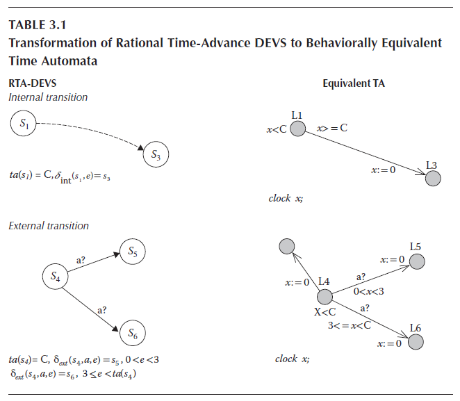

Formally, assume we have the following defined in a DEVS coupled model as shown in [Figure 3.2](#_bookmark10):

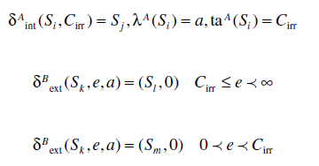

It should be approximated in RTA-DEVS as follows:

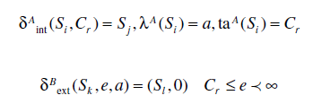 

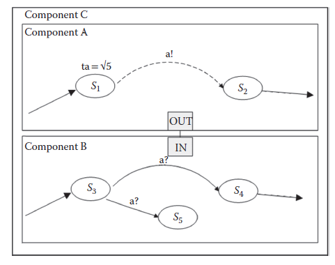

**FIGURE 3.2** A coupled DEVS model.

 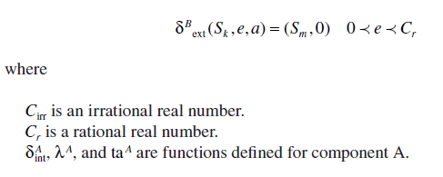

**Rule 2**: When approximating an irrational value for elapsed time in the definition of the external transition function, the choice of the approximation value should be consistent for all constants using this irrational number. Formally, assume we have the following DEVS definition of an external transition function in a model similar to the one shown in [Figure 3.3](#_bookmark11):

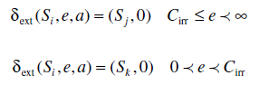

It should be approximated in the RTA-DEVS model with the following form to avoid creating action locks:

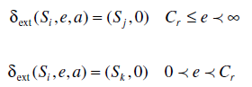

The second rule is to avoid action locks that may happen if we define the external transition function with conditions on its transitions where there is a gap in time (where the function is not defined). Another possibility is to have an approximated external transition function in which conditions on different transitions overlap in time, thus creating nondeterminism that is not in the original DEVS model.

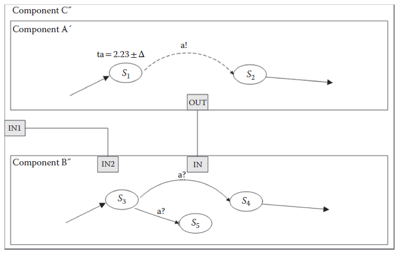

**FIGURE 3.3** RTA-DEVS component with external input.

 

**FIGURE** **3.4** Elevator RTA-DEVS model.

To further clarify the method, we show a simple example representing the behavior of an elevator [6]. The RTA-DEVS model in Figure 3.4 models the movement of the elevator.

  **TABLE** **3.2**  **Elevator** **Model** **States**  

| **Elevator**  **State** | **State** **Description**                                    |
| ----------------------- | ------------------------------------------------------------ |
| Stopped                 | The  elevator speed is zero and it is stopped at one of the floors. |
| StopUp                  | The elevator is moving up and preparing to stop. It  decelerates. |
| MovingUp                | The elevator is moving up with a constant speed.             |
| SlowDown                | The elevator is moving down and preparing to stop. It  decelerates. |
| MovingDown              | The elevator is moving down with a constant speed.           |
| Aux                     | An auxiliary state  to allow output  from the elevator model when internal  transition occurs: Aux → Stopped. |

As shown, the elevator can be in one of the five states (listed in Table 3.2).

In this model, the elevator starts in the *Stopped* state and waits for the controller commands to move to satisfy a button request from the user. The decisions for the proper direction and the start and stop of movement are all taken by the controller. The states of the elevator are represented by circles in the figure. External transitions are enabled when the function *Value(mover)* evaluates to true. This function is defined as in [Table 3.3 ](#_bookmark12)for the different transitions shown in [Figure 3.4](#_bookmark11).

Likewise, the behavior of the internal transitions are defined as in [Table 3.4](#_bookmark13).

By following the transformation steps summarized in [Table 3.1](#_bookmark9), we can construct the equivalent TA model as shown in [Figure 3.5](#_bookmark14). This model is constructed to be behaviorally equivalent to the DEVS model of Figure 3.4. This equivalence is essential to ensure that any properties that we must check in the DEVS model are preserved in the constructed TA model.

By applying the methodology we identified in Section 3.3, we go through the following steps to obtain the TA model in Figure 3.5.

- Define a clock variable for each atomic RTA-DEVS model. This results in variable *x*.
- Replace every state in RTA-DEVS with a corresponding one in TA. A location is created for each state in DEVS with the same name as is shown in the TA model.
- Model the RTA-DEVS internal transition as a TA as follows.
  - a.   A source state *L*1 and a destination state *L*2: *SlowingDown* and *StopUp states in* Figure 3.5 *represent source states of SlowDown and StopUp* *states depicted in* Figure 3.4 Reset the clock variable on the entry into each state (*x* = 0)*.*
  - b.   Put an invariant in the source state derived from the time advance function for that state. The invariant at both states *SlowingDown* and *StopUp* is *x* < 1*.*
  - c.   Optionally, define a transition with a guard. This *guard* should be the complement to the invariant in the source state. None are defined in this model.
  - d.   Define an action for each output function that is defined. This corresponds to the two actions *stop!1* in the model.
- The RTA-DEVS external transition is modeled in TA with the following items.
  - a.   A source state and some destination state(s). Transitions are defined in the TA model that correspond to the DEVS model.
  - b.   A clock reset on the entry into each state.
  - c.   An invariant in the source state that corresponds to the time advance function for that state. This corresponds to the three occurrences of the invariant *x* < 1000*.*
  - d.   For the external transition(s) with guards of clock constraints, these constraints should be disjoint to obtain a deterministic TA model. For example, in the elevator model, direction = =0, direction = = 1, and direction = = 2.
  - e.   For each event on external transition of the RTA-DEVS model, place a synchronization channel on the corresponding TA transition. For example, the *move?* and *stop!* channels in the TA model of [Figure 3.5 ](#_bookmark14)represent external events of *mover(value)* and *stop!1* in the elevator model of [Figure 3.4](#_bookmark11).

   **TABLE** **3.3**  **Elevator  External Transitions**  

|    **Transition**     | **Function** **Definition** | **Expression** |
| :-------------------: | --------------------------- | -------------- |
|  Stopped → MovingUp   | Value(mover)?2              | Mover = = 2    |
|   MovingUp → StopUp   | Value(mover)?0              | Mover = = 0    |
|     Stopped → Aux     | Value(mover)?0              | Mover = = 0    |
| MovingDown → SlowDown | Value(mover)?0              | Mover = = 0    |
|  SlowDown → Stopped   | stop!1                      | Stop = = 1     |
|   StopUp → Stopped    | stop!1                      | Stop = = 1     |
| Stopped → MovingDown  | Value(mover)?1              | Mover = = 1    |

**TABLE** **3.4**  **Elevator** **Internal Transitions**  

| **Transition**        | **Action** **Definition** | **Outport!value** |
| --------------------- | ------------------------- | ----------------- |
| SlowingDown → Stopped |                           | stop!1            |
| StopUp → Stopped      |                           | stop!1            |

 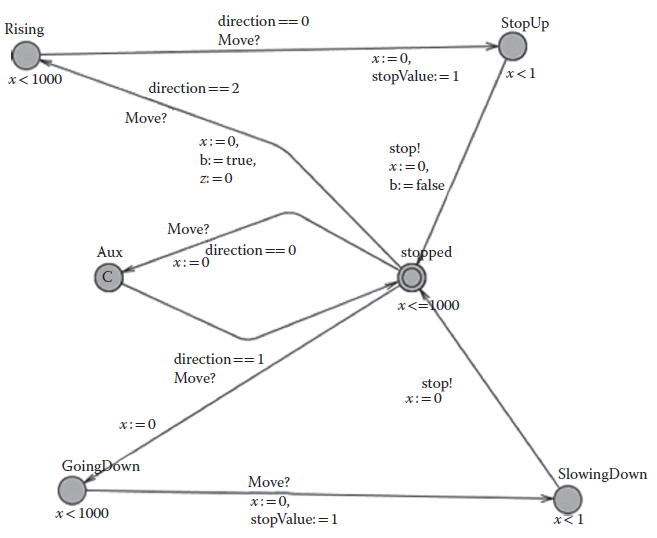

**FIGURE 3.5** Elevator timed automata model.

It is important to preserve the equivalence properties also when we map any verification results obtained from the TA model back to the DEVS model. To ensure this equivalence, the transformation from DEVS to TA is done based on the notion of bisimulation equivalence [7]. This equivalence ensures that for each state in DEVS, there is a corresponding one in TA and vice versa. It also ensures that for each transition in DEVS, there would be a corresponding equivalent one in TA and vice versa. Once we have a TA model that is behaviorally equivalent to the DEVS model, any property we wish to verify in the DEVS model can be verified in the TA model, and verification results would apply directly to the DEVS model.

The DEVS Elevator-Controller is shown in [Figure 3.6](#_bookmark15). By applying the transformation steps discussed in the beginning of Section 3.3, we obtain the TA model as shown in [Figure 3.7](#_bookmark15). In this transformation, we represented DEVS states with lifetime of zero as committed locations in the TA model. Examples of these are states Aux1, Stopping, and Moving. Committed locations of TA prevent time to elapse in them and hence serve our purpose for this transformation.

To apply the UPPAAL model checker on this elevator system, the elevator system must be represented as a closed system that allows UPPAAL to explore all its transitions and states. To do so, we define a simple *environment* model that represents a user requesting the services of the elevator, as shown in [Figure 3.8](#_bookmark16). In this model, the third floor button is pressed after 5 time units. This causes the Elevator-Controller to receive the floor value and then send the corresponding command to the elevator model to reach the third floor. The environment model then simulates different user requests.


**FIGURE 3.6** Elevator controller model as a DEVS graph.


**FIGURE 3.7** Timed automata controller model in UPPAAL.

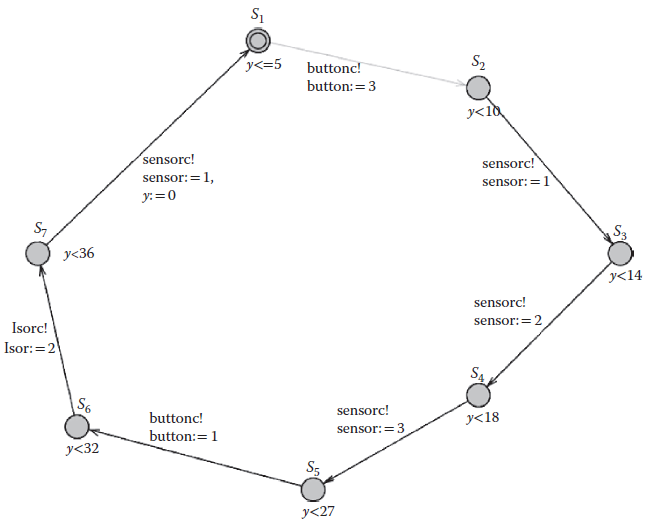

**FIGURE 3.8** Environment inputs (button and sensor).

The system composed of the Elevator, the Elevator-Controller, and the Environment can be checked using UPPAAL to verify certain properties about the system. For instance, some of the important properties would be as follows:

- a.  Does the DEVS model progress? Can we detect deadlock conditions?
- b.  If no deadlocks are found, is it always guaranteed whenever a user pushes a floor button that the elevator would reach that floor (i.e., the normal operation of the elevator system)?
- c.  If the elevator eventually reaches the floor, is there a guaranteed upper bound between the request and the arrival of the elevator? 

For the first question, we applied UPPAAL to our model to check for any deadlocks that may be present in the elevator. To check for that failure, we had formulated a simple query, expressed in computational tree logic (CTL) [25–27] as follows: 

```
A[] not deadlock
```

After running the checker, it shows that this property is satisfied, that is, there is no deadlock, as shown in [Figure 3.9](#_bookmark17).

The property (b) is an example of the system *liveness*, in which we are interested to check if by pressing a certain floor button, the elevator would *eventually* reach that floor. For example, if the user presses the third-floor button, the elevator should *eventually* reach the third floor. This property is expressed in CTL as follows:

```
button = = 3 --> ElevatorController.cur_floor = = 3
```

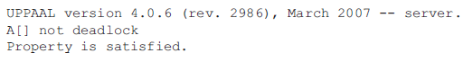

**FIGURE 3.9** Elevator verification results in UPPAAL.

This states that whenever a user input for the third-floor button occurs, the *cur_floor* variable in the *ElevatorController* would eventually reach that floor. This property was also satisfied in UPPAAL model checker for the given model.

To check the third property (c), that is, whether the elevator would reach the requested third floor within some bounded time, we extend the model for bounded time checking by adding the Boolean variable *b* and a global clock *z* as shown in the elevator model in [Figure 3.5](#_bookmark14). The variable *b* would be set to true for the time when the elevator starts traveling up until it reaches the *Stopped* state again. Therefore, by checking the accumulated time while *b* is true, it would provide us the property we must check. Then, the property can be expressed with the following query:

```
A[] ( b imply z < 27 ) which is satisfied.
```

However, the query

```
A[] ( b imply z < 26 ) is not satisfied.
```

This shows that the elevator would reach the third floor after requested to go there after no less than 26 time units, but is guaranteed to be there after 27 time units or more.

[3.2 <--- ](3_2.md) [   Зміст   ](README.md) [--> 3.4](3_4.md)