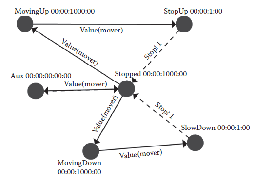
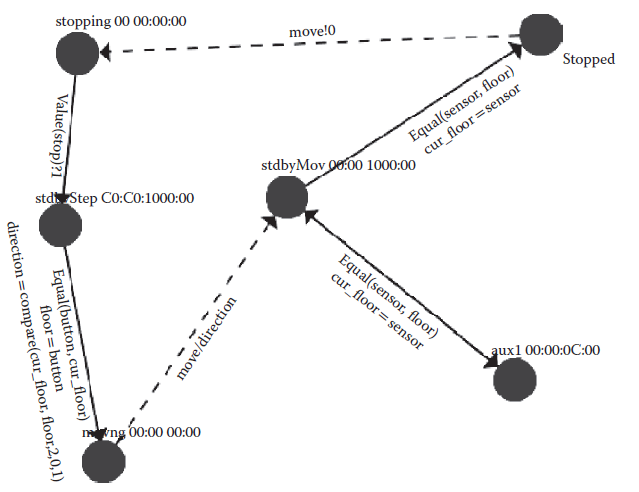
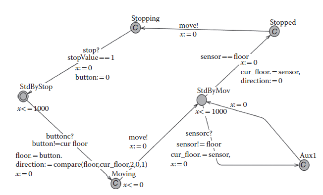

[3.2 <--- ](3_2.md) [   Зміст   ](README.md) [--> 3.4](3_4.md)

## 3.3. DEVS VERIFICATION METHODOLOGY

In this section, we introduce our methodology to transform RTA-DEVS models into TA models. The resulting TA models are a subset of deterministic safety automata (which can be used in UPPAAL or other similar model checkers). The transformation methodology can be summarized as follows: 

У цьому розділі ми представляємо нашу методологію для перетворення моделей RTA-DEVS у моделі TA. Отримані моделі TA є підмножиною детермінованих автоматів безпеки (які можна використовувати в UPPAAL або інших подібних засобах перевірки моделей). Методологію трансформації можна підсумувати таким чином:

1.   Define a clock variable for each atomic RTA-DEVS model (i.e., *x*).

2. Replace every state in RTA-DEVS with a corresponding one in TA (i.e., *L*1 for source *s*1 and *L*2 for destination *s*2).

3.   Model the RTA-DEVS internal transition from *s*1 to *s*2 as a TA as follows:

- a.   For the RTA-DEVS source state *s*1, define a TA source state *L*1. For the RTA-DEVS destination state *s*2, define a TA destination state *L*2.
- b.   Reset the clock variable on the entry to each state (*x*: = 0).
- c.   Put an invariant in the source state derived from the time advance function for that state, that is, *x* < ta(*s*1).
- d.   Optionally, define a transition with a guard. This guard should be the complement of the invariant in the source state, that is, *x* ≥ ta(*s*1).
- e.   Define an action for each output function defined.

4.   The RTA-DEVS external transition is modeled in TA with the following items:

- a.   A source state and some destination state(s), that is, *L*1 for source *s*1 and *L*2 for destination *s*2.
- b.   A clock reset on the entry into each state.
- c.   An invariant in the source state that corresponds to the time advance function for that state, that is, *x* < ta(*s*1).
- d.   For the external transition(s) with guards of clock constraints, these constraints should be disjoint to obtain a deterministic TA model.
- e.   The action label on TA transitions for each RTA-DEVS input event to source state *s*1.


1. Визначте змінну годинника для кожної атомарної моделі RTA-DEVS (тобто *x*).

2. Замініть кожен стан у RTA-DEVS на відповідний у TA (тобто *L*1 для джерела *s*1 і *L*2 для призначення *s*2).

3. Змоделюйте внутрішній перехід RTA-DEVS від *s*1 до *s*2 як TA наступним чином:

- а. Для вихідного стану RTA-DEVS *s*1 визначте вихідний стан TA *L*1. Для стану призначення RTA-DEVS *s*2 визначте стан призначення TA *L*2.
- b. Скинути змінну годинника при вході в кожен стан (*x*: = 0).
- c. Помістіть інваріант у вихідний стан, отриманий із функції випередження часу для цього стану, тобто *x* < ta(*s*1).
- d. За бажанням визначте перехід із огородженням. Цей захист має бути доповненням до інваріанта у вихідному стані, тобто *x* ≥ ta(*s*1).
- e. Визначте дію для кожної визначеної функції виведення.

4. Зовнішній перехід RTA-DEVS моделюється в TA за допомогою таких елементів:

- а. Стан джерела та деякі стани призначення, тобто *L*1 для джерела *s*1 і *L*2 для призначення *s*2.
- b. Скидання годинника при вході в кожен стан.
- c. Інваріант у вихідному стані, який відповідає функції випередження часу для цього стану, тобто *x* < ta(*s*1).
- d. Для зовнішнього переходу (переходів) із захисними обмеженнями синхронізації ці обмеження мають бути непересічними, щоб отримати детерміновану модель TA.
- e. Мітка дії на TA переходить для кожної вхідної події RTA-DEVS у вихідний стан *s*1.


By applying the above-mentioned steps, we obtain a TA model that executes every transition defined in the RTA-DEVS model under study. As already known, the RTADEVS behavior is completely defined by its transition functions, which defines all transitions in the RTA-DEVS model. Thus, the resulting TA model executes the RTA-DEVS. However, TA models cannot have irrational constant values in guards or state invariants. This implies that for any DEVS model containing a state lifetime of irrational values, it will not be possible to directly apply the transformation shown in Table 3.1. In this case, the irrational values would have to be approximated to the nearest rational value according to a choice by the modeler, based on the required precision for the equivalent RTA-DEVS model. In doing so, the transformation should take into account the following rules. These rules avoid building invalid RTA-DEVS or TA models that contain time-action locks (that prevent the model execution progress) or loops where execution progresses infinitely without allowing time to advance [24].

Застосовуючи вищезазначені кроки, ми отримуємо модель TA, яка виконує кожен перехід, визначений у досліджуваній моделі RTA-DEVS. Як уже відомо, поведінка RTADEVS повністю визначається його функціями переходів, які визначають усі переходи в моделі RTA-DEVS. Таким чином, отримана модель TA виконує RTA-DEVS. Однак моделі TA не можуть мати ірраціональних постійних значень у вартах або інваріантах стану. Це означає, що для будь-якої моделі DEVS, яка містить час життя стану ірраціональних значень, неможливо буде безпосередньо застосувати перетворення, показане в таблиці 3.1. У цьому випадку ірраціональні значення повинні бути апроксимовані до найближчого раціонального значення відповідно до вибору розробника моделювання на основі необхідної точності для еквівалентної моделі RTA-DEVS. При цьому трансформація повинна враховувати такі правила. Ці правила уникають побудови недійсних моделей RTA-DEVS або TA, які містять блокування часу дії (які перешкоджають прогресу виконання моделі) або цикли, де виконання просувається нескінченно, не дозволяючи часу просуватися [24].

**Rule 1**: When approximating an irrational value triggering an internal transition that is coupled with an external transition, the choice of approximation value should be consistent for all constants using this irrational number.

**Правило 1**: коли апроксимація ірраціонального значення викликає внутрішній перехід, який поєднується із зовнішнім переходом, вибір значення апроксимації має бути узгодженим для всіх констант, які використовують це ірраціональне число.


Formally, assume we have the following defined in a DEVS coupled model as shown in Figure 3.2:

Формально припустимо, що ми маємо наступне, визначене в пов’язаній моделі DEVS, як показано на малюнку 3.2:


It should be approximated in RTA-DEVS as follows:

Це має бути наближено в RTA-DEVS наступним чином:

 


**МАЛЮНОК 3.2** Поєднана модель DEVS.

 

**Rule 2**: When approximating an irrational value for elapsed time in the definition of the external transition function, the choice of the approximation value should be consistent for all constants using this irrational number. Formally, assume we have the following DEVS definition of an external transition function in a model similar to the one shown in Figure 3.3:

**Правило 2**: під час апроксимації ірраціонального значення для часу, що минув у визначенні зовнішньої функції переходу, вибір значення апроксимації має бути узгодженим для всіх констант, що використовують це ірраціональне число. Формально припустимо, що ми маємо таке визначення DEVS зовнішньої функції переходу в моделі, подібній до тієї, що показана на малюнку 3.3:


It should be approximated in the RTA-DEVS model with the following form to avoid creating action locks:

У моделі RTA-DEVS його слід наблизити такою формою, щоб уникнути створення блокувань дій:


The second rule is to avoid action locks that may happen if we define the external transition function with conditions on its transitions where there is a gap in time (where the function is not defined). Another possibility is to have an approximated external transition function in which conditions on different transitions overlap in time, thus creating nondeterminism that is not in the original DEVS model.

Друге правило полягає в тому, щоб уникнути блокувань дій, які можуть статися, якщо ми визначимо зовнішню функцію переходу з умовами для її переходів, де є розрив у часі (де функція не визначена). Інша можливість полягає в тому, щоб мати апроксимовану зовнішню функцію переходу, в якій умови різних переходів накладаються в часі, таким чином створюючи недетермінізм, якого немає в оригінальній моделі DEVS.


**FIGURE 3.3** RTA-DEVS component with external input.

 

**FIGURE** **3.4** Elevator RTA-DEVS model.

To further clarify the method, we show a simple example representing the behavior of an elevator [6]. The RTA-DEVS model in Figure 3.4 models the movement of the elevator.

Для подальшого пояснення методу ми покажемо простий приклад, що представляє поведінку ліфта [6]. Модель RTA-DEVS на малюнку 3.4 моделює рух ліфта.

  **TABLE** **3.2**  **Elevator** **Model** **States**  

| **Elevator**  **State** | **State** **Description**                                    |
| ----------------------- | ------------------------------------------------------------ |
| Stopped                 | The  elevator speed is zero and it is stopped at one of the floors. |
| StopUp                  | The elevator is moving up and preparing to stop. It  decelerates. |
| MovingUp                | The elevator is moving up with a constant speed.             |
| SlowDown                | The elevator is moving down and preparing to stop. It  decelerates. |
| MovingDown              | The elevator is moving down with a constant speed.           |
| Aux                     | An auxiliary state  to allow output  from the elevator model when internal  transition occurs: Aux → Stopped. |

As shown, the elevator can be in one of the five states (listed in Table 3.2).

In this model, the elevator starts in the *Stopped* state and waits for the controller commands to move to satisfy a button request from the user. The decisions for the proper direction and the start and stop of movement are all taken by the controller. The states of the elevator are represented by circles in the figure. External transitions are enabled when the function *Value(mover)* evaluates to true. This function is defined as in Table 3.3 for the different transitions shown in Figure 3.4.

У цій моделі ліфт запускається в стані *Зупинено* і чекає на переміщення команд контролера, щоб задовольнити запит кнопки від користувача. Рішення про правильний напрямок, початок і зупинку руху приймає диспетчер. Стани ліфта на малюнку позначено колами. Зовнішні переходи вмикаються, коли функція *Value(mover)* отримує значення true. Ця функція визначена як у таблиці 3.3 для різних переходів, показаних на малюнку 3.4.

Likewise, the behavior of the internal transitions are defined as in Table 3.4.

Подібним чином, поведінка внутрішніх переходів визначається як у таблиці 3.4.

By following the transformation steps summarized in Table 3.1, we can construct the equivalent TA model as shown in Figure 3.5. This model is constructed to be behaviorally equivalent to the DEVS model of Figure 3.4. This equivalence is essential to ensure that any properties that we must check in the DEVS model are preserved in the constructed TA model.

Дотримуючись етапів перетворення, підсумованих у таблиці 3.1, ми можемо побудувати еквівалентну модель TA, як показано на малюнку 3.5. Ця модель побудована так, щоб бути поведінково еквівалентною моделі DEVS на малюнку 3.4. Ця еквівалентність необхідна для того, щоб гарантувати збереження будь-яких властивостей, які ми повинні перевірити в моделі DEVS, у побудованій моделі TA.

By applying the methodology we identified in Section 3.3, we go through the following steps to obtain the TA model in Figure 3.5.

Застосовуючи методологію, визначену в розділі 3.3, ми виконуємо наступні кроки, щоб отримати модель TA на малюнку 3.5.

- Define a clock variable for each atomic RTA-DEVS model. This results in variable *x*.
- Replace every state in RTA-DEVS with a corresponding one in TA. A location is created for each state in DEVS with the same name as is shown in the TA model.
- Model the RTA-DEVS internal transition as a TA as follows.
  - a.   A source state *L*1 and a destination state *L*2: *SlowingDown* and *StopUp states in* Figure 3.5 *represent source states of SlowDown and StopUp* *states depicted in* Figure 3.4 Reset the clock variable on the entry into each state (*x* = 0)*.*
  - b.   Put an invariant in the source state derived from the time advance function for that state. The invariant at both states *SlowingDown* and *StopUp* is *x* < 1*.*
  - c.   Optionally, define a transition with a guard. This *guard* should be the complement to the invariant in the source state. None are defined in this model.
  - d.   Define an action for each output function that is defined. This corresponds to the two actions *stop!1* in the model.
- The RTA-DEVS external transition is modeled in TA with the following items.
  - a.   A source state and some destination state(s). Transitions are defined in the TA model that correspond to the DEVS model.
  - b.   A clock reset on the entry into each state.
  - c.   An invariant in the source state that corresponds to the time advance function for that state. This corresponds to the three occurrences of the invariant *x* < 1000*.*
  - d.   For the external transition(s) with guards of clock constraints, these constraints should be disjoint to obtain a deterministic TA model. For example, in the elevator model, direction = =0, direction = = 1, and direction = = 2.
  - e.   For each event on external transition of the RTA-DEVS model, place a synchronization channel on the corresponding TA transition. For example, the *move?* and *stop!* channels in the TA model of Figure 3.5 represent external events of *mover(value)* and *stop!1* in the elevator model of Figure 3.4.


- Визначте змінну годинника для кожної атомарної моделі RTA-DEVS. Це призводить до змінної *x*.
— Замінити кожен стан у RTA-DEVS на відповідний у TA. Розташування створюється для кожного стану в DEVS з тим самим іменем, що показано в моделі TA.
- Моделюйте внутрішній перехід RTA-DEVS як TA наступним чином.
  - а. Стан джерела *L*1 і стан призначення *L*2: стани *SlowingDown* і *StopUp на* Малюнку 3.5 *представляють вихідні стани SlowDown і StopUp* *стани, зображені на* Малюнок 3.4 Скидання змінної годинника на записі у кожен стан (*x* = 0)*.*
  - b. Помістіть інваріант у вихідний стан, отриманий із функції випередження часу для цього стану. Інваріант в обох станах *SlowingDown* і *StopUp* є *x* < 1*.*
  - c. За бажанням визначте перехід із огородженням. Цей *guard* повинен бути доповненням до інваріанта у вихідному стані. Жоден не визначений у цій моделі.
  - d. Визначте дію для кожної визначеної функції виведення. Це відповідає двом діям *stop!1* у моделі.
- Зовнішній перехід RTA-DEVS моделюється в TA за допомогою наступних елементів.
  - а. Стан джерела та деякі стани призначення. Переходи визначені в моделі TA, що відповідає моделі DEVS.
  - b. Скидання годинника при вході в кожен стан.
  - c. Інваріант у вихідному стані, який відповідає функції випередження часу для цього стану. Це відповідає трьом входженням інваріанта *x* < 1000*.*
  - d. Для зовнішнього переходу (переходів) із захисними обмеженнями синхронізації ці обмеження мають бути непересічними, щоб отримати детерміновану модель TA. Наприклад, у моделі ліфта напрям = =0, напрям = = 1 і напрям = = 2.
  - e. Для кожної події зовнішнього переходу моделі RTA-DEVS розмістіть канал синхронізації на відповідному переході TA. Наприклад, канали *move?* і *stop!* у моделі TA на рисунку 3.5 представляють зовнішні події *mover(value)* і *stop!1* у моделі ліфта на малюнку 3.4.

**TABLE** **3.3**  **Elevator  External Transitions**  

|    **Transition**     | **Function** **Definition** | **Expression** |
| :-------------------: | --------------------------- | -------------- |
|  Stopped → MovingUp   | Value(mover)?2              | Mover = = 2    |
|   MovingUp → StopUp   | Value(mover)?0              | Mover = = 0    |
|     Stopped → Aux     | Value(mover)?0              | Mover = = 0    |
| MovingDown → SlowDown | Value(mover)?0              | Mover = = 0    |
|  SlowDown → Stopped   | stop!1                      | Stop = = 1     |
|   StopUp → Stopped    | stop!1                      | Stop = = 1     |
| Stopped → MovingDown  | Value(mover)?1              | Mover = = 1    |

**TABLE** **3.4**  **Elevator** **Internal Transitions**  

| **Transition**        | **Action** **Definition** | **Outport!value** |
| --------------------- | ------------------------- | ----------------- |
| SlowingDown → Stopped |                           | stop!1            |
| StopUp → Stopped      |                           | stop!1            |

 

**FIGURE 3.5** Elevator timed automata model.

It is important to preserve the equivalence properties also when we map any verification results obtained from the TA model back to the DEVS model. To ensure this equivalence, the transformation from DEVS to TA is done based on the notion of bisimulation equivalence [7]. This equivalence ensures that for each state in DEVS, there is a corresponding one in TA and vice versa. It also ensures that for each transition in DEVS, there would be a corresponding equivalent one in TA and vice versa. Once we have a TA model that is behaviorally equivalent to the DEVS model, any property we wish to verify in the DEVS model can be verified in the TA model, and verification results would apply directly to the DEVS model.

Важливо зберегти властивості еквівалентності також, коли ми зіставляємо будь-які результати перевірки, отримані з моделі TA, на модель DEVS. Щоб забезпечити цю еквівалентність, перетворення від DEVS до TA виконується на основі поняття бісимуляційної еквівалентності [7]. Ця еквівалентність гарантує, що для кожного стану в DEVS існує відповідний стан у TA і навпаки. Це також гарантує, що для кожного переходу в DEVS існуватиме відповідний еквівалент у TA і навпаки. Коли ми маємо модель TA, поведінково еквівалентну моделі DEVS, будь-яку властивість, яку ми хочемо перевірити в моделі DEVS, можна буде перевірити в моделі TA, і результати перевірки застосовуватимуться безпосередньо до моделі DEVS.

The DEVS Elevator-Controller is shown in Figure 3.6. By applying the transformation steps discussed in the beginning of Section 3.3, we obtain the TA model as shown in Figure 3.7. In this transformation, we represented DEVS states with lifetime of zero as committed locations in the TA model. Examples of these are states Aux1, Stopping, and Moving. Committed locations of TA prevent time to elapse in them and hence serve our purpose for this transformation.

Ліфтовий контролер DEVS показаний на малюнку 3.6. Застосовуючи етапи перетворення, описані на початку розділу 3.3, ми отримуємо модель TA, як показано на малюнку 3.7. У цій трансформації ми представили стани DEVS з нульовим часом життя як визначені місця в моделі TA. Прикладами цього є стани Aux1, Stoping і Moving. Закріплені місця розташування TA запобігають проходженню часу в них і, отже, служать нашій меті для цієї трансформації.

To apply the UPPAAL model checker on this elevator system, the elevator system must be represented as a closed system that allows UPPAAL to explore all its transitions and states. To do so, we define a simple *environment* model that represents a user requesting the services of the elevator, as shown in Figure 3.8. In this model, the third floor button is pressed after 5 time units. This causes the Elevator-Controller to receive the floor value and then send the corresponding command to the elevator model to reach the third floor. The environment model then simulates different user requests.

Щоб застосувати засіб перевірки моделі UPPAAL до цієї ліфтової системи, ліфтова система повинна бути представлена як закрита система, яка дозволяє UPPAAL досліджувати всі її переходи та стани. Для цього ми визначаємо просту модель *середовища*, яка представляє користувача, який запитує послуги ліфта, як показано на малюнку 3.8. У цій моделі кнопка третього поверху натискається через 5 одиниць часу. Це призводить до того, що Elevator-Controller отримує значення поверху, а потім надсилає відповідну команду моделі ліфта, щоб досягти третього поверху. Потім модель середовища імітує різні запити користувачів.



**FIGURE 3.6** Elevator controller model as a DEVS graph.



**FIGURE 3.7** Timed automata controller model in UPPAAL.


**FIGURE 3.8** Environment inputs (button and sensor).

The system composed of the Elevator, the Elevator-Controller, and the Environment can be checked using UPPAAL to verify certain properties about the system. For instance, some of the important properties would be as follows:

Систему, що складається з ліфта, контролера ліфта та середовища, можна перевірити за допомогою UPPAAL для перевірки певних властивостей системи. Наприклад, деякі з важливих властивостей будуть такими:

- a.  Does the DEVS model progress? Can we detect deadlock conditions?
- b.  If no deadlocks are found, is it always guaranteed whenever a user pushes a floor button that the elevator would reach that floor (i.e., the normal operation of the elevator system)?
- c.  If the elevator eventually reaches the floor, is there a guaranteed upper bound between the request and the arrival of the elevator? 

- а. Чи прогресує модель DEVS? Чи можемо ми виявити тупикові ситуації?
- b. Якщо жодних тупикових ситуацій не знайдено, чи завжди гарантовано, коли користувач натискає кнопку поверху, що ліфт досягне цього поверху (тобто нормальна робота ліфтової системи)?
- c. Якщо ліфт зрештою досягає поверху, чи існує гарантована верхня межа між запитом і прибуттям ліфта?

For the first question, we applied UPPAAL to our model to check for any deadlocks that may be present in the elevator. To check for that failure, we had formulated a simple query, expressed in computational tree logic (CTL) [25–27] as follows: 

Для першого запитання ми застосували UPPAAL до нашої моделі, щоб перевірити наявність взаємоблокувань, які можуть бути в ліфті. Щоб перевірити цю помилку, ми сформулювали простий запит, виражений у логіці обчислювального дерева (CTL) [25–27] таким чином:

```
A[] not deadlock
```

After running the checker, it shows that this property is satisfied, that is, there is no deadlock, as shown in Figure 3.9.

Після запуску засобу перевірки він показує, що ця властивість задовольняється, тобто немає взаємоблокування, як показано на малюнку 3.9.

The property (b) is an example of the system *liveness*, in which we are interested to check if by pressing a certain floor button, the elevator would *eventually* reach that floor. For example, if the user presses the third-floor button, the elevator should *eventually* reach the third floor. This property is expressed in CTL as follows:

Властивість (b) є прикладом *жвавості* системи, в якій нам цікаво перевірити, чи натиснувши кнопку певного поверху, ліфт *зрештою* досягне цього поверху. Наприклад, якщо користувач натискає кнопку третього поверху, ліфт має *зрештою* досягти третього поверху. Ця властивість виражається в CTL наступним чином:

```
button = = 3 --> ElevatorController.cur_floor = = 3
```


**FIGURE 3.9** Elevator verification results in UPPAAL.

**МАЛЮНОК 3.9** Результати перевірки ліфта – UPPAAL.

This states that whenever a user input for the third-floor button occurs, the *cur_floor* variable in the *ElevatorController* would eventually reach that floor. This property was also satisfied in UPPAAL model checker for the given model.

Це стверджує, що щоразу, коли користувач вводить кнопку третього поверху, змінна *cur_floor* у *ElevatorController* зрештою досягне цього поверху. Ця властивість також була задоволена в перевірці моделі UPPAAL для даної моделі.

To check the third property (c), that is, whether the elevator would reach the requested third floor within some bounded time, we extend the model for bounded time checking by adding the Boolean variable *b* and a global clock *z* as shown in the elevator model in [Figure 3.5](#_bookmark14). The variable *b* would be set to true for the time when the elevator starts traveling up until it reaches the *Stopped* state again. Therefore, by checking the accumulated time while *b* is true, it would provide us the property we must check. Then, the property can be expressed with the following query:

Щоб перевірити третю властивість (c), тобто чи досягне ліфт потрібного третього поверху протягом певного обмеженого часу, ми розширюємо модель для перевірки обмеженого часу, додавши логічну змінну *b* та глобальний годинник *z* як показано на моделі ліфта на Мал. 3.5. Для змінної *b* буде встановлено значення true для часу, коли ліфт почне рухатися вгору, поки він знову не досягне стану *Зупинено*. Таким чином, перевіряючи накопичений час, коли *b* є істинним, це надасть нам властивість, яку ми повинні перевірити. Потім властивість можна виразити за допомогою такого запиту:

```
A[] ( b imply z < 27 ) which is satisfied.
```

However, the query

Проте запит

```
A[] ( b imply z < 26 ) is not satisfied.
```

This shows that the elevator would reach the third floor after requested to go there after no less than 26 time units, but is guaranteed to be there after 27 time units or more.

Це показує, що ліфт досягне третього поверху після запиту пройти туди не менше ніж через 26 одиниць часу, але гарантовано буде там через 27 одиниць часу або більше.

[3.2 <--- ](3_2.md) [   Зміст   ](README.md) [--> 3.4](3_4.md)