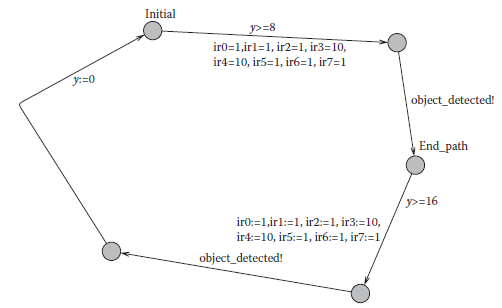

[3.3 <--- ](3_3.md) [   Зміст   ](README.md) [--> 3.5](3_5.md)

## 3.4. CASE STUDY: CONTROLLER FOR AN E-PUCK ROBOTIC APPLICATION

In this section, we present a case study where we use DEVS to build a model of a controller for an E-puck robot and later the same model is used as an actual controller. The E-puck (shown in [Figure 3.10](#_bookmark18)) is a desktop-size mobile robot with a wide range of possibilities (signal processing, autonomous control, embedded programming, etc.). The E-puck contains various sensors covering different modalities: (i) eight infrared (IR) proximity sensors placed around the body measure the closeness of obstacles, (ii) a 3D accelerometer provides the acceleration vector of the E-puck, (iii)  three microphones to capture sound, and (iv) a color CMOS (Complementary Metal Oxide Semiconductor) camera with a resolution of 640 × 480 pixels. It also includes the following actuators: (i) two stepper motors, making it capable of moving forward and backward, and spinning in both directions; (ii) a speaker, connected to an audio codec; (iii) eight red light-emitting diodes (LED) placed all around the top; and (iv) a red front LED placed beside the camera.

 

**FIGURE** **3.10** E-puck robot.

In the following sections, we introduce a DEVS model for a simple controller for the E-puck, the corresponding implementation in CD++, and the formal verification of different properties of the model through the transformation introduced in

Section 3.4 combined with the use of the UPPAL model checker.

### 3.4.1 DEVS Model Specification

The controller is designed to steer the robot in a field while avoiding obstacles. We have defined a DEVS model with an atomic component (*epuck0*) that imitates the behavior of the controller, shown in [Figure 3.11](#_bookmark19). There are eight input ports (*InIR0*, … *InIR7*), each of them modeling the connection to one proximity sensor. The input ports periodically receive the distances to the obstacles from the sensors. There are also two output ports: *OutMotor*, which transfers the output commands to the motors, and *OutLED*, to turn on/off the LEDs.

The controller can command the following actions based on the inputs received from the sensors: *move forward*, *turn 45 degrees left*, *turn 45 degrees right*, *turn 90 degrees left*, *turn 90 degrees right*, *turn 180 degrees*, and *stop*. Initially, the robot starts moving forward while receiving the periodic inputs from proximity sensors and analyzing them. As soon as it detects an obstacle, it performs one of the turning actions based on the position of the obstacle. The robot continues turning until it finds an empty space ahead. The controller also uses LEDs to signal the action that is being performed. For example, if the robot is moving forward, the front LED (*led0*) turns on and if it is turning 45 degrees to the left, *led7* turns on. [Figure 3.12 ](#_bookmark19)illustrates two sample imaginary scenarios in which obstacles block the robot’s path.


**FIGURE 3.11** E-puck controller DEVS model hierarchy.

   

**FIGURE 3.12** (a) Scenario 1: front-left blocked. (b) Scenario 2: front completely blocked.

The DEVS formal specification of the epuck0 atomic component is as follows:


  

[Table 3.5 ](#_bookmark21)summarizes the integer outputs of the DEVS model and their associated actions to be performed in the robot hardware. The driver interface programmed by the user transforms the numeric values to actions in the robot.

Figure 3.13 illustrates an abstract state diagram of the *epuck0* atomic component. The DEVS graph state diagram summarizes the behavior of a DEVS atomic component by representing the states, transitions, inputs, outputs, and state durations graphically. As we can see, initially, the robot moves forward and if no obstacle is detected from *IR0*, *IR1*, *IR6*, and *IR7* (the four sensors scanning the front direction, as seen in [Figure 3.12](#_bookmark19)), it continues moving forward. As soon as an obstacle is detected, the value of the sensor *IR6* is examined. If this sensor shows no obstacle, the left corner of the robot is open resulting in a 45° turn toward the left. Otherwise, it checks *IR1*, and if there is space, the robot turns 45° to the right. If both *IR1* and *IR6* are blocked, the controller examines *IR2*; if there is space, the robot performs a 90° turn to the left. The same occurs with *IR2*. If all sensors are blocked, the robot tries turning to the opposite direction (180°).

  

**FIGURE 3.13** epuck0 atomic component state diagram.


### 3.4.2 Implementation on the ECD++ Toolkit

To program a DEVS model on ECD++ [28,10], three main components are necessary.

1.   A model file in which the model hierarchy, model components, input and output ports of each component and input/output couplings are declared. The model file is passed to the ECD++ executable file as a runtime argument, and the latter instantiates the model components based on the declarations in the model file.

2.   Source files of the model components. For each atomic component, a C++ class is defined, and the external and internal transitions and the output function are programmed as methods of this class.

3.   A driver interface. A driver function is overridden by the user for each input or output port at the top level of the model hierarchy that is connected to a hardware counterpart. 

The ECD++ model file also contains information about the period of the input drivers and the duration of the states for each atomic component. In this example, we have tuned the input period of the IR sensors to 50 milliseconds. Therefore, for every 50 milliseconds, the external transition of the *epuck0* atomic component is invoked, and based on the updated values, the next action is decided. The following is the ECD++ model file of the e-puck robot controller model.

```
1 [top]
2 components : epuck0@epuck
3 out : outmotor outled
4 in : inir0 inir1 inir2 inir3 inir4 inir5 inir6 inir7
5 link : inir0 ir0@epuck0
6 link : inir1 ir1@epuck0
7 link : inir2 ir2@epuck0
8 link : inir3 ir3@epuck0
9 link : inir4 ir4@epuck0
10 link : inir5 ir5@epuck0
11 link : inir6 ir6@epuck0
12 link : inir7 ir7@epuck0
13 link : motor@epuck0 outmotor
14 link : led@epuck0 outled
15 inir0 : 00:00:00:100
16 inir1 : 00:00:00:100
17 inir2 : 00:00:00:100
18 inir3 : 00:00:00:100
19 inir4 : 00:00:00:100
20 inir5 : 00:00:00:100
21 inir6 : 00:00:00:100
22 inir7 : 00:00:00:100
23
24 [epuck0]
25 preparationTime : 00:00:00:000
26 turn45Time : 00:00:00:100
27 turn90Time : 00:00:00:700
28 turn180Time : 00:00:02:000
```

 Line 1 defines the *top* coupled component and line 2 declares its components. Lines 3 and 4 declare the output and input ports within the *top* coupled component, respectively. Lines 6–14 define the internal couplings. Lines 15–22 declare the periods of each input port. Lines 24–27 declare the duration of states within the *epuck0* component.

The external function performs the state transitions based on the DEVS graph diagram presented in Section 3.4.1. The following is the source code of the external transition function of *epuck0* atomic component.

```
1 if(state!=Mov_Fwd && IR0>0.04 && IR7>0.04 && IR1>0.02 &&
IR6>0.02){
2 }else if((state==Mov_Fwd)&&(IR0<0.05 || IR1< 0.02) &&
IR6>0.04){
3 state = Pre_Trn_45_Lft;
4 holdIn( Atomic::active, preparationTime );
5 }else if((state==Trn_45_Lft)&&(IR0<0.05 || IR1<0.02) &&
IR6>0.04){
6 state = Trn_45_Lft;
7 holdIn( Atomic::active, turn45Time);
8 }else if((state == Mov_Fwd)&& (IR6< 0.02 || IR7< 0.05) &&
IR1> 0.04){
9 state = Pre_Trn_45_Rgt;
10 holdIn( Atomic::active, preparationTime);
11 }else if((state==Trn_45_Rgt)&& (IR6< 0.02 || IR7< 0.05) &&
IR1> 0.04){
12 state = Trn_45_Rgt;
13 holdIn( Atomic::active, turn45Time);
14 }else if(state == Mov_Fwd && IR[0]< 0.05 && IR[7]< 0.05 &&
IR[2]> 0.04){
15 state = Pre_Trn_90_Lft;
16 holdIn( Atomic::active, preparationTime);
17 }else if(state == Mov_Fwd && IR[0]< 0.05 && IR[7]< 0.05 &&
IR[5]> 0.04){
18 state = Pre_Trn_90_Rgt;
19 holdIn(Atomic::active, preparationTime);
20 }else if(state!=Trn_180&&IR[0]<0.05&&IR[7]<0.05&&IR[2]<0.05
&&IR[5]<0.05){
21 state = Pre_Trn_180;
22 holdIn( Atomic::active, preparationTime);
23 }
```

Line 1 shows the case when *moving forward* is the current state and there is no obstacle ahead. Line 2 manages the case when *IR0* or *IR1* (right side of the robot) is obstructed. In that case, the state of the robot is changed to *prepare turn 45° left* (line 3), and in line 4, the time duration of this state is set. The other cases and the state changes are also indicated in the above-mentioned code snippet. The internal transition function and the output function are similar. For instance, the following code snippet shows a part of the internal transition function:

```
1 Model &epuck::internalFunction( const InternalMessage & )
2 {
3 switch (state){
4 case Pre_Mov_Fwd:
5 case Trn_45_Lft:
6 case Trn_45_Rgt:
7 case Trn_90_Lft:
8 case Trn_90_Rgt:
9 case Trn_180:
10 state = Mov_Fwd ;
11 passivate();
12 break;
13
14 case Pre_Trn_45_Lft:
15 state = Trn_45_Lft ;
16 holdIn( Atomic::active, turn45Time );
17 break;
18 …
```

Lines 4–9 show a part of the internal transition for the states *prepare move forward*, *turn 45° left*, *turn 45° right*, *turn 90° left*, *turn 90° right*, and *turn 180°*, after which the model continues to *move forward* (line 10). Line 14 shows the case for *prepare turn 45° left* state, after which the component transfers to *turn 45° left* state.

The following code snippet shows a part of the ECD++ output function (λ) implementation:

```
1 Model &epuck::outputFunction( const InternalMessage &msg )
2 {
3 switch (state){
4 case Pre_Mov_Fwd:
5 sendOutput( msg.time(), led, 100) ;//Turn all
Leds off
6 sendOutput( msg.time(), motor, 1) ;//Moving
Forward
7 sendOutput( msg.time(), led, 1) ;//Turn Led 0 on
8 break;
9
10 case Trn_45_Lft:
11 sendOutput( msg.time(), led, 70) ;//Turn Led 7
off
12 sendOutput( msg.time(), motor, 1) ;//Moving
Forward
13 sendOutput( msg.time(), led, 1) ;//Turn Led 0 on
14 break;
15 …
```

In this case, line 4 handles the outputs of state *prepare move forward* in which three different outputs are generated. Line 5 is the output command to turn off all LEDs. Line 6 shows the moving forward command sent to the *motor* port and line 7 is the command to turn *led0* on. These outputs are then decoded and converted by the corresponding drivers. Lines 9–13 show the outputs for the *turn 45° left* state where the *led7* is turned off first, then the motors are instructed to move forward and *led0* is turned on afterwards.

The following code snippet shows the driver interface function for the *OutMotor* output port of the *top* coupled component. The outputs generated in the output function for the *motor* port of the *epuck0* atomic component are inputted to this function as an integer argument and the respective hardware command is spawned here.

```
1 bool OutMotor::pDriver(Value &value)
2 {
3 switch((int)value){
4 case 0: //Stop
5 playerc_position2d_set_cmd_vel(position2d, 0, 0,
0, 1);
6 break;
7 case 1: //Moving Forward
8 playerc_position2d_set_cmd_vel(position2d, 1, 0,
0, 1);
9 break;
10 case 3: //Turn 45 deg. Right
11 case 4: //Turn 90 deg. Right
12 playerc_position2d_set_cmd_vel(position2d,
0,0,-10,1);
13 break;
14 case 2: //Turn 45 deg. Left
15 case 5: //Turn 90 deg. Left
16 case 6: //Turn 180 deg. (turn from left)
17 playerc_position2d_set_cmd_vel(position2d, 0, 0,
10,1);
18 break;
19 };
20 }
```

Lines 4–6 show the case of the stop command, which is encoded with value 0. Line 5 is the command to stop the robot. Lines 7–9 handle the moving forward output command and lines 10–13 manage the right turning commands. For both 45° and 90° turn actions, the robot starts spinning to the right, while the calibrated duration of the respective state accomplishes the desired degree of spinning. A more accurate approach to perform the turning actions would measure the spinning angle constantly and stop when the desired angle is reached.

### 3.4.3 Executing the Models

The e-puck model was first tested using virtual-time simulation mode. We designed a virtual space with obstacles and ran the simulation with inputs supplied from an event file, in which two series of inputs to the sensors are defined. Figure 3.14

Turn all LEDS OFF Move forward shows the contents of the event file and output file of the ECD++ and the action associated with the outputs of the controller model. The event file is structured in the format of “time, input port and value” and in this example it consists of two series of events representing the two scenarios shown in [Figure 3.12](#_bookmark19). The first three lines of the output file are the initial outputs of the model that move the robot forward. After 4 seconds of simulation, the first series of inputs is injected into the model, which results in the second series of outputs. The latter spins the robot 45° to the right and performs the appropriate LED commands and after 100 milliseconds moves the robot forward again with the appropriate LED commands. A similar scenario happens for the second series of inputs at time 8 of simulation in which the robot turns 180°.


**FIGURE 3.14** Event file and output file of ECD++.


**FIGURE 3.15** Robot controller timed automata model.

After verifying the behavior of the model in various scenarios, we tested the model using the actual e-puck robot. The model was executed in RT mode in which the model interacts with the target platform (in this case, the robot hardware). The same behavior was observed and the robot found its way through the obstacles. The results can be seen at [http://youtube.com/arslab.](http://youtube.com/arslab)

### 3.4.4 Verifying the Model

To obtain a TA model that is behaviorally equivalent to the DEVS model shown in [Figure 3.13](#_bookmark20), we followed the procedure discussed in Sections 3.3 and 3.4. The equivalent TA is shown in Figure 3.15. In this model, the Boolean conditions of the DEVS state model were defined in functions in the TA model as shown in the following code snippet.

```
1 bool forward_clear(){return ir0>4 && ir7 >4 && ir1>2 &&
ir6>2;}
2 bool left_45_clear(){return (ir0<5 || ir1<2) && ir6>4;}
3 bool right_45_clear(){return (ir6>2 || ir7 <5) && ir1>4;}
4 bool backward_clear(){return ir0<5 && ir7 <5 && ir2<5 &&
ir5<5;}
5 bool right_90_clear(){return ir0<5 && ir7 <5 && ir5>4;}
6 bool left_90_clear(){return ir0<5 && ir7 <5 && ir2>4;}
```

In this TA model, Boolean functions constitute guards on the transitions that evaluate to true whenever the sensor values satisfy the condition given in the DEVS model. While the DEVS model of the robot-controller was tested and simulated with the real robot moving in a specific environment, to verify the robot-controller model, we built a closed system where this model interacts with other models representing the motor and the environment in which the robot travels.

Figure 3.16 shows the TA model of the motor. This model represents the motor states, starting in *Preparing_To_Move_Forward.* It then synchronizes the motor model with the controller model through the *move_motor* channel. The motor model shows six states that the motor can visit depending on the value of the shared variable *motor*, which is updated by the Robot Controller model.

In [Figure 3.17](#_bookmark22), a simple model of the environment in which the robot may travel is shown. This model represents an environment that looks like a contoured closed layout. This layout was modeled in TA by the values assigned to different sensors on the robot *ir0*, *ir1*, *…* , *ir7*. These values are also shown in the event file used to test the robot DEVS model.

 

**FIGURE 3.16** Motor timed automata model.



**FIGURE 3.17** Environment timed automata model.

     

**FIGURE** **3.18** UPPAAL verification for deadlocks.

The verification of the system composed of Robot-Controller, Motor, and Environment in the UPPAAL tool revealed that it is free of deadlocks as shown in Figure 3.18. This ensures the controller is always able to successfully guide the robot through the given layout.

More complex layouts can also be modeled in TA to verify the system for more complicated behavior. For example, the TA environment model could be constructed to randomly assign values in reasonable range to the sensors. This would model generating arbitrary shaped obstacles around the robot. The verification for deadlock would then be executed to reveal if a deadlock is possible at any particular shape facing the robot. This would reveal either a fault in the robot-controller or the controller being too simple to handle irregular shapes facing the robot.

 

**FIGURE 3.19** Environment model with random sensor inputs.

Another example of verification that we can explore with verification includes different kinds of environments for the robot controller. In this example, we would attempt to check if the controller may enter into a deadlock and stop progress. To do so, we modify the environment model to randomly generate different sensor readings that simulate the robot approach to the situation where there is variety in the environment. This modified environment model is shown in Figure 3.19. In this model, sensor *ir0* obtains a value in the range of [1,5], *ir1* a value in [1,10].

By checking the model for deadlock again, the UPPAAL tool would verify this property and give a trace if this property is violated. The trace comprises values shown in the following lines.

```
1 motor = 1
2 ir0 = 5
3 ir1 = 1
4 ir2 = 1
5 ir3 = 10
6 ir4 = 10
7 ir5 = 1
8 ir6 = 1
9 ir7 = 1
```

This shows that the current design for the robot controller would not handle this combination of sensor values. In this case, either the designer reevaluates the design to address the shortcoming or it may be stated as an assumption on the simple robot controller that this shortcoming is acceptable.

[3.3 <--- ](3_3.md) [   Зміст   ](README.md) [--> 3.5](3_5.md)

