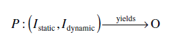
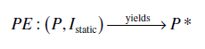
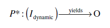
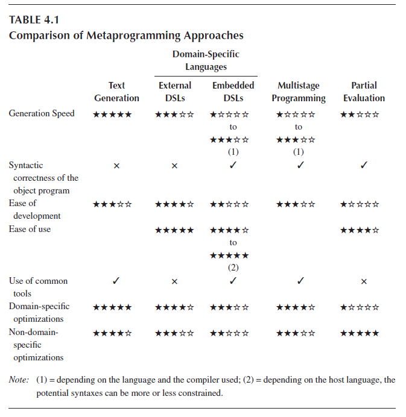

[4.1 <--- ](4_1.md) [   Зміст   ](README.md) [--> 4.3](4_3.md)

## 4.2. ГЕНЕРУВАННЯ КОДУ ТА МЕТАПРОГРАМУВАННЯ ДЛЯ ОПТИМІЗАЦІЇ ІМІТАЦІЙНОГО МОДЕЛЮВАННЯ РЕАЛЬНОГО ЧАСУ

An intuitive and (most of the time) easily verifiable notion is that the more generic a program is, the less efficient it is. A solution that is especially tailored to answer a specific problem or small set of problems has a good chance of being more effective than a solution solving a bigger set of problems. For example, a piece of code computing the result of an equation will perform better than a full-fledged equation solver. However, this classic trade-off between abstraction/genericity and performance can be overcome to attain the best of both worlds by using metaprogramming and particularly dedicated program generation.

Інтуїтивно зрозуміле і (здебільшого) легко перевірене уявлення полягає в тому, що чим більш загальною є програма, тим менш ефективною вона є. Рішення, яке спеціально розроблено для вирішення конкретної проблеми або невеликої групи проблем, має хороші шанси бути ефективнішим, ніж рішення, яке вирішує більший набір проблем. Наприклад, частина коду, що обчислює результат рівняння, працюватиме краще, ніж повноцінний розв’язувач рівнянь. Однак цей класичний компроміс між абстракцією/узагальненістю та продуктивністю можна подолати, щоб досягти найкращого з обох світів за допомогою метапрограмування та спеціальної генерації програм.

### 4.2.1 Поняття та означення

The simplest definition of a metaprogram is “a program that creates or manipulates a program.” This definition encompasses many concepts: source code generation, compilation, reflection, string evaluation, and so on. There is currently no broadly accepted taxonomy of metaprogramming systems. Two interesting propositions can be found in Refs. [10,11], where the authors identify concepts and relationships to characterize metaprograms. When dealing with performance, the most useful aspect of metaprogramming is program generation. Sheard [10] provides the following definition for a program generator:

Найпростішим визначенням метапрограми є «програма, яка створює або керує програмою». Це визначення охоплює багато понять: генерація вихідного коду, компіляція, відображення, оцінка рядка тощо. Наразі не існує загальновизнаної таксономії систем метапрограмування. Дві цікаві пропозиції можна знайти в Ref. [10,11], де автори визначають поняття та зв’язки для характеристики метапрограм. Коли йдеться про продуктивність, найкориснішим аспектом метапрограмування є генерація програм. Шеард [10] дає наступне визначення програмного генератора:

A program generator (a meta-program) solves a particular problem by constructing another program (an object program) that solves the problem at hand. Usually, the generated (object) program is “specialized” for the particular problem and uses fewer resources than a general purpose, non-generator solution.

Генератор програм (метапрограма) розв’язує певну проблему шляхом побудови іншої програми (програми-об’єкта), яка розв’язує дану проблему. Зазвичай згенерована (об’єктна) програма «спеціалізована» для конкретної проблеми та використовує менше ресурсів, ніж рішення загального призначення без генератора.

The definition by Damaševičius and Štuikys [11] is more general and simply states that Software generation is an automated process of creation of a target system from a highlevel specification. 

Визначення Дамашевичюса та Штуйкіса [11] є більш загальним і просто стверджує, що генерація програмного забезпечення – це автоматизований процес створення цільової системи з високорівневої специфікації.

These definitions are nicely encompassed by the concept of *multistage programming* [12], that is, decomposing the execution of a program into several steps. As Figure 4.1 shows through some examples, any kind of program execution can be seen as a sequence of steps. In particular, execution can be performed in a single stage (interpretation as in PHP program execution), two stages (e.g., compilation + execution), or more (e.g., code generation + compilation + execution).

Ці визначення чудово охоплюються концепцією *багатетапного програмування* [12], тобто розкладання виконання програми на кілька етапів. Як показано на рисунку 4.1 на прикладах, будь-яке виконання програми можна розглядати як послідовність кроків. Зокрема, виконання може виконуватися в один етап (інтерпретація, як у виконанні програми PHP), два етапи (наприклад, компіляція + виконання) або більше (наприклад, генерація коду + компіляція + виконання).

Adding a new stage to the interpretation approach means reducing the abstraction level to finally produce a code optimized for performing the operations described in the source program. Optionally, each stage can be parameterized by an input other than the source specification. For example, a compiler produces a machine code corresponding to the input source code and specific and optimized for a specific target machine.

Додавання нового етапу до підходу інтерпретації означає зниження рівня абстракції, щоб нарешті отримати код, оптимізований для виконання операцій, описаних у вихідній програмі. Додатково кожен етап можна параметризувати за допомогою вхідних даних, відмінних від специфікації джерела. Наприклад, компілятор виробляє машинний код, який відповідає вхідному вихідному коду та є специфічним та оптимізованим для конкретної цільової машини.

 

**FIGURE 4.1** Samples of n-stage executions.

In Sections 4.2.2 to 4.2.5, we will present several metaprogramming techniques that allow the generation of specialized and optimized artifacts without sacrificing genericity and abstraction. We adopt a pragmatic point of view, so that emphasis will be on practical examples rather than on theoretical aspects.

У розділах 4.2.2 – 4.2.5 ми представимо кілька методів метапрограмування, які дозволяють генерувати спеціалізовані та оптимізовані артефакти без шкоди для загальності та абстракції. Ми дотримуємося прагматичної точки зору, тому акцент буде зроблено на практичних прикладах, а не на теоретичних аспектах.

### 4.2.2 Генерація тексту

Metaprogramming can be as simple as writing strings into a file. For example, the following C code is a metaprogram that generates a C file containing the code for printing the string passed to the metaprogram:

Метапрограмування може бути таким же простим, як запис рядків у файл. Наприклад, наведений нижче код C є метапрограмою, яка генерує файл C, що містить код для друку рядка, переданого метапрограмі:

```c
#include <stdio.h>
int main( int argc, char * argv[] )
{
    FILE * output;
    output = fopen( argv[1], “w” );
    fprintf( output, “#include <stdio.h>\n\n” );
    fprintf( output, “int main(void)\n” );
    fprintf( output, “{\n” );
    fprintf( output, “ printf(\“%s\”);\n”, argv[2] );
    fprintf( output, “}” );
    return 0;
}
```

**CODE 1** C metaprogram generating C source code printing the string given in argument.  **CODE 1** Метапрограма C генерує вихідний код C і друкує рядок, указаний в аргументі.

Of course, this contrived example adds little value compared to writing the object program directly. However, this technique becomes quite valuable when the object code is too tedious to write by hand or when the metaprogram performs computations on its arguments before generation as all the computations that are performed beforehand need not be executed in the object program. Compared to other metaprogramming techniques, a major advantage of source code generation is that the output is readable by a human, thereby helping debugging. However, the string approach presented here has the drawback that the validity of the object program cannot be enforced at the meta level.

Звичайно, цей надуманий приклад додає мало цінності порівняно з написанням безпосередньо об’єктної програми. Однак ця техніка стає досить цінною, коли об’єктний код надто виснажливо писати вручну або коли метапрограма виконує обчислення своїх аргументів перед генерацією, оскільки всі обчислення, які виконуються заздалегідь, не потрібно виконувати в об’єктній програмі. Порівняно з іншими техніками метапрограмування головною перевагою генерації вихідного коду є те, що вихідні дані читаються людиною, що сприяє налагодженню. Однак рядковий підхід, представлений тут, має той недолік, що валідність об’єктної програми не може бути забезпечена на метарівні.

We can make a distinction between two types of generation: data generation and instructions generation.

Ми можемо розрізнити два типи генерації: генерація даних і генерація інструкцій.

#### 4.2.2.1 Генерація даних

Метою генерації даних є обчислення набору значень перед виконанням, щоб вони вже були завантажені в пам’ять під час запуску програми. Наприклад, деякі програми використовують таблицю пошуку, що містить синус багатьох значень, замість того, щоб обчислювати синус кожного разу, коли це потрібно. У більшості випадків ця таблиця пошуку заповнюється під час запуску; однак більш ефективним підходом є генерація коду для ініціалізації таблиці пошуку безпосередньо з правильними значеннями. Цю техніку також можна використовувати для прискорення стохастичного моделювання, якщо метапрограма генерує псевдовипадкові числа замість того, щоб генерувати потік під час виконання. Метапрограма створює файл, що містить ініціалізацію масиву зі згенерованими числами. Потім цей файл можна скомпільувати, і кожне моделювання, яке має використовувати випадковий потік, має лише зв’язатися з отриманим об’єктним файлом. У цих програмах значно зменшено час отримання псевдовипадкового числа (у попередній роботі [13] ми спостерігали коефіцієнт 5). Цей підхід підходить для великої пам’яті, яку ми маємо навіть на персональних комп’ютерах, оскільки він сприяє часу виконання за рахунок додаткового простору об’єктного файлу. Коли кількість псевдовипадкових чисел занадто велика для збереження в пам’яті, можна використовувати методи відображення пам’яті [14,15].

#### 4.2.2.2 Генерація інструкцій

With data generation, we mostly generate values. It is nevertheless metaprogramming, because we also generate the code to store these values in a data structure accessible at runtime. However, this is not the nominal use of metaprogramming. A metaprogram occasionally generates data, but mainly generates instructions. We can consider the metaprogram as a metasolution to a given problem. Instead of solving the problem, the program generates a solution to the problem. A metaprogram is often more generic than a regular program, and it can create solutions specialized for the inputs it receives. For example, in the work by Missaoui, Hill, and Perret [16], a metaprogram was used to generate programs for computing every reverse translation of oligopeptides containing a given set of amino acids. The metaprogram identified the set of amino acids to be considered as the input and generated a nonrecursive pile handling program with a big number of nested loops, used to compute the backtranslations of any oligopeptide (composed of the amino acids specified at generation). The resulting programs would have been difficult, if not impossible, to write manually without sacrificing some efficiency.

Генеруючи дані, ми здебільшого генеруємо цінності. Тим не менш, це метапрограмування, оскільки ми також генеруємо код для зберігання цих значень у структурі даних, доступній під час виконання. Однак це не номінальне використання метапрограмування. Метапрограма іноді генерує дані, але в основному генерує інструкції. Ми можемо розглядати метапрограму як метарозв'язання даної проблеми. Замість вирішення проблеми програма генерує рішення проблеми. Метапрограма часто є більш загальною, ніж звичайна програма, і вона може створювати рішення, спеціалізовані для вхідних даних, які вона отримує. Наприклад, у роботі Missaoui, Hill і Perret [16] метапрограма була використана для створення програм для обчислення кожної зворотної трансляції олігопептидів, що містять заданий набір амінокислот. Метапрограма визначила набір амінокислот, які слід розглядати як вхідні дані, і згенерувала нерекурсивну програму обробки купи з великою кількістю вкладених циклів, яка використовується для обчислення зворотних трансляцій будь-якого олігопептиду (складеного з амінокислот, указаних під час генерації). Отримані програми було б важко, якщо не неможливо, написати вручну без шкоди для ефективності.

Both generation approaches have been used in the real-time context for decades. In the work by Auer, Kemppainen, Okkonen, and Seppänen [17], a code generator is presented to implement full tasks for real-time systems. The code is produced from a structured data/control flow description following the real-time structured analysis/ structured design (RT-SA/SD) methodology [18] and the program transformation paradigm (which is now a classical concept of the model-driven paradigm). Petri net programs and PL/M-x86 code were generated, and the resulting Petri nets were used for dynamic analysis, helping the discovery of significant errors hidden in the RT-SA/SD specifications. In the work by Webster, Levy, Harley, Woodward, Naidoo, Westhuizen, and Meyer [19], we find the generation of parallel real-time control code. A prototype of a controller hardware platform with the design and implementation of the associated software showed efficient real-time response with customized code generation for a set of particular processors. Parallelism was used to optimize real-time responses and to increase controller throughput.

Обидва підходи генерації використовувалися в контексті реального часу протягом десятиліть. У роботі Auer, Kemppainen, Okkonen і Seppänen [17] представлено генератор коду для реалізації повних завдань для систем реального часу. Код створюється з опису потоку структурованих даних/керування відповідно до методології структурованого аналізу/структурованого проектування в реальному часі (RT-SA/SD) [18] і парадигми перетворення програми (яка зараз є класичною концепцією керованого моделлю) парадигма). Були створені програми мережі Петрі та код PL/M-x86, а отримані мережі Петрі використовувалися для динамічного аналізу, допомагаючи виявити значні помилки, приховані в специфікаціях RT-SA/SD. У роботі Webster, Levy, Harley, Woodward, Naidoo, Westhuizen і Meyer [19] ми знаходимо генерацію паралельного керуючого коду реального часу. Прототип апаратної платформи контролера з розробкою та реалізацією відповідного програмного забезпечення продемонстрував ефективну реакцію в режимі реального часу з генерацією налаштованого коду для набору конкретних процесорів. Паралелізм використовувався для оптимізації відповідей у реальному часі та збільшення пропускної здатності контролера.

### 4.2.3 Domain-Specific Languages

Domain-specific languages (DSLs) are programming or modeling languages dedicated to a particular domain. They contrast with general-purpose programming languages (GPLs) such as C, Java, and LISP and general-purpose modeling languages such as UML, which can be used in any domain. A DSL usually defines a textual or graphical syntax for manipulating the domain entities. Specifications written in the DSL are compiled either directly to machine code or more often to source code in a GPL.

Доменно-орієнтовані мови (DSL) — це мови програмування або моделювання, призначені для певної області. Вони відрізняються від мов програмування загального призначення (GPL), таких як C, Java і LISP, і мов моделювання загального призначення, таких як UML, які можна використовувати в будь-якому домені. DSL зазвичай визначає текстовий або графічний синтаксис для маніпулювання сутностями домену. Специфікації, написані в DSL, компілюються або безпосередньо до машинного коду, або частіше до вихідного коду GPL.

The advantages of using DSLs are numerous. The most obvious is that they provide abstractions that are at the appropriate level for the user, hence expediting development of models and applications. However, the same effect can be more or less achieved in a GPL through libraries. More interesting are the opportunities that DSLs bring regarding verification and optimization. Indeed, since the language is domain-dependent, the tools for manipulating specifications can themselves be domain-dependent. This means that verification about the program can be performed at design time using domain knowledge. Similarly, the DSL compiler can perform several domain-specific optimizations [20]. For the sake of illustration, let us consider electronic circuit simulation. Using a traditional library,*(\* “Traditional library” as opposed to “active library,” a notion that is presented later in this section.) the user would manipulate classes and functions. For example, there could be classes for representing each type of logical gate. When compiling this program, all the GPL compiler sees is classes and functions, and therefore, it is only able to perform generic optimizations such as loop unrolling and inlining. Now, if the same program were written in a DSL for circuit simulation (such as VHSIC Hardware Description Language (VHDL) [21]), the DSL compiler could perform more specific optimizations. For example, the DSL compiler could be aware that the combination of two NOT gates is equivalent to no gates at all and consequently avoid generating the code for these two gates in the object program.

Переваги використання DSL численні. Найбільш очевидним є те, що вони забезпечують абстракції, які знаходяться на відповідному рівні для користувача, отже прискорюючи розробку моделей і додатків. Однак того самого ефекту можна більш-менш досягти в GPL за допомогою бібліотек. Більш цікавими є можливості, які надають DSL щодо перевірки та оптимізації. Дійсно, оскільки мова є предметно-залежною, інструменти для маніпулювання специфікаціями можуть самі бути предметно-залежними. Це означає, що перевірку щодо програми можна виконати під час розробки, використовуючи знання домену. Подібним чином, компілятор DSL може виконувати кілька предметно-спеціальних оптимізацій [20]. Для ілюстрації розглянемо моделювання електронної схеми. Використовуючи традиційну бібліотеку («Традиційна бібліотека» на відміну від «активної бібліотеки», поняття, яке представлено далі в цьому розділі) користувач міг би маніпулювати класами та функціями. Наприклад, можуть бути класи для представлення кожного типу логічних воріт. Під час компіляції цієї програми компілятор GPL бачить тільки класи та функції, а отже, він може виконувати лише загальні оптимізації, такі як розгортання циклу та вбудовування. Тепер, якби ту саму програму було написано на DSL для симуляції схеми (наприклад, VHSIC Hardware Description Language (VHDL) [21]), компілятор DSL міг би виконувати більш специфічну оптимізацію. Наприклад, компілятор DSL може знати, що комбінація двох воріт НЕ еквівалентна відсутності воріт взагалі, і, отже, уникати генерації коду для цих двох воріт в об’єктній програмі.

DSLs have been used in simulation for a long time. In a previous work [22,23], we surveyed some of the most prominent simulation DSLs, which are briefly discussed in the current chapter. Back in the 1960s, IBM introduced GPSS (Global Purpose Simulation System [24]), a language for discrete event simulation with both a textual syntax and a graphical syntax, which could be compiled to machine code or to interpretable pseudocode. In the late 1970s, SLAM (Simulation Language for Alternative Modeling) [25] was introduced. It made it possible to use several modeling approaches (process, event, and continuous [26]), possibly combined together. A few years later, SIMAN (SIMulation ANalysis [27]) was released. It allowed modeling discrete, continuous, or hybrid systems and was used in several modeling and simulation software such as ARENA, which is still evolving and widely used. We can also cite the QNAP2 (Queuing Network Analysis Package 2 [28]) language, based on the theory of queuing networks. The trend in the past few years has been to make languages even more specialized. Indeed, the notion of specificity is rather subjective. After all, even though the above-mentioned languages seem more specific than a GPL such as FORTRAN or C, they can also be seen as much more generic than a DSL for flight simulation, for instance. The more specific a DSL is, the easier it is to use it and to perform verification and optimization on the model. However, it also greatly limits its scope. As a consequence, the cost of developing the DSL should not be higher than the outcome obtained by using it. Fortunately, there are more and more tools available to ease their development. One of the most active areas in this regard is model-driven engineering (MDE) [29,30]. Indeed, the MDE approach and the tools developed to support it enable, among other things, the creation of new DSLs in a very short time. DSLs are supported by providing metamodels and model transformations to develop abstract syntaxes, concrete syntaxes, code generators, graphical editors, and so on.

DSL використовувалися в моделюванні протягом тривалого часу. У попередній роботі [22,23] ми розглянули деякі з найвідоміших DSL моделювання, які коротко обговорюються в поточному розділі. Ще в 1960-х роках IBM представила GPSS (Global Purpose Simulation System [24]), мову для симуляції дискретних подій із текстовим і графічним синтаксисом, які можна скомпільувати в машинний код або в інтерпретований псевдокод. Наприкінці 1970-х років було представлено SLAM (Simulation Language for Alternative Modeling) [25]. Це дозволило використати кілька підходів до моделювання (процесний, подійний і безперервний [26]), можливо, комбінувати разом. Через кілька років було випущено SIMAN (SIMulation ANalysis [27]). Він дозволяв моделювати дискретні, безперервні або гібридні системи та використовувався в кількох програмних забезпеченнях для моделювання та моделювання, таких як ARENA, яке все ще розвивається та широко використовується. Можна також навести мову QNAP2 (Queuing Network Analysis Package 2 [28]), засновану на теорії мереж масового обслуговування. Тенденція останніх кількох років полягає в тому, щоб зробити мови ще більш спеціалізованими. Дійсно, поняття специфічності досить суб'єктивне. Зрештою, незважаючи на те, що вищезгадані мови здаються більш специфічними, ніж GPL, такі як FORTRAN або C, вони також можуть розглядатися як набагато більш загальні, ніж DSL, наприклад, для симуляції польоту. Чим більш конкретним є DSL, тим легше його використовувати та виконувати перевірку й оптимізацію моделі. Однак це також значно обмежує його сферу застосування. Як наслідок, вартість розробки DSL не повинна бути вищою за результат, отриманий при його використанні. На щастя, доступних інструментів для полегшення їх розробки стає все більше. Одним із найбільш активних напрямків у цьому відношенні є модельно-керована інженерія (MDE) [29,30]. Дійсно, підхід MDE та інструменти, розроблені для його підтримки, дозволяють, серед іншого, створювати нові DSL за дуже короткий час. DSL підтримуються наданням метамоделей і перетворень моделі для розробки абстрактного синтаксису, конкретного синтаксису, генераторів коду, графічних редакторів тощо.

Several DSLs have been developed for real-time programming; some of them target a broad range of real-time systems (e.g., Hume [31], or the graphical modeling language used in Simulink® [32]), while others are more specialized and are peculiar to a given business such as avionics [33] or robotics [34]. All these DSLs make it easier to write real-time applications by providing high-level constructs, for example, for describing time constraints in an operation. Moreover, these languages most of the time exhibit characteristics that are difficult to obtain with GPL, such as determinacy or bounded time/space. They can also outperform GPLs by applying domain-specific optimizations. For example, Simulink can minimize a certain type of loops in models, thereby removing the need to solve them at runtime with a computationally expensive loop solver.

Було розроблено кілька DSL для програмування в реальному часі; деякі з них націлені на широкий спектр систем реального часу (наприклад, Hume [31] або мова графічного моделювання, що використовується в Simulink® [32]), тоді як інші є більш спеціалізованими та властивими певному бізнесу, наприклад авіоніка [ 33] або робототехніки [34]. Усі ці DSL полегшують написання додатків у реальному часі, надаючи високорівневі конструкції, наприклад, для опису часових обмежень в операції. Крім того, ці мови здебільшого демонструють характеристики, які важко отримати за допомогою GPL, наприклад детермінованість або обмеженість у часі/просторі. Вони також можуть перевершити GPL, застосовуючи оптимізацію для конкретного домену. Наприклад, Simulink може мінімізувати певний тип циклів у моделях, тим самим усуваючи необхідність розв’язувати їх під час виконання за допомогою обчислювально дорогого розв’язувача циклів.

#### 4.2.3.1 Вбудований DSLs

The development of a DSL from scratch can be quite cumbersome. Tools are available to facilitate the process, such as Lex and Yacc [35] or MDE-related tools, but it is still not a seamless experience. Moreover, the DSL puts some burden on the user who must learn an entirely new syntax and use some specific tools to generate or execute its code. Finally, it sometimes happens that a DSL must contain a GPL as a sublanguage to provide the user with complete flexibility on some part of a program (these are sometimes called *hybrid DSLs*).

Розробка DSL з нуля може бути досить громіздкою. Для полегшення процесу доступні інструменти, такі як Lex і Yacc [35] або інструменти, пов’язані з MDE, але це все ще не бездоганний досвід. Крім того, DSL накладає певне навантаження на користувача, який повинен вивчити абсолютно новий синтаксис і використовувати деякі спеціальні інструменти для генерації або виконання коду. Нарешті, іноді трапляється, що DSL має містити GPL як підмову, щоб забезпечити користувачеві повну гнучкість щодо певної частини програми (їх іноді називають *гібридними DSL*).

An interesting approach to overcome these issues is the concept of embedded domain-specific languages (EDSLs), sometimes called *internal DSLs* [36]. These DSLs are embedded in a host language (usually a GPL), meaning that they are defined using the host constructs and syntax. This implies that every expression in the DSL must be a valid expression in the GPL. Even though this seems to be an unacceptable restriction, the gains obtained by using an EDSL are quite attractive:

Цікавим підходом до подолання цих проблем є концепція вбудованих доменно-орієнтованих мов (EDSL), які іноді називають *внутрішніми DSL* [36]. Ці DSL вбудовані в головну мову (зазвичай GPL), тобто вони визначені за допомогою основних конструкцій і синтаксису. Це означає, що кожен вираз у DSL має бути дійсним виразом у GPL. Незважаючи на те, що це здається неприйнятним обмеженням, переваги, отримані від використання EDSL, досить привабливі:

- The syntax is the same as the host GPL, and therefore, the user can focus on learning the DSL semantics.
- The GPL can be used in synergy with the DSL to have both the practical expressivity of the DSL and the theoretical expressivity of the GPL.
- It is not necessary to write a custom lexer, parser, and code generator because all of these are provided for the GPL and can be exploited at no additional charge for the DSL, including the generic optimizations performed by the GPL optimizer.

- Синтаксис такий самий, як і GPL хоста, і тому користувач може зосередитися на вивченні семантики DSL.
- GPL можна використовувати разом із DSL, щоб отримати як практичну виразність DSL, так і теоретичну виразність GPL.
- Немає необхідності писати спеціальний лексер, синтаксичний аналізатор і генератор коду, оскільки всі вони надаються для GPL і можуть використовуватися без додаткової плати для DSL, включаючи загальну оптимізацію, виконану оптимізатором GPL.

Fowler identified several techniques for writing DSLs in object-oriented languages and more broadly in any procedural language [36]. These techniques aim at providing a *fluent interface* to a library, meaning an API designed to flow like natural language: the code using the library should be readable as if it were written in a language of its own. Method chaining is one of the techniques that can be used to provide a fluent interface. Code 2 hereafter shows a sample of code for operating a robot that uses a fluent interface. The interface of the “Robot” class is designed so that the code using it can be read as if using a language specific to robot manipulation.

Фаулер виділив декілька технік для написання DSL на об’єктно-орієнтованих мовах і, ширше, на будь-якій процедурній мові [36]. Ці методи спрямовані на надання бібліотеці *плавного інтерфейсу*, що означає API, розроблений для роботи як природна мова: код, який використовує бібліотеку, має читатися так, ніби він написаний окремою мовою. Зв'язування методів є одним із методів, які можна використовувати для забезпечення вільного інтерфейсу. Код 2 нижче показує зразок коду для керування роботом, який використовує плавний інтерфейс. Інтерфейс класу «Робот» розроблений таким чином, що код, який його використовує, можна читати так, ніби використовує мову, специфічну для маніпулювання роботами.

```c
Robot wall_e;

wall_e.
    right( 60 ).
    forward().
        length( 100 ).
        speed( 20 ).
    left( 20 ).
    deployArm();
```

**CODE 2** Sample use of a fluent interface for robot manipulation.

The syntax of the DSL can be even richer in languages that support operator overloading such as C++ and C# and/or operator definition such as Scala and F#. In the first case, the DSL designer can reuse existing operators in his/her own language to provide a more usable syntax, while in the second case, the designer can even create his/her own keywords to extend the original GPL syntax.

Синтаксис DSL може бути ще багатшим у мовах, які підтримують перевантаження операторів, таких як C++ і C#, і/або визначення операторів, таких як Scala і F#. У першому випадку розробник DSL може повторно використовувати існуючі оператори у своїй власній мові, щоб забезпечити більш зручний синтаксис, тоді як у другому випадку розробник може навіть створити власні ключові слова, щоб розширити вихідний синтаксис GPL.

However, as enjoyable as providing a language-like interface to a library can be, it is not acceptable in the case at hand if it unfavorably affects performance. In general, providing a fluent interface implies additional runtime computations, notably to keep track of the context. Does it mean that EDSLs should not be employed when execution time is a concern? No, not if we couple the notion of EDSL with the one of *active library*. Veldhuizen and Gannon [37], who coined the term in 1998, provide the following definition:

Однак, як би приємно не було надання мовного інтерфейсу для бібліотеки, це неприйнятно в даному випадку, якщо це негативно впливає на продуктивність. Загалом, забезпечення вільного інтерфейсу передбачає додаткові обчислення під час виконання, зокрема для відстеження контексту. Чи означає це, що EDSL не слід використовувати, коли час виконання є проблемою? Ні, якщо поєднати поняття EDSL із *активною бібліотекою*. Veldhuizen і Gannon [37], які ввели цей термін у 1998 році, надають таке визначення:

> Unlike traditional libraries which are passive collections of functions and objects, Active Libraries may generate components, specialize algorithms, optimize code [and] configure and tune themselves for a target machine […].
>
> На відміну від традиційних бібліотек, які є пасивними колекціями функцій і об’єктів, активні бібліотеки можуть генерувати компоненти, спеціалізувати алгоритми, оптимізувати код [та] конфігурувати та налаштовувати себе для цільової машини […].

In other words, an active library can provide the same generic abstractions as a traditional one while at the same time providing maximum efficiency, thanks to code generation and optimization, achievable through metaprogramming. We can see an active library as a library generator that creates libraries tailored for the user-specific needs, depending on its parameterization.

Іншими словами, активна бібліотека може забезпечувати ті самі загальні абстракції, що й традиційна, і водночас забезпечувати максимальну ефективність завдяки генерації коду та оптимізації, які можна досягти за допомогою метапрограмування. Ми можемо розглядати активну бібліотеку як генератор бібліотек, який створює бібліотеки, адаптовані до потреб користувача, залежно від її параметризації.

Therefore, an EDSL implemented as an active library will be able to perform the same operations the compiler executes when dealing with external DSL. Ahead of execution, the library can perform abstract syntax tree rewriting, evaluation of constant expressions, domain-specific optimizations, and so on, effectively resulting in a code specialized for the user’s program. The languages providing the most powerful facilities for implementing “active EDSLs” are functional languages such as dialects of the LISP family, which provide macros for extending the syntax and quasiquoting/unquoting* (\* These terms will be defined in Section 4.2.4.) for generating code, and languages with very flexible syntax such as Ruby or Scala. However, these languages are not as widely used as other languages such as Java or C, and their strength lies in aspects other than performance. On the contrary, the C++ language is one of the most used languages and exhibits some of the best performance. And the good news for this now “old” language is that it supports active libraries, EDSLs, and metaprogramming, through the use of the template mechanism, as will be discussed in Section 4.2.4.

Таким чином, EDSL, реалізована як активна бібліотека, зможе виконувати ті самі операції, що й компілятор, коли має справу із зовнішньою DSL. Перед виконанням бібліотека може виконувати переписування абстрактного синтаксичного дерева, оцінку константних виразів, предметно-спеціальну оптимізацію тощо, фактично створюючи спеціалізований код для програми користувача. Мови, що надають найпотужніші можливості для реалізації «активних EDSL», є функціональними мовами, такими як діалекти сімейства LISP, які надають макроси для розширення синтаксису та квазікватирування/зняття лапок (Ці терміни будуть визначені в розділі 4.2.4. ) для створення коду та мови з дуже гнучким синтаксисом, такі як Ruby або Scala. Однак ці мови не так широко використовуються, як інші мови, такі як Java або C, і їх перевага полягає не в продуктивності, а в інших аспектах. Навпаки, мова C++ є однією з найбільш використовуваних мов і демонструє одну з найкращих характеристик. Хороша новина для цієї тепер уже «старої» мови полягає в тому, що вона підтримує активні бібліотеки, EDSL і метапрограмування за допомогою механізму шаблону, як буде обговорюватися в розділі 4.2.4.

A pioneer in the area of C++ active EDSLs is Blitz++ [38], a scientific computing library that uses metaprogramming to optimize numerical computations at compile time, making it possible to equal and sometimes exceed the speed of FORTRAN. Since then, frameworks have been developed to facilitate the writing of C++ EDSL. The most accomplished one is probably Boost.Proto [39], a C++ EDSL for defining C++ EDSLs. This active library makes it extremely easy to define grammars, evaluate or transform expression trees, and so on, all in C++ and with most of the computation happening at compile time. It has been successfully exploited in several domains such as parsing and output generation (Boost.Spirit), functional programming (Boost.Phoenix), or parallel programming (Skell BE [40]).

Піонером у галузі C++ активних EDSL є Blitz++ [38], наукова обчислювальна бібліотека, яка використовує метапрограмування для оптимізації чисельних обчислень під час компіляції, що дозволяє дорівнювати, а іноді й перевищувати швидкість FORTRAN. З того часу були розроблені фреймворки для полегшення написання C++ EDSL. Найдосконалішим є, мабуть, Boost.Proto [39], C++ EDSL для визначення C++ EDSL. Ця активна бібліотека дозволяє надзвичайно легко визначати граматику, оцінювати або перетворювати дерева виразів тощо, і все це на C++, і більшість обчислень відбувається під час компіляції. Він успішно використовується в кількох областях, таких як синтаксичний аналіз і генерація виводу (Boost.Spirit), функціональне програмування (Boost.Phoenix) або паралельне програмування (Skell BE [40]).

In the real-time domain, most EDSLs are based on functional languages, which are more amenable to static analysis than imperative languages and easier to adapt into DSLs. A good example is Atom, a Haskell-based EDSL [41] that provides several guarantees such as deterministic execution time and memory consumption, notably by performing task scheduling and thread synchronization at compile time. A short overview of the available DSLs for real-time systems modeling can be found in Ref. [42].

У домені реального часу більшість EDSL базуються на функціональних мовах, які більш піддаються статичному аналізу, ніж імперативні мови, і легше адаптуються до DSL. Гарним прикладом є Atom, EDSL на основі Haskell [41], який забезпечує кілька гарантій, таких як детермінований час виконання та споживання пам’яті, зокрема, шляхом виконання планування завдань і синхронізації потоків під час компіляції. Короткий огляд доступних DSL для моделювання систем реального часу можна знайти в Ref. [42].

### 4.2.4 Багатоступеневі мови програмування

Multistage programming languages (MSPLs) are languages including constructs for concisely building object programs that are guaranteed to be syntactically correct [12].

Багатоетапні мови програмування (MSPL) – це мови, що містять конструкції для стислої побудови об’єктних програм, які гарантовано є синтаксично правильними [12].

In traditional programming languages, program generation is performed through either strings or data types manipulation. The first approach, presented at the beginning of this section, has the major drawback that there is no way of proving that the resulting program will be correct. After all, “obj.meth(arg)” and “î#%2$µ” are both strings, but the first one may have a meaning in the object program while the second will probably be an erroneous piece of code. This issue can be solved by using data types to represent the object program (e.g., manipulating instances of classes such as Class, Method, Expression, and Variable), but doing so makes the metaprogram much less readable and concise.

У традиційних мовах програмування генерація програми виконується через рядки або типи даних. Перший підхід, представлений на початку цього розділу, має головний недолік: немає способу довести, що результуюча програма буде правильною. Зрештою, «obj.meth(arg)» і «î#%2$µ» є рядками, але перший може мати значення в об’єктній програмі, тоді як другий, ймовірно, буде помилковим фрагментом коду. Цю проблему можна вирішити, використовуючи типи даних для представлення об’єктної програми (наприклад, маніпулюючи екземплярами класів, таких як Class, Method, Expression і Variable), але це робить метапрограму набагато менш читабельною та короткою.

To overcome these problems, MSPLs contain annotations to indicate which pieces of code belong to the object program. These pieces of code will not be evaluated during execution and will simply be “forwarded” to the object program. They must nevertheless be valid code, hence providing syntactic verification of the object program at the meta level. This is the core of the LISP macros system, where the quote operator is used to annotate object code. More interestingly, dialects of the LISP family usually include a backquote (quasiquote in Scheme) operator. A backquoted expression, as a quoted expression, will be included in the object program, but it can also contain unquoted expressions that will be evaluated before being included.*(\* A similar feature, command substitution, can be found in Unix shells. Incidentally, the character used to denote commands that must be substituted is also the backquote.) Backquoted expressions can be nested to provide an arbitrary number of stages. The LISP code below provides an example of a power function that generates the code for computing xn for a fixed n. The pow function takes two parameters, the base x and the exponent n, and is recursively defined (x0 = 1, xn = x * xn−1). However, since the multiplication is backquoted, it will not be performed immediately. Instead, it will be included in the generated code. The two operands being unquoted (through the comma operator), they will be replaced by the result of their evaluation. Eventually, the pow function will generate unrolled code without recursive calls nor test for base case.

Щоб подолати ці проблеми, MSPL містять анотації, які вказують, які фрагменти коду належать до об’єктної програми. Ці фрагменти коду не будуть оцінюватися під час виконання, а просто будуть «переслані» об’єктній програмі. Проте вони повинні бути дійсним кодом, отже, забезпечуючи синтаксичну перевірку об’єктної програми на метарівні. Це ядро системи макросів LISP, де оператор лапок використовується для анотації об’єктного коду. Що ще цікавіше, діалекти сімейства LISP зазвичай включають оператор зворотних лапок (квазілапок у Scheme). Вираз у зворотних лапках, як вираз у лапках, буде включено в об’єктну програму, але він також може містити вирази без лапок, які будуть оцінені перед включенням.(Подібну функцію, заміну команд, можна знайти в оболонках Unix. До речі, символ, який використовується для позначення команд, які потрібно замінити, також є зворотними лапками) Вирази в зворотних лапках можуть бути вкладеними, щоб забезпечити довільну кількість етапів. Наведений нижче код LISP надає приклад функції потужності, яка генерує код для обчислення xn для фіксованого n. Функція pow приймає два параметри, основу x і експоненту n, і визначається рекурсивно (x0 = 1, xn = x * xn−1). Однак, оскільки множення введено в зворотні котирування, воно не буде виконано негайно. Натомість його буде включено до згенерованого коду. Два операнди не взяті в лапки (через оператор коми), вони будуть замінені результатом їх оцінки. Згодом функція pow генеруватиме розгорнутий код без рекурсивних викликів і без тестування базового регістру.

```lisp
(define (pow x n)
    (if (= n 0)
        1
        `(* ,x ,(pow x (- n 1)))
    )
)
(pow 'var 4)
;Output: (* var (* var (* var (* var 1))))
```

**CODE 3** LISP Code generating the code computing xn.

This backquote feature, even though powerful, can create some issues regarding symbol binding. In particular, instead of being bound at the metaprogram level, they are bound during evaluation (in the object program), which is often not the desired behavior. The MetaML language [43] has been developed, among other reasons, to solve these problems.

Ця функція зворотних лапок, хоча й потужна, може створити деякі проблеми щодо зв’язування символів. Зокрема, замість зв’язування на рівні метапрограми, вони зв’язуються під час оцінювання (в об’єктній програмі), що часто не є бажаною поведінкою. Мова MetaML [43] була розроблена, серед інших причин, для вирішення цих проблем.

Functional languages are well suited for metaprogramming, thanks to their homoiconicity (“data is code”), and have been successfully used to develop real-time applications. For instance, in the late 1980s, the expert system G2 was developed in Common LISP and heavily relied on macros to generate efficient code [44]. Thanks to that, this expert system was used for many soft real-time applications, including space shuttle monitoring and ecosystem control (Biosphere II).

Функціональні мови добре підходять для метапрограмування завдяки своїй гомоіконичності («дані — це код») і успішно використовуються для розробки програм реального часу. Наприклад, наприкінці 1980-х експертна система G2 була розроблена на Common LISP і значною мірою покладалася на макроси для створення ефективного коду [44]. Завдяки цьому ця експертна система використовувалася для багатьох програмних програм реального часу, включаючи моніторинг космічних човників і контроль екосистеми (Biosphere II).

However, functional languages are far from being mainstream and are not very well suited to computation-intensive simulations. More classic choices in this domain are C, C++, and Java. In these languages, an arbitrary number of stages would be difficult to achieve, although one of them still has some multistaging capability.

Однак функціональні мови далекі від загальноприйнятих і не дуже добре підходять для інтенсивного моделювання обчислень. Більш класичними варіантами в цьому домені є C, C++ і Java. У цих мовах було б важко досягти довільної кількості етапів, хоча один із них все ще має певну багатоетапну здатність.

#### 4.2.4.1 C++ Template Metaprogramming

C++, the well-known multiparadigm language, includes a feature for performing generic programming: templates. As a reminder, a class (resp. function) template is a parameterized model from which classes (resp. functions) will be generated during compilation, more precisely during a phase called template instantiation. This feature is very useful for writing generic classes (resp. functions) that can operate on any type or a set of types meeting some criteria. Moreover, templates proved to be more powerful than what was originally thought when they were introduced in the language. In 1994, Unruh found out that they could be used to perform numerical computations such as computing prime numbers, and Veldhuizen later established that templates were Turing complete [45]. These discoveries gave birth to a metaprogramming technique called C++ TMP [46].

C++, добре відома мультипарадигмальна мова, містить функцію для виконання загального програмування: шаблони. Нагадуємо, що шаблон класу (відповідно функції) — це параметризована модель, з якої класи (відповідно функції) будуть згенеровані під час компіляції, точніше під час фази, що називається інстанціюванням шаблону. Ця функція дуже корисна для написання загальних класів (відповідно функцій), які можуть працювати з будь-яким типом або набором типів, що відповідають певним критеріям. Крім того, шаблони виявилися більш потужними, ніж те, що вважалося спочатку, коли вони були представлені в мові. У 1994 році Унру виявив, що їх можна використовувати для виконання чисельних обчислень, таких як обчислення простих чисел, а Велдхуйзен пізніше встановив, що шаблони були повними за Тьюрингом [45]. Ці відкриття дали початок техніці метапрограмування під назвою C++ TMP [46].

Veldhuizen described C++ TMP as a kind of partial evaluation (see Section 4.2.5); however, it does not really correspond to the accepted definition. A more appropriate way to look at it would be to consider C++ with templates as a two and a half stage programming language: one stage and a half for template instantiation and compilation (which are in this case two indivisible steps), and one stage for execution.

Veldhuizen описав C++ TMP як різновид часткової оцінки (див. Розділ 4.2.5); однак воно насправді не відповідає прийнятому визначенню. Більш відповідним способом розгляду цього було б розглядати C++ із шаблонами як мову програмування з двох з половиною етапів: півтора етапу для створення екземпляра шаблону та компіляції (які в даному випадку є двома неподільними кроками), і один етап для виконання.

C++ TMP exhibits several characteristics very close to functional programming, namely, lack of mutable variables, extensive use of recursion, and pattern matching through (partial) specialization. As an example, Code 4 hereafter presents the equivalent in C++ TMP of the LISP code shown above. The class template pow is parameterized by an exponent N. It contains a member function apply that takes as parameter a base x and multiplies it by xN−1. To do so, the template is instantiated with the decremented exponent, and the apply member function of this instantiation is invoked. The base case is handled through template specialization for N = 0. When the compiler encounters pow<4>::apply, it successively instantiates pow<3>::apply, pow<2>::apply, pow<1>::apply, and finally pow<0>::apply, which matches the specialization, hence stopping the recursion. Since the functions are small and simple, the compiler can inline them and remove the function calls, effectively resulting in a generated code that only performs successive multiplications.

C++ TMP демонструє кілька характеристик, дуже близьких до функціонального програмування, а саме відсутність змінних змінних, широке використання рекурсії та зіставлення шаблонів через (часткову) спеціалізацію. Як приклад, у коді 4 наведено еквівалент у C++ TMP коду LISP, показаного вище. Шаблон класу pow параметризований експонентою N. Він містить функцію-член apply, яка приймає як параметр основу x і множить її на xN−1. Для цього створюється екземпляр шаблону з декрементованим показником і викликається функція-член apply цього екземпляра. Базовий варіант обробляється через спеціалізацію шаблону для N = 0. Коли компілятор зустрічає pow<4>::apply, він послідовно створює екземпляри pow<3>::apply, pow<2>::apply, pow<1>:: apply і, нарешті, pow<0>::apply, що відповідає спеціалізації, отже, зупиняючи рекурсію. Оскільки функції невеликі та прості, компілятор може вбудовувати їх і видаляти виклики функцій, фактично створюючи згенерований код, який виконує лише послідовне множення.

```c++
template <unsigned int N>
struct pow
{
    static double apply(double x)
    {
    	return x * pow<N-1>::apply(x);
    }
};
template <>
struct pow<0>
{
    static double apply(double x)
    {
    	return 1;
    }
};
[...]
double res = pow<4>::apply(var);
// the generated assembly code will be equivalent to
// var * var * var * var;
```

**CODE 4** C++ template metaprogram for computing xn.

Writing metaprograms with C++ TMP is not as seamless an experience as it is in LISP or MetaML. The syntax is somewhat awkward since this usage of templates was not anticipated by the C++ Standards Committee. Fortunately, several libraries have been developed to smooth the process. The most significant ones are the MetaProgramming Library (MPL) and Fusion, two libraries belonging to the Boost repository. Boost.MPL is the compile-time equivalent of the C++ Standard Library. It provides several sequences, algorithms, and metafunctions for manipulating types during compilation. Boost.Fusion makes the link between compile-time metaprogramming and runtime programming, by providing a set of heterogeneous containers (tuples) that can hold elements with arbitrary types and several functions and algorithms operating on these containers either at compile time (type manipulation) or at runtime (value manipulation).

Написання метапрограм за допомогою C++ TMP не є таким легким, як це відбувається в LISP або MetaML. Синтаксис дещо незграбний, оскільки таке використання шаблонів не було передбачено Комітетом стандартів C++. На щастя, було розроблено кілька бібліотек, щоб згладити процес. Найбільш значущими з них є MetaProgramming Library (MPL) і Fusion, дві бібліотеки, що належать до репозиторію Boost. Boost.MPL є еквівалентом C++ Standard Library під час компіляції. Він надає кілька послідовностей, алгоритмів і метафункцій для маніпулювання типами під час компіляції. Boost.Fusion створює зв’язок між метапрограмуванням під час компіляції та програмуванням під час виконання, надаючи набір різнорідних контейнерів (кортежів), які можуть містити елементи довільних типів, а також кілька функцій і алгоритмів, що працюють із цими контейнерами під час компіляції (маніпуляції типами) або під час виконання (маніпулювання значеннями).

An application of C++ TMP to modeling and simulation is provided in Section 4.3.

Застосування C++ TMP для моделювання та симуляції наведено в розділі 4.3.

### 4.2.5 Partial Evaluation

The last metaprogramming technique presented in this section is known as *partial evaluation* [47]. Partial evaluation is an automated form of multistage programming technique where the programmer is not required to invest any additional effort to obtain the benefit of program specialization.

Останній метод метапрограмування, представлений у цьому розділі, відомий як *часткове оцінювання* [47]. Часткова оцінка — це автоматизована форма багатоетапної техніки програмування, де від програміста не вимагається докладати жодних додаткових зусиль, щоб отримати вигоду від спеціалізації програми.

In mathematics and computer science, *partial application* is the technique of transforming a function with several parameters to another function with a smaller arity where some of the parameters have been fixed to a given value. Partial evaluation is quite similar, except that it applies to programs instead of mathematical functions. A partial evaluator is an algorithm that takes as input a source program and some of its inputs, and generates a *residual* or *specialized* program. When run with the rest of the inputs, the residual program generates the same output as the original program. However, in the meantime, the partial evaluator had the opportunity to evaluate every part of the original program that depended on the provided inputs. Consequently, the residual program performs fewer operations than the source program, hence exhibiting better performance. Formally, we consider a program as a function of static and dynamic data given as input, which produces some output:

У математиці та інформатиці *часткове застосування* — це техніка перетворення функції з декількома параметрами в іншу функцію з меншою арністю, де деяким параметрам присвоєно задане значення. Часткове оцінювання є досить схожим, за винятком того, що воно застосовується до програм замість математичних функцій. Частковий оцінювач — це алгоритм, який приймає вихідну програму та деякі її вхідні дані та генерує *залишкову* або *спеціалізовану* програму. При запуску з рештою вхідних даних залишкова програма генерує той самий вихід, що й вихідна програма. Однак тим часом спеціаліст із часткового оцінювання мав можливість оцінити кожну частину вихідної програми, яка залежала від наданих вхідних даних. Отже, залишкова програма виконує менше операцій, ніж вихідна програма, отже демонструючи кращу продуктивність. Формально ми розглядаємо програму як функцію статичних і динамічних даних, наданих як вхідні дані, які виробляють певний вихід:



Given this definition, a partial evaluator can be defined as follows: 

З огляду на це визначення, частковий оцінювач може бути визначений таким чином:



такий, що



As an example, in Code 5, C code of the binary search algorithm is shown. The algorithm recursively searches a given value in an ordered array and returns the index of the value (or −1 if it is not found).

Як приклад, у коді 5 показано код C бінарного алгоритму пошуку. Алгоритм рекурсивно шукає задане значення в упорядкованому масиві та повертає індекс значення (або −1, якщо воно не знайдено).

```c
int search( int * array, int value, int size )
{
	return binary_search( array, value, 0, size-1 );
}
int binary_search( int * array, int value, int firstIndex, int lastIndex )
{
    if ( lastIndex < firstIndex ) return −1; // value not found
    int middleIndex = firstIndex + ( lastIndex – firstIndex ) / 2;
    if ( array[ middleIndex ] == value ) // value found
    {
       return middleIndex;
    }
    else if ( array[ middleIndex ] > value ) // value is before
    {
        return binary_search( array, value, firstIndex, middleIndex – 1 );
    }
    else // value is after
    {
        return binary_search( array, value, middleIndex + 1, lastIndex );
    }
}
```

**CODE 5** Binary search in C.

The search function takes three parameters: the ordered array, the searched value, and the size of the array. Assuming we have a means to partially evaluate this function, Code 6 shows the residual function we would obtain with size = 3.

Функція пошуку приймає три параметри: впорядкований масив, шукане значення та розмір масиву. Якщо припустити, що ми маємо засоби для часткової оцінки цієї функції, код 6 показує функцію залишку, яку ми отримали б із розміром = 3.

```c
int search3( int * array, int value )
{
    if ( array[ 1 ] == value )
    {
    	return 1;
    }
    else if ( array[ 1 ] > value )
    {
    	if ( array[ 0 ] == value )
    		return 0;
    	else
    		return −1;
    }
    else
    {
    	if ( array[ 2 ] == value )
    		return 2;
    	else
    		return −1;
    }
}
```

**CODE 6** Binary search residual function for a given size (3).

In this residual function, partial evaluation eliminated all recursive calls, the computation of the middle index, and the test for the “value not found” base case. Most of the time, specializing a function or a program will yield a code that is both smaller and faster since many instructions will be eliminated. However, since partial evaluation performs operations such as loop unrolling and function inlining, it can sometimes lead to code bloat. This phenomenon, called overspecialization, should be avoided in the context of embedded programming. In addition to improving performance, the specialization of functions or programs can also be used to verify assertions about inputs before execution. The assertions will be checked by the partial evaluator, which will abort the residual program production if one of them is not verified.

У цій залишковій функції часткова оцінка усунула всі рекурсивні виклики, обчислення середнього індексу та перевірку базового випадку «значення не знайдено». У більшості випадків спеціалізація функції або програми дасть код, який буде меншим і швидшим, оскільки багато інструкцій будуть усунені. Однак, оскільки часткова оцінка виконує такі операції, як розгортання циклу та вбудовування функцій, іноді це може призвести до роздуття коду. Цього явища, яке називається надмірною спеціалізацією, слід уникати в контексті вбудованого програмування. Крім підвищення продуктивності, спеціалізацію функцій або програм також можна використовувати для перевірки тверджень щодо вхідних даних перед виконанням. Твердження буде перевірено частковим оцінювачем, який припинить створення залишкової програми, якщо одне з них не перевірено.

At this point, it should be obvious that partial evaluation shares the same goal as other multistage programming techniques, namely, to produce an optimized version of a program, specialized for some data. The main difference is that the process of specialization is assigned to a partial evaluator, that is, a program that will automatically perform the generation. The partial evaluator is in charge of determining which pieces of data are *static* and hence can be exploited to perform ahead-of-time computations and which ones are *dynamic* (not known before runtime).

На цьому етапі має бути очевидно, що часткова оцінка має ту ж мету, що й інші методи багатоетапного програмування, а саме створення оптимізованої версії програми, спеціалізованої для деяких даних. Основна відмінність полягає в тому, що процес спеціалізації закріплений за частковим оцінювачем, тобто програмою, яка буде автоматично виконувати генерацію. Частковий оцінювач відповідає за визначення того, які фрагменти даних є *статичними* і, отже, можуть бути використані для виконання завчасних обчислень, а які з них є *динамічними* (невідомими до виконання).

A partial evaluator operates in two main phases. First of all, it must annotate the input program to discriminate between *eliminable* and *residual* instructions. This step, called *binding-time analysis*, must ensure that the annotated program will be correct with respect to two requirements: congruence (every element marked as eliminable must be eliminable for any possible static input) and termination (for any static input, the specializer processing the annotated program must terminate). The second step actually performs the specialization by using several techniques, the most prominent ones being symbolic computation, function calls unfolding (inlining), and program point specialization (duplication of program parts with different specializations).

Частковий оцінювач працює у дві основні фази. Перш за все, він повинен анотувати вхідну програму, щоб розрізняти інструкції, що *виключаються*, і *залишкові*. Цей крок, званий *аналізом часу зв’язування*, має гарантувати, що анотована програма буде правильною щодо двох вимог: конгруентності (кожен елемент, позначений як такий, що вилучається, має бути усунений для будь-якого можливого статичного введення) і завершення (для будь-якого статичного введення, спеціалізатор, який обробляє анотовану програму, повинен припинити роботу). Другий крок фактично виконує спеціалізацію за допомогою кількох методів, найпомітнішими з яких є символічні обчислення, розгортання викликів функцій (вбудовування) та спеціалізація точки програми (дублювання частин програми з різними спеціалізаціями).

There are not many partial evaluators available yet. Most of the existing ones target declarative programming (notably functional and logic programming), where programs can be easily manipulated. However, there also exist partial evaluators for some imperative programming languages such as Pascal and C. Regarding more recent languages, it is interesting to mention a work that aims at providing a partial evaluator for the Common Intermediate Language [48]. This Common Intermediate Language is the pseudocode of the Microsoft .NET framework to which many highlevel programming languages are compiled (C#, VB.NET, F#…).

Ще не так багато доступних часткових оцінювачів. Більшість існуючих націлені на декларативне програмування (зокрема, функціональне та логічне програмування), де програмами можна легко маніпулювати. Однак існують також часткові оцінювачі для деяких імперативних мов програмування, таких як Pascal і C. Стосовно новіших мов, цікаво згадати роботу, яка спрямована на забезпечення часткового оцінювача для Common Intermediate Language [48]. Ця загальна проміжна мова є псевдокодом Microsoft .NET Framework, до якого скомпільовано багато мов програмування високого рівня (C#, VB.NET, F#…).

Partial evaluation can sometimes be combined with other metaprogramming techniques. In the work by Herrmann and Langhammer [49], the authors apply both multistage programming (see Section 4.2.4) and partial evaluation to the interpretation of an image-processing DSL. Their interpreter first simplifies the original source code by partially evaluating it with some static input (the size of the image), then generates either bytecode or native code using staging annotations, before eventually executing the resulting program with the dynamic input (the image to be processed). Even though all these steps are performed at runtime, the improvement in execution time as compared with classical interpretation is extremely good, up to 100×. In yet other work [50], partial evaluation is applied to real-time programs written for the Maruti real-time operating system to obtain deterministic execution times. Indeed, to be reusable, programs often must use features such as recursion or loop with nonbounded bounds that hinder the analysis of the program, notably the estimation of the execution time. The authors show that by partially evaluating these programs for some input, it is possible to remove the stochasticity inherent in these features and thereby obtain deterministic and predictable execution times.

Часткову оцінку іноді можна комбінувати з іншими методами метапрограмування. У роботі Herrmann і Langhammer [49] автори застосовують як багатоетапне програмування (див. розділ 4.2.4), так і часткову оцінку для інтерпретації DSL обробки зображень. Їхній інтерпретатор спочатку спрощує оригінальний вихідний код, частково оцінюючи його за допомогою деякого статичного введення (розмір зображення), потім генерує байт-код або рідний код, використовуючи проміжні анотації, перш ніж зрештою виконати отриману програму з динамічним введенням (зображення, яке буде оброблений). Незважаючи на те, що всі ці кроки виконуються під час виконання, покращення часу виконання порівняно з класичною інтерпретацією надзвичайно добре, до 100 разів. У ще одній роботі [50] часткова оцінка застосована до програм реального часу, написаних для операційної системи реального часу Maruti, щоб отримати детермінований час виконання. Дійсно, для багаторазового використання програми часто повинні використовувати такі функції, як рекурсія або цикл із необмеженими межами, які перешкоджають аналізу програми, зокрема оцінці часу виконання. Автори показують, що шляхом часткової оцінки цих програм для деяких вхідних даних можна усунути стохастичність, властиву цим функціям, і таким чином отримати детермінований і передбачуваний час виконання.

### 4.2.6 Порівняння різних підходів

Table 4.1 presents a comparison of the metaprogramming techniques described previously. The criteria retained are as follows:

У таблиці 4.1 представлено порівняння методів метапрограмування, описаних раніше. Зберігаються такі критерії:

- •   Generation speed: How fast the metaprogram generates the object program.
- •   Syntactic correctness of the object program: Whether the syntactic validity of the object program is enforced at the metaprogram level (✓) or not (**×**).
- •   Ease of development/Ease of use: How easy it is to create and use metaprograms. It is important to draw the distinction between these two activities, especially in the case of DSLs and partial evaluation. Indeed, most of the time, the people developing the tools and the ones using it will not be the same, and the work they have to provide will be very different. For instance, developing a partial evaluator is a distinctly difficult task, while developing an application and partially evaluating it is almost the same as writing a “classical” application, since partial evaluation is mostly automatic. Regarding text generation and multistage programming, we considered the case of ad-hoc programs developed with a particular aim in mind, not libraries. Consequently, it is irrelevant to differentiate between development and use.

- •   Use of common tools: Whether the user can use widely available tools such as a compiler or an interpreter for a common language (C/C++, LISP…) (✓) or whether tools particular to the approach must be considered (**×**).
- •   Domain-specific optimizations: Potential of the metaprogram for performing optimizations specific to the domain at hand (e.g., scheduling tasks ahead of runtime).
- •   Non-domain-specific optimizations: Potential of the metaprogram for performing generic optimizations (e.g., unrolling a loop with a constant number of iterations). Only the optimizations performed by the metaprogram are considered, not the optimizations applied on the object program at a later stage (such as optimization during the compilation of generated source code).


- Швидкість генерації: як швидко метапрограма генерує об'єктну програму.
- Синтаксична коректність об’єктної програми: чи забезпечується синтаксична валідність об’єктної програми на рівні метапрограми (✓) чи ні (**×**).
- Простота розробки/Простота використання: наскільки легко створювати та використовувати метапрограми. Важливо провести різницю між цими двома видами діяльності, особливо у випадку DSL та часткового оцінювання. Дійсно, більшість часу люди, які розробляють інструменти, і ті, хто їх використовує, не будуть однаковими, і робота, яку вони повинні виконувати, буде дуже різною. Наприклад, розробка часткового оцінювача є надзвичайно складним завданням, тоді як розробка програми та її часткове оцінювання майже те саме, що написання «класичної» програми, оскільки часткова оцінка здебільшого автоматична. Що стосується генерації тексту та багатоетапного програмування, ми розглядали випадок спеціальних програм, розроблених із певною метою, а не бібліотек. Отже, не має значення розрізняти розробку та використання.

- Використання звичайних інструментів: чи може користувач використовувати широкодоступні інструменти, такі як компілятор чи інтерпретатор для загальної мови (C/C++, LISP…) (✓), чи слід розглянути інструменти, які відповідають конкретному підходу (**×**).
- Оптимізація для конкретного домену: потенціал метапрограми для виконання оптимізацій, специфічних для даного домену (наприклад, планування завдань перед виконанням).
- Незалежні від домену оптимізації: потенціал метапрограми для виконання загальних оптимізацій (наприклад, розгортання циклу з постійною кількістю ітерацій). Розглядаються лише оптимізації, виконані метапрограмою, а не оптимізації, застосовані до об’єктної програми на більш пізньому етапі (наприклад, оптимізація під час компіляції згенерованого вихідного коду).

Scores range from ★ to ★★★★★. Each criterion has been expressed so that a high score denotes an asset.

Оцінки варіюються від ★ до ★★★★★. Кожен критерій було виражено таким чином, що високий бал означає актив.

As can be seen from Table 4.1, there is no one-size-fits-all solution. Instead, each approach has its strengths and weaknesses, and selecting one must be done on a case-by-case basis, depending on the necessary features.

Як видно з таблиці 4.1, універсального рішення не існує. Натомість кожен підхід має свої сильні та слабкі сторони, і вибір потрібно робити в кожному конкретному випадку залежно від необхідних функцій.



 

[4.1 <--- ](4_1.md) [   Зміст   ](README.md) [--> 4.3](4_3.md)