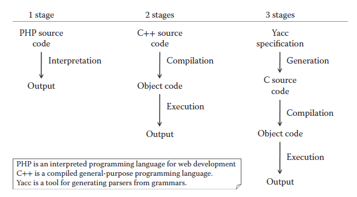

[4.1 <--- ](4_1.md) [   Зміст   ](README.md) [--> 4.3](4_3.md)

## 4.2. CODE GENERATION AND METAPROGRAMMING FOR OPTIMIZING REAL-TIME SIMULATION

An intuitive and (most of the time) easily verifiable notion is that the more generic a program is, the less efficient it is. A solution that is especially tailored to answer a specific problem or small set of problems has a good chance of being more effec- tive than a solution solving a bigger set of problems. For example, a piece of code computing the result of an equation will perform better than a full-fledged equation solver. However, this classic trade-off between abstraction/genericity and perfor- mance can be overcome to attain the best of both worlds by using metaprogramming and particularly dedicated program generation.

### 4.2.1 Concepts and Definitions

The simplest definition of a metaprogram is “a program that creates or manipulates a program.” This definition encompasses many concepts: source code generation, compilation, reflection, string evaluation, and so on. There is currently no broadly accepted taxonomy of metaprogramming systems. Two interesting propositions can be found in Refs. [10,11], where the authors identify concepts and relationships to characterize metaprograms. When dealing with performance, the most useful aspect of metaprogramming is program generation. Sheard [10] provides the following defi- nition for a program generator:

A program generator (a meta-program) solves a particular problem by constructing another program (an object program) that solves the problem at hand. Usually, the generated (object) program is “specialized” for the particular problem and uses fewer resources than a general purpose, non-generator solution.

The definition by Damaševičius and Štuikys [11] is more general and simply states that 

Software generation is an automated process of creation of a target system from a high- level specification. 

These definitions are nicely encompassed by the concept of *multistage program- ming* [12], that is, decomposing the execution of a program into several steps. As Figure 4.1 shows through some examples, any kind of program execution can be seen as a sequence of steps. In particular, execution can be performed in a single stage (interpretation as in PHP program execution), two stages (e.g., compilation + execution), or more (e.g., code generation + compilation + execution).

Adding a new stage to the interpretation approach means reducing the abstraction level to finally produce a code optimized for performing the operations described in the source program. Optionally, each stage can be parameterized by an input other than the source specification. For example, a compiler produces a machine code corresponding to the input source code and specific and optimized for a specific target machine.

 

**FIGURE 4.1** Samples of n-stage executions.

In Sections 4.2.2 to 4.2.5, we will present several metaprogramming techniques that allow the generation of specialized and optimized artifacts without sacrificing genericity and abstraction. We adopt a pragmatic point of view, so that emphasis will be on practical examples rather than on theoretical aspects.

### 4.2.2 Text Generation

Metaprogramming can be as simple as writing strings into a file. For example, the following C code is a metaprogram that generates a C file containing the code for printing the string passed to the metaprogram:

```c
#include <stdio.h>
int main( int argc, char * argv[] )
{
    FILE * output;
    output = fopen( argv[1], “w” );
    fprintf( output, “#include <stdio.h>\n\n” );
    fprintf( output, “int main(void)\n” );
    fprintf( output, “{\n” );
    fprintf( output, “ printf(\“%s\”);\n”, argv[2] );
    fprintf( output, “}” );
    return 0;
}
```

**CODE 1** C metaprogram generating C source code printing the string given in argument. 

Of course, this contrived example adds little value compared to writing the object program directly. However, this technique becomes quite valuable when the object code is too tedious to write by hand or when the metaprogram performs computa- tions on its arguments before generation as all the computations that are performed beforehand need not be executed in the object program. Compared to other metapro- gramming techniques, a major advantage of source code generation is that the output is readable by a human, thereby helping debugging. However, the string approach presented here has the drawback that the validity of the object program cannot be enforced at the meta level.

We can make a distinction between two types of generation: data generation and instructions generation.

#### 4.2.2.1 Data Generation

The aim of data generation is to compute a set of values before execution so that they are already loaded in memory when the program starts. For example, some programs use a lookup table containing the sine of many values instead of computing the sine each time it is needed. Most of the time, this lookup table is populated at start-up; however, a more efficient approach is to generate the code for initializing the lookup table directly with the correct values. This technique can also be used to accelerate stochastic simulation by having a metaprogram generate the pseudorandom numbers instead of generating the stream during execution. The metaprogram creates a file containing the initialization of an array with the generated numbers. This file can then be compiled and each simula- tion that must use the random stream only has to link to the object file obtained. In these programs, the time that it takes to obtain a pseudorandom number is significantly decreased (in previous work [13], we observed a factor of 5). This approach fits with the large memories we have even on personal computers since it favors execution time at the expense of additional object file space. When the amount of pseudorandom numbers is too large to be stored in memory, memory mapping techniques can be used [14,15]. 

#### 4.2.2.2 Instructions Generation

With data generation, we mostly generate values. It is nevertheless metaprogram- ming, because we also generate the code to store these values in a data structure accessible at runtime. However, this is not the nominal use of metaprogramming. A metaprogram occasionally generates data, but mainly generates instructions. We can consider the metaprogram as a metasolution to a given problem. Instead of solv- ing the problem, the program generates a solution to the problem. A metaprogram is often more generic than a regular program, and it can create solutions specialized for the inputs it receives. For example, in the work by Missaoui, Hill, and Perret [16], a metaprogram was used to generate programs for computing every reverse translation of oligopeptides containing a given set of amino acids. The metaprogram identified the set of amino acids to be considered as the input and generated a nonrecursive pile handling program with a big number of nested loops, used to compute the backtrans- lations of any oligopeptide (composed of the amino acids specified at generation). The resulting programs would have been difficult, if not impossible, to write manu- ally without sacrificing some efficiency.

Both generation approaches have been used in the real-time context for decades. In the work by Auer, Kemppainen, Okkonen, and Seppänen [17], a code generator is presented to implement full tasks for real-time systems. The code is produced from a structured data/control flow description following the real-time structured analysis/ structured design (RT-SA/SD) methodology [18] and the program transformation paradigm (which is now a classical concept of the model-driven paradigm). Petri net programs and PL/M-x86 code were generated, and the resulting Petri nets were used for dynamic analysis, helping the discovery of significant errors hidden in the RT-SA/SD specifications. In the work by Webster, Levy, Harley, Woodward, Naidoo, Westhuizen, and Meyer [19], we find the generation of parallel real-time control code. A prototype of a controller hardware platform with the design and implementa- tion of the associated software showed efficient real-time response with customized code generation for a set of particular processors. Parallelism was used to optimize real-time responses and to increase controller throughput.

### 4.2.3 Domain-Specific Languages

Domain-specific languages (DSLs) are programming or modeling languages dedicated to a particular domain. They contrast with general-purpose programming languages (GPLs) such as C, Java, and LISP and general-purpose modeling languages such as UML, which can be used in any domain. A DSL usually defines a textual or graphi- cal syntax for manipulating the domain entities. Specifications written in the DSL are compiled either directly to machine code or more often to source code in a GPL.

The advantages of using DSLs are numerous. The most obvious is that they provide abstractions that are at the appropriate level for the user, hence expedit- ing development of models and applications. However, the same effect can be more or less achieved in a GPL through libraries. More interesting are the opportunities that DSLs bring regarding verification and optimization. Indeed, since the language is domain-dependent, the tools for manipulating specifications can themselves be domain-dependent. This means that verification about the program can be per- formed at design time using domain knowledge. Similarly, the DSL compiler can perform several domain-specific optimizations [20]. For the sake of illustration, let us consider electronic circuit simulation. Using a traditional library,*(\* “Traditional library” as opposed to “active library,” a notion that is presented later in this section.) the user would manipulate classes and functions. For example, there could be classes for represent- ing each type of logical gate. When compiling this program, all the GPL compiler sees is classes and functions, and therefore, it is only able to perform generic optimi- zations such as loop unrolling and inlining. Now, if the same program were written in a DSL for circuit simulation (such as VHSIC Hardware Description Language (VHDL) [21]), the DSL compiler could perform more specific optimizations. For example, the DSL compiler could be aware that the combination of two NOT gates is equivalent to no gates at all and consequently avoid generating the code for these two gates in the object program.

DSLs have been used in simulation for a long time. In a previous work [22,23], we surveyed some of the most prominent simulation DSLs, which are briefly dis- cussed in the current chapter. Back in the 1960s, IBM introduced GPSS (Global Purpose Simulation System [24]), a language for discrete event simulation with both a textual syntax and a graphical syntax, which could be compiled to machine code or to interpretable pseudocode. In the late 1970s, SLAM (Simulation Language for Alternative Modeling) [25] was introduced. It made it possible to use several model- ing approaches (process, event, and continuous [26]), possibly combined together. A few years later, SIMAN (SIMulation ANalysis [27]) was released. It allowed mod- eling discrete, continuous, or hybrid systems and was used in several modeling and simulation software such as ARENA, which is still evolving and widely used. We can also cite the QNAP2 (Queuing Network Analysis Package 2 [28]) language, based on the theory of queuing networks. The trend in the past few years has been to make languages even more specialized. Indeed, the notion of specificity is rather subjective. After all, even though the above-mentioned languages seem more specific than a GPL such as FORTRAN or C, they can also be seen as much more generic than a DSL for flight simulation, for instance. The more specific a DSL is, the easier it is to use it and to perform verification and optimization on the model. However, it also greatly limits its scope. As a consequence, the cost of developing the DSL should not be higher than the outcome obtained by using it. Fortunately, there are more and more tools available to ease their development. One of the most active areas in this regard is model-driven engineering (MDE) [29,30]. Indeed, the MDE approach and the tools developed to support it enable, among other things, the creation of new DSLs in a very short time. DSLs are supported by providing metamodels and model transformations to develop abstract syntaxes, concrete syntaxes, code generators, graphical editors, and so on.

Several DSLs have been developed for real-time programming; some of them target a broad range of real-time systems (e.g., Hume [31], or the graphical modeling language used in Simulink® [32]), while others are more specialized and are peculiar to a given business such as avionics [33] or robotics [34]. All these DSLs make it easier to write real-time applications by providing high-level constructs, for example, for describing time constraints in an operation. Moreover, these languages most of the time exhibit characteristics that are difficult to obtain with GPL, such as determinacy or bounded time/space. They can also outperform GPLs by applying domain-specific optimizations. For example, Simulink can minimize a certain type of loops in models, thereby remov- ing the need to solve them at runtime with a computationally expensive loop solver.

#### 4.2.3.1 Embedded DSLs

The development of a DSL from scratch can be quite cumbersome. Tools are avail- able to facilitate the process, such as Lex and Yacc [35] or MDE-related tools, but it is still not a seamless experience. Moreover, the DSL puts some burden on the user who must learn an entirely new syntax and use some specific tools to generate or execute its code. Finally, it sometimes happens that a DSL must contain a GPL as a sublanguage to provide the user with complete flexibility on some part of a program (these are sometimes called *hybrid DSLs*).

An interesting approach to overcome these issues is the concept of embedded domain-specific languages (EDSLs), sometimes called *internal DSLs* [36]. These DSLs are embedded in a host language (usually a GPL), meaning that they are defined using the host constructs and syntax. This implies that every expression in the DSL must be a valid expression in the GPL. Even though this seems to be an unacceptable restriction, the gains obtained by using an EDSL are quite attractive:

- The syntax is the same as the host GPL, and therefore, the user can focus on learning the DSL semantics.
- The GPL can be used in synergy with the DSL to have both the practical expressivity of the DSL and the theoretical expressivity of the GPL.
- It is not necessary to write a custom lexer, parser, and code generator because all of these are provided for the GPL and can be exploited at no additional charge for the DSL, including the generic optimizations per- formed by the GPL optimizer.

Fowler identified several techniques for writing DSLs in object-oriented lan- guages and more broadly in any procedural language [36]. These techniques aim at providing a *fluent interface* to a library, meaning an API designed to flow like natural language: the code using the library should be readable as if it were written in a lan- guage of its own. Method chaining is one of the techniques that can be used to pro- vide a fluent interface. Code 2 hereafter shows a sample of code for operating a robot that uses a fluent interface. The interface of the “Robot” class is designed so that the code using it can be read as if using a language specific to robot manipulation.

```
Robot wall_e;

wall_e.
    right( 60 ).
    forward().
        length( 100 ).
        speed( 20 ).
    left( 20 ).
    deployArm();
```

**CODE 2** Sample use of a fluent interface for robot manipulation.

The syntax of the DSL can be even richer in languages that support operator over- loading such as C++ and C# and/or operator definition such as Scala and F#. In the first case, the DSL designer can reuse existing operators in his/her own language to provide a more usable syntax, while in the second case, the designer can even create his/her own keywords to extend the original GPL syntax.

However, as enjoyable as providing a language-like interface to a library can be, it is not acceptable in the case at hand if it unfavorably affects performance. In gen- eral, providing a fluent interface implies additional runtime computations, notably to keep track of the context. Does it mean that EDSLs should not be employed when execution time is a concern? No, not if we couple the notion of EDSL with the one of *active library*. Veldhuizen and Gannon [37], who coined the term in 1998, provide the following definition:

> Unlike traditional libraries which are passive collections of functions and objects, Active Libraries may generate components, specialize algorithms, optimize code [and] configure and tune themselves for a target machine […].

In other words, an active library can provide the same generic abstractions as a traditional one while at the same time providing maximum efficiency, thanks to code generation and optimization, achievable through metaprogramming. We can see an active library as a library generator that creates libraries tailored for the user-specific needs, depending on its parameterization.

Therefore, an EDSL implemented as an active library will be able to perform the same operations the compiler executes when dealing with external DSL. Ahead of execution, the library can perform abstract syntax tree rewriting, evalua- tion of constant expressions, domain-specific optimizations, and so on, effectively resulting in a code specialized for the user’s program. The languages providing the most powerful facilities for implementing “active EDSLs” are functional lan- guages such as dialects of the LISP family, which provide macros for extending the syntax and quasiquoting/unquoting* (\* These terms will be defined in Section 4.2.4.) for generating code, and languages with very flexible syntax such as Ruby or Scala. However, these languages are not as widely used as other languages such as Java or C, and their strength lies in aspects other than performance. On the contrary, the C++ language is one of the most used languages and exhibits some of the best performance. And the good news for this now “old” language is that it supports active libraries, EDSLs, and metapro- gramming, through the use of the template mechanism, as will be discussed in Section 4.2.4.

A pioneer in the area of C++ active EDSLs is Blitz++ [38], a scientific computing library that uses metaprogramming to optimize numerical computations at compile time, making it possible to equal and sometimes exceed the speed of FORTRAN. Since then, frameworks have been developed to facilitate the writing of C++ EDSL. The most accomplished one is probably Boost.Proto [39], a C++ EDSL for defin- ing C++ EDSLs. This active library makes it extremely easy to define grammars, evaluate or transform expression trees, and so on, all in C++ and with most of the computation happening at compile time. It has been successfully exploited in several domains such as parsing and output generation (Boost.Spirit), functional program- ming (Boost.Phoenix), or parallel programming (Skell BE [40]).

In the real-time domain, most EDSLs are based on functional languages, which are more amenable to static analysis than imperative languages and easier to adapt into DSLs. A good example is Atom, a Haskell-based EDSL [41] that provides several guarantees such as deterministic execution time and memory consumption, notably by performing task scheduling and thread synchronization at compile time. A short over- view of the available DSLs for real-time systems modeling can be found in Ref. [42].

### 4.2.4 Multistage Programming Languages

Multistage programming languages (MSPLs) are languages including constructs for concisely building object programs that are guaranteed to be syntactically correct [12].

In traditional programming languages, program generation is performed through either strings or data types manipulation. The first approach, presented at the begin- ning of this section, has the major drawback that there is no way of proving that the resulting program will be correct. After all, “obj.meth(arg)” and “î#%2$µ” are both strings, but the first one may have a meaning in the object program while the second will probably be an erroneous piece of code. This issue can be solved by using data types to represent the object program (e.g., manipulating instances of classes such as Class, Method, Expression, and Variable), but doing so makes the metaprogram much less readable and concise.

To overcome these problems, MSPLs contain annotations to indicate which pieces of code belong to the object program. These pieces of code will not be evaluated dur- ing execution and will simply be “forwarded” to the object program. They must nev- ertheless be valid code, hence providing syntactic verification of the object program at the meta level. This is the core of the LISP macros system, where the quote operator is used to annotate object code. More interestingly, dialects of the LISP family usu- ally include a backquote (quasiquote in Scheme) operator. A backquoted expression, as a quoted expression, will be included in the object program, but it can also con- tain unquoted expressions that will be evaluated before being included.*(\* A similar feature, command substitution, can be found in Unix shells. Incidentally, the character used to denote commands that must be substituted is also the backquote.) Backquoted expressions can be nested to provide an arbitrary number of stages. The LISP code below provides an example of a power function that generates the code for computing xn for a fixed n. The pow function takes two parameters, the base x and the exponent n, and is recursively defined (x0 = 1, xn = x * xn−1). However, since the multiplication is backquoted, it will not be performed immediately. Instead, it will be included in the generated code. The two operands being unquoted (through the comma operator), they will be replaced by the result of their evaluation. Eventually, the pow function will generate unrolled code without recursive calls nor test for base case.

```
(define (pow x n)
    (if (= n 0)
        1
        `(* ,x ,(pow x (- n 1)))
    )
)
(pow 'var 4)
;Output: (* var (* var (* var (* var 1))))
```

**CODE 3** LISP Code generating the code computing xn.

This backquote feature, even though powerful, can create some issues regarding symbol binding. In particular, instead of being bound at the metaprogram level, they are bound during evaluation (in the object program), which is often not the desired behavior. The MetaML language [43] has been developed, among other reasons, to solve these problems.

Functional languages are well suited for metaprogramming, thanks to their homoiconicity (“data is code”), and have been successfully used to develop real-time applications. For instance, in the late 1980s, the expert system G2 was developed in Common LISP and heavily relied on macros to generate efficient code [44]. Thanks to that, this expert system was used for many soft real-time applications, including space shuttle monitoring and ecosystem control (Biosphere II).

However, functional languages are far from being mainstream and are not very well suited to computation-intensive simulations. More classic choices in this domain are C, C++, and Java. In these languages, an arbitrary number of stages would be dif- ficult to achieve, although one of them still has some multistaging capability.

#### 4.2.4.1 C++ Template Metaprogramming

C++, the well-known multiparadigm language, includes a feature for performing generic programming: templates. As a reminder, a class (resp. function) template is a parameterized model from which classes (resp. functions) will be generated dur- ing compilation, more precisely during a phase called template instantiation. This feature is very useful for writing generic classes (resp. functions) that can operate on any type or a set of types meeting some criteria. Moreover, templates proved to be more powerful than what was originally thought when they were introduced in the language. In 1994, Unruh found out that they could be used to perform numerical computations such as computing prime numbers, and Veldhuizen later established that templates were Turing complete [45]. These discoveries gave birth to a metapro- gramming technique called C++ TMP [46].

Veldhuizen described C++ TMP as a kind of partial evaluation (see Section 4.2.5); however, it does not really correspond to the accepted definition. A more appropriate way to look at it would be to consider C++ with templates as a two and a half stage programming language: one stage and a half for template instantiation and compila- tion (which are in this case two indivisible steps), and one stage for execution.

C++ TMP exhibits several characteristics very close to functional programming, namely, lack of mutable variables, extensive use of recursion, and pattern match- ing through (partial) specialization. As an example, Code 4 hereafter presents the equivalent in C++ TMP of the LISP code shown above. The class template pow is parameterized by an exponent N. It contains a member function apply that takes as parameter a base x and multiplies it by xN−1. To do so, the template is instantiated with the decremented exponent, and the apply member function of this instantiation is invoked. The base case is handled through template specialization for N = 0. When the compiler encounters pow<4>::apply, it successively instantiates pow<3>::apply, pow<2>::apply, pow<1>::apply, and finally pow<0>::apply, which matches the specialization, hence stopping the recursion. Since the functions are small and simple, the compiler can inline them and remove the function calls, effectively result- ing in a generated code that only performs successive multiplications.

```c++
template <unsigned int N>
struct pow
{
    static double apply(double x)
    {
    	return x * pow<N-1>::apply(x);
    }
};
template <>
struct pow<0>
{
    static double apply(double x)
    {
    	return 1;
    }
};
[...]
double res = pow<4>::apply(var);
// the generated assembly code will be equivalent to
// var * var * var * var;
```

**CODE 4** C++ template metaprogram for computing xn.

Writing metaprograms with C++ TMP is not as seamless an experience as it is in LISP or MetaML. The syntax is somewhat awkward since this usage of tem- plates was not anticipated by the C++ Standards Committee. Fortunately, several libraries have been developed to smooth the process. The most significant ones are the MetaProgramming Library (MPL) and Fusion, two libraries belonging to the Boost repository. Boost.MPL is the compile-time equivalent of the C++ Standard Library. It provides several sequences, algorithms, and metafunctions for manipulat- ing types during compilation. Boost.Fusion makes the link between compile-time metaprogramming and runtime programming, by providing a set of heterogeneous containers (tuples) that can hold elements with arbitrary types and several functions and algorithms operating on these containers either at compile time (type manipula- tion) or at runtime (value manipulation).

An application of C++ TMP to modeling and simulation is provided in Section 4.3.

### 4.2.5 Partial Evaluation

The last metaprogramming technique presented in this section is known as *partial evaluation* [47]. Partial evaluation is an automated form of multistage programming technique where the programmer is not required to invest any additional effort to obtain the benefit of program specialization.

In mathematics and computer science, *partial application* is the technique of transforming a function with several parameters to another function with a smaller arity where some of the parameters have been fixed to a given value. Partial evalu- ation is quite similar, except that it applies to programs instead of mathematical functions. A partial evaluator is an algorithm that takes as input a source program and some of its inputs, and generates a *residual* or *specialized* program. When run with the rest of the inputs, the residual program generates the same output as the original program. However, in the meantime, the partial evaluator had the opportunity to evaluate every part of the original program that depended on the pro- vided inputs. Consequently, the residual program performs fewer operations than the source program, hence exhibiting better performance. Formally, we consider a program as a function of static and dynamic data given as input, which produces some output:


Given this definition, a partial evaluator can be defined as follows:


such that


As an example, in Code 5, C code of the binary search algorithm is shown. The algorithm recursively searches a given value in an ordered array and returns the index of the value (or −1 if it is not found).

```c
int search( int * array, int value, int size )
{
	return binary_search( array, value, 0, size-1 );
}
int binary_search( int * array, int value, int firstIndex, int lastIndex )
{
    if ( lastIndex < firstIndex ) return −1; // value not found
    int middleIndex = firstIndex + ( lastIndex – firstIndex ) / 2;
    if ( array[ middleIndex ] == value ) // value found
    {
       return middleIndex;
    }
    else if ( array[ middleIndex ] > value ) // value is before
    {
        return binary_search( array, value, firstIndex, middleIndex – 1 );
    }
    else // value is after
    {
        return binary_search( array, value, middleIndex + 1, lastIndex );
    }
}
```

**CODE 5** Binary search in C.

The search function takes three parameters: the ordered array, the searched value, and the size of the array. Assuming we have a means to partially evaluate this func- tion, Code 6 shows the residual function we would obtain with size = 3.

```c
int search3( int * array, int value )
{
    if ( array[ 1 ] == value )
    {
    	return 1;
    }
    else if ( array[ 1 ] > value )
    {
    	if ( array[ 0 ] == value )
    		return 0;
    	else
    		return −1;
    }
    else
    {
    	if ( array[ 2 ] == value )
    		return 2;
    	else
    		return −1;
    }
}
```

**CODE 6** Binary search residual function for a given size (3).

In this residual function, partial evaluation eliminated all recursive calls, the com- putation of the middle index, and the test for the “value not found” base case. Most of the time, specializing a function or a program will yield a code that is both smaller and faster since many instructions will be eliminated. However, since partial evaluation performs operations such as loop unrolling and function inlining, it can sometimes lead to code bloat. This phenomenon, called overspecialization, should be avoided in the context of embedded programming. In addition to improving performance, the specialization of functions or programs can also be used to verify assertions about inputs before execution. The assertions will be checked by the partial evaluator, which will abort the residual program production if one of them is not verified.

At this point, it should be obvious that partial evaluation shares the same goal as other multistage programming techniques, namely, to produce an optimized version of a program, specialized for some data. The main difference is that the process of specialization is assigned to a partial evaluator, that is, a program that will automati- cally perform the generation. The partial evaluator is in charge of determining which pieces of data are *static* and hence can be exploited to perform ahead-of-time com- putations and which ones are *dynamic* (not known before runtime).

A partial evaluator operates in two main phases. First of all, it must annotate the input program to discriminate between *eliminable* and *residual* instructions. This step, called *binding-time analysis*, must ensure that the annotated program will be correct with respect to two requirements: congruence (every element marked as eliminable must be eliminable for any possible static input) and termination (for any static input, the specializer processing the annotated program must terminate). The second step actually performs the specialization by using several techniques, the most prominent ones being symbolic computation, function calls unfolding (inlining), and program point specialization (duplication of program parts with different specializations).

There are not many partial evaluators available yet. Most of the existing ones target declarative programming (notably functional and logic programming), where programs can be easily manipulated. However, there also exist partial evaluators for some imperative programming languages such as Pascal and C. Regarding more recent languages, it is interesting to mention a work that aims at providing a partial evaluator for the Common Intermediate Language [48]. This Common Intermediate Language is the pseudocode of the Microsoft .NET framework to which many high- level programming languages are compiled (C#, VB.NET, F#…).

Partial evaluation can sometimes be combined with other metaprogramming techniques. In the work by Herrmann and Langhammer [49], the authors apply both multistage programming (see Section 4.2.4) and partial evaluation to the interpreta- tion of an image-processing DSL. Their interpreter first simplifies the original source code by partially evaluating it with some static input (the size of the image), then generates either bytecode or native code using staging annotations, before eventually executing the resulting program with the dynamic input (the image to be processed). Even though all these steps are performed at runtime, the improvement in execution time as compared with classical interpretation is extremely good, up to 100×. In yet other work [50], partial evaluation is applied to real-time programs written for the Maruti real-time operating system to obtain deterministic execution times. Indeed, to be reusable, programs often must use features such as recur- sion or loop with nonbounded bounds that hinder the analysis of the program, notably the estimation of the execution time. The authors show that by partially evaluating these programs for some input, it is possible to remove the stochastic- ity inherent in these features and thereby obtain deterministic and predictable execution times.

### 4.2.6 Comparison of the Different Approaches

Table 4.1 presents a comparison of the metaprogramming techniques described pre- viously. The criteria retained are as follows:

- •   Generation speed: How fast the metaprogram generates the object program.
- •   Syntactic correctness of the object program: Whether the syntactic validity of the object program is enforced at the metaprogram level (✓) or not (**×**).
- •   Ease of development/Ease of use: How easy it is to create and use metaprograms. It is important to draw the distinction between these two activities, especially in the case of DSLs and partial evaluation. Indeed, most of the time, the people developing the tools and the ones using it will not be the same, and the work they have to provide will be very different. For instance, developing a partial evaluator is a distinctly difficult task, while develop- ing an application and partially evaluating it is almost the same as writ- ing a “classical” application, since partial evaluation is mostly automatic. Regarding text generation and multistage programming, we considered the case of ad-hoc programs developed with a particular aim in mind, not libraries. Consequently, it is irrelevant to differentiate between development and use.

- •   Use of common tools: Whether the user can use widely available tools such as a compiler or an interpreter for a common language (C/C++, LISP…) (✓) or whether tools particular to the approach must be considered (**×**).
- •   Domain-specific optimizations: Potential of the metaprogram for perform- ing optimizations specific to the domain at hand (e.g., scheduling tasks ahead of runtime).
- •   Non-domain-specific optimizations: Potential of the metaprogram for per- forming generic optimizations (e.g., unrolling a loop with a constant num- ber of iterations). Only the optimizations performed by the metaprogram are considered, not the optimizations applied on the object program at a later stage (such as optimization during the compilation of generated source code).

Scores range from ★ to ★★★★★. Each criterion has been expressed so that a high score denotes an asset.

As can be seen from Table 4.1, there is no one-size-fits-all solution. Instead, each approach has its strengths and weaknesses, and selecting one must be done on a case-by-case basis, depending on the necessary features.


 

[4.1 <--- ](4_1.md) [   Зміст   ](README.md) [--> 4.3](4_3.md)