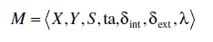
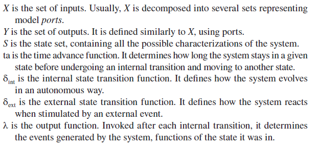
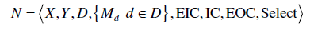
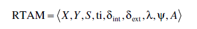
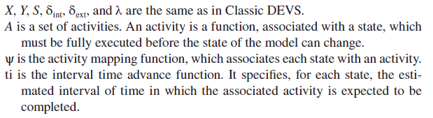
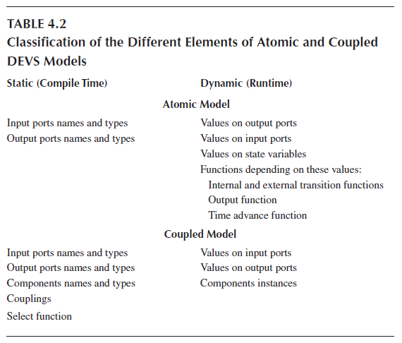

[4.2 <--- ](4_2.md) [   Зміст   ](README.md) [--> 4.4](4_4.md)

## 4.3. ЗАСТОСУВАННЯ ДЛЯ МОДЕЛЮВАННЯ: DEVS-МЕТАСИМУЛЯТОР

In Section 4.2, we introduced several metaprogramming techniques for improving program performance. Hereafter, we present an application of one of these techniques, namely C++ TMP, to the simulation domain, more particularly to the Discrete EVent System specification (DEVS) formalism [51,6].

У Розділі 4.2 ми представили кілька методів метапрограмування для покращення продуктивності програми. Далі ми представляємо застосування одного з цих методів, а саме C++ TMP, до області моделювання, зокрема до формалізму специфікації дискретної системи подій (DEVS) [51,6].

### 4.3.1 DEVS/RT-DEVS

The DEVS formalism was proposed by Zeigler in 1976. It establishes sound mathematical bases for modeling and simulation through three concepts: atomic models, coupled models, and abstract simulators. A DEVS atomic model is an entity holding a state and evolving through internal state changes and responses to external stimuli.

Формалізм DEVS був запропонований Зейглером у 1976 році. Він встановлює надійну математичну основу для моделювання та симуляції за допомогою трьох концепцій: атомарних моделей, пов’язаних моделей та абстрактних симуляторів. Атомна модель DEVS — це об’єкт, який утримує стан і розвивається через внутрішні зміни стану та реакції на зовнішні подразники.

After undergoing an internal event, the model generates an event that is sent to the “outside world.” Formally, a classic DEVS atomic model is defined by a 7-tuple:

Після проходження внутрішньої події модель генерує подію, яка надсилається у «зовнішній світ». Формально класична атомарна модель DEVS визначається 7-кортежем:

​      where

 

Atomic models can be combined to form coupled models. A DEVS coupled model is a hierarchical structure composed of atomic and/or other coupled models. The components are organized in a graph-like structure where output ports of components are linked to input ports of other components. As such, output events generated by some components become input events to others. Formally, a classic DEVS coupled model is characterized by a structure

Атомарні моделі можна комбінувати, щоб сформувати зв’язані моделі. Зв’язана модель DEVS — це ієрархічна структура, що складається з атомарних та/або інших пов’язаних моделей. Компоненти організовані у вигляді графа, де вихідні порти компонентів пов’язані з вхідними портами інших компонентів. Таким чином, вихідні події, створені одними компонентами, стають вхідними подіями для інших. Формально класична зв'язана модель DEVS характеризується структурою

 

де

*X* is the set of input ports and values, as in atomic models. *Y* is the set of output ports and values, as in atomic models. *D* is the set of component names.

*X* — це набір вхідних портів і значень, як в атомарних моделях. *Y* — це набір вихідних портів і значень, як в атомарних моделях. *D* — набір імен компонентів.

For each *d* in *D*, *Md* is a DEVS model (coupled or atomic).

Для кожного *d* в *D* *Md* є моделлю DEVS (з’єднаною або атомарною).

EIC is the external input coupling; it connects inputs of the coupled model *N* to component inputs.

EIC - зовнішній вхідний зв'язок; він з’єднує входи пов’язаної моделі *N* з входами компонентів.

EOC is the external output coupling; it connects component outputs to *N* outputs.

EOC - зовнішня вихідна муфта; він з’єднує компонентні виходи з *N* виходами.

IC is the internal coupling; it connects component outputs to component inputs. Select is the tie-breaking function. Classic DEVS is fundamentally sequential.

IC – внутрішній зв’язок; він з’єднує виходи компонентів із входами компонентів. Вибір є визначальною функцією. Класичний DEVS принципово послідовний.

Therefore, when two models are supposed to undergo an internal transition at the same time—and consequently generate two simultaneous events— only one of them must be activated. This arbitrage is performed through the Select function.

Тому, коли передбачається, що дві моделі зазнають внутрішнього переходу одночасно — і, отже, генерують дві одночасні події, — лише одна з них має бути активована. Цей арбітраж виконується за допомогою функції Select.

The operational semantic of these models have been defined through abstract simulators, which represent algorithms that correctly simulate DEVS models [51].

Операційна семантика цих моделей була визначена за допомогою абстрактних симуляторів, які представляють алгоритми, які правильно імітують моделі DEVS [51].

Many extensions have been proposed to increase the scope of DEVS: fuzzy-DEVS, dynamic structure DEVS, and so on. The real-time DEVS (RT-DEVS) [52] extension is particularly interesting in the context of this book. This formalism adapts classic DEVS to add real-time aspects and provides a framework for modeling systems and simulating them in real time so that they can interact with the physical world. As opposed to classic DEVS, an RT-DEVS simulator uses a real-time clock instead of a virtual one and hence must be deployed on a real-time operating system. The main idea is to fill the time between internal events with actual activities instead of virtually jumping through time.

Було запропоновано багато розширень для розширення сфери застосування DEVS: fuzzy-DEVS, динамічна структура DEVS тощо. Розширення DEVS реального часу (RT-DEVS) [52] особливо цікаве в контексті цієї книги. Цей формалізм адаптує класичний DEVS для додавання аспектів реального часу та забезпечує основу для моделювання систем і їх імітації в реальному часі, щоб вони могли взаємодіяти з фізичним світом. На відміну від класичного DEVS, симулятор RT-DEVS використовує годинник реального часу замість віртуального і, отже, має бути розгорнутий в операційній системі реального часу. Основна ідея полягає в тому, щоб заповнити час між внутрішніми подіями реальними діями, а не віртуально стрибати в часі.

The definition of RT-DEVS models is only slightly different than Classic DEVS models. Coupled models are specified in the same way, except for the lack of a Select function (which makes no sense in a real-time context, since in the physical world, events can occur simultaneously and are not “sequentialized”). Atomic models only differ in the addition of *activities* and the use of intervals to specify the time advance. An atomic RT-DEVS model is defined as follows:

Визначення моделей RT-DEVS лише трохи відрізняється від класичних моделей DEVS. Поєднані моделі вказуються таким же чином, за винятком відсутності функції Select (яка не має сенсу в контексті реального часу, оскільки у фізичному світі події можуть відбуватися одночасно і не «послідовні»). Атомарні моделі відрізняються лише додаванням *діяльностей* і використанням інтервалів для визначення випередження часу. Атомна модель RT-DEVS визначається таким чином:

where

As for Classic DEVS, abstract simulators have been defined to characterize what must be done to execute RT-DEVS models. These simulators deal with concurrent execution of activities, simultaneous events, and so on. However, some timing discrepancies can appear during simulation. Indeed, simulators must execute not only the activities specified by the model but also the simulation operations necessary to make the model evolve during execution. This implies that, in addition to activities, the simulator must execute internal and external transition functions, output functions, event routing, and so on. Because of this overhead, timing errors can arise. More specifically, activities can start and finish later than they should. Algorithmic approaches have been proposed to compensate for these discrepancies [52]. However, these solutions only work when the duration of activities is larger than the simulation overhead. When activities are short, RT-DEVS models can run too slow to meet the constraints defined by the interval time advance function. Consequently, it is important to reduce the overhead as much as possible. Hereafter, we will explain how metaprogramming can improve the efficiency of DEVS simulators as well as other characteristics such as correctness.

Що стосується Classic DEVS, абстрактні симулятори були визначені, щоб охарактеризувати те, що потрібно зробити для виконання моделей RT-DEVS. Ці симулятори мають справу з одночасним виконанням дій, одночасними подіями тощо. Однак під час моделювання можуть з’явитися деякі розбіжності в часі. Дійсно, тренажери повинні виконувати не тільки дії, визначені моделлю, але й операції моделювання, необхідні для того, щоб модель розвивалася під час виконання. Це означає, що, крім дій, симулятор повинен виконувати внутрішні та зовнішні функції переходу, функції виведення, маршрутизацію подій тощо. Через ці витрати можуть виникнути помилки синхронізації. Якщо говорити точніше, діяльність може починатися і закінчуватися пізніше, ніж слід. Були запропоновані алгоритмічні підходи для компенсації цих розбіжностей [52]. Однак ці рішення працюють лише тоді, коли тривалість діяльності перевищує накладні витрати моделювання. Коли дії короткі, моделі RT-DEVS можуть працювати надто повільно, щоб відповідати обмеженням, визначеним функцією випередження інтервалу. Отже, важливо максимально скоротити накладні витрати. Далі ми пояснимо, як метапрограмування може підвищити ефективність симуляторів DEVS, а також інші характеристики, такі як коректність.

### 4.3.2 Application of Metaprogramming to DEVS Simulation

DEVS models can be decomposed into structural specifications (ports, model composition, and couplings) and behavioral specifications (transition functions and output function). Most of the time, the structure will not change during execution (one notable exception are dynamic structure DEVS models). Consequently, the simulation of DEVS models appears to be a good candidate for metaprogramming optimizations. Previous work [53] presents a DEVS simulator, implemented as an active library, which specializes itself for the model provided using C++ TMP. The formalism handled by the simulator presented is Classic DEVS and the same ideas can be applied to DEVS extensions—such as RT-DEVS—or to other formalisms.

Моделі DEVS можна розкласти на структурні специфікації (порти, композиція моделі та з’єднання) та поведінкові специфікації (функції переходу та функція виведення). У більшості випадків структура не змінюється під час виконання (одним помітним винятком є моделі динамічної структури DEVS). Отже, моделювання моделей DEVS виглядає хорошим кандидатом для оптимізації метапрограмування. Попередня робота [53] представляє симулятор DEVS, реалізований як активна бібліотека, яка спеціалізується на моделі, наданій за допомогою C++ TMP. Формалізм, який обробляє представлений симулятор, є класичним DEVS, і ті самі ідеї можна застосувати до розширень DEVS, таких як RT-DEVS, або до інших формалізмів.

Table 4.2 classifies elements of DEVS models with respect to the earliest stage at which they are accessible. For example, the names of components in coupled models are static pieces of information (known at compile time) and can therefore be exploited in the metaprogram.

Таблиця 4.2 класифікує елементи моделей DEVS щодо найранішої стадії, на якій вони доступні. Наприклад, назви компонентів у пов’язаних моделях є статичними частинами інформації (відомими під час компіляції), тому їх можна використовувати в метапрограмі.

The “metasimulator” uses the static information to evaluate some parts of the simulation during template instantiation and generates a residual simulator specialized for the given model, where only the dynamic operations remain. Thanks to this, several improvements are obtained over more classical approaches that do not use metaprogramming.

«Метасимулятор» використовує статичну інформацію для оцінки деяких частин моделювання під час створення екземпляра шаблону та генерує залишковий симулятор, спеціалізований для даної моделі, де залишаються лише динамічні операції. Завдяки цьому було отримано декілька покращень порівняно з більш класичними підходами, які не використовують метапрограмування.

A first set of enhancements concerns model verification. Specifically, the metaprogram can check many assertions about the model provided by the library user. This enables testing the correctness of the model before execution even begins.

Перший набір удосконалень стосується перевірки моделі. Зокрема, метапрограма може перевіряти багато тверджень щодо моделі, наданих користувачем бібліотеки. Це дозволяє перевірити правильність моделі ще до початку виконання.

 

As a result, some errors are immediately caught and stop the generation of the object program (through compiler errors). The following is a list of the verifications that are performed by the metaprogram:

- •   Name checking. Names are made available at the compilation stage by making them types instead of strings. As a consequence, the metaprogram can check that the names used throughout the model are all correct.

- •   Identifier uniqueness. In addition to the preceding point, the metaprogram can also verify that each identifier is unique in its scope. For example, a model shall not have two ports with the same name. If this were the case, compilation would abort—generation of the object program would fail. Concretely, this is achieved by using static asserts, that is, assertions that are verified at compile time.

- •   Detection of incorrect couplings. The metaprogram is able to detect several kinds of invalid connections between coupled model components:

  - •   Port-type incompatibility. If the types of two connected ports are incompatible (i.e., the output event of the source component cannot be converted into an input event of the destination component), the metaprogram issues an error and stops its execution.
  - •   Direct feedback loops. The DEVS formalism forbids algebraic loops, meaning cycles of output-to-input connections without delay. This constraint cannot be enforced by the metaprogram in the general case since it depends on time advance functions, which are not always statically evaluable. However, direct feedback loops (connection of an output port of a component to an input port of the same component) can be detected based solely on the coupling information. Consequently, they can be discovered and rejected by the metaprogram.
  - •   Simultaneous events on a component. In Classic DEVS, a component must not receive simultaneous events on its input ports. Once again, this can be enforced by the metaprogram using the coupling information. This constraint no longer holds in RT-DEVS.

В результаті деякі помилки відразу виявляються і зупиняють генерацію об'єктної програми (через помилки компілятора). Нижче наведено список перевірок, які виконує метапрограма:

- Перевірка імені. Назви стають доступними на етапі компіляції, роблячи їх типами замість рядків. Як наслідок, метапрограма може перевірити правильність імен, які використовуються в моделі.

- Унікальність ідентифікатора. На додаток до попереднього пункту, метапрограма також може перевірити, що кожен ідентифікатор є унікальним у своїй області. Наприклад, модель не повинна мати два порти з однаковою назвою. Якби це було так, компіляція була б перервана — створення об’єктної програми не вдалось би. Конкретно, це досягається використанням статичних тверджень, тобто тверджень, які перевіряються під час компіляції.

- Виявлення неправильних з'єднань. Метапрограма здатна виявляти кілька видів недійсних зв’язків між пов’язаними компонентами моделі:

  - Несумісність типу порту. Якщо типи двох підключених портів несумісні (тобто вихідна подія вихідного компонента не може бути перетворена у вхідну подію кінцевого компонента), метапрограма видає помилку та зупиняє своє виконання.
  - Прямі петлі зворотного зв'язку. Формалізм DEVS забороняє алгебраїчні цикли, що означає цикли з’єднань вихід-вхід без затримки. Це обмеження не може бути виконано метапрограмою в загальному випадку, оскільки воно залежить від функцій випередження часу, які не завжди статично оцінюються. Проте петлі прямого зворотного зв’язку (з’єднання вихідного порту компонента з вхідним портом того самого компонента) можна виявити виключно на основі інформації про зв’язок. Отже, вони можуть бути виявлені та відхилені метапрограмою.
  - Одночасні події на компоненті. У класичному DEVS компонент не повинен отримувати одночасні події на своїх вхідних портах. Знову ж таки, це може бути виконано метапрограмою за допомогою інформації про зв’язок. Це обмеження більше не діє в RT-DEVS. 

In addition to these forms of verification, the use of metaprogramming also improves simulation efficiency by making the metaprogram perform actual simulation operations that are usually performed at runtime and by removing some of the overhead usually associated with the use of generic high-level libraries. The following is the list of operations performed by the metaprogram that have an impact on the residual simulator performances:

На додаток до цих форм перевірки, використання метапрограмування також покращує ефективність моделювання, змушуючи метапрограму виконувати фактичні операції моделювання, які зазвичай виконуються під час виконання, і видаляючи деякі накладні витрати, зазвичай пов’язані з використанням загальних бібліотек високого рівня. Нижче наведено список операцій, які виконує метапрограма, які впливають на залишкову продуктивність симулятора:

•   Virtual calls dispatch. Genericity is often achieved through inheritance and polymorphism. However, polymorphism comes at a price: since method calls must be bound at runtime, the compiler is deprived of several optimization opportunities, such as inlining. Moreover, the dynamic dispatch most of the time implies additional computation (e.g., a lookup in a virtual method table) generating some overhead. By using a technique called static polymorphism, it is possible to effectively achieve polymorphism at the metaprogram level and remove any necessity for it in the object program.

- Віртуальна відправка дзвінків. Універсальність часто досягається через успадкування та поліморфізм. Однак поліморфізм має свою ціну: оскільки виклики методів повинні бути пов’язані під час виконання, компілятор позбавлений кількох можливостей оптимізації, таких як інлайнінг. Крім того, динамічна диспетчеризація більшу частину часу передбачає додаткові обчислення (наприклад, пошук у віртуальній таблиці методів), що створює певні накладні витрати. Використовуючи техніку, що називається статичним поліморфізмом, можна ефективно досягти поліморфізму на рівні метапрограми та усунути будь-яку необхідність у ньому в об’єктній програмі.

•   Event routing. Events exchanged between components involve two pieces of information: the value carried by the event (dynamic) and the source or destination port of the event (static). Since the source of the event is available at the metaprogramming stage, as well as the coupling information, it is possible for the metaprogram to route the events from their source to their destination at compile time. The result in the residual simulator is that there is no longer a need for any tree structure. Instead, all components are on the same level and are directly connected to one another. During execution, events pass directly from one component to another without going up and down a hierarchy of coupled model handlers.

- Маршрутизація подій. Події, якими обмінюються компоненти, охоплюють дві частини інформації: значення, яке передає подія (динамічне), і порт джерела або призначення події (статичний). Оскільки джерело події доступне на етапі метапрограмування, а також інформація про зв’язок, метапрограма може направляти події від джерела до місця призначення під час компіляції. Результатом залишкового симулятора є те, що більше немає потреби в будь-якій структурі дерева. Натомість усі компоненти знаходяться на одному рівні та безпосередньо пов’язані один з одним. Під час виконання події переходять безпосередньо від одного компонента до іншого без переходу вгору та вниз по ієрархії об’єднаних обробників моделей.

•   Input events filtering. Atomic models usually have different reactions to different stimuli because the change in state depends on the port receiving the event. Consequently, external transition functions commonly make branching based on the input port involved. As discussed earlier, the routing of an event between models is performed by the metaprogram. Therefore, the identifier of the port receiving an event is statically known, which allows the metaprogram to filter events and dispatch to the correct behavior at compile time.

- Фільтрація вхідних подій. Атомні моделі зазвичай мають різні реакції на різні подразники, оскільки зміна стану залежить від порту, який приймає подію. Отже, зовнішні функції переходу зазвичай здійснюють розгалуження на основі задіяного вхідного порту. Як обговорювалося раніше, маршрутизація події між моделями виконується метапрограмою. Таким чином, ідентифікатор порту, який отримує подію, є статично відомим, що дозволяє метапрограмі фільтрувати події та виконувати правильну поведінку під час компіляції.

•   Removal of certain superfluous operations. On the basis of the structure of a model, the metaprogram is able to remove some simulation operations that are not necessary. For example, if an atomic model has no output ports, there is no need to invoke its output function.

- Видалення деяких зайвих операцій. На основі структури моделі метапрограма здатна видалити деякі непотрібні операції моделювання. Наприклад, якщо атомарна модель не має вихідних портів, немає необхідності викликати її вихідну функцію.

•   Simultaneous internal events scheduling. When several components must undergo an internal event at the same time, the Select function is used to determine which one will be activated first. By representing this function with a data structure, it is possible for the metaprogram to perform the tie breaking. This optimization would not be applicable in RT-DEVS since there is no Select function in this extension of DEVS.

- Одночасне планування внутрішніх подій. Коли кілька компонентів мають одночасно пройти внутрішню подію, функція Select використовується для визначення того, який із них буде активовано першим. Представляючи цю функцію структурою даних, метапрограма може розірвати зв’язки. Цю оптимізацію не можна застосувати в RT-DEVS, оскільки в цьому розширенні DEVS немає функції Select.

In a previous work [53], we tested this metaprogramming technique on a sample DEVS model, and the residual simulator was compared to other software: a program developed with another library supporting simulation of any DEVS model and a piece of software developed specifically for the model considered. The results showed that the residual program generated by the metaprogram was four times faster than the generic library (written in Java). We have also performed a comparison between the residual program and the several versions of C++ software especially crafted and optimized for the model considered. We observed an overhead only in one of these versions. This is explained by the fact that the “handwritten” simulator used some optimizations based on knowledge about the model that was not accessible to the metaprogram (in the same way that a compiler is not able to perform optimizations that depend on the domain of the software developed). However, the generation of the residual program is fully automated, and such a tool can be used by many modelers, whereas very few of them can implement efficient and optimized C++ code.

У попередній роботі [53] ми протестували цю техніку метапрограмування на зразковій моделі DEVS, і залишковий симулятор порівнювався з іншим програмним забезпеченням: програмою, розробленою з іншою бібліотекою, що підтримує моделювання будь-якої моделі DEVS, і частиною програмного забезпечення, розробленою спеціально для розглянута модель. Результати показали, що залишкова програма, згенерована метапрограмою, була в чотири рази швидшою за загальну бібліотеку (написану на Java). Ми також провели порівняння між залишковою програмою та декількома версіями програмного забезпечення C++, спеціально розробленими та оптимізованими для розглянутої моделі. Ми спостерігали накладні витрати лише в одній із цих версій. Це пояснюється тим, що «рукописний» симулятор використовував деякі оптимізації на основі знань про модель, які не були доступні метапрограмі (так само, як компілятор не може виконувати оптимізації, які залежать від домену програмного забезпечення). розроблений). Однак генерація залишкової програми повністю автоматизована, і такий інструмент може використовуватися багатьма моделістами, тоді як дуже небагато з них можуть реалізувати ефективний і оптимізований код C++.

[4.2 <--- ](4_2.md) [   Зміст   ](README.md) [--> 4.4](4_4.md)