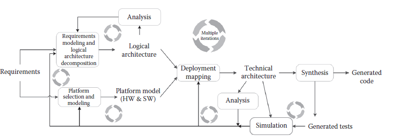

[5 <--- ](5.md) [   Зміст   ](README.md) [--> 5.2](5_2.md)

## 5.1. INTRODUCTION

Embedded systems, such as automotive, avionics, communications, and defense systems, are notoriously difficult to design and develop because of increasing complexity, heterogeneous requirements (combining, e.g., noncritical infotainment and hard real-time engine control), distributed infrastructure, distributed development and outsourcing, time to market, lifecycle management, and cost, to name just a few.

Вбудовані системи, такі як автомобільні, авіаційні, комунікаційні та оборонні системи, як відомо, важко проектувати та розробляти через зростаючу складність, неоднорідні вимоги (поєднання, наприклад, некритичних інформаційно-розважальних систем і жорсткого керування двигуном у реальному часі), розподілену інфраструктуру, розподілену розробку і аутсорсинг, час виходу на ринок, управління життєвим циклом і вартість, і це лише деякі з них.

Model-based engineering (MBE) [1] greatly contributes to the development of dependable systems with models playing an important role in domain analysis, requirements elicitation, architecture specification, analysis, documentation, and evolution. Nevertheless, while modeling is accepted as a key engineering activity especially in all engineering disciplines *outside* of software engineering, it is often seen as standing in the way of “the code,” and if it is used, it is often only for forward engineering (i.e., creating code from specifications), leaving activities such as diagnosis and failure management to be addressed separately.

Інженерія на основі моделей (MBE) [1] значною мірою сприяє розробці надійних систем з моделями, які відіграють важливу роль в аналізі домену, виявленні вимог, специфікації архітектури, аналізі, документуванні та еволюції. Тим не менш, хоча моделювання вважається ключовим інженерним видом діяльності, особливо в усіх інженерних дисциплінах *за межами* розробки програмного забезпечення, воно часто розглядається як перешкода «коду», і якщо воно використовується, то часто лише для подальшого розвитку інжиніринг (тобто створення коду зі специфікацій), залишаючи такі дії, як діагностика та управління несправностями, для вирішення окремо.

The Unified Modeling LanguageTM (UML®) [2,3] is a general-purpose modeling language—a standard managed by the Object Management Group® (OMG®)—widely used in both academia and industry. It is a family of graphical notations underpinned by a single metamodel [4]. UML can be used at different levels of the development process, especially for requirement modeling and functional design, resulting in specification for behavior, structure, and quality of service (QoS) properties. There exist several UML compliant modeling tools that support code generation to C/C++, Java, Ada, different Real-Time Operating Systems (RTOSs), and Common Object Request Broker Architecture (CORBA®). Moreover, through its profile mechanism, UML can be tailored for various domains or different target platforms.

Уніфікована мова моделюванняTM (UML®) [2,3] — це мова моделювання загального призначення — стандарт, керований Object Management Group® (OMG®), — широко використовується як в наукових колах, так і в промисловості. Це сімейство графічних нотацій, підкріплених єдиною метамоделлю [4]. UML можна використовувати на різних рівнях процесу розробки, особливо для моделювання вимог і функціонального проектування, що призводить до специфікації поведінки, структури та властивостей якості обслуговування (QoS). Існує кілька інструментів моделювання, сумісних з UML, які підтримують генерацію коду для C/C++, Java, Ada, різних операційних систем реального часу (RTOS) і загальної архітектури брокера запитів до об’єктів (CORBA®). Крім того, за допомогою механізму профілю UML можна адаптувати для різних доменів або різних цільових платформ.

In this chapter, we present the modeling capabilities of UML and its extensions for real-time systems. We are not providing an introductory UML tutorial, but instead we assume that the reader is familiar with most basic UML notations. Furthermore, we discuss requirements for modeling languages, which helps us pinpoint how and to what degree UML can be used for modeling aspects of real-time systems. This also allows us to identify open issues, such as model consistency, that remain to be addressed to provide a systematic modeling methodology.

У цій главі ми представляємо можливості моделювання UML та його розширень для систем реального часу. Ми не надаємо вступного посібника з UML, але замість цього ми припускаємо, що читач знайомий з більшістю базових нотацій UML. Крім того, ми обговорюємо вимоги до мов моделювання, що допомагає нам точно визначити, як і в якій мірі UML можна використовувати для моделювання аспектів систем реального часу. Це також дозволяє нам визначити відкриті проблеми, такі як узгодженість моделі, які ще потрібно вирішити, щоб забезпечити систематичну методологію моделювання.

In the following paragraphs, we discuss the challenges in embedded systems and how models can be used in various steps in the development process.

У наступних параграфах ми обговорюємо проблеми вбудованих систем і те, як моделі можна використовувати на різних етапах процесу розробки.

### 5.1.1 Challenges for MBE in Embedded Systems

Embedded systems are often developed by integrating components that have been designed and implemented by different teams, often specialized in different disciplines such as mechanical, electronics, and software engineering. As the system behavior emerges from the interplay of multiple distributed components, a key challenge is the *correct* integration of all these components. System integration is often performed in vertical design chains such as in automotive and avionics, and the development chain typically involves several tools that are not integrated, as explained below.

Вбудовані системи часто розробляються шляхом інтеграції компонентів, які були розроблені та впроваджені різними командами, які часто спеціалізуються на різних дисциплінах, таких як механіка, електроніка та розробка програмного забезпечення. Оскільки поведінка системи виникає внаслідок взаємодії кількох розподілених компонентів, ключовою проблемою є *правильна* інтеграція всіх цих компонентів. Системна інтеграція часто виконується у вертикальних ланцюжках проектування, наприклад, в автомобільній та авіоніці, і ланцюжок розробки зазвичай включає кілька інструментів, які не інтегровані, як пояснюється нижче.

For example, embedded systems in automobiles are developed as a joint engineering process between an original equipment manufacturer (OEM) and suppliers. The car manufacturer or OEM traditionally specifies the requirements of the various electronic control units (ECUs) for the car. Each ECU is produced by (external) companies known as suppliers. The OEM then integrates the supplier’s components into the vehicle. Achieving independent component development by suppliers necessitates precise and expressive requirements and interface specifications, as well as an integration framework that addresses quality requirements that crosscut multiple components. In practice, requirements are seldom expressed precisely enough, and system integration has to consider the effects of interactions among distributed components. Therefore, projects often use joint iterative development between the OEM and suppliers to ensure corrective feedback cycles.

Наприклад, вбудовані системи в автомобілях розробляються як спільний процес розробки між виробником оригінального обладнання (OEM) і постачальниками. Виробник автомобіля або OEM традиційно визначає вимоги до різних електронних блоків керування (ECU) для автомобіля. Кожен ECU виробляється (зовнішніми) компаніями, відомими як постачальники. Потім OEM інтегрує компоненти постачальника в автомобіль. Досягнення незалежної розробки компонентів постачальниками вимагає точних і виразних вимог і специфікацій інтерфейсу, а також інтеграційної структури, яка задовольняє вимоги до якості, що охоплюють багато компонентів. На практиці вимоги рідко виражаються досить точно, і системна інтеграція повинна враховувати вплив взаємодії між розподіленими компонентами. Тому в проектах часто використовується спільна ітераційна розробка між OEM і постачальниками для забезпечення коригувальних циклів зворотного зв’язку.

Furthermore, the specification and implementation of diagnostic functions, for example, is often implemented ad hoc based on a stream of documents exchanged between the OEM and the suppliers. In the automotive domain, model-based approaches leveraging tools such as MATLAB® [5] and Simulink® [6] from MathWorks and ASCET® [7] from ETAS are used to model control functions and generate implementations for different platforms. However, in practice, there is no formal model of diagnosis that is exchanged between parties. Consequently, it is impossible to validate the design and anticipate problems in putting together the various components in the later phases of the development. The lack of an integrated diagnostic model also limits the reuse of diagnostics across models and generations of cars. Redeveloping diagnostic functions, obviously, leads to higher cost in all areas of requirements engineering, design, development, maintenance, verification, and validation.

Крім того, специфікація та реалізація діагностичних функцій, наприклад, часто реалізується ad hoc на основі потоку документів, якими обмінюються OEM та постачальники. В автомобільній сфері для моделювання функцій керування та створення реалізацій для різних платформ використовуються підходи, засновані на моделі, що використовують інструменти, такі як MATLAB® [5] і Simulink® [6] від MathWorks і ASCET® [7] від ETAS. Однак на практиці не існує офіційної моделі діагностики, якою обмінюються сторони. Отже, неможливо підтвердити дизайн і передбачити проблеми під час об’єднання різних компонентів на наступних етапах розробки. Відсутність інтегрованої діагностичної моделі також обмежує повторне використання діагностики в різних моделях і поколіннях автомобілів. Повторна розробка діагностичних функцій, очевидно, призводить до підвищення витрат у всіх сферах розробки вимог, проектування, розробки, обслуговування, верифікації та валідації.

Models and MBE hold promise for overcoming these exemplar challenges. Models should serve as a common interface between requirements and architecture specification—using models is the only systematic way to ensure that parties can communicate across all development phases from requirements to acceptance tests. The ultimate goal of MBE is that engineers will spend most of their time modeling the system under consideration and then generate code for a specific target platform. This goal is already supported by various tools (including MATLAB and Simulink), but the models often do not include all aspects of the system, as explained earlier. When automatic code generation is not feasible at the level of the entire system, there is still significant benefit if modeling is used for requirements gathering and architecture verification before deploying the actual system. Various terms are used in the literature to denote the use of models in the development process (e.g., Model- Driven Architecture® [8], model-based design [9], model-driven engineering [10], and model-integrated computing [11,12]). We use the general term MBE as a superset for all model-based approaches.

Моделі та MBE обіцяють подолати ці зразкові виклики. Моделі повинні служити загальним інтерфейсом між вимогами та специфікацією архітектури — використання моделей є єдиним систематичним способом гарантувати, що сторони можуть спілкуватися на всіх етапах розробки від вимог до приймальних випробувань. Кінцева мета MBE полягає в тому, щоб інженери витрачали більшу частину свого часу на моделювання системи, що розглядається, а потім створювали код для конкретної цільової платформи. Ця мета вже підтримується різними інструментами (включаючи MATLAB і Simulink), але моделі часто не включають усі аспекти системи, як пояснювалося раніше. Якщо автоматична генерація коду неможлива на рівні всієї системи, все одно існує значна перевага, якщо моделювання використовується для збору вимог і перевірки архітектури перед розгортанням фактичної системи. У літературі використовуються різні терміни для позначення використання моделей у процесі розробки (наприклад, Model-Driven Architecture® [8], model-based design [9], model-driven engineering [10] та model-integrated computing [11,12]). Ми використовуємо загальний термін MBE як надмножину для всіх підходів на основі моделі.

In the past decade, significant advances in the area of model specification, transformation, analysis, and synthesis have brought the vision of MBE within reach. Challenges for a comprehensive methodology include providing modeling techniques that result in a consistent, integrated specification; models expressive enough to support both generic and domain-specific aspects of the system; model reusability and integration; model execution; and seamless tool suites.

За останнє десятиліття значні досягнення в області специфікації моделей, перетворення, аналізу та синтезу зробили бачення MBE доступним. Проблеми для комплексної методології включають забезпечення методів моделювання, які призводять до послідовної інтегрованої специфікації; достатньо виразні моделі, щоб підтримувати як загальні, так і предметно-спеціальні аспекти системи; повторне використання та інтеграція моделі; модельне виконання; і безшовні набори інструментів.

### 5.1.2 MBE Process

In general, Fowler [13] identified three ways of using models (specifically, models in UML): sketch, blueprint, and programming language. In sketching, models are used to communicate some aspects of the system. As blueprints, the models should be sufficiently complete as to allow straightforward implementation. By using a modeling language as a programming language, the system is specified at the level of models, and then tools are used to automatically generate the code for the target platform.

Загалом Фаулер [13] виділив три способи використання моделей (зокрема, моделей в UML): ескіз, проект і мова програмування. У ескізах моделі використовуються для передачі деяких аспектів системи. Як креслення, моделі повинні бути достатньо повними, щоб забезпечити пряме впровадження. Використовуючи мову моделювання як мову програмування, система специфікується на рівні моделей, а потім використовуються інструменти для автоматичного генерування коду для цільової платформи.

In the case of embedded systems, sketches are useful for requirements elicitation because each requirement addresses only a partial view of the system and, thus, a model for an individual requirement is by definition an incomplete specification. Moreover, in the early phases of system engineering, rarely all requirements, let alone their interplay, are understood. On the one hand, sketches as an early analysis tool are generally not hampered by lack of precision in the modeling language proper. To use a model as a blueprint or a programming language, on the other hand, requires the precise specification of the platform and the environment in which the system will operate. Blueprints for embedded systems can support system verification before deploying the actual system, and such verification should include timing requirements, resource usage, and other characteristics of embedded systems. Using a model as a programming language requires powerful tools for code synthesis. Sometimes, code generated from models (e.g., MATLAB and Simulink) is manually adjusted to meet the timing constraints, in which case the link between the code and the model is lost. Moreover, topics such as system reconfiguration and diagnosis are difficult to address. Therefore, a comprehensive MBE approach should involve round-trip engineering.

У випадку вбудованих систем ескізи корисні для виявлення вимог, оскільки кожна вимога стосується лише часткового вигляду системи, і, таким чином, модель для окремої вимоги за визначенням є неповною специфікацією. Крім того, на ранніх етапах проектування системи рідко розуміються всі вимоги, не кажучи вже про їх взаємодію. З одного боку, ескізи як ранній інструмент аналізу, як правило, не перешкоджають недостатній точності в самій мові моделювання. З іншого боку, для використання моделі як плану або мови програмування потрібна точна специфікація платформи та середовища, в якому працюватиме система. Чертежі для вбудованих систем можуть підтримувати перевірку системи перед розгортанням фактичної системи, і така перевірка повинна включати вимоги до часу, використання ресурсів та інші характеристики вбудованих систем. Використання моделі як мови програмування вимагає потужних інструментів для синтезу коду. Іноді код, створений на основі моделей (наприклад, MATLAB і Simulink), налаштовується вручну відповідно до часових обмежень, і в цьому випадку зв’язок між кодом і моделлю втрачається. Більше того, такі теми, як реконфігурація системи та діагностика, важко розглянути. Таким чином, комплексний підхід MBE повинен передбачати інженерну роботу в обидві сторони.

Figure 5.1 shows a simplified view of the activities and models involved in an MBE process. We use the terms *logical architecture* and *technical architecture* as described in Pretschner et al. [14]. The *logical architecture* is the decomposition of the system into functional components independent of the platform that will execute them, whereas the *technical architecture* specifies the representation of the logical components in terms of platform-specific entities. A logical architecture can be mapped to multiple technical architectures, each capturing all aspects of a particular deployment. Various other terms are used in the literature to distinguish between logical and technical system aspects. For example, OMG’s Model- Driven Architecture® (MDA®) [8] distinguishes between a platform-independent model (PIM) and a platform-specific model (PSM). Furthermore, the Department of Defense Architecture Framework [15] distinguishes between operational views and systems views to separate the logical and technical architectures. We maintain the use of logical and technical architecture to encompass both these standards.  

На малюнку 5.1 показано спрощене уявлення про дії та моделі, які беруть участь у процесі MBE. Ми використовуємо терміни *логічна архітектура* і *технічна архітектура*, як описано в Pretschner et al. [14]. *Логічна архітектура* — це декомпозиція системи на функціональні компоненти, незалежно від платформи, яка їх виконуватиме, тоді як *технічна архітектура* визначає представлення логічних компонентів у термінах платформо-специфічних об’єктів. Логічна архітектура може бути зіставлена з декількома технічними архітектурами, кожна з яких охоплює всі аспекти конкретного розгортання. Для розрізнення логічних і технічних аспектів системи в літературі використовуються різні інші терміни. Наприклад, OMG Model-Driven Architecture® (MDA®) [8] розрізняє незалежну від платформи модель (PIM) і модель, що залежить від платформи (PSM). Крім того, структура архітектури Міністерства оборони [15] розрізняє оперативні та системні погляди, щоб розділити логічну та технічну архітектури. Ми продовжуємо використовувати логічну та технічну архітектуру для охоплення обох цих стандартів.

**FIGURE 5.1** Simplified model-based engineering process.

The modeling process involves creating and refining abstractions in a series of steps. Starting with requirements, we first construct requirements models. Next, we construct logical architecture models, which show how the system achieves the functionality described in the requirements models. At the same time, we use the requirements analysis to select and model a deployment and execution platform. Next, we map the logical models onto the platform, thereby obtaining a technical architecture.

Процес моделювання передбачає створення й уточнення абстракцій у серії кроків. Починаючи з вимог, ми спочатку будуємо моделі вимог. Далі ми будуємо моделі логічної архітектури, які показують, як система досягає функціональності, описаної в моделях вимог. У той же час ми використовуємо аналіз вимог для вибору та моделювання платформи розгортання та виконання. Далі ми наносимо логічні моделі на платформу, отримуючи тим самим технічну архітектуру.

Analysis and simulation can be performed at various levels. Logical models can be analyzed for consistency and correctness, whereas technical models can be analyzed for realizability of the deployed system (e.g., schedulability analysis).

Аналіз і моделювання можна виконувати на різних рівнях. Логічні моделі можна аналізувати на послідовність і правильність, тоді як технічні моделі можна аналізувати на реалізованість розгорнутої системи (наприклад, аналіз планування).

The modeling process involves feedback loops, and multiple iterations are possible in each step, within sequences of steps and within the entire process from the beginning. For example, analyzing the technical architecture can reveal hidden requirements and, therefore, may lead to reiterating the process from the initial phase of requirements modeling. We emphasize the need for an iterative process in alignment with the spiral [16] model of agile development methodologies, where requirements often resolve to partial specifications and refinements at one stage can trigger iterations at some earlier stages. An iterative process also accommodates architectural spiking, which is defined as taking a partial set of requirements/use cases and generating a system architecture and implementation based on them, then adding more and more use cases over subsequent rounds. Architectural spikes help in identifying the most critical parts of the system and implementing them first to verify that they can be addressed as expected and, therefore, to mitigate the risks associated with them.

Процес моделювання включає цикли зворотного зв’язку, і на кожному кроці можливі численні ітерації в межах послідовності кроків і в межах усього процесу з самого початку. Наприклад, аналіз технічної архітектури може виявити приховані вимоги і, отже, може призвести до повторення процесу з початкової фази моделювання вимог. Ми наголошуємо на необхідності ітераційного процесу відповідно до спіральної [16] моделі гнучких методологій розробки, де вимоги часто зводяться до часткових специфікацій, а уточнення на одному етапі може викликати ітерації на деяких попередніх етапах. Ітераційний процес також враховує архітектурне розширення, яке визначається як взяття часткового набору вимог/випадків використання та генерування системної архітектури та реалізації на їх основі, а потім додавання нових і нових варіантів використання протягом наступних раундів. Архітектурні сплески допомагають визначити найбільш критичні частини системи та спочатку їх реалізувати, щоб переконатися, що їх можна вирішити належним чином і, отже, пом’якшити пов’язані з ними ризики.

### 5.1.3 Outline

In the preceding paragraphs, we presented the modeling process in general and various ways of using models, with the implications in the case of embedded systems. We also discussed the current state of the art and challenges in MBE.

У попередніх абзацах ми представили процес моделювання в цілому та різні способи використання моделей із наслідками у випадку вбудованих систем. Ми також обговорили сучасний стан і виклики MBE.

The remainder of the chapter is structured as follows. In Section 5.2, we identify requirements for a comprehensive modeling language for embedded systems. This allows us to better position UML’s capabilities in response to this requirements spectrum. In Section 5.3, we present an overview of UML, its metamodeling architecture, extension mechanism, and behavior semantics. We also show how UML can be used for modeling real-time systems, by means of a simplified example from the Bay Area Rapid Transit (BART) [17] system. In Section 5.4, we provide an overview of UML profiles relevant for real-time systems and we cover more detailed aspects from the UML profile for Modeling and Analysis of Real-Time and Embedded systems (MARTE) [18]. In Section 5.5, we discuss how the UML and MARTE together meet the requirements presented in Section 5.2.

Решта розділу структурована таким чином. У розділі 5.2 ми визначаємо вимоги до комплексної мови моделювання для вбудованих систем. Це дозволяє нам краще позиціонувати можливості UML відповідно до цього спектру вимог. У розділі 5.3 ми представляємо огляд UML, його архітектури метамоделювання, механізму розширення та семантики поведінки. Ми також показуємо, як UML можна використовувати для моделювання систем реального часу, за допомогою спрощеного прикладу системи швидкого транзиту Bay Area Rapid Transit (BART) [17]. У Розділі 5.4 ми надаємо огляд профілів UML, що стосуються систем реального часу, і детальніше розглядаємо аспекти профілю UML для моделювання та аналізу систем реального часу та вбудованих систем (MARTE) [18]. У розділі 5.5 ми обговорюємо, як UML і MARTE разом відповідають вимогам, представленим у розділі 5.2.

[5 <--- ](5.md) [   Зміст   ](README.md) [--> 5.2](5_2.md)