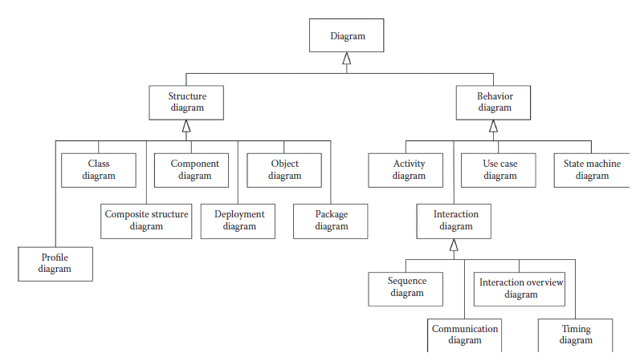

[5.2 <--- ](5_2.md) [   Зміст   ](README.md) [--> 5.4](5_4.md)

## 5.3. MODELING WITH UML

UML is a family of graphical notations that support modeling structural (i.e., static) and behavioral (i.e., dynamic) views of a system. Among others, the structural view includes class and component diagrams, while the behavior view includes sequence and state machine diagrams. UML provides 14 types of diagrams, though some are used more often and more prominently than others—a guide to the key aspects of the UML can be found in Fowler [13]. In this chapter, we focus on some of the commonly used diagrams.

UML — це сімейство графічних нотацій, які підтримують моделювання структурних (тобто статичних) і поведінкових (тобто динамічних) уявлень системи. Серед іншого, структурне подання включає діаграми класів і компонентів, тоді як подання поведінки включає діаграми послідовності та кінцевого автомата. UML надає 14 типів діаграм, хоча деякі з них використовуються частіше та більш помітно, ніж інші — керівництво до ключових аспектів UML можна знайти у Fowler [13]. У цій главі ми зосередимося на деяких часто використовуваних діаграмах.

UML was created to unify many object-oriented graphical modeling notations that became popular in the early 1990s. UML appeared in 1997 and underwent several changes from one version to another, the most radical ones taking place with the transition to UML 2. The most recent version is UML 2.3, whose specification consists of the UML Superstructure [3] defining the notation and semantics for diagrams and the UML Infrastructure [2] defining the language on which the superstructure is based.

UML було створено для об’єднання багатьох нотацій об’єктно-орієнтованого графічного моделювання, які стали популярними на початку 1990-х років. UML з’явилася в 1997 році і зазнала кількох змін від однієї версії до іншої, найрадикальніші з яких відбулися з переходом до UML 2. Найновішою версією є UML 2.3, специфікація якої складається з UML Superstructure [3], що визначає нотацію та семантику для діаграм та інфраструктури UML [2], що визначає мову, на якій базується надбудова.

In this section, we discuss the metamodeling architecture, the basic modeling capabilities of UML, the extension mechanisms, and behavioral semantics of UML. Then, in Section 5.4, we present an overview of the profiles for real-time systems and go into the details of the MARTE profile. In the end, we discuss the advantages and open issues in UML with respect to the requirements for modeling languages identified in Section 5.2.

У цьому розділі ми обговорюємо архітектуру метамоделювання, основні можливості моделювання UML, механізми розширення та поведінкову семантику UML. Потім, у Розділі 5.4, ми представляємо огляд профілів для систем реального часу та переходимо до деталей профілю MARTE. Наприкінці ми обговорюємо переваги та відкриті проблеми UML щодо вимог до мов моделювання, визначених у розділі 5.2.

### 5.3.1 Metamodeling Architecture

All graphical notations in UML are backed by a single metamodel. The notation (e.g., a class diagram notation) is the graphical syntax of the language. The metamodel defines the concepts of the language—the abstract syntax. Therefore, the UML metamodel defines the language elements and the relationship between them in the different UML graphical notations (e.g., sequence diagrams and class diagrams). A modeler who uses UML diagrams only as sketches is typically not concerned that much with the metamodel. However, for blueprints and especially for using UML as a programming language [13], the metamodel is very important.

Усі графічні позначення в UML підтримуються єдиною метамоделлю. Нотація (наприклад, нотація діаграми класів) — це графічний синтаксис мови. Метамодель визначає поняття мови — абстрактний синтаксис. Таким чином, метамодель UML визначає елементи мови та зв’язок між ними в різних графічних позначеннях UML (наприклад, діаграми послідовності та діаграми класів). Модельєр, який використовує діаграми UML лише як ескізи, як правило, не надто зацікавлений у метамоделі. Однак для креслень і особливо для використання UML як мови програмування [13] метамодель дуже важлива.

The metalayer hierarchy for any language generally has three layers: (i) the metamodel, or the language specification, (ii) the model, and (iii) objects of the model. The metamodel defines how model elements in a model are instantiated. This layered structure can be applied recursively, such that the same layer that is a model instantiated from a metamodel can be seen as a metamodel of another model at the next lower level of instantiation.

Ієрархія метарівня для будь-якої мови зазвичай має три рівні: (i) метамодель, або специфікація мови, (ii) модель і (iii) об’єкти моделі. Метамодель визначає, як створюються екземпляри елементів моделі в моделі. Цю багатошарову структуру можна застосовувати рекурсивно, так що той самий рівень, який є моделлю, створеною з метамоделі, можна розглядати як метамодель іншої моделі на наступному нижчому рівні створення.

The OMG has developed a modeling language (similar to a class diagram) called the Meta Object Facility (MOFTM) [25], which is used to specify metamodels, such as the UML metamodel. From the perspective of MOF, the UML metamodel is seen as a user model that is based on the MOF metamodel. Therefore, MOF is commonly referred to as a meta-metamodel.

OMG розробила мову моделювання (подібну до діаграми класів), яка називається Meta Object Facility (MOFTM) [25], яка використовується для визначення метамоделей, таких як метамодель UML. З точки зору MOF, метамодель UML розглядається як модель користувача, яка базується на метамоделі MOF. Тому MOF зазвичай називають мета-метамоделлю.

Figure 5.2 shows the four-layer metamodeling architecture used by the OMG: meta-metamodel (layer M3), metamodel (layer M2), model (layer M1), and the runtime system (layer M0). The top layer (M3) provides the meta-metamodel (MOF) that is used to build metamodels. The UML metamodel (layer M2) is an instance of the MOF. Layer M1 models are user models written in UML, and these models are instances of the UML metamodel. The M0 layer contains the runtime instances of the model instances defined in layer M1. The layers are numbered from M0 upward, but the architecture is not restricted to four layers. In general, more layers can be used by applying the recursive pattern as explained before.

На малюнку 5.2 показано чотирирівневу архітектуру метамоделювання, яку використовує OMG: мета-метамодель (рівень M3), метамодель (рівень M2), модель (рівень M1) і система виконання (рівень M0). Верхній рівень (M3) забезпечує мета-метамодель (MOF), яка використовується для створення метамоделей. Метамодель UML (рівень M2) є екземпляром MOF. Моделі рівня M1 — це моделі користувача, написані на UML, і ці моделі є екземплярами метамоделі UML. Рівень M0 містить екземпляри часу виконання екземплярів моделі, визначених у шарі M1. Рівні пронумеровані від M0 і вище, але архітектура не обмежується чотирма рівнями. Загалом, застосовуючи рекурсивний шаблон, як пояснювалося раніше, можна використовувати більше шарів.

Figure 5.2 also shows an example, where the meta-metaclass Class is defined as part of MOF. Then, UML defines the metaclasses Class and Attribute as part of the UML metamodel. Every model element in UML is an instance of exactly one model element in MOF. The UML Class is instantiated in a user model in a class called Train, with an attribute called Speed. Layer M0 contains an instance of a Train.

На малюнку 5.2 також показано приклад, де мета-метаклас Class визначено як частина MOF. Потім UML визначає метакласи Class і Attribute як частину метамоделі UML. Кожен елемент моделі в UML є екземпляром точно одного елемента моделі в MOF. Клас UML створюється в моделі користувача в класі Train з атрибутом Speed. Рівень M0 містить екземпляр Train.

**FIGURE 5.2** Metamodeling architecture.

The UML Infrastructure [2] defines a common package Core such that model elements are shared between UML and MOF. UML is defined as a model based on MOF used as metamodel; however, both UML and MOF depend on Core. Therefore, Core can be seen as the architectural kernel, and the Infrastructure defines the foundations for both M2 and M3 layers. The Superstructure [3] extends and customizes the Infrastructure to provide the modeling elements of UML.

Інфраструктура UML [2] визначає загальний пакет Core, так що елементи моделі спільно використовуються між UML і MOF. UML визначається як модель на основі MOF, що використовується як метамодель; однак і UML, і MOF залежать від Core. Таким чином, ядро можна розглядати як архітектурне ядро, а інфраструктура визначає основи для рівнів M2 і M3. Надбудова [3] розширює та налаштовує інфраструктуру для надання елементів моделювання UML.

### 5.3.2 Modeling with UML

In this section, we start with presenting the UML diagrams briefly, then we comment how they can be used for modeling requirements and architectures, and in the end we present a modeling example with the basic capabilities.

У цьому розділі ми починаємо з короткого представлення діаграм UML, потім коментуємо, як їх можна використовувати для моделювання вимог і архітектур, і в кінці ми представляємо приклад моделювання з основними можливостями.

[Figure 5.3 ](#_bookmark23)shows the types of diagrams provided by UML for modeling structure and behavior. A UML model consists of elements such as packages, classes, and associations. UML diagrams are graphical representations of a UML model. Examples of using UML diagrams for real-time systems are available in Douglass [26–28].

[Малюнок 5.3 ](#_bookmark23) показує типи діаграм, наданих UML для моделювання структури та поведінки. Модель UML складається з таких елементів, як пакети, класи та асоціації. Діаграми UML — це графічне представлення моделі UML. Приклади використання діаграм UML для систем реального часу доступні в Douglass [26–28].

**FIGURE 5.3** Unified Modeling Language structure and behavior diagrams. (From Object Management Group, “Unified Modeling Language (OMG UML), Superstructure, Version 2.3,” formal/2010-05-05, OMG, 2010. With permission.)

Structure diagrams show the static structure of the system at different abstraction levels and how system elements relate to each other. Class diagrams show system Classifiers such as classes and interfaces, their attributes, and relationships between them. Object diagrams show instances of Classifiers and instances of associations between them. Composite structure diagrams show the internal structure of a Classifier. Component diagrams show logical or physical components and dependencies between them via required and provided interfaces. Package diagrams show packages (i.e., namespaces used to group together elements that are related) and dependencies between them. Deployment diagrams show the assignment of software artifacts to execution nodes. A component may be implemented by one or more artifacts. Behavior diagrams show the dynamic behavior of the system objects over time.

Структурні діаграми показують статичну структуру системи на різних рівнях абстракції та те, як елементи системи відносяться один до одного. Діаграми класів показують системні класифікатори, такі як класи та інтерфейси, їхні атрибути та зв’язки між ними. Діаграми об’єктів показують екземпляри класифікаторів і екземпляри асоціацій між ними. Складені структурні діаграми показують внутрішню структуру класифікатора. Діаграми компонентів показують логічні або фізичні компоненти та залежності між ними через необхідні та надані інтерфейси. Діаграми пакетів показують пакети (тобто простори імен, які використовуються для групування пов’язаних елементів) і залежності між ними. Діаграми розгортання показують призначення програмних артефактів вузлам виконання. Компонент може бути реалізований одним або кількома артефактами. Діаграми поведінки показують динамічну поведінку системних об’єктів у часі.

Use case diagrams show a set of actions that some actors perform. Activity diagrams show sequences and conditions for coordinating lower-level behaviors. State machine diagrams model the behavior of a part of the system through finite state transitions. Sequence diagrams show the messages exchanged between entities. Communication diagrams show the interaction between entities, where the sequence of messages is given as a sequence numbering scheme. Interaction overview diagrams are similar to activity diagrams but focus on the overview of the control flow. Timing diagrams show interactions and conditions along a linear time axis.

Діаграми варіантів використання показують набір дій, які виконують деякі актори. Діаграми діяльності показують послідовності й умови координації поведінки нижчого рівня. Діаграми кінцевого автомата моделюють поведінку частини системи через кінцеві переходи між станами. Діаграми послідовності показують повідомлення, якими обмінюються сутності. Комунікаційні діаграми показують взаємодію між об’єктами, де послідовність повідомлень задається як схема послідовної нумерації. Діаграми огляду взаємодії подібні до діаграм діяльності, але зосереджені на огляді потоку керування. Часові діаграми показують взаємодії та умови вздовж лінійної осі часу.

Some diagram types blur the boundary between structure and behavior. For instance, sequence and object diagrams display aspects of both. Figure 5.3 classifies the diagrams according to their dominant trait.

Деякі типи діаграм стирають межу між структурою та поведінкою. Наприклад, діаграми послідовності та об’єкти відображають аспекти обох. На рисунку 5.3 діаграми класифіковані за їх домінуючою ознакою.

#### 5.3.2.1 Requirements Modeling with UML

For requirements engineering, modelers first create domain models to describe the existing system for which the software should be built, capturing domain entities and their structural and behavioral relationships in a systematic way. Domain models cover stakeholders, human actors that interact with the system, hardware devices, and the environment in which the system will operate. UML class diagrams can be used for specifying structural domain model aspects, showing the relationships between system entities. UML class diagrams can also be used to specify business rules implicitly through class composition and multiplicity constraints, as well as explicitly through preand post-conditions expressed in Object Constraint Language (OCL) [29]. Such domain models can help in defining the questions for stakeholders and uncovering hidden requirements. Models also help in defining the boundaries between the target system and its environment.

Для розробки вимог моделісти спочатку створюють моделі предметної області для опису існуючої системи, для якої має бути створено програмне забезпечення, систематично фіксуючи сутності домену та їх структурні та поведінкові зв’язки. Доменні моделі охоплюють зацікавлених сторін, людей, які взаємодіють із системою, апаратні пристрої та середовище, в якому система працюватиме. Діаграми класів UML можна використовувати для визначення структурних аспектів моделі предметної області, показуючи зв’язки між системними об’єктами. Діаграми класів UML також можуть бути використані для визначення бізнес-правил неявно через композицію класу та обмеження множинності, а також явно через попередні та післяумови, виражені мовою обмежень об’єктів (OCL) [29]. Такі моделі домену можуть допомогти у визначенні запитань для зацікавлених сторін і виявленні прихованих вимог. Моделі також допомагають визначити межі між цільовою системою та її середовищем.

UML use case diagrams identify actors and the capabilities of the system. Use cases are useful also in eliciting end-to-end timing and other QoS requirements, often expressed as constraints of the form “when the actor does X, the system should respond within Y ms.”

Діаграми варіантів використання UML визначають учасників і можливості системи. Варіанти використання також корисні для виявлення наскрізного часу та інших вимог до QoS, які часто виражаються як обмеження у формі «коли актор виконує X, система повинна відповісти протягом Y мс».

The next level of detail beyond use cases is often a set of scenarios that depict interactions between the actors of the use case when using that specific capability of the system. Scenarios are modeled as sequence diagrams, capturing the operations performed by the system, the message protocol of interaction between the system and its actors, and constraints. UML activity and communication diagrams (previously called collaboration diagrams) can also be used to show how actors collaborate to perform tasks.

Наступним рівнем деталізації, окрім варіантів використання, часто є набір сценаріїв, які зображують взаємодію між учасниками варіанту використання під час використання конкретної можливості системи. Сценарії моделюються як діаграми послідовності, що відображають операції, які виконує система, протокол повідомлень взаємодії між системою та її акторами та обмеження. Діаграми активності та спілкування UML (раніше називалися діаграмами співпраці) також можна використовувати, щоб показати, як учасники співпрацюють для виконання завдань.

#### 5.3.2.2 Modeling Logical and Technical Architectures with UML

After identifying requirements, architecture and design models show how the system is structured and how its internal entities behave to achieve system goals. All diagrams from [Figure 5.3 ](#_bookmark23)can be used at this stage. In general, a type of structural or behavioral diagram can be used both for the logical and technical architecture. The models relevant to the logical architecture focus on capabilities and their mapping to logical entities, whereas the models relevant to the technical architecture focus on deployment entities. A platform model adds details such as middleware, operating system, network, and resources. The technical architecture then expresses the mapping between the logical architecture and the platform. In particular, package and deployment diagrams are used for the technical architecture. Furthermore, UML profiles such as MARTE [18] support the modeling of software and hardware resources in a standard way (see Section 5.4).

Після визначення вимог моделі архітектури та дизайну показують, як структурована система та як її внутрішні об’єкти поводяться для досягнення цілей системи. На цьому етапі можна використовувати всі діаграми з [Рис. 5.3 ](#_bookmark23). Загалом, тип структурної чи поведінкової діаграми можна використовувати як для логічної, так і для технічної архітектури. Моделі, що мають відношення до логічної архітектури, зосереджені на можливостях та їх відображенні в логічних сутностях, тоді як моделі, що стосуються технічної архітектури, зосереджені на сутностях розгортання. Модель платформи додає такі деталі, як проміжне програмне забезпечення, операційна система, мережа та ресурси. Тоді технічна архітектура виражає відображення між логічною архітектурою та платформою. Зокрема, для технічної архітектури використовуються діаграми пакетів і розгортання. Крім того, профілі UML, такі як MARTE [18], підтримують моделювання програмних і апаратних ресурсів стандартним способом (див. Розділ 5.4).

UML is the language choice of MDA, where both PIM and PSM are expressed as UML models. Model transformation from PIM to PSM is a core concern of MDA, and a PIM has to contain sufficient detail for a tool to generate a PSM. In MDA, the PSM contains the same information as an implementation, but in the form of a UML model instead of code. In general, UML is often used for modeling the logical architecture and other languages can be used for the technical architecture. However, if the transformation is not performed automatically or if it cannot be formalized, then the traceability between the logical and technical architecture is lost.

UML є вибором мови MDA, де як PIM, так і PSM виражаються моделями UML. Трансформація моделі з PIM на PSM є основною проблемою MDA, і PIM має містити достатньо деталей, щоб інструмент генерував PSM. У MDA PSM містить ту саму інформацію, що й реалізація, але у формі моделі UML замість коду. Загалом UML часто використовується для моделювання логічної архітектури, а для технічної архітектури можна використовувати інші мови. Однак, якщо перетворення не виконується автоматично або якщо його неможливо формалізувати, то простежуваність між логічною та технічною архітектурою втрачається.

As concurrency and timing constraints are of particular concern in real-time systems, in the following, we discuss how UML supports them. Concurrency can be modeled in communication diagrams via the sequencing mechanism for events. Messages with the same sequence numbers (e.g., two messages numbered 3a and 3b) can be simultaneously triggered, provided that all messages with lower sequence numbers have been successfully triggered. Furthermore, concurrency can be expressed in sequence diagrams via the interaction operator PAR, which expresses parallel execution of a set of operations.

Оскільки обмеження паралелізму та часу викликають особливе занепокоєння в системах реального часу, далі ми обговорюємо, як UML їх підтримує. Паралельність можна моделювати на діаграмах зв’язку за допомогою механізму послідовності подій. Повідомлення з однаковими порядковими номерами (наприклад, два повідомлення під номерами 3a і 3b) можуть бути запущені одночасно, за умови, що всі повідомлення з нижчими порядковими номерами були успішно запущені. Крім того, паралельність може бути виражена в діаграмах послідовності за допомогою оператора взаємодії PAR, який виражає паралельне виконання набору операцій.

The Simple Time package defined in the UML Superstructure [3] provides basic support to represent time and durations and to define timing constraints. A time event denotes an absolute or relative point in time (relative to the occurrence of other events) when the event occurs. A time event is specified by an expression, which may reference observations. A time observation denotes a time instant to be observed during execution when a model element is entered or exited. A duration observation denotes an interval of time. For example, a time constraint can be associated with the reception of a message. In UML, timing constraints can be used in sequence diagrams or state machine diagrams. Simple Time enables triggering a transition in a state machine when a specific point in time has reached or after a certain amount of time has passed. However, the simple model of time does not account for multiple clocks or phenomena such as clock drifts, which occur in distributed systems, leaving more sophisticated models of time to be provided by profiles. In Section 5.4.2, we discuss in more detail how timing constraints are supported in the MARTE profile. UML also introduces timing diagrams to show the effects of message/event interactions between entities over time. Timing diagrams are useful to depict different states of entities over time, especially in systems with continuous behavior relative to time, but sequence diagrams are more useful in actually modeling explicit time constraints.

Пакет Simple Time, визначений у надбудові UML [3], надає базову підтримку для представлення часу та тривалості, а також для визначення часових обмежень. Часова подія означає абсолютний або відносний момент часу (відносно настання інших подій), коли відбувається подія. Подія часу визначається виразом, який може посилатися на спостереження. Спостереження часу означає момент часу, який слід спостерігати під час виконання, коли елемент моделі входить або виходить з нього. Спостереження тривалості означає інтервал часу. Наприклад, часове обмеження може бути пов'язане з отриманням повідомлення. В UML часові обмеження можна використовувати в діаграмах послідовності або діаграмах кінцевого автомата. Простий час дозволяє запускати перехід у кінцевому автоматі, коли досягнуто певного моменту часу або після того, як мине певний проміжок часу. Однак проста модель часу не враховує кілька годинників або явища, такі як дрейфи годинника, які відбуваються в розподілених системах, залишаючи більш складні моделі часу, які надаються профілями. У розділі 5.4.2 ми докладніше обговорюємо, як підтримуються часові обмеження в профілі MARTE. UML також представляє часові діаграми, щоб показати ефекти взаємодії повідомлень/подій між об’єктами з часом. Тимчасові діаграми корисні для зображення різних станів об’єктів у часі, особливо в системах із безперервною поведінкою відносно часу, але діаграми послідовності більш корисні для реального моделювання явних часових обмежень.

#### 5.3.2.3 UML Basics by Example

To show the modeling capabilities of UML, we use a simplified example of the BART system, particularly the part of the train system that controls speed and acceleration of the trains. BART is the commuter rail train system in the San Francisco Bay area. A full description of the case study is beyond the scope of this chapter, so we will exemplify some of the UML diagrams that can be used for modeling such a system—use case, class, sequence, and state machine diagrams. We will revisit the example in Section 5.4.2.3 when discussing additional capabilities introduced in MARTE and the issue of consistency in UML models.

Щоб продемонструвати можливості моделювання UML, ми використовуємо спрощений приклад системи BART, зокрема частини системи поїздів, яка контролює швидкість і прискорення поїздів. BART — система приміських поїздів у районі затоки Сан-Франциско. Повний опис прикладу виходить за рамки цієї глави, тому ми наведемо приклади деяких діаграм UML, які можна використовувати для моделювання такої системи — діаграми варіантів використання, класів, послідовностей і кінцевих автоматів. Ми повернемося до прикладу в розділі 5.4.2.3 під час обговорення додаткових можливостей, представлених у MARTE, і проблеми узгодженості моделей UML.

The BART system automatically controls over 50 trains, most of them consisting of 10 cars. Tracks are unidirectional and sections of the track network are shared by trains of different lines. A track is partitioned into track segments, which may be bounded by gates. A gate can be viewed as a traffic light, establishing the right-ofway where tracks join at switches. [Figure 5.4 ](#_bookmark24)depicts a domain model for the BART track system, showing in a UML class diagram the relationships between physical entities such as train, track, and gate. Such models facilitate establishing a common language for eliciting requirements from domain experts. Typically, specifying relationships and multiplicity constraints on a domain model leads to further discussions with the stakeholders to clarify the domain. For example, gates are not necessarily associated with switches, but can be used just to control the traffic flow.

Система BART автоматично контролює понад 50 поїздів, більшість з яких складаються з 10 вагонів. Колії є односпрямованими, і ділянки колійної мережі використовуються поїздами різних ліній. Колія розділена на сегменти колії, які можуть бути обмежені воротами. Ворота можна розглядати як світлофор, який встановлює смугу проїзду там, де колії з’єднуються зі стрілочними переводами. [Малюнок 5.4 ](#_bookmark24) зображує модель предметної області для колійної системи BART, показуючи на діаграмі класів UML зв’язки між фізичними об’єктами, такими як поїзд, колія та ворота. Такі моделі полегшують встановлення спільної мови для отримання вимог від експертів предметної області. Як правило, визначення зв’язків і обмежень множинності в моделі домену призводить до подальших обговорень із зацікавленими сторонами для уточнення домену. Наприклад, ворота не обов’язково пов’язані з вимикачами, але їх можна використовувати лише для керування потоком транспорту.

**FIGURE 5.4** Class diagram: domain model for the Bay Area Rapid Transit tracks.

Other work [17] describes the Advanced Automatic Train Control (AATC) system, which controls the train movement for BART. One important AATC requirement is to optimize train speeds and the spacing between the trains to increase throughput on the congested parts of the network, while constantly ensuring train safety. The specification strictly defines certain safety conditions that must never be violated, such as “a train must never enter a segment closed by a gate,” or “the distance between trains must always exceed the safe stopping distance of the following train under any circumstances.”

Інша робота [17] описує систему Advanced Automatic Train Control (AATC), яка контролює рух поїзда для BART. Однією з важливих вимог AATC є оптимізація швидкості поїздів і відстані між поїздами, щоб збільшити пропускну здатність у перевантажених частинах мережі, одночасно забезпечуючи безпеку руху поїздів. Специфікація чітко визначає певні умови безпеки, які ні в якому разі не можна порушувати, наприклад, «поїзд ніколи не повинен заходити на ділянку, закриту воротами», або «відстань між поїздами завжди повинна перевищувати безпечну зупинку поїзда, що йде за ним, за будь-яких обставин. »

The system is controlled automatically. Onboard operators have limited responsibility: they signal the system when the platforms are clear, so a train can depart a station and they can operate the trains manually when a problem arises. Use case diagrams are useful in identifying the system boundaries (the control system that must be designed) and the external actors that interact with the system. Typically in UML, actors are human actors that use an application, but in embedded systems actors can be external physical resources such as devices and sensors. Nevertheless, actors represent logical roles, so a physical resource could play several roles in UML models. Figure 5.5 depicts a simple use case diagram for BART. Actors that interact with the AATC system are the Train and the Train Operator and so they are part of the system environment. The use cases depict the high-level goals of the system without details on how these goals are accomplished.

Система управляється автоматично. Бортові оператори мають обмежену відповідальність: вони сигналізують системі, коли платформи вільні, щоб поїзд міг відправитися зі станції, і вони можуть керувати поїздами вручну, коли виникає проблема. Діаграми варіантів використання корисні для визначення меж системи (системи керування, яку необхідно спроектувати) і зовнішніх акторів, які взаємодіють із системою. Як правило, в UML акторами є люди-актори, які використовують програму, але у вбудованих системах акторами можуть бути зовнішні фізичні ресурси, такі як пристрої та датчики. Тим не менш, актори представляють логічні ролі, тому фізичний ресурс може відігравати декілька ролей у моделях UML. На малюнку 5.5 зображено просту діаграму варіантів використання BART. Акторами, які взаємодіють із системою AATC, є поїзд і оператор поїзда, тому вони є частиною системного середовища. Варіанти використання зображують високорівневі цілі системи без детальної інформації про те, як ці цілі досягаються.

**FIGURE 5.5** Use case diagram.

AATC consists of computers at train stations, a radio communications network that links the stations with the trains, and two AATC controllers on board of each train—the two controllers are at the front and back of the train. A track is not a loop. Thus, at the end of the line, the front and back controllers exchange roles and the train moves in the other direction. Each station controls a local part of the track network. Stations communicate with the neighboring stations using land-based network links. Trains receive acceleration and brake commands from the station computers via the radio communication network. The train AATC controller (from the lead car) is responsible for operating the brakes and motors of all cars in the train. The radio network has the capability of providing ranging information (from wayside radios to train radios and back) that allows the system to track train positions.

AATC складається з комп’ютерів на залізничних станціях, мережі радіозв’язку, яка з’єднує станції з поїздами, і двох контролерів AATC на борту кожного поїзда — два контролери знаходяться в передній і задній частині поїзда. Доріжка – це не петля. Таким чином, в кінці лінії передній і задні контролери міняються ролями, і поїзд рухається в іншому напрямку. Кожна станція контролює локальну ділянку колійної мережі. Станції спілкуються з сусідніми станціями за допомогою наземних мережевих каналів. Потяги отримують команди прискорення та гальмування від станційних комп’ютерів через мережу радіозв’язку. Контролер AATC поїзда (від головного вагона) відповідає за роботу гальм і двигунів усіх вагонів поїзда. Радіомережа має можливість надавати інформацію про дальність (від придорожніх радіоприймачів до залізничних радіоприймачів і назад), що дозволяє системі відстежувати розташування поїздів.

The system operates in half a second cycles. In each cycle, the station control computer receives train information, computes commands for all trains under its control, and forwards these commands to the train controllers. Figure 5.6 shows a sequence diagram depicting the interactions between three roles called Train, Station AATC, and Train Controller. Note that the Station AATC system obtains the status information directly from the Train by using the radio network, not from the Train Controller.

Система працює півсекундними циклами. У кожному циклі станційний диспетчерський комп’ютер отримує інформацію про поїзд, обчислює команди для всіх поїздів, що знаходяться під його управлінням, і передає ці команди диспетчерам поїздів. На малюнку 5.6 показана діаграма послідовності, що зображує взаємодію між трьома ролями, які називаються Поїзд, Станція AATC і Диспетчер поїзда. Зауважте, що станційна система AATC отримує інформацію про статус безпосередньо від поїзда за допомогою радіомережі, а не від диспетчера поїзда.

The sequence diagram features interaction frames, introduced in UML 2.0. A frame provides the boundary of a diagram and a place to show the diagram label (e.g., “Control Train Speed” in Figure 5.6). Frames also allow specifying combined fragments with operators and guards. Common examples of operators are LOOP for repetitive sequences, ALT for mutually exclusive fragments, and PAR for parallel execution of fragments. Figure 5.6 uses a LOOP operator to show that the system repeats the sequence of checking the train position and issuing new commands. Another operator is REF, which creates a reference to an interaction specified in another diagram. This REF operator allows composing primitive sequence diagrams into complex sequence diagrams. The expressiveness of UML 2 increased with the addition of these operators, which are borrowed from Message Sequence Charts [30,31].

Діаграма послідовності містить кадри взаємодії, представлені в UML 2.0. Рамка забезпечує межу діаграми та місце для відображення мітки діаграми (наприклад, «Контроль швидкості поїзда» на малюнку 5.6). Рамки також дозволяють вказати комбіновані фрагменти з операторами та охоронцями. Типовими прикладами операторів є LOOP для повторюваних послідовностей, ALT для взаємовиключних фрагментів і PAR для паралельного виконання фрагментів. На малюнку 5.6 використовується оператор LOOP, щоб показати, що система повторює послідовність перевірки положення поїзда та видачі нових команд. Іншим оператором є REF, який створює посилання на взаємодію, вказану на іншій діаграмі. Цей оператор REF дозволяє компонувати примітивні діаграми послідовностей у складні діаграми послідовностей. Виразність UML 2 зросла з додаванням цих операторів, які запозичені з Message Sequence Charts [30,31].

**FIGURE 5.6** Sequence diagram that composes two other sequence diagrams.

Figure 5.7 depicts a simplified Check Train Status sequence diagram as referenced in [Figure 5.6](#_bookmark25). The Train sends status information regarding its speed, acceleration, and range. The Station AATC system computes the train position from the status information and updates its Environmental Model. Status messages and commands are time-stamped in the so-called Message Origination Time Tag (MOTT). When a Train sends status information to a station, it attaches the time it sends the message as a MOTT. When the Station AATC estimates the train position, it attaches the original MOTT to the estimate. Furthermore, when the Station AATC sends a command, it again attaches the original MOTT, and the Train Controller checks the MOTT before executing the command. The station’s control algorithm takes the MOTT, track information, and train status into account to compute new commands that never violate the safety conditions. To ensure this, each station computer is attached to an independent safety control computer that validates all computed commands for conformance with the safety conditions.

На рисунку 5.7 зображено спрощену діаграму послідовності перевірки стану поїзда, як зазначено на [рисунок 5.6] (#_bookmark25). Поїзд надсилає інформацію про свій статус, швидкість, прискорення та діапазон. Станційна система AATC обчислює позицію поїзда на основі інформації про стан і оновлює свою екологічну модель. Повідомлення про стан і команди позначаються часовими мітками в так званому часовому мітці відправлення повідомлення (MOTT). Коли поїзд надсилає інформацію про стан на станцію, він додає час надсилання повідомлення як MOTT. Коли станція AATC оцінює розташування поїзда, вона додає оригінальний MOTT до оцінки. Крім того, коли станційний AATC надсилає команду, він знову приєднує оригінальний MOTT, а диспетчер поїзда перевіряє MOTT перед виконанням команди. Алгоритм керування станцією враховує MOTT, інформацію про трек і стан поїзда для обчислення нових команд, які ніколи не порушують умови безпеки. Для забезпечення цього кожен станційний комп’ютер підключено до незалежного комп’ютера керування безпекою, який перевіряє всі обчислені команди на відповідність умовам безпеки.

The actors in sequence diagrams (e.g., Train, Station AATC, etc.) are logical roles—in modeling the interactions, we concentrate on specific use cases and abstract from any concrete deployment architectures. In essence, a role shows *part* of the behavior the system displays during execution. What concrete deployment entity *plays* this role is left for a later modeling stage. The natural modeling entities for roles in the UML are Classifiers—with the understanding that multiple roles may be aggregated into a single Classifier. The roles related to computing commands and safety are omitted from [Figure 5.7](#_bookmark26), as they are relevant for another sequence diagram, called Issue New Commands, shown later in this chapter in [Figure 5.17](#_bookmark34). The roles visible in a sequence diagram are a subset of the roles of the entire system. Figure 5.8 shows a simplified domain model with the roles mentioned so far. We use the notation of a class diagram without the multiplicities—for a role domain model, we are interested in the roles that communicate and the links between them. The same diagram can be seen as a simplified Communication diagram, showing the communication links without the messages being exchanged. The role domain model is part of the logical architecture, as roles are logical entities that are later mapped onto physical components to define the technical architecture. A component can play several logical roles.

Актори в діаграмах послідовності (наприклад, потяг, станція AATC тощо) є логічними ролями — у моделюванні взаємодії ми зосереджуємося на конкретних випадках використання й абстрагуємося від будь-якої конкретної архітектури розгортання. По суті, роль показує *частину* поведінки системи під час виконання. Яка конкретна сутність розгортання *відіграє* цю роль, залишилося для наступного етапу моделювання. Природними сутностями моделювання для ролей в UML є класифікатори, при цьому розуміючи, що кілька ролей можуть бути об’єднані в один класифікатор. Ролі, пов’язані з обчислювальними командами та безпекою, опущено на [Рис. 5.7] (#_bookmark26), оскільки вони мають відношення до іншої діаграми послідовності під назвою «Видача нових команд», показаної далі в цій главі на [Рис. 5.17] (#_bookmark34). Ролі, видимі на діаграмі послідовності, є підмножиною ролей усієї системи. На рисунку 5.8 показана спрощена модель домену з ролями, згаданими досі. Ми використовуємо позначення діаграми класів без множинностей — для моделі рольової області нас цікавлять ролі, які взаємодіють, і зв’язки між ними. Цю ж діаграму можна розглядати як спрощену діаграму зв’язку, яка показує зв’язки без обміну повідомленнями. Модель рольової області є частиною логічної архітектури, оскільки ролі є логічними сутностями, які пізніше відображаються на фізичні компоненти для визначення технічної архітектури. Компонент може виконувати декілька логічних ролей.

**FIGURE 5.7** Sequence diagram for Check Train Status.

If a train does not receive a valid command within 2 s of the time stamp contained in the MOTT accompanying the status, it goes into emergency braking. Figure 5.9 shows the behavior of the Train Controller as a state-machine diagram with two states for normal operation and emergency mode.

Якщо поїзд не отримує дійсну команду протягом 2 с після відмітки часу, що міститься в MOTT, що супроводжує статус, він починає екстрене гальмування. На малюнку 5.9 показана поведінка Поїзного контролера у вигляді діаграми стан-автомат із двома станами для нормальної роботи та аварійного режиму.

In state-machine diagrams, we show states as boxes with rounded corners. Arrows denote state transitions. Labels on arrows indicate (i) the trigger (such as a message received), (ii) a guard (a condition that must be true for the transition to be taken) in square brackets, separated from (iii) the action (to be performed when the transition is taken) by a “/.” Actions include assignments to state variables and the sending of messages. All three pasts of a transition are optional. A solid circle indicates the initial “pseudo” state. This example shows a frequently used pattern in modeling time with the basic capabilities of the UML: time is represented as an explicit parameter in messages exchanged among actors and these actors then perform explicit time arithmetic to determine transition triggers.

На діаграмах автоматів стани ми показуємо стани як коробки із закругленими кутами. Стрілки позначають переходи між станами. Мітки на стрілках у квадратних дужках позначають (i) тригер (наприклад, отримане повідомлення), (ii) захист (умова, яка має бути істинною для здійснення переходу), відокремлені від (iii) дії (має бути виконується під час переходу) за допомогою “/.” Дії включають призначення змінним стану та надсилання повідомлень. Усі три минулих етапи переходу є необов’язковими. Суцільне коло вказує на початковий «псевдо» стан. Цей приклад демонструє часто використовуваний шаблон у моделюванні часу з базовими можливостями UML: час представлено як явний параметр у повідомленнях, якими обмінюються актори, і ці актори потім виконують явну арифметику часу для визначення тригерів переходу.

 

**FIGURE 5.8** Role domain model as a class diagram.

**FIGURE 5.9** State-machine diagram for Train Controller.

### 5.3.3 UML Extension Mechanism

The UML standard supports two types of extension mechanisms: lightweight extension through profiles and first-class extension through MOF. The profile mechanism allows UML metaclasses to be specialized for specific domains or different target platforms. In profiles, it is not possible to modify existing metamodels or to insert new metaclasses. Thus, in profiles it is impossible to remove constraints that apply to the UML metamodel, but it is possible to add new constraints that are specific to the profile. In contrast to profiles, in first-class extensibility, there are no restrictions on what changes can be made to a metamodel as MOF enables adding new metaclasses, removing existing classes, and changing relationships. In other words, the profile’s extension defines a new dialect of UML, whereas the first-class extension defines a new language *related to* the UML.

Стандарт UML підтримує два типи механізмів розширення: легке розширення через профілі та першокласне розширення через MOF. Механізм профілю дозволяє спеціалізувати метакласи UML для конкретних доменів або різних цільових платформ. У профілях неможливо змінити існуючі метамоделі або вставити нові метакласи. Таким чином, у профілях неможливо видалити обмеження, які застосовуються до метамоделі UML, але можна додати нові обмеження, які є специфічними для профілю. На відміну від профілів, у розширюваності першого класу немає обмежень на те, які зміни можна внести в метамодель, оскільки MOF дозволяє додавати нові метакласи, видаляти існуючі класи та змінювати зв’язки. Іншими словами, розширення профілю визначає новий діалект UML, тоді як розширення першого класу визначає нову мову, *пов’язану* з UML.

Stereotypes, tagged values, and constraints are the main extension mechanisms available in a profile. A profile extends a reference metamodel such that the specialized semantics do not contradict the semantics of the metamodel. As such, the reference model is considered “read only.” Stereotypes allow creating new model elements (not new metamodels), new constructs specific to a particular domain or platform. As such, a stereotype extends an existing metaclass and uses the same graphical notation as a class, with the keyword «stereotype» shown before or above the name of the stereotype. When the stereotype is applied to a model element, the name of the stereotype is given between «». A metaclass is extended by a stereotype by using a special kind of association relationship called an extension, which supports flexible addition/removal of stereotypes to classes. The notation for an extension is an arrow pointing to the extended class with the arrowhead as a solid triangle. For example, for real-time systems, the MARTE profile defines the stereotype part of the figure shows the stereotype definition (the stereotype extends the metaclass BehavioredClassifier) and the right-hand part of the figure shows how the stereotype is applied to the model element Train Controller. A stereotype definition must be consistent with the abstract syntax and semantics of UML but can adapt the concrete syntax of UML to the domain. A stereotype can use an icon instead of a UML diagram element as, for example, when defining a clock element.

Стереотипи, позначені значення та обмеження є основними механізмами розширення, доступними в профілі. Профіль розширює еталонну метамодель таким чином, що спеціалізована семантика не суперечить семантиці метамоделі. Таким чином, еталонна модель вважається «тільки для читання». Стереотипи дозволяють створювати нові елементи моделі (не нові метамоделі), нові конструкції, специфічні для конкретного домену чи платформи. Як такий, стереотип розширює існуючий метаклас і використовує ту саму графічну нотацію, що й клас, із ключовим словом «stereotype», яке відображається перед назвою стереотипу або над нею. Коли стереотип застосовується до елемента моделі, ім’я стереотипу вказується між «». Метаклас розширюється за допомогою стереотипу за допомогою спеціального типу зв’язку асоціації, який називається розширенням, який підтримує гнучке додавання/видалення стереотипів до класів. Позначення для розширення — це стрілка, що вказує на розширений клас із наконечником стрілки у вигляді суцільного трикутника. Наприклад, для систем реального часу профіль MARTE визначає стереотипну частину малюнка, показує визначення стереотипу (стереотип розширює метаклас BehavioredClassifier), а права частина малюнка показує, як стереотип застосовується до елемента моделі Контролер поїзда. Визначення стереотипу має узгоджуватися з абстрактним синтаксисом і семантикою UML, але може адаптувати конкретний синтаксис UML до домену. Стереотип може використовувати піктограму замість елемента діаграми UML, як, наприклад, при визначенні елемента годинника.

**FIGURE** **5.10** Stereotype example.

The properties of a stereotype are called tag definitions. When a stereotype is applied to a model element, the values of its properties are called tagged values. Thus, tagged values are defined as tag–value pairs, where the tag represents the property and the value represents the value of the property. In previous versions of UML, tagged values allowed defining additional properties for any type of model element. Starting with UML 2, a tagged value can be represented only as an attribute on a stereotype. For example, [Figure 5.10 ](#_bookmark27)shows the Boolean attribute isDynamic defined for the stereotype «RtUnit». If this attribute is true, the real-time unit dynamically creates the schedulable resource required to execute its services [18]. When applying the stereotype, tagged values can be shown in the class compartment under the stereotype name as shown in Figure 5.10 for Train Controller. However, tagged values may also be shown in a comment attached to the stereotype.

Властивості стереотипу називаються визначеннями тегів. Коли стереотип застосовується до елемента моделі, значення його властивостей називають значеннями тегів. Таким чином, позначені тегами значення визначаються як пари тег–значення, де тег представляє властивість, а значення представляє значення властивості. У попередніх версіях UML теговані значення дозволяли визначати додаткові властивості для будь-якого типу елемента моделі. Починаючи з UML 2, теговане значення може бути представлено лише як атрибут стереотипу. Наприклад, [Малюнок 5.10] (#_bookmark27) показує логічний атрибут isDynamic, визначений для стереотипу «RtUnit». Якщо цей атрибут має значення true, блок реального часу динамічно створює запланований ресурс, необхідний для виконання своїх послуг [18]. Під час застосування стереотипу позначені значення можуть відображатися у відділенні класу під назвою стереотипу, як показано на малюнку 5.10 для Train Controller. Однак позначені значення можуть також відображатися в коментарях, доданих до стереотипу.

A profile consists of a package that contains one or more related extension mechanisms. Profile diagrams (see [Figure 5.3](#_bookmark23)) allow defining custom stereotypes, tagged values, and constraints. Constraints allow extending the semantics of the UML metamodel by adding new rules. Constraints can be specified in OCL (not shown here for reasons of brevity).

Профіль складається з пакета, який містить один або кілька пов’язаних механізмів розширення. Діаграми профілів (див. [Малюнок 5.3](#_bookmark23)) дозволяють визначати власні стереотипи, позначені значення та обмеження. Обмеження дозволяють розширити семантику метамоделі UML шляхом додавання нових правил. Обмеження можна вказати в OCL (тут не показано з причин стислості).

Compared to pure stereotyping, the advantage of using the UML profile mechanism is that UML’s metaand meta-metamodels provide a shared semantic and syntactic foundation across all profiles.

Порівняно з чистим стереотипуванням перевага використання механізму профілю UML полягає в тому, що мета- та мета-метамоделі UML забезпечують спільну семантичну та синтаксичну основу для всіх профілів.

### 5.3.4 UML Behavioral Semantics

UML semantics is a topic that ignites fierce discussions in the modeling community. A common argument of UML critics is that UML has no behavioral semantics. While this was true for the first version of the language, OMG introduced an action-based semantics into the UML version 2.0 standard. Because UML supports expressing behavior in different specialized languages (i.e., state machines and activity diagrams), the semantics defined in the standard uses generic and finegrained elements, which are composed to support all these sublanguages. UML is also intended to be used in different domains that have diverse execution requirements. Therefore, the UML standard defines variation points for which the documentation states alternative behaviors or leaves explicitly unspecified the behavior, calling for profiles to choose the most appropriate set of behaviors for the intended application domain.

Семантика UML – це тема, яка розпалює запеклі дискусії в спільноті моделювання. Загальний аргумент критиків UML полягає в тому, що UML не має поведінкової семантики. Хоча це було вірно для першої версії мови, OMG представила семантику на основі дій у стандарт UML версії 2.0. Оскільки UML підтримує вираження поведінки різними спеціалізованими мовами (тобто кінцевими автоматами та діаграмами активності), семантика, визначена в стандарті, використовує загальні та тонкі елементи, які створені для підтримки всіх цих підмов. UML також призначений для використання в різних областях, які мають різні вимоги до виконання. Таким чином, стандарт UML визначає точки варіації, для яких документація визначає альтернативну поведінку або залишає явно невизначеною поведінку, закликаючи профілі вибирати найбільш відповідний набір поведінок для передбачуваної області застосування.

Shortcomings of UML semantics are an important topic of discussion in the modeling community. Some scientists [32] point out that, even if a semantic model exists in the standard, it is not adequate to many usage scenarios. A first criticism is that the semantics is not defined formally, in terms of pure math of other formal languages. Consequently, it is impossible to prove that UML semantics is consistently defined or to develop verification tools that check behavioral properties of UML models. A second criticism is that the standard documents do not contain a chapter that coherently describes UML semantics. In fact, semantics information is spread across the standard and discussed together with the different UML notations. This makes it difficult for the reader to grasp UML semantics and thus paves the way for inconsistencies in the definition and misinterpretation by users. Additional critics complain about the very simple time model, which uses a centralized unique clock and must be completely replaced in many domains. Finally, the variation points that make UML applicable to any domain are subject to criticism as they force adopters to create semantic variations for each such domain.

Недоліки семантики UML є важливою темою для обговорення в спільноті моделювання. Деякі вчені [32] зазначають, що навіть якщо семантична модель існує в стандарті, вона не є адекватною для багатьох сценаріїв використання. Перша критика полягає в тому, що семантика не визначена формально, з точки зору чистої математики інших формальних мов. Отже, неможливо довести, що семантика UML визначена послідовно, або розробити інструменти перевірки, які перевіряють поведінкові властивості моделей UML. Друга критика полягає в тому, що стандартні документи не містять розділу, який узгоджено описує семантику UML. Насправді інформація про семантику розподілена по стандарту та обговорюється разом з різними нотаціями UML. Це ускладнює для читача розуміння семантики UML і, таким чином, відкриває шлях для неузгодженості у визначенні та неправильному тлумаченні користувачами. Додаткові критики скаржаться на дуже просту модель часу, яка використовує централізований унікальний годинник і має бути повністю замінена в багатьох доменах. Нарешті, точки варіації, які роблять UML застосовним до будь-якого домену, піддаються критиці, оскільки вони змушують користувачів створювати семантичні варіації для кожного такого домену.

In the remainder of this section, we describe some of the key elements of UML semantics and how they connect to structural elements of UML. We do not present the semantics of specific UML behavioral notations (e.g., interaction diagrams) but focus on the key elements that are used in the UML standard to construct the semantics of such notations. In our description, we highlight some variation points that are left open for profiles to specify. In Section 5.4.2.2, we discuss how the MARTE profile uses those variation points to create a behavioral semantics amenable to realtime embedded systems.

У решті цього розділу ми опишемо деякі ключові елементи семантики UML і те, як вони пов’язані зі структурними елементами UML. Ми не представляємо семантику конкретних нотацій поведінки UML (наприклад, діаграм взаємодії), але зосереджуємося на ключових елементах, які використовуються в стандарті UML для побудови семантики таких нотацій. У нашому описі ми виділяємо деякі варіанти, які залишаються відкритими для вказівки в профілях. У розділі 5.4.2.2 ми обговорюємо, як профіль MARTE використовує ці варіаційні точки для створення поведінкової семантики, доступної для вбудованих систем реального часу.

The first step for understanding UML behavioral semantics is defining how behavior is specified and which elements participate in an instance of such behavior. UML specifies behavior by defining flows of actions. These flows are always attached to a structural element, a Classifier. UML distinguishes between two types of objects with behavior: active and passive. Active objects, on the one hand, are the source of behavior. When created, they execute their actions independently of any other object. Passive objects, on the other hand, execute their actions in reaction to requests from other objects. Active objects subsume familiar programming concepts such as threads of execution and processes. The UML specification uses this more generic representation so that it can include behavior of entities that are not necessarily programs (e.g., people).

Першим кроком для розуміння поведінкової семантики UML є визначення того, як специфікується поведінка та які елементи беруть участь у екземплярі такої поведінки. UML визначає поведінку, визначаючи потоки дій. Ці потоки завжди прикріплені до структурного елемента, класифікатора. UML розрізняє два типи об’єктів з поведінкою: активні та пасивні. Активні об'єкти, з одного боку, є джерелом поведінки. Коли вони створені, вони виконують свої дії незалежно від будь-якого іншого об’єкта. Пасивні об'єкти, з іншого боку, виконують свої дії у відповідь на запити інших об'єктів. Активні об’єкти включають знайомі концепції програмування, такі як потоки виконання та процеси. Специфікація UML використовує це більш загальне представлення, щоб воно могло включати поведінку сутностей, які не обов’язково є програмами (наприклад, люди).

Figure 5.11 depicts the subset of the UML metamodel that defines the Behavior class and its connection to Behaviored Classifiers. Behavior is the superclass that represents all behaviors in the UML. Therefore, all the UML notations that describe behavior inherit this basic definition and enrich it by defining more specific types of behavior and their descriptions. Behaviors are associated to BehavioredClassifier. Because the UML Classifiers define sets of instances, the figure shows that behaviors are contained in instances of model elements. This is expressed by the use of a composition relation (black diamond) in the ownedBehavior association of [Figure 5.11](#_bookmark28). The figure also shows that instances can be associated with a classifier Behavior, which represents the behavior that active objects start executing when created.

На малюнку 5.11 зображено підмножину метамоделі UML, яка визначає клас Behavior і його зв’язок із Behaviored Classifiers. Поведінка — це суперклас, який представляє всі види поведінки в UML. Тому всі нотації UML, які описують поведінку, успадковують це основне визначення та збагачують його визначенням більш конкретних типів поведінки та їх описів. Поведінки пов’язані з BehavioredClassifier. Оскільки класифікатори UML визначають набори екземплярів, на малюнку показано, що поведінка міститься в екземплярах елементів моделі. Це виражається використанням відношення композиції (чорний ромб) у асоціації ownedBehavior [Рисунок 5.11] (#_bookmark28). На малюнку також показано, що екземпляри можуть бути пов’язані з класифікатором Behavior, який представляє поведінку, яку активні об’єкти починають виконувати після створення.

**FIGURE 5.11** Subset of common behavior from package BasicBehavior. (From Object Management Group, “Unified Modeling Language (OMG UML), Superstructure, Version 2.3,” formal/2010-05-05, OMG, 2010. With permission.)

The UML standard specifies the behavior performed by Behavior objects in terms of actions and action flows. Actions are elementary operations that, given sets of inputs, produce sets of outputs and optionally modify the value of some structural elements. Multiple actions can be composed into flows to specify more complex operations. Flows specify networks of actions and, as such, identify dependencies between subsequent actions and how outputs feed into subsequent inputs. To support different types of systems requiring diverse semantic choices, UML supports variation points in the action model. One such variation point is the type of dependencies that flows can define. UML has two types of flow dependency: control flow, which starts the dependent action only when the previous one ends, and object flow, which starts dependent actions as soon as all their inputs are available. A second variation point arises by the fact that UML does not mandate when the elements of the action output sets become available. Different decisions on when to make the output values available create very different semantics. For example, UML could support semantics that assume synchronous reactions.

Стандарт UML визначає поведінку об’єктів Behavior у термінах дій і потоків дій. Дії — це елементарні операції, які за заданих наборів вхідних даних створюють набори виходів і за бажанням змінюють значення деяких структурних елементів. Кілька дій можна об’єднати в потоки, щоб визначити більш складні операції. Потоки вказують мережі дій і, як такі, визначають залежності між наступними діями та тим, як виходи надходять у наступні входи. Для підтримки різних типів систем, що вимагають різноманітних семантичних виборів, UML підтримує варіаційні точки в моделі дії. Однією з таких точок варіації є тип залежностей, які можуть визначати потоки. UML має два типи залежності потоку: контрольний потік, який починає залежну дію лише тоді, коли попередня закінчується, і об’єктний потік, який починає залежні дії, щойно всі їхні вхідні дані стають доступними. Друга відмінність виникає через те, що UML не вимагає, коли елементи вихідних наборів дій стають доступними. Різні рішення про те, коли робити вихідні значення доступними, створюють дуже різну семантику. Наприклад, UML може підтримувати семантику, яка передбачає синхронні реакції.

Messages and events are the final building blocks that form the base of the UML behavioral semantics. Messages support communication between different instances of UML elements. For example, different message patterns support synchronous calls, asynchronous calls, and signal broadcast. Messages are received in message pools and presented to the receiving instances when they are ready to receive. What happens to an incoming message when the pool is full and in which order messages in the pool are presented to the receiving instance are semantic variation points. Reception of messages is an example of an event. UML events represent the occurrence of a generic state or condition in the UML model instance. Types of events include call events, expression change events, and time events. Some events act as triggers, in which case a Behavior starts executing when the event occurs. Other events just capture a state. For example, a send signal does not even initiate a new behavior whereas a receive signal may.

Повідомлення та події є останніми будівельними блоками, які утворюють основу поведінкової семантики UML. Повідомлення підтримують зв’язок між різними примірниками елементів UML. Наприклад, різні шаблони повідомлень підтримують синхронні виклики, асинхронні виклики та трансляцію сигналу. Повідомлення надходять у пули повідомлень і надаються одержувачам, коли вони готові до отримання. Те, що відбувається з вхідним повідомленням, коли пул заповнений, і в якому порядку повідомлення в пулі представлені екземпляру-одержувачу, є точками семантичної варіації. Прикладом події є отримання повідомлень. Події UML представляють виникнення загального стану або умови в екземплярі моделі UML. Типи подій включають події виклику, події зміни виразу та події часу. Деякі події діють як тригери, і в цьому випадку Поведінка починає виконуватися, коли відбувається подія. Інші події просто фіксують стан. Наприклад, сигнал відправлення навіть не ініціює нову поведінку, тоді як сигнал прийому може.

A very good summary of the UML 2.0 semantics is provided by Selic [33]. We also suggest the interested reader to consult the standard documents [2,3], in particular, to understand how the UML behavior notations (Sequence Diagrams, State Machines Diagrams, Activity Diagrams, etc.) use the core elements we discussed to concretely define their semantics.

Дуже гарне резюме семантики UML 2.0 надано Selic [33]. Ми також пропонуємо зацікавленому читачеві ознайомитися зі стандартними документами [2,3], зокрема, щоб зрозуміти, як нотації поведінки UML (схеми послідовності, діаграми кінцевих автоматів, діаграми діяльності тощо) використовують основні елементи, які ми обговорювали, для конкретного визначення їх семантика.

[5.2 <--- ](5_2.md) [   Зміст   ](README.md) [--> 5.4](5_4.md)

