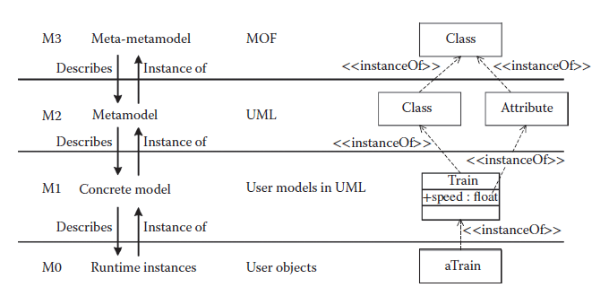
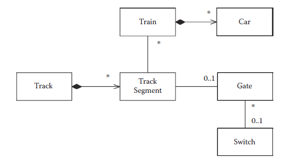
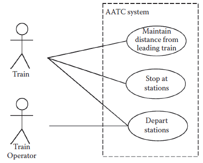
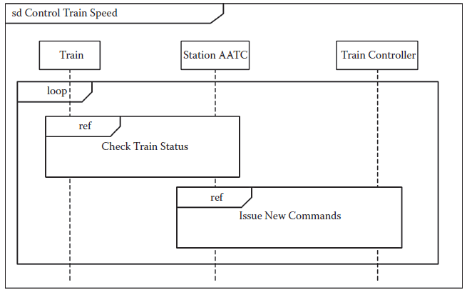
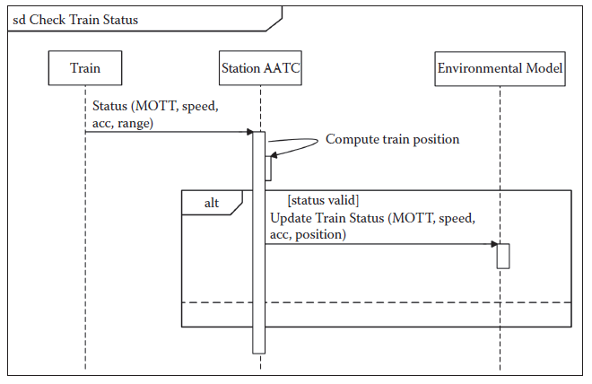
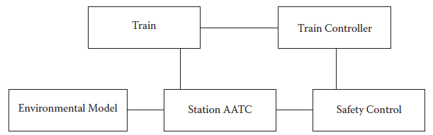
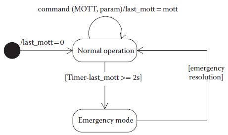
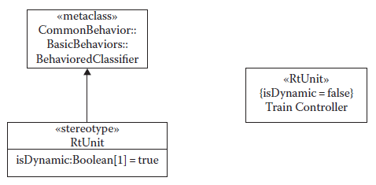
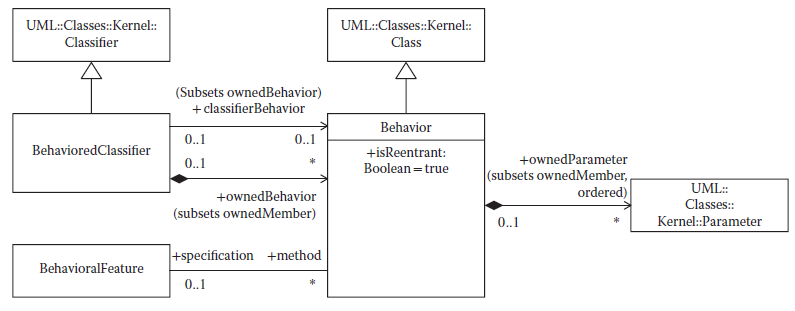

[5.2 <--- ](5_2.md) [   Зміст   ](README.md) [--> 5.4](5_4.md)

## 5.3. MODELING WITH UML

UML is a family of graphical notations that support modeling structural (i.e., static) and behavioral (i.e., dynamic) views of a system. Among others, the structural view includes class and component diagrams, while the behavior view includes sequence and state machine diagrams. UML provides 14 types of diagrams, though some are used more often and more prominently than others—a guide to the key aspects of the UML can be found in Fowler [13]. In this chapter, we focus on some of the com- monly used diagrams.

UML was created to unify many object-oriented graphical modeling notations that became popular in the early 1990s. UML appeared in 1997 and underwent sev- eral changes from one version to another, the most radical ones taking place with the transition to UML 2. The most recent version is UML 2.3, whose specification con- sists of the UML Superstructure [3] defining the notation and semantics for diagrams and the UML Infrastructure [2] defining the language on which the superstructure is based.

In this section, we discuss the metamodeling architecture, the basic modeling capabilities of UML, the extension mechanisms, and behavioral semantics of UML. Then, in Section 5.4, we present an overview of the profiles for real-time systems and go into the details of the MARTE profile. In the end, we discuss the advantages and open issues in UML with respect to the requirements for modeling languages identified in Section 5.2.

### 5.3.1 Metamodeling Architecture

All graphical notations in UML are backed by a single metamodel. The notation (e.g., a class diagram notation) is the graphical syntax of the language. The metamodel defines the concepts of the language—the abstract syntax. Therefore, the UML metamodel defines the language elements and the relationship between them in the different UML graphical notations (e.g., sequence diagrams and class diagrams). A modeler who uses UML diagrams only as sketches is typically not concerned that much with the metamodel. However, for blueprints and especially for using UML as a programming language [13], the metamodel is very important.

The metalayer hierarchy for any language generally has three layers: (i) the metamodel, or the language specification, (ii) the model, and (iii) objects of the model. The metamodel defines how model elements in a model are instantiated. This layered structure can be applied recursively, such that the same layer that is a model instantiated from a metamodel can be seen as a metamodel of another model at the next lower level of instantiation.

The OMG has developed a modeling language (similar to a class diagram) called the Meta Object Facility (MOFTM) [25], which is used to specify metamodels, such as the UML metamodel. From the perspective of MOF, the UML metamodel is seen as a user model that is based on the MOF metamodel. Therefore, MOF is commonly referred to as a meta-metamodel.

Figure 5.2 shows the four-layer metamodeling architecture used by the OMG: meta-metamodel (layer M3), metamodel (layer M2), model (layer M1), and the run- time system (layer M0). The top layer (M3) provides the meta-metamodel (MOF) that is used to build metamodels. The UML metamodel (layer M2) is an instance of the MOF. Layer M1 models are user models written in UML, and these models are instances of the UML metamodel. The M0 layer contains the runtime instances of the model instances defined in layer M1. The layers are numbered from M0 upward, but the architecture is not restricted to four layers. In general, more layers can be used by applying the recursive pattern as explained before.

Figure 5.2 also shows an example, where the meta-metaclass Class is defined as part of MOF. Then, UML defines the metaclasses Class and Attribute as part of the UML metamodel. Every model element in UML is an instance of exactly one model element in MOF. The UML Class is instantiated in a user model in a class called Train, with an attribute called Speed. Layer M0 contains an instance of a Train.

**FIGURE 5.2** Metamodeling architecture.

The UML Infrastructure [2] defines a common package Core such that model elements are shared between UML and MOF. UML is defined as a model based on MOF used as metamodel; however, both UML and MOF depend on Core. Therefore, Core can be seen as the architectural kernel, and the Infrastructure defines the foun- dations for both M2 and M3 layers. The Superstructure [3] extends and customizes the Infrastructure to provide the modeling elements of UML.

### 5.3.2 Modeling with UML

In this section, we start with presenting the UML diagrams briefly, then we comment how they can be used for modeling requirements and architectures, and in the end we present a modeling example with the basic capabilities.

[Figure 5.3 ](#_bookmark23)shows the types of diagrams provided by UML for modeling struc- ture and behavior. A UML model consists of elements such as packages, classes, and associations. UML diagrams are graphical representations of a UML model. Examples of using UML diagrams for real-time systems are available in Douglass [26–28].

Structure diagrams show the static structure of the system at different abstrac- tion levels and how system elements relate to each other. Class diagrams show system Classifiers such as classes and interfaces, their attributes, and relationships between them. Object diagrams show instances of Classifiers and instances of asso- ciations between them. Composite structure diagrams show the internal structure of a Classifier. Component diagrams show logical or physical components and depen- dencies between them via required and provided interfaces. Package diagrams show packages (i.e., namespaces used to group together elements that are related) and depen- dencies between them. Deployment diagrams show the assignment of software arti- facts to execution nodes. A component may be implemented by one or more artifacts. Behavior diagrams show the dynamic behavior of the system objects over time.

Use case diagrams show a set of actions that some actors perform. Activity diagrams show sequences and conditions for coordinating lower-level behaviors. State machine diagrams model the behavior of a part of the system through finite state transitions. Sequence diagrams show the messages exchanged between entities. Communication diagrams show the interaction between entities, where the sequence of messages is given as a sequence numbering scheme. Interaction overview diagrams are similar to activity diagrams but focus on the overview of the control flow. Timing diagrams show interactions and conditions along a linear time axis.

Some diagram types blur the boundary between structure and behavior. For instance, sequence and object diagrams display aspects of both. Figure 5.3 classifies the diagrams according to their dominant trait.

#### 5.3.2.1 Requirements Modeling with UML

For requirements engineering, modelers first create domain models to describe the existing system for which the software should be built, capturing domain entities and their structural and behavioral relationships in a systematic way. Domain models cover stakeholders, human actors that interact with the system, hardware devices, and the environment in which the system will operate. UML class diagrams can be used for specifying structural domain model aspects, showing the relationships between system entities. UML class diagrams can also be used to specify business rules implicitly through class composition and multiplicity constraints, as well as explicitly through pre- and post-conditions expressed in Object Constraint Language (OCL) [29]. Such domain models can help in defining the questions for stakeholders and uncovering hidden requirements. Models also help in defining the boundaries between the target system and its environment.

**FIGURE 5.3** Unified Modeling Language structure and behavior diagrams. (From Object Management Group, “Unified Modeling Language (OMG UML), Superstructure, Version 2.3,” formal/2010-05-05, OMG, 2010. With permission.)

UML use case diagrams identify actors and the capabilities of the system. Use cases are useful also in eliciting end-to-end timing and other QoS requirements, often expressed as constraints of the form “when the actor does X, the system should respond within Y ms.”

The next level of detail beyond use cases is often a set of scenarios that depict inter- actions between the actors of the use case when using that specific capability of the sys- tem. Scenarios are modeled as sequence diagrams, capturing the operations performed by the system, the message protocol of interaction between the system and its actors, and constraints. UML activity and communication diagrams (previously called col- laboration diagrams) can also be used to show how actors collaborate to perform tasks.

#### 5.3.2.2 Modeling Logical and Technical Architectures with UML

After identifying requirements, architecture and design models show how the sys- tem is structured and how its internal entities behave to achieve system goals. All diagrams from [Figure 5.3 ](#_bookmark23)can be used at this stage. In general, a type of structural or behavioral diagram can be used both for the logical and technical architecture. The models relevant to the logical architecture focus on capabilities and their map- ping to logical entities, whereas the models relevant to the technical architecture focus on deployment entities. A platform model adds details such as middleware, operating system, network, and resources. The technical architecture then expresses the mapping between the logical architecture and the platform. In particular, pack- age and deployment diagrams are used for the technical architecture. Furthermore, UML profiles such as MARTE [18] support the modeling of software and hardware resources in a standard way (see Section 5.4).

UML is the language choice of MDA, where both PIM and PSM are expressed as UML models. Model transformation from PIM to PSM is a core concern of MDA, and a PIM has to contain sufficient detail for a tool to generate a PSM. In MDA, the PSM contains the same information as an implementation, but in the form of a UML model instead of code. In general, UML is often used for modeling the logical archi- tecture and other languages can be used for the technical architecture. However, if the transformation is not performed automatically or if it cannot be formalized, then the traceability between the logical and technical architecture is lost.

As concurrency and timing constraints are of particular concern in real-time systems, in the following, we discuss how UML supports them. Concurrency can be modeled in communication diagrams via the sequencing mechanism for events. Messages with the same sequence numbers (e.g., two messages numbered 3a and 3b) can be simultaneously triggered, provided that all messages with lower sequence numbers have been success- fully triggered. Furthermore, concurrency can be expressed in sequence diagrams via the interaction operator PAR, which expresses parallel execution of a set of operations.

The Simple Time package defined in the UML Superstructure [3] provides basic support to represent time and durations and to define timing constraints. A time event denotes an absolute or relative point in time (relative to the occurrence of other events) when the event occurs. A time event is specified by an expression, which may reference observations. A time observation denotes a time instant to be observed during execution when a model element is entered or exited. A duration observation denotes an interval of time. For example, a time constraint can be associated with the reception of a message. In UML, timing constraints can be used in sequence diagrams or state machine diagrams. Simple Time enables triggering a transition in a state machine when a specific point in time has reached or after a certain amount of time has passed. However, the simple model of time does not account for multiple clocks or phenomena such as clock drifts, which occur in distributed systems, leav- ing more sophisticated models of time to be provided by profiles. In Section 5.4.2, we discuss in more detail how timing constraints are supported in the MARTE profile. UML also introduces timing diagrams to show the effects of message/event inter- actions between entities over time. Timing diagrams are useful to depict different states of entities over time, especially in systems with continuous behavior relative to time, but sequence diagrams are more useful in actually modeling explicit time constraints.

#### 5.3.2.3 UML Basics by Example

To show the modeling capabilities of UML, we use a simplified example of the BART system, particularly the part of the train system that controls speed and accel- eration of the trains. BART is the commuter rail train system in the San Francisco Bay area. A full description of the case study is beyond the scope of this chapter, so we will exemplify some of the UML diagrams that can be used for modeling such a system—use case, class, sequence, and state machine diagrams. We will revisit the example in Section 5.4.2.3 when discussing additional capabilities introduced in MARTE and the issue of consistency in UML models.

The BART system automatically controls over 50 trains, most of them consisting of 10 cars. Tracks are unidirectional and sections of the track network are shared by trains of different lines. A track is partitioned into track segments, which may be bounded by gates. A gate can be viewed as a traffic light, establishing the right-of- way where tracks join at switches. [Figure 5.4 ](#_bookmark24)depicts a domain model for the BART track system, showing in a UML class diagram the relationships between physical entities such as train, track, and gate. Such models facilitate establishing a common language for eliciting requirements from domain experts. Typically, specifying rela- tionships and multiplicity constraints on a domain model leads to further discussions with the stakeholders to clarify the domain. For example, gates are not necessarily associated with switches, but can be used just to control the traffic flow.

Other work [17] describes the Advanced Automatic Train Control (AATC) sys- tem, which controls the train movement for BART. One important AATC require- ment is to optimize train speeds and the spacing between the trains to increase throughput on the congested parts of the network, while constantly ensuring train safety. The specification strictly defines certain safety conditions that must never be violated, such as “a train must never enter a segment closed by a gate,” or “the distance between trains must always exceed the safe stopping distance of the follow- ing train under any circumstances.”

**FIGURE 5.4** Class diagram: domain model for the Bay Area Rapid Transit tracks.

 

**FIGURE 5.5** Use case diagram.

The system is controlled automatically. Onboard operators have limited respon- sibility: they signal the system when the platforms are clear, so a train can depart a station and they can operate the trains manually when a problem arises. Use case diagrams are useful in identifying the system boundaries (the control system that must be designed) and the external actors that interact with the system. Typically in UML, actors are human actors that use an application, but in embedded systems actors can be external physical resources such as devices and sensors. Nevertheless, actors represent logical roles, so a physical resource could play several roles in UML models. Figure 5.5 depicts a simple use case diagram for BART. Actors that interact with the AATC system are the Train and the Train Operator and so they are part of the system environment. The use cases depict the high-level goals of the system without details on how these goals are accomplished.

AATC consists of computers at train stations, a radio communications network that links the stations with the trains, and two AATC controllers on board of each train—the two controllers are at the front and back of the train. A track is not a loop. Thus, at the end of the line, the front and back controllers exchange roles and the train moves in the other direction. Each station controls a local part of the track net- work. Stations communicate with the neighboring stations using land-based network links. Trains receive acceleration and brake commands from the station computers via the radio communication network. The train AATC controller (from the lead car) is responsible for operating the brakes and motors of all cars in the train. The radio network has the capability of providing ranging information (from wayside radios to train radios and back) that allows the system to track train positions.

The system operates in half a second cycles. In each cycle, the station control computer receives train information, computes commands for all trains under its control, and forwards these commands to the train controllers. Figure 5.6 shows a sequence diagram depicting the interactions between three roles called Train, Station AATC, and Train Controller. Note that the Station AATC system obtains the status information directly from the Train by using the radio network, not from the Train Controller.

The sequence diagram features interaction frames, introduced in UML 2.0. A frame provides the boundary of a diagram and a place to show the diagram label (e.g., “Control Train Speed” in Figure 5.6). Frames also allow specifying combined fragments with operators and guards. Common examples of operators are LOOP for repetitive sequences, ALT for mutually exclusive fragments, and PAR for par- allel execution of fragments. Figure 5.6 uses a LOOP operator to show that the system repeats the sequence of checking the train position and issuing new com- mands. Another operator is REF, which creates a reference to an interaction speci- fied in another diagram. This REF operator allows composing primitive sequence diagrams into complex sequence diagrams. The expressiveness of UML 2 increased with the addition of these operators, which are borrowed from Message Sequence Charts [30,31].

**FIGURE 5.6** Sequence diagram that composes two other sequence diagrams.

Figure 5.7 depicts a simplified Check Train Status sequence diagram as referenced in [Figure 5.6](#_bookmark25). The Train sends status information regarding its speed, acceleration, and range. The Station AATC system computes the train position from the status information and updates its Environmental Model. Status messages and commands are time-stamped in the so-called Message Origination Time Tag (MOTT). When a Train sends status information to a station, it attaches the time it sends the mes- sage as a MOTT. When the Station AATC estimates the train position, it attaches the original MOTT to the estimate. Furthermore, when the Station AATC sends a command, it again attaches the original MOTT, and the Train Controller checks the MOTT before executing the command. The station’s control algorithm takes the MOTT, track information, and train status into account to compute new com- mands that never violate the safety conditions. To ensure this, each station computer is attached to an independent safety control computer that validates all computed commands for conformance with the safety conditions.

The actors in sequence diagrams (e.g., Train, Station AATC, etc.) are logi- cal roles—in modeling the interactions, we concentrate on specific use cases and abstract from any concrete deployment architectures. In essence, a role shows *part* of the behavior the system displays during execution. What concrete deployment entity *plays* this role is left for a later modeling stage. The natural modeling entities for roles in the UML are Classifiers—with the understanding that multiple roles may be aggregated into a single Classifier. The roles related to computing commands and safety are omitted from [Figure 5.7](#_bookmark26), as they are relevant for another sequence diagram, called Issue New Commands, shown later in this chapter in [Figure 5.17](#_bookmark34). The roles visible in a sequence diagram are a subset of the roles of the entire system. Figure 5.8 shows a simplified domain model with the roles mentioned so far. We use the notation of a class diagram without the multiplicities—for a role domain model, we are interested in the roles that communicate and the links between them. The same diagram can be seen as a simplified Communication diagram, showing the communication links without the messages being exchanged. The role domain model is part of the logical architecture, as roles are logical entities that are later mapped onto physical components to define the technical architecture. A component can play several logical roles.

**FIGURE 5.7** Sequence diagram for Check Train Status.

If a train does not receive a valid command within 2 s of the time stamp contained in the MOTT accompanying the status, it goes into emergency braking. Figure 5.9 shows the behavior of the Train Controller as a state-machine diagram with two states for normal operation and emergency mode.

In state-machine diagrams, we show states as boxes with rounded corners. Arrows denote state transitions. Labels on arrows indicate (i) the trigger (such as a message received), (ii) a guard (a condition that must be true for the transition to be taken) in square brackets, separated from (iii) the action (to be performed when the transition is taken) by a “/.” Actions include assignments to state variables and the sending of messages. All three pasts of a transition are optional. A solid circle indicates the initial “pseudo” state. This example shows a frequently used pattern in modeling time with the basic capabilities of the UML: time is represented as an explicit parameter in messages exchanged among actors and these actors then perform explicit time arithmetic to determine transition triggers.

 

**FIGURE 5.8** Role domain model as a class diagram.

**FIGURE 5.9** State-machine diagram for Train Controller.

 

### 5.3.3 UML Extension Mechanism

The UML standard supports two types of extension mechanisms: lightweight exten- sion through profiles and first-class extension through MOF. The profile mechanism allows UML metaclasses to be specialized for specific domains or different target platforms. In profiles, it is not possible to modify existing metamodels or to insert new metaclasses. Thus, in profiles it is impossible to remove constraints that apply to the UML metamodel, but it is possible to add new constraints that are specific to the profile. In contrast to profiles, in first-class extensibility, there are no restrictions on what changes can be made to a metamodel as MOF enables adding new metaclasses, removing existing classes, and changing relationships. In other words, the profile’s extension defines a new dialect of UML, whereas the first-class extension defines a new language *related to* the UML.

Stereotypes, tagged values, and constraints are the main extension mechanisms available in a profile. A profile extends a reference metamodel such that the spe- cialized semantics do not contradict the semantics of the metamodel. As such, the reference model is considered “read only.” Stereotypes allow creating new model elements (not new metamodels), new constructs specific to a particular domain or platform. As such, a stereotype extends an existing metaclass and uses the same graphical notation as a class, with the keyword «stereotype» shown before or above the name of the stereotype. When the stereotype is applied to a model element, the name of the stereotype is given between «». A metaclass is extended by a stereotype by using a special kind of association relationship called an extension, which sup- ports flexible addition/removal of stereotypes to classes. The notation for an exten- sion is an arrow pointing to the extended class with the arrowhead as a solid triangle. For example, for real-time systems, the MARTE profile defines the stereotype part of the figure shows the stereotype definition (the stereotype extends the meta- class BehavioredClassifier) and the right-hand part of the figure shows how the ste- reotype is applied to the model element Train Controller. A stereotype definition must be consistent with the abstract syntax and semantics of UML but can adapt the concrete syntax of UML to the domain. A stereotype can use an icon instead of a UML diagram element as, for example, when defining a clock element.

**FIGURE** **5.10** Stereotype example.

The properties of a stereotype are called tag definitions. When a stereotype is applied to a model element, the values of its properties are called tagged values. Thus, tagged values are defined as tag–value pairs, where the tag represents the prop- erty and the value represents the value of the property. In previous versions of UML, tagged values allowed defining additional properties for any type of model element. Starting with UML 2, a tagged value can be represented only as an attribute on a stereotype. For example, [Figure 5.10 ](#_bookmark27)shows the Boolean attribute isDynamic defined for the stereotype «RtUnit». If this attribute is true, the real-time unit dynamically creates the schedulable resource required to execute its services [18]. When applying the stereotype, tagged values can be shown in the class compartment under the ste- reotype name as shown in Figure 5.10 for Train Controller. However, tagged values may also be shown in a comment attached to the stereotype.

A profile consists of a package that contains one or more related extension mecha- nisms. Profile diagrams (see [Figure 5.3](#_bookmark23)) allow defining custom stereotypes, tagged values, and constraints. Constraints allow extending the semantics of the UML metamodel by adding new rules. Constraints can be specified in OCL (not shown here for reasons of brevity).

Compared to pure stereotyping, the advantage of using the UML profile mecha- nism is that UML’s meta- and meta-metamodels provide a shared semantic and syn- tactic foundation across all profiles.

### 5.3.4 UML Behavioral Semantics

UML semantics is a topic that ignites fierce discussions in the modeling commu- nity. A common argument of UML critics is that UML has no behavioral seman- tics. While this was true for the first version of the language, OMG introduced an action-based semantics into the UML version 2.0 standard. Because UML sup- ports expressing behavior in different specialized languages (i.e., state machines and activity diagrams), the semantics defined in the standard uses generic and fine- grained elements, which are composed to support all these sublanguages. UML is also intended to be used in different domains that have diverse execution require- ments. Therefore, the UML standard defines variation points for which the docu- mentation states alternative behaviors or leaves explicitly unspecified the behavior, calling for profiles to choose the most appropriate set of behaviors for the intended application domain.

Shortcomings of UML semantics are an important topic of discussion in the mod- eling community. Some scientists [32] point out that, even if a semantic model exists in the standard, it is not adequate to many usage scenarios. A first criticism is that the semantics is not defined formally, in terms of pure math of other formal languages. Consequently, it is impossible to prove that UML semantics is consistently defined or to develop verification tools that check behavioral properties of UML models. A second criticism is that the standard documents do not contain a chapter that coher- ently describes UML semantics. In fact, semantics information is spread across the standard and discussed together with the different UML notations. This makes it difficult for the reader to grasp UML semantics and thus paves the way for inconsis- tencies in the definition and misinterpretation by users. Additional critics complain about the very simple time model, which uses a centralized unique clock and must be completely replaced in many domains. Finally, the variation points that make UML applicable to any domain are subject to criticism as they force adopters to create semantic variations for each such domain.

In the remainder of this section, we describe some of the key elements of UML semantics and how they connect to structural elements of UML. We do not present the semantics of specific UML behavioral notations (e.g., interaction diagrams) but focus on the key elements that are used in the UML standard to construct the seman- tics of such notations. In our description, we highlight some variation points that are left open for profiles to specify. In Section 5.4.2.2, we discuss how the MARTE profile uses those variation points to create a behavioral semantics amenable to real- time embedded systems.

The first step for understanding UML behavioral semantics is defining how behavior is specified and which elements participate in an instance of such behav- ior. UML specifies behavior by defining flows of actions. These flows are always attached to a structural element, a Classifier. UML distinguishes between two types of objects with behavior: active and passive. Active objects, on the one hand, are the source of behavior. When created, they execute their actions independently of any other object. Passive objects, on the other hand, execute their actions in reaction to requests from other objects. Active objects subsume familiar programming concepts such as threads of execution and processes. The UML specification uses this more generic representation so that it can include behavior of entities that are not neces- sarily programs (e.g., people).

Figure 5.11 depicts the subset of the UML metamodel that defines the Behavior class and its connection to Behaviored Classifiers. Behavior is the superclass that represents all behaviors in the UML. Therefore, all the UML notations that describe behavior inherit this basic definition and enrich it by defining more specific types of behavior and their descriptions. Behaviors are associated to BehavioredClassifier. Because the UML Classifiers define sets of instances, the figure shows that behaviors are contained in instances of model elements. This is expressed by the use of a com- position relation (black diamond) in the ownedBehavior association of [Figure 5.11](#_bookmark28). The figure also shows that instances can be associated with a classifier Behavior, which represents the behavior that active objects start executing when created.

**FIGURE 5.11** Subset of common behavior from package BasicBehavior. (From Object Management Group, “Unified Modeling Language (OMG UML), Superstructure, Version 2.3,” formal/2010-05-05, OMG, 2010. With permission.)

The UML standard specifies the behavior performed by Behavior objects in terms of actions and action flows. Actions are elementary operations that, given sets of inputs, produce sets of outputs and optionally modify the value of some structural elements. Multiple actions can be composed into flows to specify more complex operations. Flows specify networks of actions and, as such, identify dependencies between subsequent actions and how outputs feed into subsequent inputs. To support different types of systems requiring diverse semantic choices, UML supports varia- tion points in the action model. One such variation point is the type of dependencies that flows can define. UML has two types of flow dependency: control flow, which starts the dependent action only when the previous one ends, and object flow, which starts dependent actions as soon as all their inputs are available. A second variation point arises by the fact that UML does not mandate when the elements of the action output sets become available. Different decisions on when to make the output values available create very different semantics. For example, UML could support seman- tics that assume synchronous reactions.

Messages and events are the final building blocks that form the base of the UML behavioral semantics. Messages support communication between different instances of UML elements. For example, different message patterns support synchronous calls, asynchronous calls, and signal broadcast. Messages are received in message pools and presented to the receiving instances when they are ready to receive. What happens to an incoming message when the pool is full and in which order messages in the pool are presented to the receiving instance are semantic variation points. Reception of mes- sages is an example of an event. UML events represent the occurrence of a generic state or condition in the UML model instance. Types of events include call events, expression change events, and time events. Some events act as triggers, in which case a Behavior starts executing when the event occurs. Other events just capture a state. For example, a send signal does not even initiate a new behavior whereas a receive signal may.

A very good summary of the UML 2.0 semantics is provided by Selic [33]. We also suggest the interested reader to consult the standard documents [2,3], in par- ticular, to understand how the UML behavior notations (Sequence Diagrams, State Machines Diagrams, Activity Diagrams, etc.) use the core elements we discussed to concretely define their semantics.

[5.2 <--- ](5_2.md) [   Зміст   ](README.md) [--> 5.4](5_4.md)

