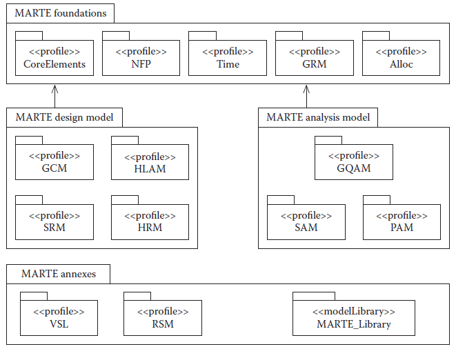
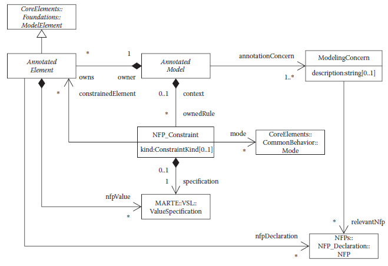
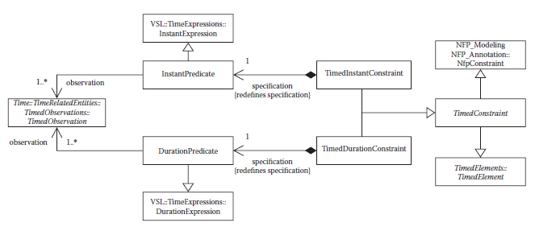
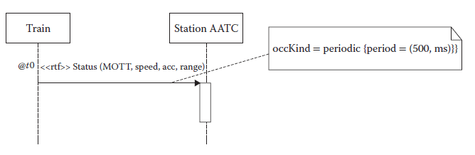
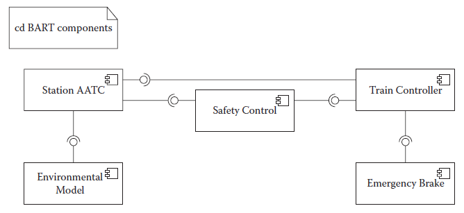
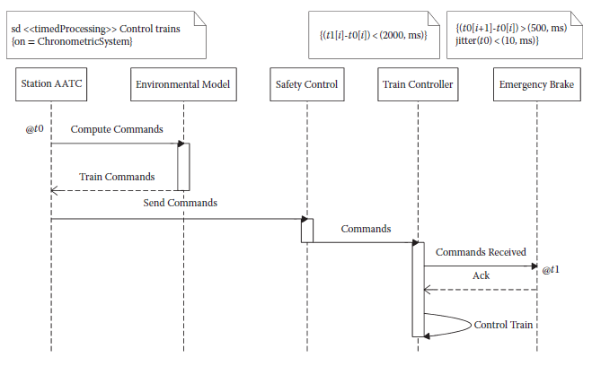
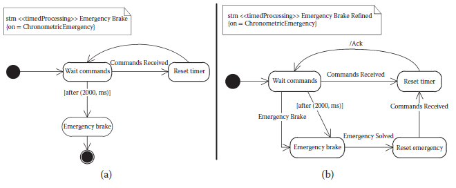

[5.3 <--- ](5_3.md) [   Зміст   ](README.md) [--> 5.5](5_5.md)

## 5.4. UML EXTENSIONS FOR REAL TIME

In this section, we discuss various extensions of UML and then show details from the recent profile for MARTE. The extension mechanism in UML (see Section 5.3.3) allows the definition of families of languages targeted to specific domains and levels of abstractions.

### 5.4.1 Overview of UML Profiles

The profile mechanism has been specifically defined for providing a lightweight extension mechanism to the UML standard via stereotypes, tagged values, and constraints as described in Section 5.3.3. For example, other work [34] presents a UML profile for a platform-based approach to embedded software development using stereotypes to represent platform services and resources that can be assembled together. There is an increasing number of profiles defined in various domains, resulting from either OMG standardization efforts or research outcomes. Different profiles may be overlapping and also inconsistent as each profile tailors the UML for a particular domain or platform. Some of the profiles emerged in previous versions of UML and then new profiles were defined to keep up with the latest changes in UML and to fill in the gaps identified in practice. In the following, we discuss some of the most commonly used profiles for real-time systems, with the historical background and the relationships between them.

The profile mechanism has been significantly refined starting with UML 2.0. Initially, UML 1.0/1.1 provided stereotypes and tagged values, but did not define the concept of a profile. Subsequent revisions of UML introduced the concept of a profile to provide structure to the extension elements. Moreover, to complete the previous versions of UML, the UML 2.0 Infrastructure and Superstructure specifications have defined the profile mechanism as a specific metamodeling technique. In addition, profile diagrams have been introduced in UML 2.0.

UML/Realtime (UML-RT) [35,36] extended UML 1.1–1.4 to support Real-Time Object-Oriented Modeling [37] concepts. It was also the UML dialect of the CASE tool Rational Rose®/RT. The extension used the standard UML mechanisms of stereotypes, tagged values, and constraints. Thus, UML-RT is a profile, although it was not called a profile initially because there was no profile concept in UML 1.1. For modeling architectural concepts, UML-RT introduced capsules (to model components), ports (to model the interaction of a capsule with its environment), connectors (communication channels between ports), and protocols (to model the behavior that can occur over a connector). A protocol comprises a set of participants (protocol roles), each specified by a set of signals received/sent by it. The corresponding communication sequence can be specified by a state machine and sequence diagrams. While UML-RT was a substantial improvement over the first generation of UML to model real-time systems, it still did not support all notations needed in modeling real-time systems. For example, Krüger et al. [38] presents an extension to UML-RT to support broadcasting. Because UML-RT was not based on an extensible framework such as the one supported by UML 2.0, extending it was an ad hoc process. UML-RT concepts were finally included in UML 2.0, which grants not only the ability to use its constructs in standard UML, but also the ability to systematically extend such constructs. For example, Krüger et al. [39] presents an approach to introducing broadcasting using UML 2.0 facilities similar to the UML-RT approach we mentioned earlier [38].

The UML profiles standardized by OMG include the UML Profile for Schedulability, Performance, and Time (SPT) [40], the UML profile for MARTE [18], and the UML profile for QoS and Fault Tolerance (QoS & FT) [41]. UML-RT focused on component-oriented development of communicating systems but left other aspects of embedded systems unaddressed. The SPT profile [40] was developed to define a resource model, time, and concurrency aspects in UML. MARTE is a new UML profile that updates the previous profile SPT for UML 2.x. MARTE is presented in more detail in Section 5.4.2. The QoS & FT profile [41] defines resource properties such as memory capacity and power consumption. The QoS & FT profile allows users to customize service characteristics (i.e., define new characteristics through specialization) and use tools to perform analyses such as performance and dependability. The QoS & FT profile allows defining a wide variety of QoS properties as compared to the SPT profile, which focused on schedulability and performance. In comparison, MARTE reuses concepts defined in both the SPT and the QoS & FT profile. Moreover, MARTE has the advantage that it allows modelers to attach directly to the design model additional information necessary for various analyses, rather than creating dedicated models for analysis.

OMG also provides the standard for the Systems Modeling Language™ (OMG SysMLTM) [42]. SysML reuses a subset of UML 2 (called UML4SysML) and provides additional extensions to address the concerns for systems engineering applications (called the SysML Profile). Therefore, SysML uses both UML extension mechanisms: the first-class extension via MOF is used to define the UML4SysML subset and then the profile extension mechanism is used not on UML but on UML4SysML. SysML does not use all of the UML diagram types and, thus, it is smaller and easier to learn than UML. In particular, SysML strictly reuses the UML use case, sequence, state machine, and package diagrams. SysML also modifies some of the UML diagrams. The SysML block definition diagram, internal block definition diagram, and activity diagrams extend the UML class diagram, composite structure diagram, and activity diagram, respectively. The SysML “block” is a significant extension in the direction of modeling complex systems. Blocks can be used to decompose the system into individual parts, with dedicated ports for accessing their internals. A block can represent almost any other type of structural entity. Furthermore, SysML allows the description of more general interactions than in software, for example, physical flows such as liquids, energy, or electricity. SysML activity diagrams add support for modeling continuous flows of material, energy, or information. By specifying a continuous rate, the increment of time between tokens approaches zero to simulate continuous flow. Nevertheless, SysML does not extend the time model of UML.

SysML adds two new diagram types: the requirements diagram and the parametric diagram. The requirements diagram captures text-based requirements and the relationships between them—requirements hierarchies and requirements derivation. A requirement can be related to a model element that satisfies or verifies the requirements. Thus, SysML requirements modeling not only supports the process of documenting requirements, but also provides traceability to requirements throughout the design flow. It furthermore provides tabular representations for requirements. Parametric diagrams allow the graphical specification of analytical relationships and constraints on system properties (such as performance and reliability) associated with blocks. Thus, parametric diagrams serve the integration of design models with analysis models.

SysML and MARTE are complementary and could be used together in a common modeling framework [43]. In general, there exist several profiles defined in various domains, and it is not clear how to combine multiple profiles when this is necessary for a particular interdisciplinary application. Therefore, Espinoza et al. [43] presents how SysML and MARTE can be combined and highlights the open issues in terms of convergence between the two profiles. For requirements engineering, SysML provides traceability relations, whereas MARTE provides ways to specify nonfunctional requirements. For system structure, modelers could start with a model specified with SysML blocks and then apply MARTE stereotypes to add additional semantics to these blocks. For system behavior, MARTE adopted the notion of port and flow from SysML, but they have different semantics. Therefore, when combining SysML and MARTE, it is required to define a common consistent semantics. Furthermore, significant differences exist in the specification of quantitative values for analysis (see Espinoza et al. [43] for a detailed analysis of the two profiles).

Even from this short exploration of UML extensions and profiles, it becomes clear that model consistency is a critical aspect of MBE—within *and* across profiles.

### 5.4.2 Modeling and Analysis of Real-Time and Emb edded Systems

The UML profile for SPT [40] provides a framework for specifying time properties, schedulability analysis (rate monotonic analysis), and performance analysis (queuing theory). MARTE [18] updates SPT for UML 2.x. It allows for modeling of both software and hardware platforms along with their nonfunctional properties. It supports component-based architectures and different computational paradigms, and it allows more extensive performance and schedulability analysis.

In this section, we present an overview of MARTE’s capabilities and we revisit the BART case study introduced in Section 5.3.2.3.

#### 5.4.2.1 MARTE Basics

MARTE [18] is structured as a hierarchy of subprofiles (see the UML package diagram in [Figure 5.12](#_bookmark29)) with five foundation profiles and then further extensions used for design or analysis.

The foundation profiles are as follows: 

•   *Core Elements* define the basic elements used for structural and behavioral modeling. MARTE distinguishes between design-time Classifier elements and runtime instance elements created from the Classifiers. Behaviors are composed of actions and are triggered by events. Behaviors provide context for actions and determine when they execute and what inputs they have. In addition, MARTE supports modeling of operational modes (i.e., modal behavior), which are mutually exclusive at runtime. A mode defines a fragment in the system execution that is characterized by a given configuration when a set of system entities are active and have parameters defined for that mode.

•   *Nonfunctional Properties Modeling (NFP)* supports the declaration of nonfunctional properties (such as memory usage and power consumption) as UML data types. The Value Specification Language (VSL) is introduced in MARTE to specify the values of those data types using a textual language for specifying algebraic expressions. An annotated model (see [Figure 5.13](#_bookmark30)) contains annotated elements, which are model elements that have attached NFP value annotations for describing nonfunctional aspects (which can differ from one operational mode to another). The annotated model establishes the context for interpreting names used in the value specification. Examples of annotated elements (defined in other MARTE packages) used for performance analysis are step (a unit of execution), scenario (a sequence of steps), resource, and service (offered by a resource or component). A Modeling Concern establishes the ontology of relevant NFPs for a given domain used for the analysis. A domain model such as Figure 5.13 shows the concepts defined in MARTE. Then, a profile diagram defines the profile packages and how the elements of the domain model extend metaclasses of the UML metamodel. As explained in Section 5.3.3, the elements in the domain model are represented in the UML as stereotypes (e.g., the stereotypes «Nfp», «NfpConstraint», «Mode», etc.). However, not every element in the domain model results directly in a stereotype, because some of the domain concepts are abstract.

**FIGURE 5.12** The architecture of the Modeling and Analysis of Real-Time and Embedded systems (MARTE) profile. (From Object Management Group, “UML Profile for MARTE: Modeling and Analysis of Real-Time Embedded Systems” Version 1.0, formal/2009-11-02, OMG, 2009. With permission.)

•   The *Time* profile supports three models of time: chronometric, logical, and synchronous. It enriches the behavior specification from the core elements with explicit references to time concepts. Time is represented as a partial ordering of instants. The occurrence of a time event refers to one instant. The basic model does not refer to physical time and, therefore, supports logical time, which is the basis also for synchronous languages. A time base is a set of instants where MARTE supports discrete and dense time bases (only countable sets). Physical time can be modeled as a dense time base. Clocks (logical or chronometric) use a discrete time base. For distributed systems, multiple time bases are supported.

**FIGURE 5.13** Nonfunctional properties annotations in MARTE. (From Object Management Group, OMG, 2009, “UML Profile for MARTE: Modeling and Analysis of Real-Time Embedded Systems” Version 1.0, formal/2009-11-02, 2009. With permission.)

Time can be used for triggering behaviors or observing event occurrences. MARTE defines the concepts for relating events, actions, and messages to time. A time constraint is specified as a predicate on timed observations (see [Figure 5.14](#_bookmark31)) and so the TimedObservation is a key concept introduced in MARTE. A constraint can be imposed on the occurrence of an event, the temporal distance between two events, or the duration of a behavior execution. A TimedObservation is a TimedElement, and, therefore, it has associated clocks used for observing time. A TimedObservation is the abstract superclass of TimedInstantObservation and TimedDurationObservation. For a behavior, observed events can be either its *start* or *finish* event. For a request, the possible events are its *send, receive*, or *consume* (the start of its processing by the receiver) events. Duration constraints can be defined on two events not necessarily occurring on the same clock.

**FIGURE 5.14** TimedConstraints as defined in MARTE. (From Object Management Group, “UML Profile for MARTE: Modeling and Analysis of Real-Time Embedded Systems” Version 1.0, formal/2009-11-02, OMG, 2009. With permission.) 

•   *Generic Resource Modeling (GRM)* provides an ontology of resources that allows the modeling of computing platforms, including computing resources, storage resources, communication media, and execution platforms.

•   *Allocation Modeling (Alloc)* provides concepts for allocation of functionality to implementation entities. It includes space allocation and time allocation (i.e., scheduling). It also addresses the issue of refinement between models of different levels of abstraction. Nonfunctional properties (e.g., worst case execution time) can be attached to an allocation specification.

Based on the foundational profiles, MARTE provides two packages of extensions (see [Figure 5.12](#_bookmark29)): the MARTE design model supports model-based design of embedded applications and the MARTE analysis model supports model-based analyses and, thus, validation and verification.

For model-based design with MARTE, the *High-Level Application Modeling (HLAM)* subprofile provides extensions for real-time concerns such as Real-time Unit (using the stereotype «RtUnit») for concurrent computing units and Protected passive Unit («PpUnit») for shared information. An «RtUnit» owns one or several schedulable resources and can satisfy several requests from several real-time units at the same time, enabling intraunit parallelism if necessary. An «RtUnit» owns a single message queue for saving the messages it receives, and each message can be used to trigger the execution of a behavior owned by the unit. Real-time units and protected passive units may provide real-time services, which may specify real-time features such as deadlines and periods (with the ArrivalPattern data type). The stereotype for features («rtf») can be applied to multiple kinds of modeling elements (e.g., actions, messages, and signals). For example, the message *Status* from [Figure 5.7 ](#_bookmark26)can be stereotyped as a real-time feature, indicating that is has a period of 500 ms (remember that the AATC system operates in half-second cycles). As a simple example, [Figure 5.15 ](#_bookmark32)depicts the status message, omitting other messages exchanged in this scenario. We define *t*0 as a TimedInstantObservation. Because the message is periodic, the period starts at time event *t*0[*i*]. Later in the chapter, [Figure 5.17 ](#_bookmark34)shows an example for specifying timing constraints on the temporal distance between two events.

**FIGURE 5.15** Bay Area Rapid Transit periodic feature.

The *Generic Component Model (GCM)* subprofile supports component-based design, with both message and data communication between components. The MARTE component model adopted the concepts of ports and flows from SysML and added client/server ports. Furthermore, *Software Resource Modeling (SRM)* and *Hardware Resource Modeling (HRM)* allow designers to specify computing platforms. SRM allows modeling of elements such as tasks, semaphores, mailboxes, etc. The MARTE annexes feature supports modeling of OSEK, ARINC, and POSIXcompliant software computing platforms. The model of computation in MARTE is an asynchronous/event-based approach, but alternative models can be defined as extensions to the MARTE specification by using NFP, Time, and GRM packages.

Model-based analysis with MARTE is provided by the *Generic Quantitative Analysis Modeling (GQAM)* subprofile or by its two refinement subprofiles for schedulability and performance analysis. The analysis is based on the annotation mechanism in MARTE, which uses UML stereotypes. The model elements are mapped into analysis elements, which include the values for nonfunctional properties necessary for the analysis.

The Architecture Analysis and Design Language (AADL) [44] is an architecture description language defined ab initio (*not* as a UML profile) and standardized by the Society of Automotive Engineers. A system modeled in AADL consists of application software components (made of data, threads, and process components) bound to execution platform components (processors, memory, buses, and devices). Note that there is a MARTE rendering of AADL, formalized as a subset of MARTE.

#### 5.4.2.2 MARTE Semantics

We discussed in Section 5.3.4 that UML 2.x defines a flexible semantics framework, which leaves several variation points open for profiles to specify. This approach leaves the developers of profiles free to adapt the general framework of UML behavior to the special needs of their target domains. In the case of MARTE, one of the most evident variations is the time model, which we discussed in Section 5.4.2.1. In fact, because the target domain includes real-time systems, the simplistic time model based on a global clock of the UML is not suitable.

While time is the most evident variation over standard UML semantics, MARTE defines semantics for many other variation points that the general UML specification left open. For example, we mentioned in Section 5.3.4 that the order in which messages are removed from the message pool and presented to the receiving instance is an open variation point. MARTE addresses this variation point by defining two default policies (first-in-first-out, FIFO and last-in-first-out, LIFO) and specifying that, by default, messages that arrive when the message pool is full will not be blocking and the message pool will silently drop the oldest message it contains to make room for the new one ([see Section 12.3.2.6 ](#_bookmark35)in the MARTE profile specification [18]). A complete discussion of all UML variation points fixed by MARTE is beyond the scope of this chapter. We recommend that the interested reader consult the MARTE profile specification [18] for a complete specification of the MARTE semantics.

#### 5.4.2.3 MARTE Example

In this section, we revisit the BART example introduced in Section 5.3.2.3. We show different modeling perspectives using MARTE, give an example of timing constraints, and present an inconsistency that can arise when modeling behavior in the different diagrams.

Figure 5.16 depicts a component diagram with five components and the interface dependencies between them (we use the graphical notation of a ball-and-socket connection between a provided interface and a required interface). The Environmental Model component models the physical environment containing the trains. The Station AATC uses the Environmental Model to compute commands to send to trains. The Safety Control component checks all commands sent by the Station AATC for safety before forwarding them to each train. The safety computation is based on a simpler model than the one used to compute commands and only focuses on ensuring that all commands sent maintain the safety of each train. The last two components are deployed on the actual train. The Train Controller manages the train accelerations and decelerations, and the Emergency Brake is activated only in case of an emergency and stops the train as quickly as possible.

**FIGURE 5.16** Component diagram for Bay Area Rapid Transit system.

Figure 5.17 depicts a sequence diagram capturing the common control scenario for the BART system. The figure represents the Issue New Commands diagram referenced earlier in [Figure 5.6](#_bookmark25). This model is annotated with MARTE time constraints to specify the real-time requirements of the BART case study. The behavior specified in the diagram is the following:

•   Station AATC sends a request to Environmental Model to compute the commands for the train.

•   Environmental Model computes the commands, taking into account all parameters such as passenger comfort, schedule, etc.

•   After receiving the commands from Environmental Model, Station AATC sends the commands to Safety Control to ensure the commands computed are safe.

•   If the commands are safe, Safety Control forwards them to Train Controller.

•   Train Controller informs Emergency Brake that the commands have been received.

•   Emergency Brake acknowledges the commands received.

•   Finally, Train Controller controls the train engine according to the commands received.

In Figure 5.17, we annotated two time instants *t*0 and *t*1 using Timed InstantObservations as defined in MARTE, which is indicated by the graphical representations @*t*0 and @*t*1. A TimedInstantObservation denotes an instant in time associated with an event occurrence (e.g., send or receive) and observed on a given clock. *t*0 is the instant when the message Compute Commands is *sent* by Station AATC, whereas *t*1 is the time instant when the message Commands Received is *received* by Emergency Brake.

**FIGURE 5.17** Sequence diagram for computing and delivering Train Commands.

**FIGURE 5.18** State-machine diagrams for the Emergency Brake.

Given those two instants, we leverage MARTE to define three time constraints in our system. With the time constraint (*t*1[*i*] − *t*0[*i*]) < (2000, ms), we limit the duration of each iteration of this scenario to 2 s. The notations *t*0[*i*] and *t*1[*i*] represent the generic *i*th instantiation of the scenario (recall that the system operates in cycles). The second constraint, (*t*0[*i* + 1] − *t*0[*i*]) > (500, ms), imposes that between each instantiation of the scenario, at least half a second passes. Finally, the last constraint, jitter(*t*0) < (10, ms), limits the jitter of the *t*0 event, enforcing that between each iteration of the event at *t*0, there are between 500 and 510 ms.

Figures 5.18a and 5.18b present state-machine diagrams for the Emergency Brake system. These state machines are two different versions of the same perspective, where the one in Figure 5.18b is a refined version that enables restarting the system after an emergency brake. If we consider the three graphs from [Figures 5.16](#_bookmark33), 5.17, and 5.18a together, we have an inconsistent model: the state machine diagram Figure 5.18a does not acknowledge the Commands Received call from Train Controller— contrary to what the sequence diagram from [Figure 5.17 ](#_bookmark34)demands. Replacing the diagram from Figure 5.18a with Figure 5.18b, we obtain a consistent model.

[5.3 <--- ](5_3.md) [   Зміст   ](README.md) [--> 5.5](5_5.md)