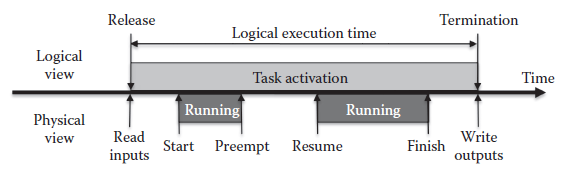
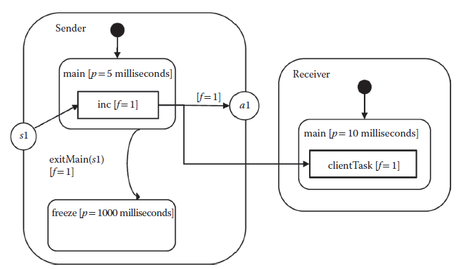
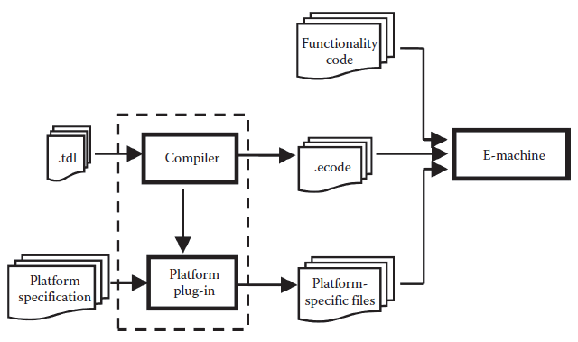
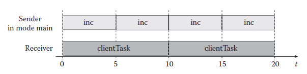

[6.1 <--- ](6_1.md) [   Зміст   ](README.md) [--> 6.3](6_3.md)

## 6.2. TIMING DEFINITION LANGUAGE

The TDL [8] at its core follows the time-triggered programming model [3,9]. In a time-triggered system, all activities are triggered only by the ticks of a single global clock. To increase the range of applicability, TDL also supports a limited form of event-triggered programming, which allows, for example, responding to hardware interrupts.

TDL [8] у своїй основі слідує моделі програмування, що запускається за часом [3,9]. У системі, що запускається за часом, усі дії запускаються лише цоканнями одного глобального годинника. Щоб збільшити діапазон застосовності, TDL також підтримує обмежену форму програмування, викликаного подіями, що дозволяє, наприклад, реагувати на апаратні переривання.

### 6.2.1 TDL Properties

TDL programs that only rely on the time-triggered features exhibit the following properties by construction.

Програми TDL, які покладаються лише на функції, що запускаються за часом, демонструють такі властивості за своєю конструкцією.

#### 6.2.1.1 Time and Value Determinism

Value determinism means that a program provides the same outputs if it is provided with the same inputs. Time determinism means that a program provides the outputs at the same times if it is provided with the inputs at the same times, where all times are relative to the program start. TDL aims for both time determinism and value determinism. Thus, a TDL program provides the same outputs at the same times if it is provided with the same inputs at the same times. In other words, the chronologically ordered sequence of outputs (time plus values) of a TDL program, which is also referred to as the observable behavior of a program, is deterministic and platform-independent.

Детермінізм цінностей означає, що програма забезпечує однакові виходи, якщо їй надаються однакові вхідні дані. Детермінізм часу означає, що програма забезпечує вихідні дані в один і той самий час, якщо вона забезпечується входами в той самий час, де всі часи відносяться до початку програми. TDL має на меті як часовий, так і ціннісний детермінізм. Таким чином, програма TDL забезпечує однакові виходи в той самий час, якщо їй надаються однакові вхідні дані в той самий час. Іншими словами, хронологічно впорядкована послідовність виходів (час плюс значення) програми TDL, яку також називають спостережуваною поведінкою програми, є детермінованою та незалежною від платформи.

#### 6.2.1.2 Portability

TDL programs represent a platform-independent description of the timing behavior of an application. Everything that is platform specific, for example, accessing sensors or actuators, is defined outside the TDL program. TDL programs behave exactly the same independent of the underlying CPU, network bandwidth, or operating system. Even when simulating a TDL application, for example, under MATLAB and Simulink, the application exhibits the same behavior.

Програми TDL представляють незалежний від платформи опис поведінки синхронізації програми. Все, що стосується конкретної платформи, наприклад, доступ до датчиків або виконавчих механізмів, визначається поза програмою TDL. Програми TDL поводяться абсолютно однаково незалежно від основного процесора, пропускної здатності мережі чи операційної системи. Навіть під час моделювання програми TDL, наприклад, у MATLAB і Simulink, програма демонструє однакову поведінку.

#### 6.2.1.3 Transparent Distribution

Since TDL abstracts from the execution platform, a TDL application shows the same observable behavior in the case of a distributed system as on a single-node system. Thus, the fact that a distributed system is used as an execution platform is transparent. It is the task of the TDL compiler to generate a suitable network communication schedule for maintaining the observable behavior of the application [10].

Оскільки TDL абстрагується від платформи виконання, програма TDL демонструє таку ж спостережувану поведінку у випадку розподіленої системи, як і в системі з одним вузлом. Таким чином, той факт, що розподілена система використовується як платформа виконання, є прозорим. Завданням компілятора TDL є створення відповідного розкладу мережевого зв’язку для підтримки спостережуваної поведінки програми [10].

#### 6.2.1.4 Time Safety

The TDL compiler provides a time safety check, which guarantees that a program behaves as expected for a particular target platform given that the worst case execution times for the tasks to be executed are known for that platform. In the case of a distributed platform, the compiler also guarantees that the network communication preserves the expected observable behavior of the application.

Компілятор TDL забезпечує перевірку безпеки часу, яка гарантує, що програма поводиться так, як очікувалося для конкретної цільової платформи, враховуючи, що для цієї платформи відомі найгірші випадки часу виконання завдань, які потрібно виконати. У випадку розподіленої платформи компілятор також гарантує, що мережевий зв’язок зберігає очікувану спостережувану поведінку програми.

#### 6.2.1.5 Compositionality

A TDL program consists of a set of so-called modules. All modules are executed in parallel, and the data flow between modules is handled by the TDL runtime system. Adding another module to the application does not change the observable behavior of the previously existing modules. 

Програма TDL складається з набору так званих модулів. Усі модулі виконуються паралельно, а потік даних між модулями обробляється системою виконання TDL. Додавання іншого модуля до програми не змінює спостережувану поведінку раніше існуючих модулів.

### 6.2.2 TDL Language Constructs

In the sequel, we introduce the individual TDL language constructs informally. For more details including a formal grammar, please refer to the TDL Language Specification [8].

У подальшому ми неофіційно представимо окремі конструкції мови TDL. Для отримання додаткової інформації, включаючи формальну граматику, зверніться до специфікації мови TDL [8].

#### 6.2.2.1 Modules

At the outermost level, a TDL application consists of a set of modules[35]. Two modules can either be independent, that is, they share no data, or cooperating. Cooperating modules exchange data through ports. Statically, a module provides a namespace. Dynamically, modules are executed in parallel—possibly on different nodes in a distributed system. All modules share a common clock, which, in the case of a distributed execution platform, has to be distributed to the individual nodes of the platform. A module may encapsulate a finite state machine (FSM), where the states are denoted as modes. In a mode, the temporal aspects of all activities are defined.

На самому зовнішньому рівні додаток TDL складається з набору модулів [35]. Два модулі можуть бути незалежними, тобто вони не мають спільних даних, або співпрацювати. Взаємодіючі модулі обмінюються даними через порти. Статично модуль забезпечує простір імен. Динамічно модулі виконуються паралельно — можливо, на різних вузлах у розподіленій системі. Усі модулі мають загальний тактовий сигнал, який, у випадку платформи розподіленого виконання, має бути розподілений між окремими вузлами платформи. Модуль може інкапсулювати кінцевий автомат (FSM), де стани позначаються як режими. У режимі визначаються часові аспекти всіх видів діяльності.

#### 6.2.2.2 Ports

Data flow within a single TDL module, between multiple modules, and between a TDL module and the physical environment is exclusively based on ports. A port is a typed variable that is accessed (read or written) at specific time instances only. Sensor and actuator ports (sensors and actuators for short) are the only means for a TDL module to communicate with the environment. A sensor declaration defines a typed read-only variable to represent a particular value in the physical environment and provides input to the TDL application. An actuator declaration is an initialized and typed write-only variable that influences a particular value in the physical environment and provides output from the TDL application to the environment. The access to the hardware is performed by user-provided setter and getter functions that are external to TDL.

Потік даних в межах одного модуля TDL, між кількома модулями та між модулем TDL і фізичним середовищем базується виключно на портах. Порт — це типізована змінна, до якої доступ (читання або запис) здійснюється лише в певні моменти часу. Порти датчиків і приводів (скорочено датчиків і приводів) є єдиним засобом для зв’язку модуля TDL із середовищем. Оголошення датчика визначає введену змінну лише для читання для представлення певного значення у фізичному середовищі та надає вхідні дані для програми TDL. Оголошення актуатора — це ініціалізована та введена змінна, призначена лише для запису, яка впливає на конкретне значення у фізичному середовищі та забезпечує вихід із програми TDL у середовище. Доступ до обладнання здійснюється за допомогою наданих користувачем функцій налаштування та отримання, які є зовнішніми щодо TDL.

#### 6.2.2.3 Tasks

A task is the computational unit in TDL. It defines a namespace for input, output, and state ports. Each task is associated with a task function, that is, a stateless piece of code without any synchronization points. A single invocation of a task at runtime creates a *task activation*. A task activation lasts for a strictly positive amount of time that starts at the release time (the time when the task activation is released) and ends at the termination time (the time when the task activation is terminated). The time between these two instants is called the *logical execution time* (LET) of the task activation ([Figure 6.1](#_bookmark36)). At the release time, the input ports of the corresponding task are updated with the values read from the output ports of other tasks and sensors that have been passed as parameters by the task invocation. The actual execution of the task function can be scheduled at will, as long as its execution starts after the release time and finishes before the termination time. The task activation locally buffers the output of the task function. At the termination time, the output ports of the task are updated with the values stored in the local buffers of the task activation. State ports hold data that must persist among multiple activations of a task.

Завдання є обчислювальною одиницею в TDL. Він визначає простір імен для портів введення, виведення та стану. Кожне завдання пов’язане з функцією завдання, тобто фрагментом коду без стану без будь-яких точок синхронізації. Один виклик завдання під час виконання створює *активацію завдання*. Активація завдання триває строго позитивний проміжок часу, який починається в момент випуску (час, коли активація завдання вивільняється) і закінчується в час завершення (час, коли активація завдання припиняється). Час між цими двома моментами називається *логічним часом виконання* (LET) активації завдання ([Рис. 6.1](#_bookmark36)). Під час випуску вхідні порти відповідного завдання оновлюються значеннями, зчитаними з вихідних портів інших завдань і датчиків, які були передані як параметри під час виклику завдання. Фактичне виконання функції завдання можна запланувати за бажанням, якщо його виконання починається після часу випуску та закінчується до часу завершення. Активація завдання локально буферизує вихід функції завдання. У момент завершення вихідні порти завдання оновлюються значеннями, що зберігаються в локальних буферах активації завдання. Порти стану зберігають дані, які мають зберігатися під час кількох активацій завдання.



**FIGURE 6.1** Logical execution time.

#### 6.2.2.4 Modes

Modules that encapsulate a state machine have a dedicated start mode each and can switch between modes independently of others. A mode *m* specifies a mode period *Pm* (in microseconds) and a set of activities. As long as a module remains in mode *m*, the activities associated with *m* are repeated with period *Pm*. A mode activity either is a task invocation, an actuator update, or a mode switch. Mode activities may be guarded. A *guard* is a function that returns either true or false. A guarded mode activity is executed only if its guard evaluates to true.

Модулі, які інкапсулюють кінцевий автомат, мають окремий режим запуску та можуть перемикатися між режимами незалежно від інших. Режим *m* визначає період режиму *Pm* (у мікросекундах) і набір дій. Поки модуль залишається в режимі *m*, дії, пов’язані з *m*, повторюються з періодом *Pm*. Активність режиму – це або виклик завдання, або оновлення приводу, або перемикач режиму. Режим діяльності може охоронятися. *guard* — це функція, яка повертає значення true або false. Діяльність у захищеному режимі виконується, лише якщо її guard оцінюється як істина.

When defining a mode activity within a mode, a frequency *f* for this activity is specified. This frequency divides the mode period *Pm* into *slots* of duration *Pm*/*f* each. These slots define the times during the mode period at which the guard of the activity is evaluated and the activity is executed. Actuator updates and mode switches are executed at the end of a slot. Task invocations result in the release of a task activation at the beginning and the termination of the particular activation at the end. Thus, the LET of an activation spans the entire slot, and, by default, the task invocation is executed in each slot.

При визначенні дії режиму в режимі вказується частота *f* для цієї дії. Ця частота ділить період режиму *Pm* на *слоти* тривалістю *Pm*/*f* кожен. Ці слоти визначають час протягом періоду режиму, коли охорона діяльності оцінюється та діяльність виконується. Оновлення приводу та перемикання режимів виконуються в кінці слота. Виклики завдань призводять до звільнення активації завдання на початку та припинення певної активації в кінці. Таким чином, LET активації охоплює весь слот, і за замовчуванням виклик завдання виконується в кожному слоті.

For control systems, the fixed relationship between the rate of task invocations and the LET of each task activation poses problems as the delay between reading the sensors and updating the actuators consumes phase reserve in the control loop (e.g., Ref. [11]). Besides increasing the frequency of a task invocation and thus the sampling rate, which may be prohibitive in terms of CPU load, TDL offers two mechanisms for dealing with this situation: slot selection and task splitting.

Для систем управління фіксоване співвідношення між частотою викликів завдань і LET кожної активації завдання створює проблеми, оскільки затримка між зчитуванням датчиків і оновленням виконавчих механізмів споживає резерв фази в контурі керування (наприклад, Ref. [11]). Окрім збільшення частоти викликів завдань і, отже, частоти дискретизації, яка може бути непомірно високою з точки зору навантаження ЦП, TDL пропонує два механізми для вирішення цієї ситуації: вибір слота та розподіл завдань.

*Slot selection* is the explicit selection of the slots in which a mode activity should be executed. For task invocations, slot selection maintains the basic pattern of freezing the input ports of a task at the release of each of the task activations and updating the output ports (and actuators) at termination. It allows a separation between the specification of the LET of a task activation and the repetition rate of the associated task. Slots that are not selected go unused.

*Вибір слота* — це явний вибір слотів, у яких має виконуватися режим. Для викликів завдань вибір слота підтримує базовий шаблон заморожування вхідних портів завдання при звільненні кожної активації завдання та оновлення вихідних портів (і приводів) після завершення. Це дозволяє розділити специфікацію LET активації завдання та частоту повторення пов’язаного завдання. Невибрані слоти залишаються невикористаними.

*Task splitting* means to split the single task function into two functions, one called fast step and the other called slow step. TDL assumes that the fast step does not consume any time. At release time, first the input ports of the task are updated and then the fast step is executed. As a modification of the basic actuator update pattern, there is the possibility to update an actuator with a value calculated in the fast step immediately after it has finished execution. The slow step is executed afterwards, during the LET of the activation. At the termination time, the output ports of the task are updated and further actuator updates may be performed. In a control system application, for example, the actual controller may be moved into the fast step. Thus, the delay between reading the output of the plant and updating the actuator that delivers the input to the plant is minimized. A state estimator (e.g., [11]), representing a higher computational load, will then be moved into the slow step.

*Розподіл завдання* означає розділення однієї функції завдання на дві функції, одну з яких називають швидким кроком, а іншу — повільним. TDL передбачає, що швидкий крок не споживає часу. Під час випуску спочатку оновлюються вхідні порти завдання, а потім виконується швидкий крок. Як модифікація основного шаблону оновлення приводу, існує можливість оновити привод зі значенням, обчисленим у швидкому кроці, одразу після завершення його виконання. Повільний крок виконується пізніше, під час LET активації. У момент завершення вихідні порти завдання оновлюються, і можна виконувати подальші оновлення приводу. У додатку системи керування, наприклад, фактичний контролер може бути переміщений на швидкий крок. Таким чином, мінімізується затримка між зчитуванням виходу установки та оновленням приводу, який передає вхідні дані в установку. Оцінювач стану (наприклад, [11]), що представляє більш високе обчислювальне навантаження, буде потім переміщено на повільний крок.

#### 6.2.2.5 Asynchronous (= Event-Triggered) Activities

In addition to time-triggered (alias synchronous) activities, it is often necessary to execute event-triggered (alias asynchronous) activities as well [12]. TDL supports asynchronous task invocations and actuator updates. Such an asynchronous activity is triggered either by an update of an output port, by the occurrence of a hardware interrupt, or by the tick of a timer that may potentially introduce its own time base.

На додаток до дій, викликаних часом (псевдонім синхронних), часто необхідно також виконувати дії, викликані подіями (псевдонім асинхронних) [12]. TDL підтримує асинхронні виклики завдань і оновлення приводів. Така асинхронна активність ініціюється або оновленням порту виводу, виникненням апаратного переривання або пуском таймера, який потенційно може ввести власну часову базу.

By integrating asynchronous activities into TDL, the TDL runtime system is able to provide the synchronization of the data flow between synchronous and asynchronous activities. It has been shown in Ref. [13] that a lock-free synchronization approach with a negligible impact on the timing of the time-triggered activities is possible with the semantics outlined below.

Завдяки інтеграції асинхронних дій у TDL система виконання TDL може забезпечити синхронізацію потоку даних між синхронними та асинхронними діями. Це було показано в Ref. [13], що підхід до синхронізації без блокування з незначним впливом на час виконання дій, викликаних часом, можливий із семантикою, описаною нижче.

Events may be associated with a priority and are registered in a priority queue when they arrive. Processing the events is delayed and supposed to be performed sequentially by a single background thread that runs whenever there are no time-triggered activities to perform. Input ports are read as part of the asynchronous execution, not at the time of registering an event. Output ports are updated immediately after an asynchronous task invocation has finished. If an activity is triggered again before it has started to execute, it will not be executed a second time but remains registered once. In the case of a distributed system, the communication of asynchronous output values to remote nodes is supposed to rely on asynchronous network operations. Since any network operation introduces a delay, the transparent distribution property (see Section 6.2.1.3) does not hold in the case of asynchronous activities [14].

Події можуть бути пов’язані з пріоритетом і реєструються в черзі пріоритетів, коли вони надходять. Обробка подій відкладена та має виконуватися послідовно одним фоновим потоком, який запускається щоразу, коли немає дій, викликаних часом. Вхідні порти зчитуються як частина асинхронного виконання, а не під час реєстрації події. Вихідні порти оновлюються одразу після завершення виклику асинхронного завдання. Якщо дію запускається знову до того, як вона почала виконуватися, вона не буде виконана вдруге, а залишиться зареєстрованою один раз. У випадку розподіленої системи передача асинхронних вихідних значень до віддалених вузлів повинна покладатися на асинхронні мережеві операції. Оскільки будь-яка мережева операція вносить затримку, властивість прозорого розподілу (див. розділ 6.2.1.3) не виконується у випадку асинхронних дій [14].

### 6.2.3 Example TDL Modules

The following example of two TDL modules exemplifies the textual syntax of TDL ([Figure 6.2](#_bookmark37)). As an alternative to the textual representation, the TDL toolchain also provides a syntax-driven editor that supports a visual and interactive modeling of TDL modules (see [Figure 6.6 ](#_bookmark38)later in the chapter).

Наступний приклад двох модулів TDL ілюструє текстовий синтаксис TDL ([Малюнок 6.2](#_bookmark37)). Як альтернатива текстовому представленню, ланцюжок інструментів TDL також надає керований синтаксисом редактор, який підтримує візуальне та інтерактивне моделювання модулів TDL (див. [Малюнок 6.6](#_bookmark38) далі в цьому розділі).

```c
module Sender {
    sensor int s1 uses getS1;
    actuator int a1 uses setA1;
    public task inc {
        input int i;
        output int o := 10;
        uses incImpl(o);
	}
    start mode main [period=5ms] {
        task
        [freq=1] inc(s1);//LET = 5ms/1 = 5ms
        actuator
        [freq=1] a1 := inc.o;
        mode
        [freq=1] if exitMain(s1) then freeze;
    }
    mode freeze [period=1000ms] {}
}
module Receiver {
    import Sender;
    …
    task clientTask {
        input int i1;
        …
        }
        start mode main [period=10ms] {
        task
        [freq=1] clientTask(Sender.inc.o); //LET = 10ms
        …
    }
    …
}
```



**FIGURE 6.2** Sample TDL application.

Module *Sender* contains a sensor variable *s1* and an actuator variable *a1*. The value of *s1* is updated by executing the (platform-specific) function *getS1* and the value of *a1* is sent to the physical actuator by using the platform-specific function *setA1*. The declaration of task *inc* contains an input port *i* and an output port *o* with an initial value of 10. This task is invoked in the mode *main*, where it reads input from the sensor *s1*. In the same mode, actuator *a1* is updated with the value of the task’s output port. The timing behavior of the mode activities is specified by means of individual frequencies within their common mode period. For example, with a frequency of 1, the activation of task *inc* is defined to have a LET of 5 milliseconds. The second module called *Receiver* imports the *Sender* module to connect the output of the task *inc* with the input of the task *clientTask*.

Модуль *Sender* містить змінну датчика *s1* і змінну приводу *a1*. Значення *s1* оновлюється шляхом виконання (специфічної для платформи) функції *getS1*, а значення *a1* надсилається до фізичного приводу за допомогою спеціальної для платформи функції *setA1*. Оголошення завдання *inc* містить вхідний порт *i* і вихідний порт *o* з початковим значенням 10. Це завдання викликається в режимі *main*, де воно зчитує вхідні дані з датчика *s1*. У цьому ж режимі актуатор *a1* оновлюється значенням вихідного порту завдання. Поведінка синхронізації режимних дій визначається за допомогою окремих частот у межах їхнього періоду загального режиму. Наприклад, із частотою 1 активація завдання *inc* визначена як LET 5 мілісекунд. Другий модуль під назвою *Receiver* імпортує модуль *Sender* для з’єднання виходу завдання *inc* із входом завдання *clientTask*.

### 6.2.4 TDL Toolc hain

TDL introduces appropriate abstractions to separate timing from functionality and platform-independent from platform-specific aspects. To obtain executable software, the textual TDL description must be compiled and combined with external functions that implement the required functionality. Figure 6.3 outlines the TDL toolchain. It shows as a central component the TDL compiler that compiles a textual TDL program to platform-independent embedded code (so-called E-code). The TDL compiler also offers a plug-in-architecture for generating target platform-specific output. For example, on an automotive platform with OSEK as the operating system, the platform-specific output could include the so-called OIL files [15]. The E-code together with the platform-specific output and the functionality code corresponding to task function implementations is used by the TDL runtime system, the so-called E-machine [16], to execute TDL applications.

TDL вводить відповідні абстракції, щоб відокремити синхронізацію від функціональності та незалежні від платформи аспекти. Для отримання виконуваного програмного забезпечення текстовий опис TDL має бути скомпільований і об’єднаний із зовнішніми функціями, які реалізують необхідну функціональність. На рисунку 6.3 показано схему інструментів TDL. Він показує як центральний компонент компілятор TDL, який компілює текстову програму TDL до вбудованого коду, незалежного від платформи (так званого електронного коду). Компілятор TDL також пропонує архітектуру плагіна для генерації вихідних даних для цільової платформи. Наприклад, на автомобільній платформі з OSEK як операційною системою вихідні дані для конкретної платформи можуть включати так звані файли OIL [15]. Електронний код разом із вихідними даними для конкретної платформи та функціональним кодом, що відповідає реалізації функцій завдання, використовується системою виконання TDL, так званою електронною машиною [16], для виконання програм TDL.

 

**FIGURE 6.3** TDL toolchain.

#### 6.2.4.1 E-code

The TDL compiler generates E-code for each mode of a module. The E-code covers a single mode period and is repeated by means of a jump instruction to the beginning of the mode. For every logical time instant at which E-code must be executed, one E-code block is generated. An E-code block is a list of E-code instructions. It specifies for one logical time instant the actions that must be taken by the E-machine to comply with the timing specifications and LET semantics. The following generic sequence of actions comprises one E-code block for a logical time instant *t*:

Компілятор TDL генерує електронний код для кожного режиму модуля. Е-код охоплює один період режиму та повторюється за допомогою інструкції переходу на початок режиму. Для кожного логічного моменту часу, коли електронний код повинен бути виконаний, генерується один блок електронного коду. Блок E-code — це список інструкцій E-code. Він визначає для одного логічного моменту часу дії, які має виконати електронна машина, щоб відповідати специфікаціям часу та семантиці LET. Наступна загальна послідовність дій містить один блок електронного коду для логічного моменту часу *t*:

1.   Update the output ports of all tasks that are defined to be terminated at *t*.

2.   Update all actuators that are defined to be updated at *t*.

3.   Switch mode if a mode switch is defined at *t*.

4.   Update the input ports of all tasks that are defined to be released at *t*.

5.   Release all task activations that are defined to be released at *t*.

6.   Sleep until the next logical time instant that must execute E-code.


1. Оновіть вихідні порти всіх завдань, які визначено як завершені в *t*.

2. Оновіть усі приводи, які визначено для оновлення в *t*.

3. Перемикач режимів, якщо перемикач режимів визначено в *t*.

4. Оновіть вхідні порти всіх завдань, які визначено для випуску в *t*.

5. Звільніть усі активації завдань, які визначено як звільнення в *t*.

6. Сплячий режим до наступного логічного моменту часу, який має виконати електронний код.

Sensors are read whenever their value is required. However, at one particular logical time, a sensor is read at most once.

Датчики зчитуються, коли потрібно їх значення. Проте в один конкретний логічний час датчик зчитується щонайбільше один раз.

In the following, we illustrate these actions for the module *Sender* from the previously described example. At time 0, actions in the start mode are processed. Output ports are initialized and connected actuators are updated. Then, the sensor *s1* is read and an activation for task *inc* is released. There are no further actions to be processed at time 0. At time 5, which is the end of the LET of the first activation of task *inc*, the task’s output port is updated. Following this, the actuator *a1* is updated. Next, the mode switch condition in the guard function *exitMain* is evaluated. This causes sensor *s1* to be read, and the value is provided as input to *exitMain*. If the guard evaluates to true, a mode switch to the empty mode *freeze* is performed, and no further actions are processed. Otherwise, the module remains in the mode, and the next activation for task *inc* is released. Figure 6.4 shows the periodic execution pattern of the task *inc* in mode *main* of module *Sender* and of the task *clientTask* of module *Receiver*.

Далі ми проілюструємо ці дії для модуля *Sender* з попередньо описаного прикладу. У момент часу 0 обробляються дії в режимі запуску. Вихідні порти ініціалізуються, а підключені приводи оновлюються. Потім зчитується датчик *s1* і звільняється активація для завдання *inc*. Немає подальших дій для обробки в момент часу 0. У момент часу 5, який є кінцем LET першої активації завдання *inc*, вихідний порт завдання оновлюється. Після цього актуатор *a1* оновлюється. Далі оцінюється умова перемикання режимів у захисній функції *exitMain*. Це призводить до зчитування датчика *s1*, а значення надається як вхід до *exitMain*. Якщо guard оцінює як true, виконується перемикання режиму в порожній режим *freeze* і подальші дії не обробляються. В іншому випадку модуль залишається в режимі, а наступна активація для завдання *inc* звільняється. На рисунку 6.4 показаний шаблон періодичного виконання завдання *inc* у режимі *main* модуля *Sender* і завдання *clientTask* модуля *Receiver*.

In Section 6.2.4, we describe and compare the integration of TDL with the two simulation environments MATLAB and Simulink and Ptolemy. As these two environments are quite different, this requires two entirely different integration strategies. This applies to both modeling and simulation. Whereas Ptolemy is open source, targeted to support different models of computation, and highly adaptable even for fundamental elements, MATLAB and Simulink is proprietary and more restrictive in its adaptability.

У розділі 6.2.4 ми описуємо та порівнюємо інтеграцію TDL з двома середовищами моделювання MATLAB і Simulink і Ptolemy. Оскільки ці два середовища досить різні, це вимагає двох абсолютно різних стратегій інтеграції. Це стосується як моделювання, так і симуляції. У той час як Ptolemy є відкритим вихідним кодом, орієнтованим на підтримку різних моделей обчислень і добре адаптованим навіть для фундаментальних елементів, MATLAB і Simulink є пропрієтарними та більш обмежувальними у своїй адаптованості.



**FIGURE 6.4** Periodic execution of the tasks *inc* and *clientTask*.

[6.1 <--- ](6_1.md) [   Зміст   ](README.md) [--> 6.3](6_3.md)