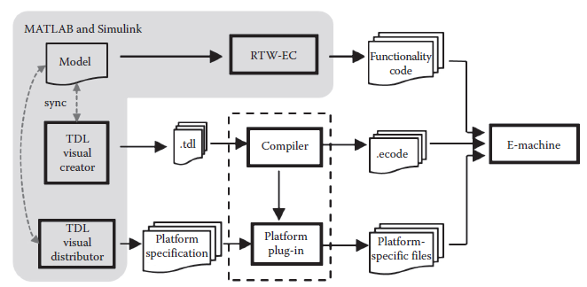
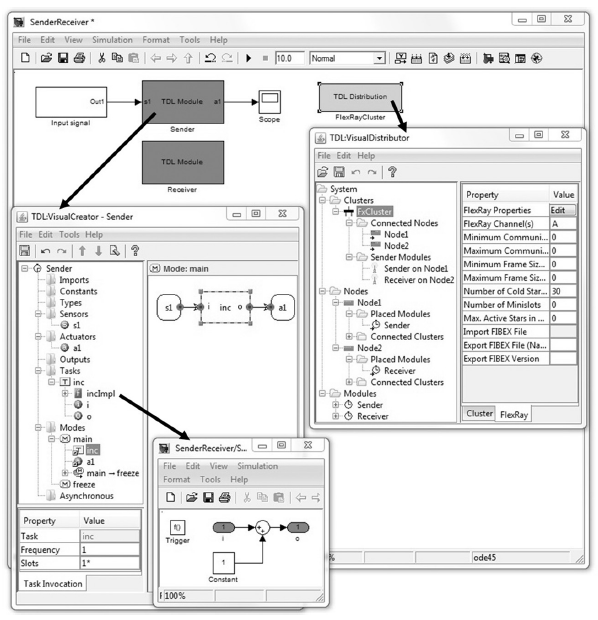
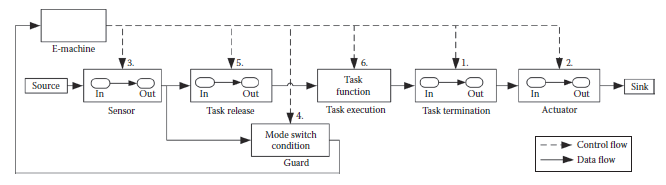

[6.2 <--- ](6_2.md) [   Зміст   ](README.md) [--> 6.4](6_4.md)

## 6.3. TDL INTEGRATION WITH MATLAB® AND SIMULINK®

Simulink builds on MATLAB (both products by MathWorks) [6] and has become the de facto standard for the modeling and simulation of real-time systems in various domains such as automotive, avionics, and aerospace. First attempts to integrate TDL with MATLAB and Simulink started as early as the initial development of TDL in 2003 [17]. In Simulink, systems are modeled in a visual and interactive environment using (mostly time-based) block diagrams. Code generators may then automatically translate the block diagrams into software, for example, into C code.

Simulink базується на MATLAB (обидва продукти від MathWorks) [6] і став стандартом де-факто для моделювання та імітації систем реального часу в різних областях, таких як автомобільна, авіоніка та авіакосмічна промисловість. Перші спроби інтегрувати TDL з MATLAB і Simulink почалися ще під час початкової розробки TDL у 2003 році [17]. У Simulink системи моделюються у візуальному та інтерактивному середовищі за допомогою блок-схем (переважно на основі часу). Генератори коду можуть потім автоматично перекладати блок-схеми в програмне забезпечення, наприклад, у код C.

According to the results described in Ref. [18], manually implementing LET semantics in Simulink is strongly discouraged. Even simple models of single-mode systems are cluttered with additional blocks to ensure that the timing behavior in the simulation conforms to LET semantics. It turned out that it is practically infeasible to model LET-based applications with multimodal behavior by hand, even when using the Simulink extension Stateflow® [6]. In the following, we describe an approach that is based on an explicit timing specification with TDL. For the simulation, the TDL specification is automatically translated into a Simulink model with an E-machine implementation at its core. In this sense, MATLAB and Simulink represents yet another execution platform for TDL modules.

Згідно з результатами, описаними в Ref. [18], вручну реалізувати семантику LET у Simulink настійно не рекомендується. Навіть прості моделі одномодових систем захаращені додатковими блоками, щоб гарантувати, що поведінка синхронізації в симуляції відповідає семантиці LET. Виявилося, що вручну моделювати додатки на основі LET з мультимодальною поведінкою практично неможливо, навіть якщо використовувати розширення Simulink Stateflow® [6]. Далі ми описуємо підхід, який базується на явній специфікації синхронізації з TDL. Для симуляції специфікація TDL автоматично перекладається на модель Simulink із реалізацією електронної машини в її основі. У цьому сенсі MATLAB і Simulink представляють ще одну платформу виконання для модулів TDL.

### 6.3.1 Application Developer’s Perspective

We will start with a developer’s perspective of the TDL integration with MATLAB and Simulink that covers the modeling, the simulation, and finally the platform mapping and the code generation.

Ми почнемо з погляду розробника на інтеграцію TDL з MATLAB і Simulink, яка охоплює моделювання, імітацію та, нарешті, відображення платформи та генерацію коду.

#### 6.3.1.1 Extension of the TDL Toolchain for MATLAB® and Simulink®

Figure 6.5 outlines the TDL toolchain when used together with MathWorks tools. Real-Time Workshop® Embedded Coder™ [20] (RTW-EC in Figure 6.5) can be used to generate the C source code for the TDL task implementations. The so-called TDL:VisualCreator tool allows the visual and interactive modeling of TDL applications. For mapping TDL modules to specific platforms, that is, for organizing the various build steps, we provide the so-called TDL:VisualDistributor tool. It allows a developer to 

На малюнку 6.5 представлено ланцюжок інструментів TDL при використанні разом з інструментами MathWorks. Real-Time Workshop® Embedded Coder™ [20] (RTW-EC на малюнку 6.5) можна використовувати для створення вихідного коду C для реалізації завдань TDL. Так званий інструмент TDL:VisualCreator дозволяє візуально та інтерактивно моделювати програми TDL. Для відображення модулів TDL на певних платформах, тобто для організації різних кроків збірки, ми надаємо так званий інструмент TDL:VisualDistributor. Це дозволяє розробнику

- Define a hardware topology. This can be a single node or a cluster consisting of potentially heterogeneous nodes that are connected, for example, through a time-triggered Ethernet.

- Assign the individual TDL modules to their target nodes.

- Визначити апаратну топологію. Це може бути окремий вузол або кластер, що складається з потенційно неоднорідних вузлів, які з’єднані, наприклад, через Ethernet, що запускається за часом.

- Призначте окремі модулі TDL до їхніх цільових вузлів.

**FIGURE 6.5** TDL toolchain in MATLAB® and Simulink®.

A built-in code and schedule generation framework generates platform-specific code, a communication schedule in the case of a distributed platform, makefiles, and any other output required for a particular platform [4].

Вбудована структура створення коду та розкладу генерує специфічний для платформи код, розклад зв’язку у випадку розподіленої платформи, make-файли та будь-який інший вихід, необхідний для конкретної платформи [4].

#### 6.3.1.2 Modeling

The modeling typically comprises two principal components: the controller and the plant. The plant is modeled as usual in MATLAB and Simulink. The controller is modeled with one or multiple *TDL module block(s)* (Figure 6.6) available in the TDL library.

Моделювання зазвичай складається з двох основних компонентів: контролера та установки. Завод моделюється як зазвичай в MATLAB і Simulink. Контролер моделюється за допомогою одного або кількох *модульних блоків TDL* (Малюнок 6.6), доступних у бібліотеці TDL.

**FIGURE 6.6** Modeling with the TDL toolchain in MATLAB® and Simulink®.

Each TDL module block represents one TDL module. Instead of using the textual representation of TDL, the module is edited using the TDL:VisualCreator tool that opens when double-clicking a TDL module block. The TDL module is two-way synchronized with Simulink. This means that a change in the TDL:VisualCreator, such as adding a sensor, is immediately reflected in the Simulink representation of the particular TDL module and vice versa. A sensor of the TDL module is represented as *Inport*, and an actuator is represented as *Outport* of the TDL module block. A task is represented as a (*Function-Call) Subsystem* that resides within the TDL module block. Within this subsystem, the functionality of the task may be modeled with appropriate library blocks (excluding those that comprise continuous-time behavior) with inherited sample time. [Figure 6.6 ](#_bookmark38)shows the previously described TDL example within a MATLAB and Simulink model and the two tools TDL:VisualCreator and TDL:VisualDistributor. The TDL:VisualCreator tool lists the individual elements such as the sensor *s1* and the task *inc* of module *Sender* in a tree representation. The activities of mode *main*, for example, are shown in the right-hand half of the frame. Their timing is specified through properties in the table below the tree representation. 

Кожен блок модуля TDL представляє один модуль TDL. Замість використання текстового представлення TDL модуль редагується за допомогою інструменту TDL:VisualCreator, який відкривається після подвійного клацання блоку модуля TDL. Модуль TDL двосторонньо синхронізований із Simulink. Це означає, що зміни в TDL:VisualCreator, такі як додавання датчика, негайно відображаються в представленні Simulink конкретного модуля TDL і навпаки. Датчик модуля TDL представлений як *Inport*, а виконавчий механізм представлений як *Outport* блоку TDL модуля. Завдання представлено як (*Виклик функції) підсистема*, яка знаходиться в блоці модуля TDL. У цій підсистемі функціональність завдання може бути змодельована за допомогою відповідних бібліотечних блоків (за винятком тих, які включають поведінку в безперервному часі) з успадкованим часом вибірки. [Малюнок 6.6] (#_bookmark38) показує описаний раніше приклад TDL у моделі MATLAB і Simulink і два інструменти TDL:VisualCreator і TDL:VisualDistributor. Інструмент TDL:VisualCreator перераховує окремі елементи, такі як датчик *s1* і завдання *inc* модуля *Sender* у представленні дерева. Діяльність режиму *main*, наприклад, показана в правій половині кадру. Їх час вказується за допомогою властивостей у таблиці під представленням дерева.

#### 6.3.1.3 Simulation

The overall system can be simulated once the application developer has finished the modeling phase, that is, timing behavior has been specified using the TDL:VisualCreator, whereas controller functionality and plant behavior have been modeled with Simulink blocks. From the developer’s point of view, there is no observable difference to starting a simulation if there were no TDL blocks present. This is achieved by an internal model translation (as sketched in the toolchain) to ensure that the simulation corresponds with the TDL specification. In fact, during the simulation, the compiled TDL program is executed within an E-machine encapsulated in a Simulink S-function. Details of how this is accomplished are described below.

Загальну систему можна змоделювати після того, як розробник додатку завершив етап моделювання, тобто поведінка синхронізації була визначена за допомогою TDL:VisualCreator, тоді як функціональні можливості контролера та поведінка установки були змодельовані за допомогою блоків Simulink. З точки зору розробника, немає помітної різниці в запуску симуляції, якщо відсутні блоки TDL. Це досягається шляхом внутрішньої трансляції моделі (як показано в інструментальному ланцюжку), щоб гарантувати, що симуляція відповідає специфікації TDL. Фактично, під час моделювання скомпільована програма TDL виконується в електронній машині, інкапсульованій у S-функцію Simulink. Подробиці того, як це досягається, описано нижче.

As the TDL code and the schedule generators ensure that the timing behavior of TDL modules is equivalent when executed on a single node and when distributed among multiple nodes, the simulation can assume execution is on a single node and it is not necessary to account for any communication behavior.

Оскільки код TDL і генератори розкладу гарантують, що тимчасова поведінка модулів TDL є еквівалентною при виконанні на одному вузлі та при розподілі між кількома вузлами, симуляція може припускати, що виконання відбувається на одному вузлі, і немає необхідності враховувати будь-які поведінка спілкування.

#### 6.3.1.4 Platform Mapping and Code Generation

To generate code for the application, the target platform must be specified. This is performed with the TDL:VisualDistributor tool that is integrated with Simulink as a *TDL Distribution block* (see the shaded box in the top-right corner of the Simulink model in Figure 6.6). The platform involves the specification of the (potentially heterogeneous) node platforms, their interconnections within the cluster, and the communication protocol. For this purpose, the developer may choose from a set of available node (such as a dSpace MicroAutoBox for prototyping) and cluster (such as FlexRay) plug-ins. After every TDL module of the Simulink model has been assigned to a node, the developer may start the generation of platform-specific code, a communication schedule in the case of distributed platforms, makefiles, and any other required output. If desired, the TDL:VisualDistributor tool can also trigger the RTW-EC to generate C code for all the tasks of the TDL modules.

Щоб створити код для програми, необхідно вказати цільову платформу. Це виконується за допомогою інструменту TDL:VisualDistributor, який інтегрований із Simulink як *розповсюджувальний блок TDL* (див. заштриховане поле у верхньому правому куті моделі Simulink на малюнку 6.6). Платформа передбачає специфікацію (потенційно неоднорідних) платформ вузлів, їх взаємозв’язки в кластері та протокол зв’язку. Для цього розробник може вибрати з набору доступних вузлів (наприклад, dSpace MicroAutoBox для створення прототипів) і кластерних (наприклад, FlexRay) плагінів. Після того, як кожен модуль TDL моделі Simulink буде призначено вузлу, розробник може розпочати генерацію специфічного для платформи коду, розкладу зв’язку у випадку розподілених платформ, make-файлів та будь-якого іншого необхідного результату. Якщо потрібно, інструмент TDL:VisualDistributor також може запустити RTW-EC для створення коду C для всіх завдань модулів TDL.

### 6.3.2 Implementation Perspective

On an embedded hardware platform, the E-machine represents the core piece for a LET-based execution. E-machine implementations exist for several different platforms [21]. For the TDL integration with MATLAB and Simulink, we implemented an E-machine that is based on a Simulink S-function [18]. An S-function is a Simulink block that references a user-defined functionality implemented in a programming language such as C and compiled by the *MATLAB EXecutable (MEX)* compiler. In this way, the built-in Simulink blockset can be extended. S-functions are composed of *callback methods* that the Simulink engine executes at particular points during the simulation.

На вбудованій апаратній платформі E-machine являє собою основну частину для виконання на основі LET. Реалізації електронних машин існують для кількох різних платформ [21]. Для інтеграції TDL з MATLAB і Simulink ми реалізували електронну машину, яка базується на S-функції Simulink [18]. S-функція — це блок Simulink, який посилається на визначену користувачем функціональність, реалізовану мовою програмування, наприклад C, і скомпільовану компілятором *MATLAB EXecutable (MEX)*. Таким чином можна розширити вбудований набір блоків Simulink. S-функції складаються з *методів зворотного виклику*, які механізм Simulink виконує в певних точках під час симуляції.

As the S-function implements the E-code interpreter, it must be invoked whenever the simulation time matches the logical time of a TDL activity, as defined in the E-code. According to the E-code instructions, the S-function triggers the execution of Simulink Function-Call Subsystems. Each task and each guard is represented as a Function-Call Subsystem that is provided by the developer. Additional Function- Call Subsystems are generated automatically as part of the model translation when the simulation is started. They implement the port assignment operations, for exam- ple, to update an actuator port with the value of a task output port.

Оскільки S-функція реалізує інтерпретатор E-code, її потрібно викликати щоразу, коли час моделювання збігається з логічним часом дії TDL, як визначено в E-code. Згідно з інструкціями електронного коду, S-функція запускає виконання підсистем виклику функцій Simulink. Кожне завдання та кожен захисник представлені як підсистема виклику функцій, яку надає розробник. Підсистеми виклику додаткових функцій генеруються автоматично як частина трансляції моделі під час запуску симуляції. Вони реалізують операції призначення портів, наприклад, щоб оновити порт приводу значенням вихідного порту завдання.

Figure 6.7 exemplifies this E-machine approach for a simplified application. The placement of the individual blocks conforms to the data flow, which is basically from left to right along the arrows from a source to a sink. The source value is read by a sensor, which provides the value to a guard and a task. The actuator block uses the output port of a task to write to a sink. The E-machine triggers the individual blocks according to the E-code resulting in the indicated order (1–6). The input port of such a generated subsystem is directly connected to the output port, which corresponds to an assignment in the imperative programming paradigm as soon as the system is triggered. This ensures the correct LET behavior of a task activation, for example, when triggering its release and termination at the correct time instants. Both fixed and variable sample time approaches for the E-machine are possible [22]. The suggested value for a fixed sample time is the GCD (greatest common divisor) of all activity periods.

На малюнку 6.7 показано приклад цього підходу електронної машини для спрощеного застосування. Розміщення окремих блоків відповідає потоку даних, який в основному йде зліва направо вздовж стрілок від джерела до приймача. Вихідне значення зчитується датчиком, який передає значення охоронцю та завданню. Блок приводу використовує вихідний порт завдання для запису в приймач. Електронна машина запускає окремі блоки відповідно до електронного коду, що призводить до вказаного порядку (1–6). Вхідний порт такої згенерованої підсистеми безпосередньо з’єднаний з вихідним портом, що відповідає призначенню в парадигмі імперативного програмування, як тільки система запускається. Це забезпечує правильну поведінку LET під час активації завдання, наприклад, під час запуску його випуску та завершення в правильні моменти часу. Для електронної машини можливі як фіксований, так і змінний час вибірки [22]. Пропонованим значенням для фіксованого часу вибірки є НОД (найбільший спільний дільник) усіх періодів діяльності.

 

**FIGURE 6.7** Basic principle of an E-machine as a Simulink® S-function and Function-Call Subsystems. 

#### 6.3.2.1 Resolving Data Dependencies

The S-function implementation of the E-machine for a simulation environment is analogous to E-machine implementations for hardware platforms. Compared to other simulation approaches, such a Simulink E-machine results in an efficient simulation model [18]. However, because of data dependency problems that can occur in simulation environments, the practical applicability of this basic mechanism turned out to be limited. We identified the following application scenarios that in general cannot be handled by this integration concept:

Реалізація S-функції E-machine для середовища моделювання аналогічна реалізації E-machine для апаратних платформ. Порівняно з іншими підходами моделювання, така Simulink E-machine призводить до ефективної моделі моделювання [18]. Однак через проблеми із залежністю даних, які можуть виникнути в середовищах моделювання, практична застосовність цього базового механізму виявилася обмеженою. Ми визначили такі прикладні сценарії, які загалом не можуть бути оброблені цією концепцією інтеграції:

- •   Cyclic import relationships between LET-based controllers (TDL modules)

- •   Control loops involving plants without delay

- •   Control loops with mixed LET-based and conventionally modeled controllers

These cases are discussed in detail in Ref. [22]. They are all related to cyclic data flow dependencies and the ability of the simulation environment to find a valid strategy for executing each individual block. Like many other simulation environments, Simulink does not support cycles without a delay except for special cases [23]. Delays are introduced by explicit delay blocks or by other blocks whose output is not directly controlled by the input (although possibly dependent on the block state). Those blocks are said to have indirect (or nondirect) feedthrough. When Function- Call Subsystems are involved, Simulink reports a *data dependency violation*, which is similar to an *algebraic loop error* [24], when attempting to simulate a model with a direct data dependency cycle. From the control engineer’s point of view, this appears to be counterintuitive, since the LET of a task is always greater than zero and thus should introduce the required delay. The problem is that the simulation environment is not aware of this LET characteristic.

Ці випадки детально обговорюються в роботі. [22]. Усі вони пов’язані із залежностями циклічного потоку даних і здатністю середовища моделювання знаходити дійсну стратегію для виконання кожного окремого блоку. Як і багато інших середовищ моделювання, Simulink не підтримує цикли без затримки, за винятком особливих випадків [23]. Затримки вводяться явними блоками затримки або іншими блоками, вихід яких безпосередньо не контролюється входом (хоча, можливо, залежить від стану блоку). Кажуть, що ці блоки мають непряме (або непряме) проходження. Коли задіяні підсистеми виклику функцій, Simulink повідомляє про *порушення залежності даних*, яке схоже на *помилку алгебраїчного циклу* [24], під час спроби симулювати модель із прямим циклом залежності даних. З точки зору інженера з управління, це виглядає нелогічно, оскільки LET завдання завжди більше нуля і, таким чином, має вводити необхідну затримку. Проблема полягає в тому, що середовище моделювання не знає про цю характеристику LET.

In Ref. [25], we propose an E-machine implementation that consists of two interacting S-functions. Without violating the TDL specification, that is, without changing the timing behavior of the simulation, this approach introduces additional delay blocks to resolve the cyclic dependencies. This *two-step E-machine architecture* is capable of simulating these three scenarios with cyclic data flow dependencies and also supports TDL applications with mixed timeand event-triggered (asynchronous) activities [22]. In the case of simulating event-triggered activities, the simulation of events and the corresponding reaction cannot be guaranteed to match the behavior on a specific target platform. This is because asynchronously activated tasks do not have a LET and also because the simulation is not aware of any scheduling strategy, distribution topology, or CPU speed of the target platform.

У посил. [25] ми пропонуємо реалізацію електронної машини, яка складається з двох взаємодіючих S-функцій. Не порушуючи специфікацію TDL, тобто не змінюючи поведінку синхронізації моделювання, цей підхід вводить додаткові блоки затримки для вирішення циклічних залежностей. Ця *двоетапна архітектура електронної машини* здатна симулювати ці три сценарії з циклічними залежностями потоку даних, а також підтримує додатки TDL зі змішаними (асинхронними) діями, викликаними часом і подіями [22]. У разі моделювання дій, викликаних подіями, моделювання подій і відповідна реакція не можуть бути гарантовано відповідними поведінці на певній цільовій платформі. Це пояснюється тим, що асинхронно активовані завдання не мають LET, а також тому, що симуляція не знає жодної стратегії планування, топології розподілу чи швидкості процесора цільової платформи.

[6.2 <--- ](6_2.md) [   Зміст   ](README.md) [--> 6.4](6_4.md)