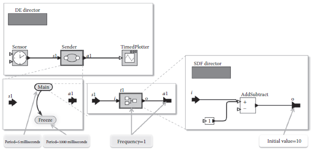

[6.3 <--- ](6_3.md) [   Зміст   ](README.md) [--> 6.5](6_5.md)

## 6.4. TDL INTEGRATION WITH PTOLEMY II

Ptolemy II is the software infrastructure of the Ptolemy project [7], which studies modeling, simulation, and design of concurrent, real-time, and embedded systems. It is an open source tool written in Java that allows modeling and simulation of systems adhering to various models of computation (MoC). Conceptually, a MoC represents a set of rules, which govern the execution and interaction of model components.

Ptolemy II — це інфраструктура програмного забезпечення проекту Ptolemy [7], який вивчає моделювання, імітацію та проектування паралельних систем, систем реального часу та вбудованих систем. Це інструмент із відкритим вихідним кодом, написаний на Java, який дозволяє моделювати та імітувати системи, що дотримуються різних моделей обчислень (MoC). Концептуально MoC являє собою набір правил, які керують виконанням і взаємодією компонентів моделі.

The implementation of a MoC is called a *domain* in Ptolemy. Some examples of existing domains are Discrete Event (DE), Continuous Time (CT), Finite State Machines (FSM), and Synchronous Data Flow (SDF).

Реалізація MoC називається *доменом* у Птолемея. Деякі приклади існуючих доменів: дискретна подія (DE), безперервний час (CT), кінцеві автомати (FSM) і синхронний потік даних (SDF).

Ptolemy is extensible in that it allows the implementation of new MoCs. Most MoCs in Ptolemy support actor-oriented modeling and design, where models are built from actors that can be executed and that can communicate with other actors through ports. The nature of communication between actors is defined by the enclosing domain, which is itself represented by a special actor, called the domain director. Simulating a model means executing actors as defined by the top-level model director.

Ptolemy є розширюваним, оскільки він дозволяє впроваджувати нові MoCs. Більшість MoCs у Ptolemy підтримують орієнтоване на акторів моделювання та проектування, де моделі будуються з акторів, які можна виконувати та які можуть спілкуватися з іншими акторами через порти. Характер спілкування між акторами визначається охоплюючим доменом, який сам представлений спеціальним актором, який називається директором домену. Симуляція моделі означає виконання акторів згідно з визначенням керівника моделі верхнього рівня.

### 6.4.1 TDL Domain

TDL is implemented as an experimental domain in Ptolemy. The TDL domain consists of three specialized actors: *TDLModule*, *TDLMode*, and *TDLTask*. The TDLModule actor (with the associated *TDLModuleDirector*) restricts the basic modal model behavior according to the TDL semantics. In modal models, mode switches are made whenever a mode switch guard evaluates to true, whereas in TDL modules, mode switches are only allowed at predefined points in time. Similar restrictions apply to port updates. To ensure the LET of a task activation, input ports are only allowed to be read once, at the beginning of the LET, and output ports are only allowed to be written at the end of the LET and not when a task finished its computation. TDL requires a deterministic choice of one of all simultaneously enabled transitions, which is not provided by the FSM domain. We resolve this by employing a convention similar to the one supported by Stateflow [19], where the outgoing transitions of the active mode are tested based on the graphical layout, in clockwise order starting from the upper left corner of the graphical representation of the mode. TDL timing information such as the mode period is associated with TDL actors in the model.

TDL реалізовано як експериментальний домен у Ptolemy. Домен TDL складається з трьох спеціалізованих акторів: *TDLModule*, *TDLMode* і *TDLTask*. Актор TDLModule (із пов’язаним *TDLModuleDirector*) обмежує поведінку основної модальної моделі відповідно до семантики TDL. У модальних моделях перемикання режимів здійснюється щоразу, коли захист перемикання режиму оцінює значення true, тоді як у модулях TDL перемикання режимів дозволено лише в попередньо визначені моменти часу. Подібні обмеження застосовуються до оновлень портів. Щоб забезпечити LET активації завдання, вхідні порти можна читати лише один раз, на початку LET, а вихідні порти можна записувати лише в кінці LET, а не після завершення обчислення завдання. TDL вимагає детермінованого вибору одного з усіх одночасно активованих переходів, що не забезпечується доменом FSM. Ми вирішуємо це, використовуючи угоду, подібну до тієї, що підтримується Stateflow [19], де вихідні переходи активного режиму перевіряються на основі графічного макета, у порядку годинникової стрілки, починаючи з верхнього лівого кута графічного представлення режиму. . Інформація про час TDL, така як період режиму, пов’язана з акторами TDL у моделі.

TDL activities are conceptually regarded as DEs that are processed in increasing time stamp order. Thus, a TDL module can be seen as a restricted DE actor. This enables the usage of TDL modules inside every domain that is amenable to DE actors. A TDL task is implemented as an SDF actor, which executes in logically zero time. The top-level director is a DE director. The DE director uses a global event queue to schedule the execution of actors in the model. The TDL module places events in this queue for every time stamp where at least one TDL action is scheduled.

Дії TDL концептуально розглядаються як DE, які обробляються в порядку збільшення часових позначок. Таким чином, модуль TDL можна розглядати як обмежений актор DE. Це дозволяє використовувати модулі TDL у кожному домені, доступному для акторів DE. Завдання TDL реалізовано як актор SDF, який виконується за логічно нульовий час. Директор вищого рівня - це директор DE. Директор DE використовує глобальну чергу подій для планування виконання акторів у моделі. Модуль TDL розміщує події в цій черзі для кожної позначки часу, де запланована принаймні одна дія TDL.

The module *Sender* from the example above modeled in Ptolemy is shown in [Figure 6.8](#_bookmark39). The model shown in the top-left box of the figure contains a TDL Module and two actors to provide sensor values and display actuator values. The TDL Module contains two modes *Main* and *Freeze* (see Figure 6.8, the bottom-left box). Both modes have their period indicated by an associated parameter. The *Main* mode contains the task and the association of sensor and actuator values to input and output ports of the task. The frequency of the task invocation, which determines the LET, is defined as a parameter.

Модуль *Sender* із наведеного вище прикладу, змодельований у Ptolemy, показаний на [Рис. 6.8] (#_bookmark39). Модель, показана у верхньому лівому кутку малюнка, містить модуль TDL і двох акторів для надання значень датчиків і відображення значень приводу. Модуль TDL містить два режими *Main* і *Freeze* (див. Малюнок 6.8, нижнє ліве поле). Обидва режими мають свій період, який вказується відповідним параметром. Режим *Main* містить завдання та зв’язок значень датчиків і приводів із вхідними та вихідними портами завдання. Частота виклику завдання, яка визначає LET, визначається як параметр.

**FIGURE 6.8** TDL module *Sender* in Ptolemy II.

Because of the iterative execution strategy of Ptolemy, problems with irresolvable cyclic dependencies as described for the Simulink integration do not arise. As the LET is always greater than zero, there is an actor without a direct dependency between inputs and outputs. Consequently, the DE director is able to resolve the loop and to process the TDL actions represented as events in the correct order and potentially interleaved with the plant.

Через ітераційну стратегію виконання Птолемея проблеми з нерозв’язними циклічними залежностями, як описано для інтеграції Simulink, не виникають. Оскільки LET завжди більше нуля, існує актор без прямої залежності між входами та виходами. Отже, директор DE може розв’язати цикл і обробити дії TDL, представлені як події в правильному порядку та потенційно перемежовані з установкою.

[6.3 <--- ](6_3.md) [   Зміст   ](README.md) [--> 6.5](6_5.md)

