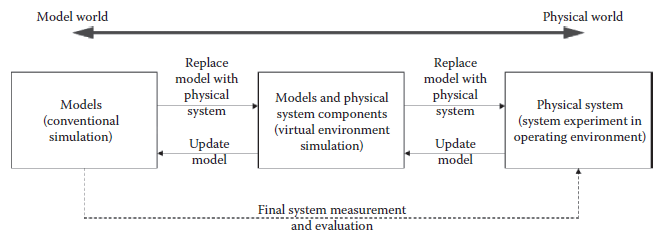
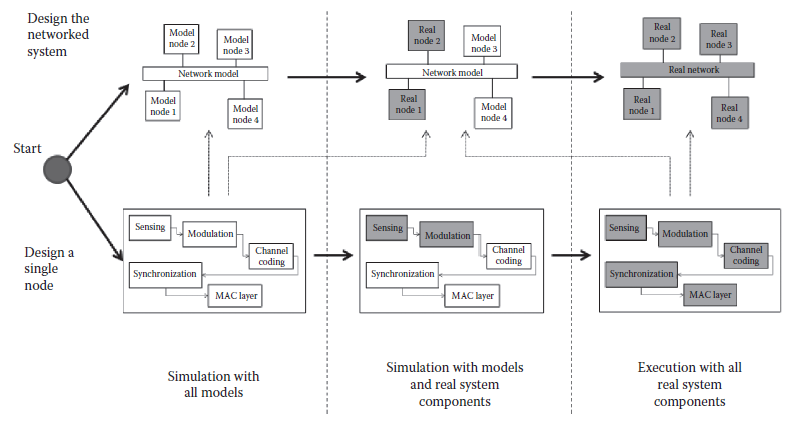

[7.1 <--- ](7_1.md) [   Зміст   ](README.md) [--> 7.3](7_3.md)

## 7.2. PSBD FOR NETWORKED REAL-TIME EMBEDDED SYSTEMS

This section provides an overview of the PSBD methodology [3] and develops a bifurcated design process for networked real-time embedded systems. 

У цьому розділі наведено огляд методології PSBD [3] і розроблено роздвоєний процес проектування мережевих вбудованих систем реального часу.

### 7.2.1 PSBD Overview

PSBD views simulation as the driving force for designing and testing engineering systems. It provides a design process that explicitly focuses on systematic transitions from simulation models to system realization. As shown in [Figure 7.1](#_bookmark40), the design process consists of three stages, each of which is characterized by the types of entities (virtual or physical) that are involved. The first stage is *conventional simulation* (in fast simulation mode), where simulation is carried out using all models. A major task of this stage is to develop the system model based on available knowledge and assumptions about the hardware and operating environment of the physical system. Often discrepancies between simulation models and physical system components exist. These discrepancies cause the models to comprise behavior different from the system behavior. To reveal such design discrepancies, the next stage of the design process is *virtual environment simulation* (in real-time simulation mode), where simulation-based study is carried out in a virtual testing environment using combined models and physical system components. This stage brings simulation-based study one step closer to a realization by including physical system components into the simulation. The goal is to use physical system components to reveal overlooked design details, and thus help designers improve the control models/algorithms under development. The final stage is *physical system experiment*, where the physical system is tested in the target operating environment.

PSBD розглядає моделювання як рушійну силу для проектування та тестування інженерних систем. Він забезпечує процес проектування, який явно фокусується на систематичних переходах від імітаційних моделей до реалізації системи. Як показано на [Рис. 7.1] (#_bookmark40), процес проектування складається з трьох етапів, кожен з яких характеризується типами об’єктів (віртуальних або фізичних), які беруть участь. Перший етап — *звичайне моделювання* (у режимі швидкого моделювання), де моделювання виконується з використанням усіх моделей. Основним завданням цього етапу є розробка моделі системи на основі наявних знань і припущень про апаратне забезпечення та операційне середовище фізичної системи. Часто існують розбіжності між імітаційними моделями та фізичними компонентами системи. Ці розбіжності призводять до того, що поведінка моделей відрізняється від поведінки системи. Щоб виявити такі розбіжності в проекті, наступним етапом процесу проектування є *моделювання віртуального середовища* (у режимі моделювання в реальному часі), де дослідження на основі моделювання здійснюється у віртуальному середовищі тестування з використанням комбінованих моделей і фізичних компонентів системи. Цей етап наближає дослідження, засноване на моделюванні, на один крок до реалізації, включаючи компоненти фізичної системи в моделювання. Мета полягає в тому, щоб використовувати фізичні компоненти системи для виявлення упущених деталей дизайну, і таким чином допомогти дизайнерам покращити моделі/алгоритми керування, що розробляються. Останнім етапом є *експеримент фізичної системи*, де фізична система перевіряється в цільовому робочому середовищі.

**FIGURE 7.1** Progressive simulation-based design methodology.

Along this design process, the PSBD methodology emphasizes two parallel activities in a progressive manner: *replace models with physical system components* and *update models*. As the design moves forward, physical system components are incrementally brought into the simulation to replace models. Simulations with these physical system components allow designers to validate their design assumptions and to reveal new design details. Such information is fed back to the previous stages to update the models if necessary. The updated model will then be used for follow-on design and test. This activity of model update allows designers to maintain a coherent model of the system under development. Thus, at the end of the design, not only the system is realized and tested, but also a system model that faithfully represents the system is developed. This system model can support final system measurement and evaluation (shown by the dashed line in Figure 7.1) and serve other purposes such as system maintenance and future development. It is important to note that each design stage is a dynamically evolving process by itself. For example, during the conventional simulation stage, it is common for designers to start from high level models and then refine them to more detailed models. Similarly, the virtual environment simulation stage that involves combined models and physical system components typically includes multiple phases too, for example, to start with replacing one physical system component first and then gradually add more.

У цьому процесі проектування методологія PSBD наголошує на двох паралельних діях у прогресивний спосіб: *замінити моделі фізичними компонентами системи* та *оновити моделі*. У міру просування дизайну фізичні компоненти системи поступово вводяться в симуляцію, щоб замінити моделі. Моделювання за допомогою цих фізичних системних компонентів дозволяє розробникам перевірити свої припущення щодо дизайну та виявити нові деталі дизайну. Така інформація повертається на попередні етапи для оновлення моделей у разі необхідності. Оновлену модель потім використовуватимуть для подальшого проектування та тестування. Ця діяльність з оновлення моделі дозволяє розробникам підтримувати узгоджену модель системи, що розробляється. Таким чином, наприкінці проектування не тільки реалізується та тестується система, але також розробляється модель системи, яка вірно представляє систему. Ця модель системи може підтримувати остаточне вимірювання та оцінку системи (показано пунктирною лінією на малюнку 7.1) і служити для інших цілей, таких як обслуговування та майбутній розвиток системи. Важливо відзначити, що кожен етап проектування є процесом, що динамічно розвивається. Наприклад, на стадії звичайного моделювання розробники зазвичай починають з моделей високого рівня, а потім вдосконалюють їх до більш детальних моделей. Подібним чином етап моделювання віртуального середовища, який включає комбіновані моделі та компоненти фізичної системи, зазвичай також включає кілька етапів, наприклад, щоб почати із заміни одного компонента фізичної системи, а потім поступово додавати нові.

Two important features of the PSBD methodology are *model continuity* and *virtual environment simulation* that supports simulation-based test with combined virtual and physical system components. Model continuity refers to the ability to transition as much as possible of a model specification through the stages of a development process [17]. For real-time embedded systems, we restrict model continuity to the models (software components) that implement the real-time control of the system. This means the control models of a real-time embedded system are designed, analyzed, and tested by simulation methods and then smoothly transitioned from simulation to hardware execution in the physical environment (see Hu et al. [4] and Azarnasab [6] for more details). To support model continuity, it is necessary to develop system models and run simulation-based tests in a systematic way. A modular design and well-defined interfaces are necessary to ensure the control models work with physical and simulated hardware in the same way at different stages of the design process [4,6]. The virtual environment simulation provides a virtual testing environment by using combined physical and virtual system components. It bridges the gap between conventional simulations that use all models and physical system experiments that use all physical system components. To support the virtual environment, simulation techniques must be developed that synchronize the physical and virtual system components. This includes allowing the physical and virtual components to “sense” each others’ existence (see Hu and Zeigler [18] for an example of how physical and virtual robots are synchronized with each other). Meanwhile, time synchronization is also important. Since hardware components are included in the simulation-based study, real-time simulations are necessary to support the virtual testing environment.

Двома важливими особливостями методології PSBD є *безперервність моделі* та *імітація віртуального середовища*, яка підтримує тестування на основі моделювання з комбінованими віртуальними та фізичними компонентами системи. Безперервність моделі відноситься до здатності переходити якомога більше специфікації моделі через етапи процесу розробки [17]. Для вбудованих систем реального часу ми обмежуємо безперервність моделі моделями (компонентами програмного забезпечення), які реалізують керування системою в реальному часі. Це означає, що моделі керування вбудованою системою реального часу проектуються, аналізуються та тестуються методами моделювання, а потім плавно переходять від моделювання до апаратного виконання у фізичному середовищі (див. Hu та ін. [4] і Azarnasab [6] щодо Детальніше). Щоб підтримувати безперервність моделі, необхідно систематично розробляти системні моделі та запускати тести на основі моделювання. Модульна конструкція та чітко визначені інтерфейси необхідні для забезпечення однакової роботи моделей керування з фізичним та змодельованим обладнанням на різних етапах процесу проектування [4,6]. Симуляція віртуального середовища забезпечує віртуальне середовище тестування за допомогою комбінованих фізичних і віртуальних компонентів системи. Він усуває розрив між звичайним моделюванням, яке використовує всі моделі, та експериментами фізичної системи, які використовують усі компоненти фізичної системи. Для підтримки віртуального середовища необхідно розробити методи моделювання, які синхронізують фізичні та віртуальні компоненти системи. Це включає в себе дозвіл фізичним і віртуальним компонентам «відчути» існування один одного (дивіться Ху і Зейглер [18] для прикладу того, як фізичні та віртуальні роботи синхронізуються один з одним). При цьому важлива також синхронізація часу. Оскільки апаратні компоненти включені в дослідження на основі моделювання, моделювання в реальному часі необхідно для підтримки віртуального середовища тестування. 

### 7.2.2 Bifurcated Design Process for Networked Real-Time Embedded Systems

Networked real-time embedded systems are characterized by a network of embedded devices interacting with each other and the tight couplings between software and hardware of those devices. Each of these devices is referred to as a *node* in this chapter. When commercial-off-the-shelf (COTS) nodes are not used, design of networked real-time embedded systems must design both the individual nodes and the networked system as a whole. Within this context, the PSBD methodology described above is elaborated to include a bifurcated design process as shown in [Figure 7.2](#_bookmark41). The bifurcated design process explicitly differentiates the design of a single node (the bottom route in Figure 7.2) and the design of the networked system (the top route in Figure 7.2). The former mainly concerns designing the different functional modules, such as sensing, modulation/demodulation, and channel coding, of the embedded device. The latter focuses on how the multiple nodes work together as a whole, including designing and improving the communication protocols and the cooperative strategies among the nodes. Despite the different design focuses, both designs follow the PSBD process that starts from models and gradually adds more physical system components.

Мережеві вбудовані системи реального часу характеризуються мережею вбудованих пристроїв, які взаємодіють один з одним, і тісним зв’язком між програмним і апаратним забезпеченням цих пристроїв. Кожен із цих пристроїв у цій главі називається *вузлом*. Якщо комерційні готові вузли (COTS) не використовуються, розробка мережевих вбудованих систем реального часу повинна проектувати як окремі вузли, так і мережеву систему в цілому. У цьому контексті методологія PSBD, описана вище, розроблена для включення роздвоєного процесу проектування, як показано на [Рис. 7.2] (#_bookmark41). Процес роздвоєного проектування чітко розрізняє дизайн одного вузла (нижній маршрут на малюнку 7.2) і дизайн мережевої системи (верхній маршрут на малюнку 7.2). Перше в основному стосується проектування різних функціональних модулів, таких як зондування, модуляція/демодуляція та кодування каналів, вбудованого пристрою. Останній зосереджується на тому, як численні вузли працюють разом як одне ціле, включаючи розробку та вдосконалення протоколів зв’язку та стратегій співпраці між вузлами. Незважаючи на різний фокус дизайну, обидва дизайни дотримуються процесу PSBD, який починається з моделей і поступово додає більше фізичних компонентів системи.

In Figure 7.2, the models are shown as white boxes; the physical system components are shown as grey boxes. The design starts and bifurcates into two routes: the design of a single node and the design of the networked system. For designing a single node, the first step is to model the functional modules of the embedded device and simulate how they work together to fulfill the functionality of the device. Then hardware components are brought into the design and HIL simulations are conducted to test how well the designed modules and algorithmic code work with the hardware. This proceeds in a stepwise fashion as more and more hardware components are included. Consider the CR (described later) as an example, first the channel sensing mechanism is implemented on the FPGA and DSP hardware, then the data transmission and data reception components are included, and finally the reporting mechanism is implemented. We use a signal generator and signal analyzer to help to test the developed components before a working node is complete. Eventually, all the code modules are implemented in the hardware and the embedded node is tested with all hardware components.

На рисунку 7.2 моделі показані у вигляді білих прямокутників; фізичні компоненти системи показані сірими прямокутниками. Розробка починається і розгалужується на два маршрути: проектування окремого вузла та проектування мережевої системи. Для розробки окремого вузла першим кроком є моделювання функціональних модулів вбудованого пристрою та імітація того, як вони працюють разом, щоб виконати функціональні можливості пристрою. Потім апаратні компоненти вводяться в проект і проводиться моделювання HIL, щоб перевірити, наскільки добре розроблені модулі та алгоритмічний код працюють із апаратним забезпеченням. Це відбувається поетапно, оскільки включається все більше і більше апаратних компонентів. Розглянемо CR (описано пізніше) як приклад, спочатку механізм визначення каналу реалізується на апаратних засобах FPGA та DSP, потім включені компоненти передачі та прийому даних, і, нарешті, реалізується механізм звітування. Ми використовуємо генератор сигналів і аналізатор сигналів, щоб допомогти перевірити розроблені компоненти до завершення робочого вузла. Зрештою всі модулі коду реалізуються в апаратному забезпеченні, а вбудований вузол тестується з усіма апаратними компонентами.

**FIGURE 7.2** A bifurcated design process for networked real-time embedded system.

When designing the networked system, the first step is to develop individual node models and a model of the communicating network. The individual node model can reuse the model from designing the single node (as indicated by the dotted arrow in Figure 7.2). Alternatively, a different node model at a higher abstraction level (e.g., without including all the details of the devices’ functional modules) can be used. Simulations with these models allow designers to test the networked system in the model world. The next step is to gradually include physical device nodes into the simulation-based study to conduct virtual environment simulations. The physical device nodes are either the ones from the single node design or COTS nodes. This continues until the entire system is realized and all designed nodes are tested in a physical network. It is important to note that the bifurcated design process provides a systematic view for designing general networked embedded systems. For a specific application, the design process can be tailored (e.g., some design stages are elaborated while others are omitted) to fit the specific design needs of the application. In Section 7.4, we provide an example of designing a CR system by starting from the design of a single radio modem and then proceeding to the design of a CR network. The single radio modem is also designed in progressive manner, where different functional modules are gradually implemented/tested in the hardware while other modules are provided by simulation models.

При проектуванні мережевої системи першим кроком є розробка індивідуальних моделей вузлів і моделі комунікаційної мережі. Модель окремого вузла може повторно використовувати модель із проектування окремого вузла (як показано пунктирною стрілкою на малюнку 7.2). В якості альтернативи можна використовувати іншу модель вузла на вищому рівні абстракції (наприклад, без включення всіх деталей функціональних модулів пристроїв). Симуляції за допомогою цих моделей дозволяють розробникам перевірити мережеву систему у світі моделей. Наступним кроком є поступове включення вузлів фізичних пристроїв у дослідження на основі моделювання для проведення моделювання віртуального середовища. Вузли фізичних пристроїв – це вузли з єдиного вузла або вузли COTS. Це триває доти, доки не буде реалізовано всю систему і всі розроблені вузли не будуть протестовані у фізичній мережі. Важливо відзначити, що роздвоєний процес проектування забезпечує систематичний погляд на проектування загальних мережевих вбудованих систем. Для конкретного застосування процес проектування може бути налаштований (наприклад, деякі етапи проектування розроблені, а інші опущені), щоб відповідати конкретним потребам у проектуванні програми. У розділі 7.4 ми надаємо приклад проектування системи CR, починаючи з проектування одного радіомодему, а потім переходячи до проектування мережі CR. Одиночний радіомодем також розроблений у прогресивний спосіб, де різні функціональні модулі поступово впроваджуються/тестуються в апаратному забезпеченні, тоді як інші модулі забезпечуються імітаційними моделями.

PSBD brings several advantages when designing complex networked engineering systems. Some of them are shared by the traditional HIL simulation. For example, it brings simulation-based study one step closer to the reality to provide useful information for designers. It also increases confidence by the designer about how the final system will operate. However, PSBD goes beyond that by emphasizing a systematic design process that gradually adds more physical system components to replace simulation models. The virtual environment simulation provides the flexibility for experimenting with a design in a virtual testing environment. It allows designers to use several, instead of all, physical nodes to carry out a system-wide test of a networked system. This is especially useful for large-scale networked realtime embedded systems whose complexity and scale severely limit experimentations in a physical environment using all physical nodes. As the scale of these systems increases, so does their design and test complexity. It is the intent of PSBD to systematically handle such design complexity in a progressive manner.

PSBD має кілька переваг при проектуванні складних мережевих інженерних систем. Деякі з них поділяють традиційне моделювання HIL. Наприклад, це наближає дослідження на основі симуляції до реальності, щоб надати корисну інформацію для дизайнерів. Це також підвищує впевненість дизайнера в тому, як працюватиме кінцева система. Однак PSBD виходить за рамки цього, наголошуючи на системному процесі проектування, який поступово додає більше фізичних компонентів системи для заміни імітаційних моделей. Симуляція віртуального середовища забезпечує гнучкість для експериментів із дизайном у віртуальному середовищі тестування. Це дозволяє розробникам використовувати кілька, а не всі фізичні вузли, щоб провести загальносистемне тестування мережевої системи. Це особливо корисно для великомасштабних мережевих вбудованих систем реального часу, чия складність і масштаб сильно обмежують експерименти у фізичному середовищі з використанням усіх фізичних вузлів. Зі збільшенням масштабу цих систем зростає складність їх проектування та тестування. Намір PSBD полягає в тому, щоб систематично вирішувати таку складність конструкції прогресивним чином.

[7.1 <--- ](7_1.md) [   Зміст   ](README.md) [--> 7.3](7_3.md)