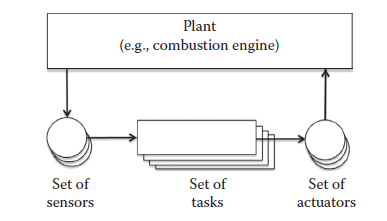

[8 <--- ](8.md) [   Зміст   ](README.md) [--> 8.2](8_2.md)

## 8.1. SOLID SYSTEM VERIFICATION AND VALIDATION NEEDS IMPROVED SIMULATION SUPPORT

An embedded system operates in a physical environment with which it interacts through sensors and actuators. An important class of real-time embedded systems is represented by control systems. In this case, the embedded software consists of a set of (controller) tasks and the physical system under control is referred to as the plant. [Figure 8.1 ](#_bookmark46)sketches the typical architecture of an embedded control system.

Вбудована система працює у фізичному середовищі, з яким вона взаємодіє через датчики та виконавчі механізми. Важливим класом вбудованих систем реального часу є системи керування. У цьому випадку вбудоване програмне забезпечення складається з набору завдань (контролера), а фізична система під керуванням називається заводом. [Малюнок 8.1 ](#_bookmark46) демонструє типову архітектуру вбудованої системи керування.

Simulation is an approach for testing embedded systems before they are deployed in real-world operation. In simulation, the plant is represented by a software model executed on a host computer, typically a personal computer. In a hardware-in-the- loop (HIL) simulation, the entire embedded system (embedded software consisting of the controller tasks executing on the target platform) is operated in closed loop with the plant model, which is executed in real time on a dedicated computer [1]. Since the embedded software is executed in real time on the target platform, HIL simulations can be used to verify the real-time properties of the embedded system. Thus, any difference between the behavior of the embedded system in a HIL simulation and the corresponding behavior in the real world is due to the abstractions made in plant modeling.

Моделювання — це підхід до тестування вбудованих систем перед їх розгортанням у реальних умовах. При моделюванні завод представлений програмною моделлю, що виконується на головному комп’ютері, як правило, персональному комп’ютері. У апаратно-контурному моделюванні (HIL) вся вбудована система (вбудоване програмне забезпечення, що складається із завдань контролера, що виконуються на цільовій платформі) працює в замкнутому циклі з моделлю заводу, яка виконується в режимі реального часу на виділений комп’ютер [1]. Оскільки вбудоване програмне забезпечення виконується в реальному часі на цільовій платформі, моделювання HIL можна використовувати для перевірки властивостей вбудованої системи в реальному часі. Таким чином, будь-яка різниця між поведінкою вбудованої системи в моделюванні HIL і відповідною поведінкою в реальному світі зумовлена абстракціями, зробленими в моделюванні заводу.

In a software-in-the-loop (SIL) simulation, the embedded software consisting of the controller tasks is executed on a host computer other than the target platform, in closed loop with the plant model. Both simulations (of the controller and the plant model) are typically executed on the same host computer. The SIL model of an embedded system contains the embedded software and an abstraction of the target platform. This abstraction determines how close the software execution in the SIL simulation is to the HIL simulation, provided that the same plant model is used. It ranges from a minimal representation of the target platform that enables only testing of functional (transformational or processing) properties of the software, to full-fledged hardware simulators (called instruction set simulators, ISS), which lead to system behavior close to a HIL simulation, while offering better observability of software executions. Pure functional simulations are fast, but do not allow the testing of timing properties of the embedded system. ISS can be used for timing analysis [2], but they are extremely slow and expensive. [Figure 8.2](#_bookmark46)* (\* Parts of the picture are taken from [http://www.mathworks.com/products/xpctarget/ ](http://www.mathworks.com/products/xpctarget/)and are courtesy of MathWorks.) summarizes the characteristics of conventional SIL, ISS-based SIL, and HIL simulations.

У симуляції програмного забезпечення в циклі (SIL) вбудоване програмне забезпечення, що складається із завдань контролера, виконується на хост-комп’ютері, відмінному від цільової платформи, у замкнутому циклі з моделлю підприємства. Обидва моделювання (контролера та моделі заводу) зазвичай виконуються на одному головному комп’ютері. Модель SIL вбудованої системи містить вбудоване програмне забезпечення та абстракцію цільової платформи. Ця абстракція визначає, наскільки виконання програмного забезпечення в моделюванні SIL є близьким до моделювання HIL, за умови, що використовується та сама модель підприємства. Він варіюється від мінімального представлення цільової платформи, що дозволяє лише тестувати функціональні (трансформаційні або обробні) властивості програмного забезпечення, до повноцінних симуляторів апаратного забезпечення (так звані симулятори набору команд, ISS), які призводять до поведінки системи, близької до HIL моделювання, водночас пропонуючи кращу спостережуваність виконання програмного забезпечення. Чисте функціональне моделювання є швидким, але не дозволяє тестувати властивості синхронізації вбудованої системи. ISS можна використовувати для аналізу часу [2], але вони надзвичайно повільні та дорогі. [Малюнок 8.2](#_bookmark46)* (\* Частини зображення взято з [http://www.mathworks.com/products/xpctarget/ ](http://www.mathworks.com/products/xpctarget/ )та люб’язно надані MathWorks.) узагальнюють характеристики традиційного моделювання SIL, SIL на основі ISS та HIL.

[Figure 8.3](#_bookmark47) summarizes the features and the advantages and disadvantages of state-of-the-art SIL and HIL simulations in comparison with a Validator simulation. Note that the Validator replaces the ISS-based simulation.

[Малюнок 8.3] (#_bookmark47) підсумовує функції, переваги та недоліки найсучаснішого моделювання SIL і HIL у порівнянні з моделюванням Validator. Зверніть увагу, що Validator замінює симуляцію на основі ISS.

[Figure 8.4 ](#_bookmark47)refines the comparison between the Validator and SIL/HIL approaches. The Validator unifies characteristics of both a SIL and a HIL simulation. The Validator has the flavor of a SIL simulation as it does not require a target platform for executing the embedded software. On the other hand, the Validator separates the simulation of plant and controller tasks as in a HIL simulation.

[Малюнок 8.4] (#_bookmark47) уточнює порівняння підходів Validator і SIL/HIL. Валідатор об’єднує характеристики симуляції як SIL, так і HIL. Валідатор має смак симуляції SIL, оскільки не потребує цільової платформи для виконання вбудованого програмного забезпечення. З іншого боку, валідатор розділяє симуляцію задач заводу та контролера, як у симуляції HIL.

**FIGURE 8.1** Typical architecture of an embedded system.

 

**FIGURE 8.2** Conventional software-in-the-loop, instruction set simulators-based software- in-the-loop, and hardware-in-the-loop simulations.

### 8.1.1 Real-Time Behavior in the Validator

An important aspect is the simulation of real-time behavior. A simple example that illustrates in which respect the Validator is better than typical SIL simulation tools is shown in [Figure 8.5](#_bookmark48). Consider three concurrent tasks, called DynamicsController (DC), MotorController (MC), and ParkingController (PC), that communicate through a shared (global) variable called *angle*. The code of the tasks is sketched in Figure 8.5a. The tasks DC and MC are periodic with periods equal to 5 and 1 ms, respectively. The task PC is event-triggered. Assume that they are deployed on a real-time operating system with fixed priority preemptive scheduling, where the priorities of the periodic tasks are assigned by a rate monotonic policy. Thus, the MC task has a higher priority than the DC task. Moreover, consider that the PC task has highest priority.

Важливим аспектом є моделювання поведінки в реальному часі. Простий приклад, який ілюструє, у чому валідатор кращий за типові інструменти моделювання SIL, наведено на [Рис. 8.5] (#_bookmark48). Розглянемо три одночасні завдання, які називаються DynamicsController (DC), MotorController (MC) і ParkingController (PC), які взаємодіють через спільну (глобальну) змінну під назвою *angle*. Код завдань зображено на малюнку 8.5a. Задачі DC і MC є періодичними з періодами відповідно 5 і 1 мс. Завдання ПК ініціюється подією. Припустимо, що вони розгорнуті в операційній системі реального часу з фіксованим пріоритетом випереджаючого планування, де пріоритети періодичних завдань призначаються політикою монотонної швидкості. Таким чином, завдання MC має вищий пріоритет, ніж завдання DC. Крім того, врахуйте, що завдання ПК має найвищий пріоритет.

**FIGURE 8.3** Validator: advanced software-in-the-loop simulation in between conventional software-in-the-loop and hardware-in-the-loop simulations.

 

**FIGURE 8.4** Structure of a simulation with the Validator.

A snapshot of real-time behavior of the application is depicted in Figure 8.5b, which indicates the sequence of accesses to the variable *angle* by the three tasks. Note that task DC is triggered first, at 5 ms, and then it is preempted by MC at 6 ms, before writing into the variable *angle*. Thus, MC reads from *angle* first. Thereafter, DC resumes and writes the angle, then it is preempted by PC, which reads the variable. Figure 8.5c shows the behavior of the application in a pure functional simulation, where each function is completely executed at the triggering time. In other words, the code is executed in logically zero time. Such a simulation can be obtained in Simulink® [3], for example, by importing the C code as so-called S-function(s) in Simulink. Figure 8.5d presents a timed-functional simulation, where each task has a specified execution time and sharing of processor time among tasks in the system is also simulated. A timed-functional model includes a scheduling component to decide when a triggered task obtains access to the processor. When the task is started, its code is still executed in zero time, thus using the inputs available at that moment; however, the outputs of the task are made available after the specified execution time has elapsed. Examples of SIL simulation environments that offer task-level timed simulation are the Timed Multitasking Ptolemy domain [4] and TrueTime [5]. Notice that the order in which the three tasks access the variable *angle* is different in the two simulations compared to the real-time case.

Знімок поведінки програми в реальному часі зображено на малюнку 8.5b, де показано послідовність звернень до змінної *angle* трьома завданнями. Зауважте, що завдання DC запускається спочатку через 5 мс, а потім витісняється MC через 6 мс перед записом у змінну *angle*. Таким чином, MC спочатку читає з *куту*. Після цього DC відновлює та записує кут, потім він витісняється ПК, який читає змінну. На малюнку 8.5c показано поведінку програми в чистому функціональному моделюванні, де кожна функція повністю виконується в момент запуску. Іншими словами, код виконується за логічно нульовий час. Таке моделювання можна отримати в Simulink® [3], наприклад, шляхом імпорту коду C як так званих S-функцій у Simulink. На малюнку 8.5d представлено часово-функціональне моделювання, де кожне завдання має певний час виконання, а також моделюється розподіл процесорного часу між завданнями в системі. Часово-функціональна модель включає компонент планування, щоб вирішити, коли запущене завдання отримує доступ до процесора. Коли завдання запускається, його код все ще виконується за нульовий час, таким чином використовуючи вхідні дані, доступні в цей момент; однак результати завдання стають доступними після закінчення зазначеного часу виконання. Прикладами середовищ моделювання SIL, які пропонують часове моделювання на рівні завдання, є домен багатозадачності Ptolemy [4] і TrueTime [5]. Зверніть увагу, що порядок, у якому три завдання звертаються до змінної *angle*, відрізняється в двох симуляціях порівняно з випадком реального часу.

**FIGURE 8.5** Examples of mismatch between simulated and real-time behaviors.

On the other hand, a simulation with the Validator would reflect the same order of accesses as in the real-time behavior shown in Figure 8.5b. This requires a detailed execution time analysis and a corresponding instrumentation of the embedded software by the Validator support tools as described in Section 8.3.2.

З іншого боку, симуляція за допомогою Validator відображатиме той самий порядок доступу, що й у поведінці в реальному часі, показаній на малюнку 8.5b. Це вимагає детального аналізу часу виконання та відповідного інструментарію вбудованого програмного забезпечення за допомогою інструментів підтримки Validator, як описано в розділі 8.3.2.

[8 <--- ](8.md) [   Зміст   ](README.md) [--> 8.2](8_2.md)