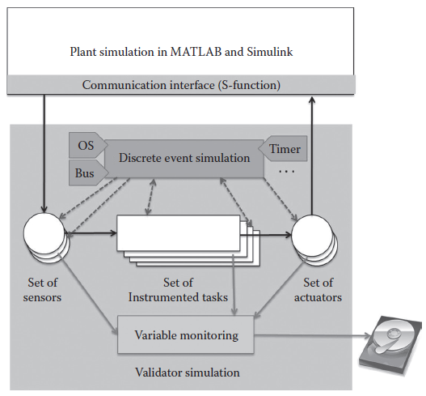
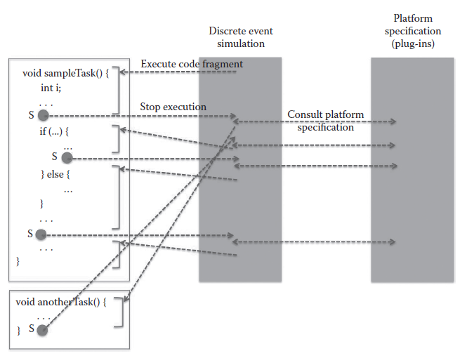

[8.1 <--- ](8_1.md) [   Зміст   ](README.md) [--> 8.3](8_3.md)

## 8.2. ARCHITECTURE OF A SIMULATION WITH THE VALIDATOR

Remember that a simulation with the Validator is a closed-loop co-simulation of the plant under control and the controller tasks. Currently, the Validator supports continuous-time plant models in MATLAB® [6] and Simulink. For that purpose, a communication interface was implemented as a MATLAB and Simulink S-function (see [Figure 8.6](#_bookmark49)). The underlying protocol for communication between the plant and the simulation with the Validator is TCP/IP. So both simulations can execute in parallel on the same computer or on different cores or, for example, for efficiency reasons, on different computers. We will extend the Validator to support co-simulation with other simulation environments in the future. For that purpose, communication interfaces must be implemented for the particular simulation environment.

**FIGURE 8.6** Architecture of a closed-loop simulation with the Validator.

The Validator also offers a file reader for processing time-stamped values of input data from recorded signals. This is useful for regression testing as discussed in Section 8.4.2.

The Validator simulation engine is a discrete event simulation that takes the platform specifications into account. The platform specifications comprising the operating system (OS), the communication bus, hardware timers, etc. are plug-ins of the Validator simulation engine. The lower half of Figure 8.6 sketches this aspect of the architecture of a Validator simulation. The discrete event simulation controls which of the tasks are executed once the control flow gets back to the discrete event simulation from a task execution. For example, based on the scheduling strategy used by the OS, a higher priority task must interrupt one with a lower priority. In such a situation, the discrete event simulation will switch the execution to the appropriate task. Dashed arrows express this control flow between the instrumented tasks and the discrete event simulation in Figure 8.6. In an analogous way, the Validator takes care of the appropriate reading of sensor values and writing of actuator values.

[Figure 8.7 ](#_bookmark50)illustrates the discrete event simulation in the Validator in more detail. As the discrete event simulation of the controller tasks proceeds from what we call a *spot* (S) within a task to the next spot, the control flow between tasks and the discrete event simulation constantly switches back and forth. In the sample scenario in Figure 8.7, the discrete event simulation starts executing sampleTask(). This task executes till it reaches the first spot and returns control to the discrete event simulation. Based on the platform specification, the discrete event simulation decides to interrupt sampleTask() and to give control to anotherTask(), for example, because that one was triggered for execution and has higher priority than sampleTask(). As anotherTask() has only one spot at the end, it executes completely and then returns the control back to the discrete event simulation. Now the discrete event simulation gives back control to sampleTask(). The discrete event simulation continues with the execution of sampleTask() also at the other two spots.

**FIGURE 8.7** Sample switching between tasks at *spots* (S).

### 8.2.1 Basic Features of the Validator

Let us conclude this overview of the architecture and some core simulation concepts by summarizing the features that result from a bare-bones setup of the Validator:

- *Variable monitoring.* The Validator allows the logging of the time-stamped values of selected variables (global variables and variables local to tasks) to a file. The variable monitor in [Figure 8.6 ](#_bookmark49)corresponds to that functionality.
- *Stop and restart simulation runs.* The Validator allows stopping a simulation and saving the state of the overall simulation, that is, the simulations of both the plant and the controller tasks. A simulation can later be restarted from a saved state.

[8.1 <--- ](8_1.md) [   Зміст   ](README.md) [--> 8.3](8_3.md)