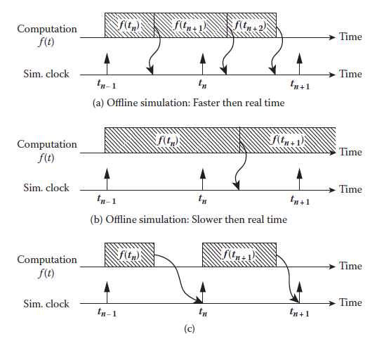
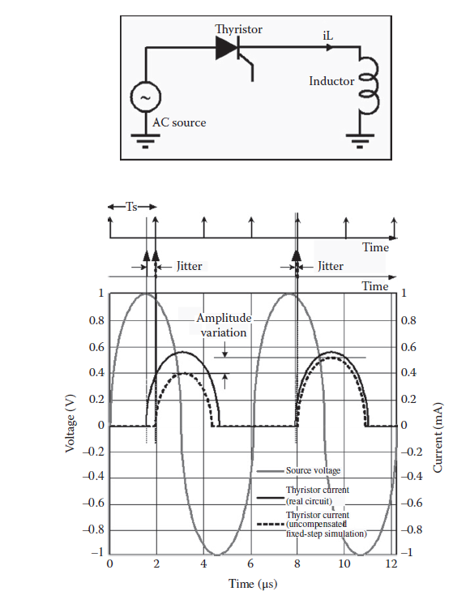
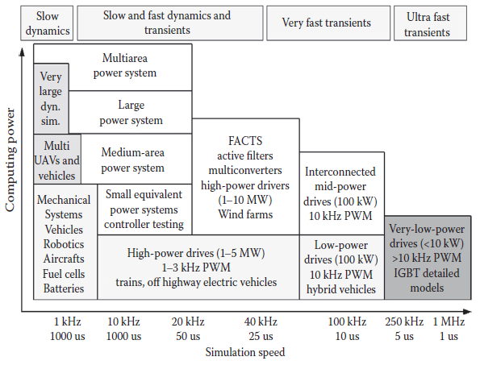
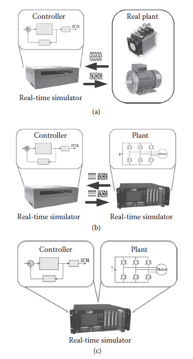

[9 <--- ](9.md) [   Зміст   ](README.md) [--> 9.2](9_2.md)

## 9.1. INTRODUCTION TO REAL-TIME SIMULATION

A simulation is a representation of the operation or features of a system through the use or operation of another system [1]. For the types of digital simulation discussed in this work, it is assumed that a simulation with discrete-time and constant-step duration is performed. During discrete-time simulation, time moves forward with constant-step duration in set slices or steps of equal duration. This is commonly known as fixed time-step simulation [2]. However, it is important to note that other solving techniques that are unsuitable for real-time simulation make use of variable time steps, which helps in solving high-frequency dynamics and nonlinear systems [3]. This subject is not covered in this chapter, but it is covered in Crosbie [4].

Симуляція — це представлення роботи або особливостей системи за допомогою використання або функціонування іншої системи [1]. Для типів цифрового моделювання, які обговорюються в цій роботі, передбачається, що виконується моделювання з дискретним часом і постійною тривалістю кроку. Під час симуляції з дискретним часом час рухається вперед із постійною тривалістю кроку в заданих сегментах або кроках однакової тривалості. Це широко відомо як моделювання з фіксованим кроком у часі [2]. Однак важливо відзначити, що інші методи розв’язування, які не підходять для моделювання в реальному часі, використовують змінні кроки часу, що допомагає у вирішенні високочастотної динаміки та нелінійних систем [3]. Ця тема не розглядається в цій главі, але вона розглядається в Crosbie [4].

To solve mathematical functions and equations at a given time step, each variable or system state is solved successively as a function of variables and states at the end of the preceding time slice. For the sake of clarity, we do not consider iterative solver methods that are not time-bounded. In real-time simulation, explicit or semiexplicit solvers such as State-Space Nodal [5] are preferred for the fact that their computational time at each iteration is predictable. During a discrete-time simulation, the amount of physical time, or real time, it takes to compute all equations and functions representing a system during a given time slice can be shorter or longer than the duration of the simulation time-step. Figures 9.1a and b represent these two possibilities. In Figure 9.1a, the computing time is shorter than a fixed time step (also referred to as accelerated simulation), while in Figure 9.1b, the computing time is longer. These two situations are referred to as offline simulation. In both cases, the moment at which a result becomes available is irrelevant. In fact, when performing offline simulation, typically the objective is to obtain results as fast as possible. The time that a system takes to produce a simulation depends on the computation power available and the mathematical complexity of the system model.

Щоб розв’язати математичні функції та рівняння на певному часовому етапі, кожна змінна або стан системи розв’язується послідовно як функція змінних і станів у кінці попереднього відрізку часу. Заради ясності ми не розглядаємо ітераційні методи розв’язування, які не обмежені в часі. У моделюванні в реальному часі явним або напівявним розв’язувачам, таким як State-Space Nodal [5], надають перевагу тому факту, що їхній час обчислення на кожній ітерації є передбачуваним. Під час симуляції в дискретному часі кількість фізичного часу або реального часу, необхідного для обчислення всіх рівнянь і функцій, що представляють систему протягом певного відрізку часу, може бути меншою або довшою за тривалість кроку за часом моделювання. Малюнки 9.1a і b представляють ці дві можливості. На малюнку 9.1a час обчислення менший за фіксований крок часу (також називається прискореним моделюванням), тоді як на малюнку 9.1b час обчислення довший. Ці дві ситуації називають офлайн-симуляцією. В обох випадках момент, коли стає доступним результат, не має значення. Насправді, під час моделювання в режимі офлайн зазвичай метою є отримання результатів якомога швидше. Час, потрібний системі для моделювання, залежить від доступної обчислювальної потужності та математичної складності моделі системи.

Conversely, during real-time simulation, the accuracy of the computations depends not only on the precise dynamic representation of the system, but also on the time duration necessary to produce results [6]. Figure 9.1c illustrates the chronological principle of a real-time simulation. For a real-time simulation to be valid, the real-time simulator that is used must accurately produce the internal variables and outputs of the simulation and do so within the same length of time that its physical counterpart would. In fact, the time required to compute the solution at a given time step must be shorter than the physical time duration of the time slice. This permits the real-time simulator to perform all operations necessary to make a real-time simulation relevant, including driving inputs and outputs (I/O) to and from externally connected devices. For a given time slice, any idle time following (or preceding) simulator operation is literally lost, as opposed to accelerated simulation, where this idle time is used to compute the equations at the next time step. In case of idle time, the real-time simulator waits until the clock ticks to the next time-step. However, if all simulator operations are not achieved within the required fixed time step, the real-time simulation is considered erroneous. Such an occurrence is commonly defined as an “overrun.”

І навпаки, під час моделювання в реальному часі точність обчислень залежить не тільки від точного динамічного представлення системи, але й від тривалості часу, необхідного для отримання результатів [6]. Рисунок 9.1c ілюструє хронологічний принцип моделювання в реальному часі. Щоб симуляція в реальному часі була дійсною, симулятор у реальному часі, який використовується, повинен точно виробляти внутрішні змінні та результати моделювання та робити це протягом того ж часу, що й його фізичний аналог. Фактично, час, необхідний для обчислення рішення на даному часовому етапі, має бути коротшим, ніж фізична тривалість часового відрізку. Це дозволяє симулятору в реальному часі виконувати всі операції, необхідні для того, щоб симуляція в реальному часі була релевантною, включаючи керування входами та виходами (I/O) до та від зовнішніх підключених пристроїв. Для певного відрізку часу будь-який час простою після (або попередньої) операції симулятора буквально втрачається, на відміну від прискореного моделювання, де цей час простою використовується для обчислення рівнянь на наступному часовому кроці. У разі простою симулятор реального часу чекає, доки годинник відмітить наступний часовий крок. Однак, якщо всі операції симулятора не виконуються протягом необхідного фіксованого кроку часу, моделювання в реальному часі вважається помилковим. Такий випадок зазвичай визначається як «перевищення».

**FIGURE 9.1** Real-time simulation requisites and other simulation techniques.

Based on these basic definitions, it can be concluded that a real-time simulator is performing as expected if the equations and states of the simulated system are solved sufficiently accurately, that is, within a user specification, depending on the type of phenomena that the user wants to observe, with an acceptable resemblance to its physical counterpart and without the occurrence of overruns.

На основі цих основних визначень можна зробити висновок, що симулятор реального часу працює належним чином, якщо рівняння та стани змодельованої системи розв’язуються достатньо точно, тобто в межах специфікації користувача, залежно від типу явищ, які користувач бажає спостерігати, маючи прийнятну схожість із своїм фізичним аналогом і без виникнення перевиконання.

### 9.1.1 Timing and Constraints

As previously discussed, real-time digital simulation is based on discrete time steps, where the simulator solves model equations successively. Proper step size duration must be determined to accurately represent system frequency response up to the fastest transient of interest. Simulation results can be validated when the simulator achieves real-time performance without overruns.

Як обговорювалося раніше, цифрове моделювання в реальному часі базується на дискретних кроках у часі, коли симулятор послідовно розв’язує рівняння моделі. Необхідно визначити належну тривалість розміру кроку, щоб точно представити частотну характеристику системи до найшвидшого цікавого перехідного процесу. Результати моделювання можна перевірити, коли симулятор досягає продуктивності в реальному часі без перевиконання.

For each time step, the simulator executes the same series of tasks: (1) read inputs and generate outputs, (2) solve model equations, (3) exchange results with other simulation nodes, and (4) wait for the start of the next step. A simplified explanation of this routine suggests that the state(s) of any externally connected device is sampled once at the beginning of each time step of the simulation. Consequently, the state(s) of the simulated system is communicated to external devices only once per time step. If not all the timing conditions of real-time simulation are met, overruns occur and discrepancies between the simulator results and the responsive of its physical counterpart are observed.

На кожному часовому етапі симулятор виконує ту саму серію завдань: (1) читає вхідні дані та генерує виходи, (2) розв’язує рівняння моделі, (3) обмінюється результатами з іншими вузлами моделювання та (4) чекає початку наступний крок. Спрощене пояснення цієї процедури передбачає, що стан(и) будь-якого зовнішнього підключеного пристрою відбирається один раз на початку кожного часового кроку симуляції. Отже, стан(и) змодельованої системи передається зовнішнім пристроям лише один раз за часовий крок. Якщо виконуються не всі часові умови симуляції в реальному часі, виникають перевиконання та спостерігаються розбіжності між результатами симулятора та чутливістю його фізичного аналога.

The inherent constraint of today’s real-time simulator is the inescapable use of a discrete-time-step solver, which can become a major limitation when simulating nonlinear systems, such as a High Voltage Direct Current (HVDC) electric power system [7], FACTS [8], active filters, or drives. When nonlinear events such as transistor switching are present in a real-time simulation, because of the nature of discrete-time-step solvers, numerical instability can occur. Different solving methods have been proposed to prevent this problem [6,9], but they cannot be used during real-time simulation.

Внутрішнім обмеженням сьогоднішнього симулятора реального часу є неминуче використання дискретного розв’язувача кроків у часі, що може стати основним обмеженням при моделюванні нелінійних систем, таких як система електроенергії постійного струму високої напруги (HVDC) [7], ФАКТИ [8], активні фільтри або приводи. Коли нелінійні події, такі як перемикання транзистора, присутні в моделюванні в реальному часі, через природу дискретних розв’язувачів із кроком у часі може виникнути числова нестабільність. Було запропоновано різні методи вирішення для запобігання цій проблемі [6,9], але вони не можуть бути використані під час моделювання в реальному часі.

Achieving real time is one thing, but achieving it synchronously is another. With nonlinear systems, there is no guarantee that switching events will occur (or should be simulated) at a discrete-time instance. Furthermore, multiple events can occur during a single time step, and without proper handling, the simulator may only be aware of the last one. Recently, real-time simulator manufacturers have proposed solutions to timing and stability problems. Proposed solutions generally known as discrete-time compensation techniques usually involve time-stamping and interpolation algorithms [8]. State-of-the-art real-time simulators take advantage of advanced I/O cards running at a sampling rate considerably faster than fixed-step simulation [10,11]. As the I/O card acquires data faster than the simulation, it can read state changes in between simulation steps. Then, at the beginning of the next time step, the I/O card passes on to the simulator not only state information, but also timing information regarding the moment at which the state change occurred. The simulator can then compensate for the timing error.

Досягнення реального часу - це одне, але досягнення цього синхронного - інше. У нелінійних системах немає гарантії, що події перемикання відбудуться (або повинні моделюватися) у момент дискретного часу. Крім того, кілька подій можуть відбуватися протягом одного тимчасового кроку, і без належної обробки симулятор може знати лише про останню. Нещодавно виробники симуляторів у режимі реального часу запропонували вирішення проблем синхронізації та стабільності. Запропоновані рішення, загалом відомі як методи компенсації дискретного часу, зазвичай включають алгоритми міток часу та інтерполяції [8]. Сучасні симулятори реального часу використовують переваги розширених плат вводу-виводу, що працюють із частотою дискретизації, значно вищою, ніж симуляція з фіксованим кроком [10,11]. Оскільки карта вводу/виводу отримує дані швидше, ніж моделювання, вона може зчитувати зміни стану між етапами моделювання. Потім, на початку наступного кроку часу, карта вводу/виводу передає симулятору не тільки інформацію про стан, але також інформацію про час щодо моменту, коли відбулася зміна стану. Потім симулятор може компенсувати похибку синхронізації.

Figure 9.2 illustrates a classic case of simulation error caused by the late firing of a thyristor in a converter circuit. In this example, a thyristor is triggered at a 90-degree angle with respect to the AC voltage source positive zero-crossing. As soon as the thyristor is triggered, current starts flowing through it. The resulting load current obtained through uncompensated real-time simulation (dotted line) is represented with some degree of error in comparison to the current flowing through the physical circuit (plain black line). This is because the event at 90 electrical degrees does not occur synchronously to the simulator fixed time step. Thus, the thyristor gate signal is only taken into account at the beginning of the next time step. This phenomenon typically induces low-frequency spurious oscillations in the simulation, for example, causing “jitter” in the motor current [12]. When jitter occurs in a discrete-time simulation, subsynchronous or uncharacteristic harmonics (amplitude variations) may be visible in the resulting waveforms. In this case, variations are evident in the thyristor current.

Рисунок 9.2 ілюструє класичний випадок помилки моделювання, спричиненої пізнім увімкненням тиристора в схемі перетворювача. У цьому прикладі тиристор спрацьовує під кутом 90 градусів щодо позитивного переходу нуля джерела напруги змінного струму. Як тільки тиристор спрацьовує, через нього починає текти струм. Результуючий струм навантаження, отриманий за допомогою некомпенсованого моделювання в реальному часі (пунктирна лінія), представлений з певним ступенем похибки порівняно зі струмом, що протікає через фізичне коло (звичайна чорна лінія). Це пояснюється тим, що подія при 90 електричних градусах не відбувається синхронно з фіксованим часовим кроком симулятора. Таким чином, сигнал затвора тиристора враховується лише на початку наступного кроку часу. Це явище зазвичай викликає низькочастотні паразитні коливання в моделюванні, наприклад, викликаючи «тремтіння» в струмі двигуна [12]. Коли тремтіння виникає під час симуляції з дискретним часом, субсинхронні або нехарактерні гармоніки (зміни амплітуди) можуть бути видимими в результуючих формах хвилі. У цьому випадку очевидні коливання струму тиристора.

**FIGURE 9.2** Timing problem in the simulation of a thyristor converter.

Finally, the use of multiple simulation tools and different step sizes during real- time simulation can cause problems. When multiple tools are integrated in the same simulation environment, a method called co-simulation, data transfer between tools can present challenges since synchronization and data validity must be maintained [13]. Furthermore, in multirate simulations, where parts of a model are simulated at different rates (with different time-step durations), result accuracy and simulation stability are also issues [14]. For example, multirate simulation may be used to simulate a thermal system with slow dynamics along with an electrical system with fast dynamics [15]. The field of multirate simulation and co-simulation environments, where multiple tools are used side by side, is still an active topic of research.

Нарешті, використання кількох інструментів моделювання та різних розмірів кроків під час моделювання в реальному часі може спричинити проблеми. Коли кілька інструментів інтегровано в одне середовище моделювання, метод називається спільним моделюванням, передача даних між інструментами може становити проблеми, оскільки синхронізація та достовірність даних повинні підтримуватися [13]. Крім того, у багатошвидкісному моделюванні, де частини моделі моделюються з різною швидкістю (з різною тривалістю кроку в часі), точність результату та стабільність моделювання також є проблемними [14]. Наприклад, багатошвидкісне моделювання може використовуватися для моделювання теплової системи з повільною динамікою разом з електричною системою з швидкою динамікою [15]. Сфера багатошвидкісного моделювання та середовищ спільного моделювання, де декілька інструментів використовуються пліч-о-пліч, все ще є активною темою досліджень.

### 9.1.2 Analysis of Simulator Bandwidth Requirements

The criteria that will dictate the capability, size, and consequently the cost of the simulator are (1) the frequency of the highest transients to be simulated, which in turn dictates minimum step size and (2) the size of the system to simulate (i.e., the number of differential/algebraic equation to compute), which along with the step size dictates the computing power required. The number of I/O channels required to interface the simulator with physical controllers or other hardware is also critically important, affecting the total performance and cost of the simulator.

Критеріями, які визначатимуть можливості, розмір і, отже, вартість симулятора, є (1) частота найвищих перехідних процесів, які потрібно моделювати, що, у свою чергу, диктує мінімальний розмір кроку та (2) розмір системи для моделювання ( тобто кількість диференціальних/алгебраїчних рівнянь для обчислення), що разом із розміром кроку визначає необхідну обчислювальну потужність. Кількість каналів введення/виведення, необхідних для інтерфейсу симулятора з фізичними контролерами або іншим обладнанням, також є критично важливою, що впливає на загальну продуктивність і вартість симулятора.

[Figure 9.3 ](#_bookmark53)outlines the typical step size and computing power required for a variety of applications. On the left-hand side of the chart, it is observed that mechanical systems with slow dynamics will generally require a simulation time step between 1 and 10 ms, according to the rule of thumb that the simulation step size should be smaller than 5% to 10% of the smallest time constant of the system. A shorter step size may be required to maintain numerical stability in stiff systems. In addition, when friction phenomena are present, simulation step sizes as low as 100–500 μs may be required.

[Малюнок 9.3 ](#_bookmark53) описує типовий розмір кроку та обчислювальну потужність, необхідну для різноманітних програм. У лівій частині діаграми видно, що механічні системи з повільною динамікою, як правило, потребуватимуть кроку моделювання в часі від 1 до 10 мс, згідно з емпіричним правилом, згідно з яким розмір кроку моделювання має бути меншим за 5%, щоб 10% від найменшої постійної часу системи. Для підтримки чисельної стабільності в жорстких системах може знадобитися менший розмір кроку. Крім того, коли присутні явища тертя, може знадобитися розмір кроку моделювання лише 100–500 мкс.

It is a common practice with electromagnetic transient (EMT) simulators to use a simulation time step of 30–50 μs to provide acceptable results for transients up to 2 kHz [16]. Because greater precision can be achieved with smaller step sizes, simulation of transient phenomena with frequency content up to 10 kHz typically require a simulation time step of approximately 10 μs.

У симуляторах електромагнітних перехідних процесів (EMT) є звичайною практикою використання кроку моделювання в 30–50 мкс для забезпечення прийнятних результатів для перехідних процесів до 2 кГц [16]. Оскільки більшої точності можна досягти за допомогою менших розмірів кроку, моделювання перехідних явищ із вмістом частоти до 10 кГц зазвичай вимагає кроку моделювання за часом приблизно 10 мкс.

Accurately simulating fast-switching power electronic devices requires the use of very small time steps to solve system equations [12]. Offline simulation is widely used in the field, but it is time consuming if no precision compromise has been made on models (i.e., by the use of average models) [17]. Power electronic converters with a higher pulse width modulation (PWM) carrier frequency in the range of 10 kHz, such as those used in low-power converters, require step sizes of less than 250 ns in duration without interpolation or 10 μs with an interpolation technique. AC circuits with higher resonance frequency and very short lines, as expected in low-voltage distribution circuits and electric rail power feeding systems, may require step sizes below 20 μs in duration. Tests that use practical system configurations and parameters are necessary to determine minimum step size and computing power required to achieve the time step chosen.

Точне моделювання швидкоперемикаючих силових електронних пристроїв вимагає використання дуже малих часових кроків для вирішення системних рівнянь [12]. Моделювання в автономному режимі широко використовується в цій галузі, але воно займає багато часу, якщо не було досягнуто компромісу щодо точності моделей (тобто за допомогою використання середніх моделей) [17]. Силові електронні перетворювачі з вищою несучою частотою широтно-імпульсної модуляції (ШІМ) у діапазоні 10 кГц, такі як ті, що використовуються в малопотужних перетворювачах, вимагають розміру кроку менше 250 нс без інтерполяції або 10 мкс із методом інтерполяції. . Для ланцюгів змінного струму з вищою резонансною частотою та дуже короткими лініями, як очікується в схемах розподілу низької напруги та системах живлення електричних рейок, можуть знадобитися розміри кроків тривалістю менше 20 мкс. Тести, які використовують практичні конфігурації та параметри системи, необхідні для визначення мінімального розміру кроку та обчислювальної потужності, необхідних для досягнення вибраного кроку за часом.

**FIGURE 9.3** Simulation time step by application.

Regardless of the simulator used, both numerical solver performance and the bandwidth of interest are considerations when selecting the appropriate step size. The standard approach for selecting a suitable fixed step size for models with increasing complexity is a time-domain comparison of waveforms for repeated runs with different step sizes.

Незалежно від симулятора, який використовується, під час вибору відповідного розміру кроку враховуються як продуктивність чисельного вирішувача, так і смуга пропускання. Стандартним підходом до вибору відповідного фіксованого розміру кроку для моделей зі зростаючою складністю є порівняння форм сигналів у часовій області для повторюваних циклів із різними розмірами кроку.

### 9.1.3 Rapid Control Prototyping

Real-time simulators are typically used in three different application categories [18–21], as illustrated in [Figure 9.4](#_bookmark54). First, in rapid control prototyping (RCP) applications (Figure 9.4a), a plant controller is implemented using a real-time simulator and is connected to a real physical plant. RCP offers many advantages over implementing an actual controller prototype. A controller prototype developed using a real-time simulator is more flexible, less time consuming to implement, and easier to debug. The controller prototype can be tuned on the fly or completely modified with just a few mouse clicks. Also, since every internal controller state is available, an RCP can be debugged faster without having to take its cover off.

Симулятори реального часу зазвичай використовуються в трьох різних категоріях додатків [18–21], як показано на [Рис. 9.4] (#_bookmark54). По-перше, у програмах швидкого керування прототипуванням (RCP) (рис. 9.4a) контролер установки реалізується за допомогою симулятора реального часу та підключений до реальної фізичної установки. RCP пропонує багато переваг перед впровадженням фактичного прототипу контролера. Прототип контролера, розроблений за допомогою симулятора реального часу, є більш гнучким, займає менше часу для впровадження та легше налагоджувати. Прототип контролера можна налаштувати на льоту або повністю модифікувати лише кількома клацаннями миші. Крім того, оскільки доступний кожен внутрішній стан контролера, RCP можна налагоджувати швидше, не знімаючи кришку.

**FIGURE 9.4** Application categories.

### 9.1.4 Hardware-in-the-Loop

For hardware-in-the-loop (HIL), the second category of applications, a physical controller is connected to a virtual plant executed on a real-time simulator, instead of to a physical plant. Figure 9.4b illustrates a small variation to HIL. In this case, an implementation of a controller using RCP is connected to a virtual plant via HIL. In addition to the advantages of RCP, HIL allows for early testing of controllers when physical test benches are not available. Moreover, virtual plants usually cost less and have parameters that have less standard deviation of the parameters due to manufacturing process or caused by environmental variations. This allows for more repeatable results and provides for testing conditions that are unavailable on real hardware, such as extreme events testing in which a real device would be damaged for example.

Для апаратного забезпечення в циклі (HIL), другої категорії додатків, фізичний контролер підключається до віртуальної установки, що виконується на симуляторі в реальному часі, а не до фізичної установки. Рисунок 9.4b ілюструє невелику варіацію HIL. У цьому випадку реалізація контролера, що використовує RCP, підключається до віртуальної установки через HIL. На додаток до переваг RCP, HIL дозволяє проводити раннє тестування контролерів, коли фізичні стенди для тестування недоступні. Крім того, віртуальні заводи зазвичай коштують дешевше та мають менші стандартні відхилення параметрів, пов’язані з виробничим процесом або змінами навколишнього середовища. Це забезпечує більш повторювані результати та забезпечує умови тестування, які недоступні на реальному апаратному забезпеченні, наприклад, тестування екстремальних подій, під час яких реальний пристрій може бути пошкоджено, наприклад.

### 9.1.5 Software-in-the-Loop

Software-in-the-loop (SIL) represents the third logical step beyond the combination of RCP and HIL. With a sufficiently powerful simulator, both controller and plant can be simulated in real time on the same simulator. SIL has the advantage over RCP and HIL that no I/O are used, thereby preserving signal integrity. Also, since both the controller and plant models run on the same simulator, timing with the outside world is no longer critical. The execution time can now be slower or faster than real time with no impact on the validity of the results. SIL can, therefore, be used for a class of simulation called accelerated simulation. In accelerated mode, a simulation runs faster than real time, allowing for a large number of tests to be performed in a short period of time. For this reason, SIL is well suited for statistical testing such as Monte Carlo simulations. SIL does not have to be done in real time because no physical device is connected to the process but because Monte Carlo simulations are very time consuming, involving typically several thousand simulation runs, a real-time simulator will result in shorter completion time than offline simulation; the simulation runs slower than real time.

Програмне забезпечення в циклі (SIL) представляє третій логічний крок після поєднання RCP і HIL. За допомогою достатньо потужного симулятора і контролер, і завод можна моделювати в режимі реального часу на одному симуляторі. Перевага SIL перед RCP і HIL полягає в тому, що не використовуються введення/виведення, що зберігає цілісність сигналу. Крім того, оскільки і контролер, і моделі рослин працюють на одному симуляторі, синхронізація із зовнішнім світом більше не є критичною. Час виконання тепер може бути повільнішим або швидшим, ніж реальний час, без впливу на достовірність результатів. Таким чином, SIL можна використовувати для класу моделювання, який називається прискореним моделюванням. У прискореному режимі симуляція працює швидше, ніж у реальному часі, що дозволяє виконувати велику кількість тестів за короткий проміжок часу. З цієї причини SIL добре підходить для статистичних тестувань, таких як моделювання за методом Монте-Карло. SIL не потрібно виконувати в режимі реального часу, оскільки до процесу не підключено жодного фізичного пристрою, але оскільки моделювання за методом Монте-Карло займає дуже багато часу, включаючи кілька тисяч прогонів моделювання, симулятор у реальному часі призведе до коротшого часу завершення, ніж моделювання в автономному режимі. ; симуляція працює повільніше, ніж у реальному часі.

[9 <--- ](9.md) [   Зміст   ](README.md) [--> 9.2](9_2.md)