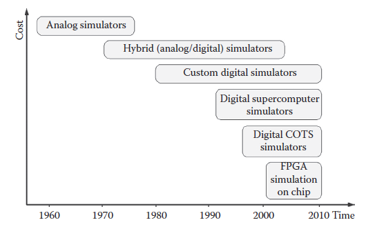

[9.1 <--- ](9_1.md) [   Зміст   ](README.md) [--> 9.3](9_3.md)

## 9.2. REAL-TIME SIMULATOR TECHNOLOGY

Simulator technology has evolved from physical/analog simulators (e.g., HVDC simulators and transient network analyzer (TNA)) for EMT and protection and control studies, to hybrid TNA/analog/digital simulators with the capability of studying electromechanical transient behavior [22], to fully digital real-time simulators, as illustrated in Figure 9.5. technologies, physical simulators have been gradually replaced with fully digital real- time simulators.

Технологія симулятора еволюціонувала від фізичних/аналогових симуляторів (наприклад, симуляторів HVDC та аналізатора перехідних процесів мережі (TNA)) для EMT та досліджень захисту та керування до гібридних TNA/аналогових/цифрових симуляторів з можливістю вивчення електромеханічної перехідної поведінки [22], до повністю цифрових симуляторів реального часу, як показано на малюнку 9.5. технології, фізичні симулятори були поступово замінені повністю цифровими симуляторами реального часу.

**FIGURE 9.5** Evolution of real-time simulation technologies.

DSP-based real-time simulators developed using proprietary technology, and used primarily for HIL studies, were the first of the new breed of digital simulator to become commercially available [23]. However, the limitations of using proprietary hardware were quickly recognized, leading to the development of commercial supercomputer-based simulators, such as HYPERSIM™ from Hydro-Quebec [24] or RTDS™ real-time simulator [25]. Attempts have been made by a number of universities and research organizations to develop fully digital real-time simulators using low-cost standard PC technology in an effort to eliminate the high costs associated with the use of high-end supercomputers [16]. Such development was very difficult due to the lack of fast, low-cost intercomputer communication links. However, the advent of low-cost, easily obtainable multicore processors [26] (from INTEL and AMD) and related commercial-off-the-shelf (COTS) computer components has directly addressed this issue, clearing the way for the development of much lower cost and easily scalable real-time simulators. The availability of this low-cost, high- performance processor technology has also reduced the need to cluster multiple PCs to conduct complex parallel simulation. This reduces dependence on sometimes costly fast intercomputer communication technology.

Симулятори реального часу на основі DSP, розроблені з використанням запатентованої технології та використовувані в основному для досліджень HIL, були першими з нової породи цифрових симуляторів, які стали комерційно доступними [23]. Однак обмеження використання пропрієтарного апаратного забезпечення були швидко визнані, що призвело до розробки комерційних симуляторів на основі суперкомп’ютерів, таких як HYPERSIM™ від Hydro-Quebec [24] або симулятор реального часу RTDS™ [25]. Ряд університетів і дослідницьких організацій робили спроби розробити повністю цифрові симулятори реального часу, використовуючи недорогу стандартну технологію ПК, щоб усунути високі витрати, пов’язані з використанням суперкомп’ютерів високого класу [16]. Така розробка була дуже складною через відсутність швидких і недорогих міжкомп'ютерних каналів зв'язку. Однак поява недорогих, легкодоступних багатоядерних процесорів [26] (від INTEL і AMD) і відповідних комерційних готових комп’ютерних компонентів (COTS) безпосередньо вирішила цю проблему, розчистивши шлях для розробки багатьох нижча вартість і легко масштабовані симулятори реального часу. Доступність цієї недорогої високопродуктивної процесорної технології також зменшила потребу в об’єднанні кількох ПК для проведення складного паралельного моделювання. Це зменшує залежність від інколи дорогої технології швидкого міжкомп’ютерного зв’язку.

COTS-based high-end real-time simulators equipped with multicore processors have been used in aerospace, robotics, automotive, and power electronic system design and testing for a number of years [27,28]. Recent advancements in multicore processor technology means that such simulators are now available for the simulation of EMT expected in large-scale power grids, microgrids, wind farms, and power systems installed in large electrical ships and aircraft. These simulators, operating under Windows, LINUX, and standard real-time operating systems, have the potential to be compatible with multidomain tools, including simulation tools. This capability enables the analysis of interactions between electrical, power electronic, mechanical, and fluid dynamic systems.

Високоякісні симулятори реального часу на основі COTS, оснащені багатоядерними процесорами, використовувалися в аерокосмічній, робототехнічній, автомобільній та силовій електронних системах проектування та тестування протягом ряду років [27,28]. Останні досягнення в технології багатоядерних процесорів означають, що такі симулятори тепер доступні для моделювання EMT, який очікується у великих електромережах, мікромережах, вітряних електростанціях та енергетичних системах, встановлених на великих електричних кораблях і літаках. Ці симулятори, що працюють під Windows, LINUX і стандартними операційними системами реального часу, мають потенціал для сумісності з багатодоменними інструментами, включаючи засоби моделювання. Ця можливість дозволяє аналізувати взаємодію між електричними, силовими електронними, механічними та гідродинамічними системами.

The latest trend in real-time simulation consists of exporting simulation models to field programmable gate arrays (FPGA) [29]. This approach has many advantages. First, computation time within each time step is almost independent of the system size because of the parallel nature of FPGAs. Second, overruns cannot occur once the model is running and timing constraints are met. Last, but most importantly, the simulation step size can be very small, in the order of 250 ns. There are still limitations on model size since the number of gates is limited in FPGAs; nevertheless, this technique is promising for the future.

Остання тенденція в моделюванні в реальному часі полягає в експорті імітаційних моделей до програмованих вентильних матриць (FPGA) [29]. Такий підхід має багато переваг. По-перше, час обчислення на кожному часовому етапі майже не залежить від розміру системи через паралельну природу FPGA. По-друге, перевиконання не може відбутися, коли модель запущена та часові обмеження виконані. Нарешті, але найважливіше, розмір кроку моделювання може бути дуже малим, порядку 250 нс. Існують обмеження на розмір моделі, оскільки кількість вентилів обмежена в FPGA; тим не менш, ця методика є перспективною на майбутнє.

[9.1 <--- ](9_1.md) [   Зміст   ](README.md) [--> 9.3](9_3.md)