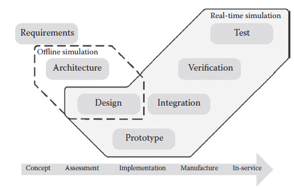
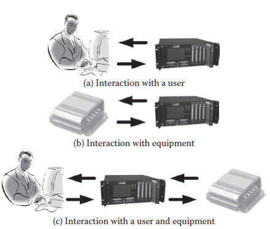

[9.2 <--- ](9_2.md) [   Зміст   ](README.md) [--> 9.4](9_4.md)

## 9.3. MODEL-BASED DESIGN USING REAL-TIME SIMULATION

This section explains how the model-based design methodology and real-time simulation technology are used together in the industrial development process.

### 9.3.1 Model-Based Design

Model-based design (MBD) is a mathematical and graphical method of addressing problems associated with the design of complex systems [30]. MBD is a methodology based on a workflow known as the “V” diagram, as illustrated in [Figure 9.6 ](#_bookmark55)[21].

**FIGURE 9.6** Model-based design workflow.

It allows multiple engineers involved in a design and modeling project to use models to communicate knowledge of the system under development in an efficient and organized manner [31]. Four basic steps are necessary in the process: (1) build the plant model, (2) analyze the plant model and synthesize a controller for it, (3) simulate the combination of plant and controller, and (4) deploy the controller.

MBD offers many advantages. By using models, it provides a common design environment available to every engineer involved in creating a system from beginning to end. Indeed, the use of a common set of tools facilitates communication and data exchange. Reusing older designs is also easier since the design environment can remain homogeneous through different projects. In addition to MBD, graphical modeling tools, such as the SimPowerSystems™ for Simulink™ from MathWorks™ [32], simplify the design task by reducing the complexity of models through the use of a hierarchical approach. Modeling techniques have also been used to embed independent coded models inside the power systems simulation tool PSCAD/ EMTDC [33].

Most commercial simulation tools provide an automatic code generator that facilitates the transition from controller model to controller implementation. The added value of real-time simulation in MBD emerges from the use of an automatic code generator [34,35]. By using an automatic code generator with a real-time simulator, an RCP can be implemented from a model with minimal effort. The prototype can then be used to accelerate integration and verification testing, something that cannot be done using offline simulation. HIL testing also offers a number of interesting possibilities. The HIL process, which is the reverse of the RCP methodology, involves implementing a plant model in a real-time simulator and connecting it to a physical controller or controller prototype. By using an HIL test bench, test engineers become part of the design workflow earlier in the process, sometimes before an actual plant becomes available. For example, by using the HIL methodology, automotive test engineers can start early testing of an automobile controller before a physical test bench is available.

Combining RCP and HIL while using the MBD approach has many advantages:

•   Design issues can be discovered earlier in the process, enabling required trade-offs to be determined and applied, thereby reducing development costs.

•   Development cycle duration is reduced because of parallelization in the workflow.

•   Testing cost can be reduced in the mediumto long-term, since HIL test setups often cost less than the physical setups and the real-time simulator used can be typically used for multiple applications and projects.

•   Testing results are more repeatable since real-time simulators evidence less variability because the dynamics do not change through time the way physical systems do.

•   Tests that are too risky or expensive to perform using physical test benches become possible.

### 9.3.2 Interact ion with the Model

Figure 9.7 illustrates the key advantage of real-time simulation: model interaction. These interactions can be (1) with a system user, (2) with physical equipment, or (3)   with both at the same time.

It is important to note that a model executed on a real-time simulator can be modified online, which is not possible with a physical plant. Any parameter of the model can be read and updated continuously. For example, in a power plant simulation, the shaft inertia of a turbine can be modified during the simulation to determine its effect on stability, something impossible on a physical power plant. Furthermore, with a real-time simulator, all model variables are accessible during execution. As an example, in a wind turbine application, the torque imposed on the generator from the gearbox is available, since it is a modeled quantity. In a physical wind turbine, obtaining a precise torque value in real time may not be possible since the cost of a torque meter may well be prohibitive.

**FIGURE 9.7** Types of simulator interaction.

Online model configuration and full data availability make previously unthinkable applications possible. An example of such an application is testing the ability of a controller to adapt to changes in a plant. It is, therefore, possible to verify if a controller can compensate for changes in the dynamics of the plant caused by component aging.

[9.2 <--- ](9_2.md) [   Зміст   ](README.md) [--> 9.4](9_4.md)