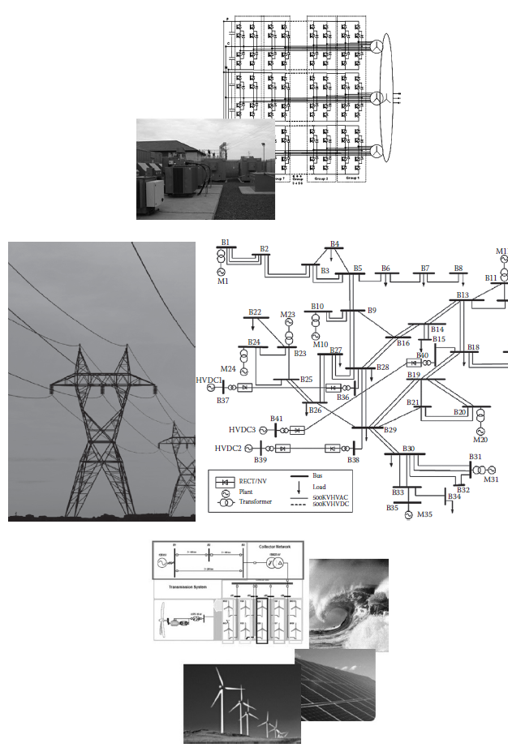
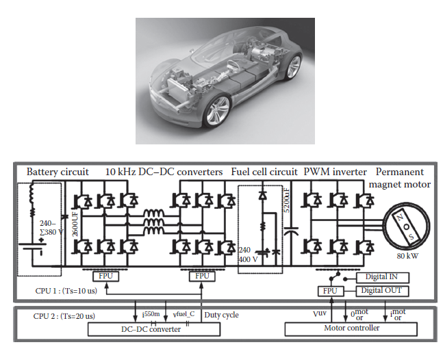
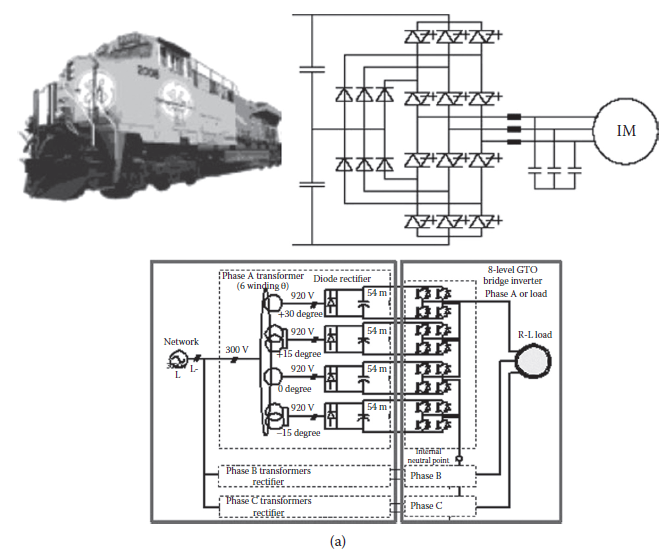
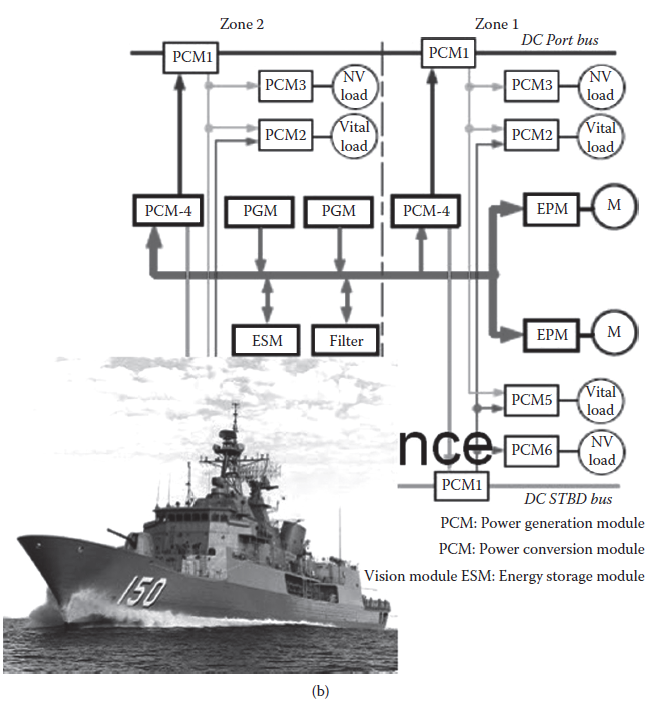
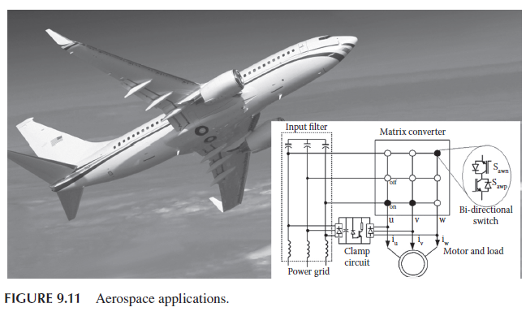
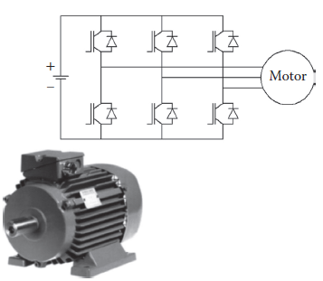
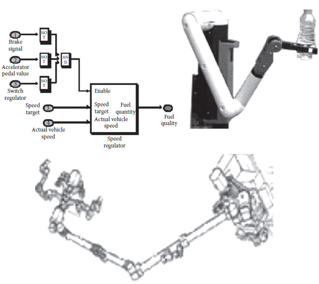
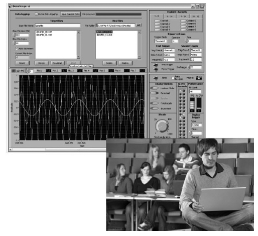
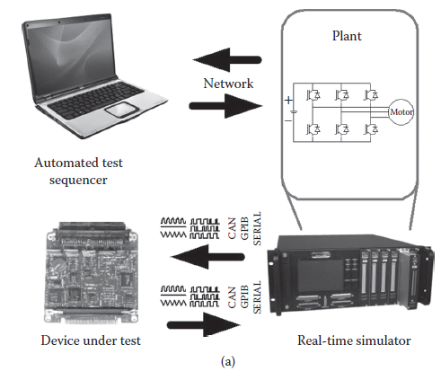
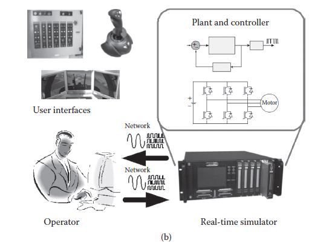

[9.3 <--- ](9_3.md) [   Зміст   ](README.md) [--> 10](10.md)

## 9.4. APPLICATION EXAMPLES

This section explains various applications of real-time simulation technology. 

### 9.4.1 Power Generation Applications

Testing of complex electric systems shown in [Figure 9.8 ](#_bookmark56)such as HVDC networks, static VAR compensators, static compensators, FACTS device control systems, and the integration of renewable energy sources in the grid, under steady state and transient operating conditions, is a mandatory practice during the controller development phase and before final system commissioning [30,36,37]. Testing is performed to reduce risk associated with conducting tests on physical networks. HIL testing must first be performed successfully with a prototype controller before the actual production controller is installed in the field. Thousands of systematic and random tests are typically required to test performance under normal and abnormal operating conditions [38]. This testing can also detect instabilities caused by unwanted interactions between control functions and the power system, which may include other FACTS devices that may interact with the system under test.

Protection and insulation coordination techniques for large power systems make use of statistical studies to deal with inherent random events, such as the electrical angle at which a breaker closes or the point-on-wave at which a fault appears [39]. By testing multiple fault occurrences, measured quantities can be identified, recorded, and stored in databases for later retrieval, analysis, and study. While traditional offline simulation software (e.g., ATP, EMTP) [40] can be used to conduct statistical studies during the development of protection algorithms, once a hardware relay is built, further evaluation and development may require using a real-time simulator. Typical studies include digital relay behavior evaluation in different power system operating conditions. Furthermore, relay action may influence the power system, increase distortions, and thus affect other relays. Closed-loop testing in real time is necessary for many system studies and for protection system development.

The integration of distributed generation (DG) devices, including microgrid applications and renewable energy sources (RES), such as wind farms, is one of the primary challenges facing electrical engineers in the power industry today [41,42]. It requires in-depth analysis and the contributions of many engineers from different specialized fields. With growing demand in the area, there is a need for engineering studies to be conducted on the impact that the interconnection of DG and RES will have on specific grids. The fact that RES and DG are usually connected to the grid using power electronic converters is a challenge in itself. Accurately simulating fast-switching power electronic devices requires the use of very short step sizes to solve system equations. Moreover, synchronous generators, which are typically the main generation sources on grids, have a slow response to EMT. The simulation of fast-switching power electronic devices in combination with slow electromechanical components in an electrical network is challenging for large grid benchmark studies, more so if proper computation resources are not available. Offline simulation is widely used in the field but is time consuming, particularly if no precision compromise is made on the models (e.g., use of average models for PWM inverters). By using real-time simulation, the overall stability and transient responses of the power system, before and after the integration of RES and DG, can be investigated in a timely matter. Statistical studies can be performed to determine worst-case scenarios, optimize power system planning, and mitigate the effect of the integration of these new energy sources.

**FIGURE 9.8** Power generation applications.

### 9.4.2 Automotive Applications

Internal combustion engine hybrid electric cars built by companies such as Toyota and Honda have become economically viable and widely available in recent years. At the same time, considerable research is underway toward the development of fuel cell hybrid electric vehicles, where the main energy source is hydrogen-based. Successful research and development of fuel cell hybrid electric vehicles requires state-of-the-art technology for design and testing. Lack of prior experience, expensive equipment, and shorter developmental cycles are forcing researchers to use MBD techniques for development of control systems [43]. For this reason, thorough testing of traction subsystems such as fuel cell hybrid vehicle is performed using HIL simulation [44], as illustrated by Figure 9.9. In this example, a real-time simulation of a realistic fuel cell hybrid electric vehicle circuit, consisting of a fuel cell, battery, DC–DC converter, and permanent magnet motor drives, with a sufficient number of I/O for real controllers in HIL mode, can now (2010) be performed with a step size duration below 10 μs [45].

 

**FIGURE 9.9** Automotive applications.

### 9.4.3 All-Electric Ships and Electric Train Networks

Today, the development and integration of controllers for electric train and allelectric ship (AES) applications is a more difficult task than ever before. Emergence of high-power switching devices has enabled the development of new solutions with improved controllability and efficiency. It has also increased the necessity for more stringent test and integration capabilities since these new topologies come with less design experience on the part of system designers. To address this issue, real-time simulation can be a very useful tool to test, validate, and integrate various subsystems of modern rail (Figure 9.10a) and marine (Figure 9.10b) vehicle devices [46]. The requirements for rail/marine vehicle test and integration reaches several levels on the control hierarchy, from low-level power electronic converters used for propulsion and auxiliary systems to high-level supervisory controls.

The modular design and redundancies built into the power system of an AES designed for combat are critical in ensuring the ship’s reliability and survivability during battle. For instance, auxiliary propulsion systems will dynamically replace the primary system in case of failure. This implies that such a power system be dynamically reconfigured, such as in zonal electric distribution systems (ZEDS) that have been recently designed for the U.S. Navy AES [47]. Therefore, power management operations must be highly efficient. Power quality issues must be kept to a minimum, and operational integrity must be as high as possible during transients caused by system reconfigurations or loss of modules.

**FIGURE 9.10** Train (a) and ship (b) applications.

**FIGURE 9.10** (*Continued*)

The design and integration of an AES’s ZEDS is challenging in many ways. Such a project requires testing of the interactions between hundreds of interconnected power electronic subsystems, built by different manufacturers. Large analog test benches or the use of actual equipment during system commissioning is, therefore, required at different stages of the project. A real-time simulator can be effectively used to perform HIL integration tests to evaluate the performance of some parts of these very complex systems, thereby reducing the cost, duration, and risks related to the use of actual equipment to conduct integration tests [40].

**FIGURE 9.11** Aerospace applications.

### 9.4.4 Aerospace

Although most aerospace applications do not necessitate the extremely short step sizes required in power generation or automotive applications, repeatability and accuracy of simulation results is crucial. Safety is a critical factor in the design of aerospace systems (Figure 9.11). Accordingly, aircraft manufacturers must conform to stringent industry standards. Developed by the U.S.-based Radio Technical Commission for Aeronautics, the DO-178B standard establishes guidelines for avionics software quality and testing in real-world conditions [48]. DO-254 is a formal standard governing design of airborne electronic hardware [49].

The complex control systems found onboard today’s aircraft are also developed and tested according to these standards. As a result, aerospace engineers must rely on high-precision testing and simulation technologies that will ensure this compliance. Of course, at the same time they must also meet the market’s demands for innovative new products, built on time, according to the specifications, and within budget.

### 9.4.5 Electric Drive and Motor Development and Testing

A critical aspect in the deployment of motor drives lies in the detection of design defects early in the design process. Simply put, the later in the process that a problem is discovered, the higher the cost to fix it. Rapid prototyping of motor controllers is a methodology that enables the control engineer to quickly deploy control algorithms and find eventual problems. This is typically performed using RCP connected in closed loop with a physical prototype of the drive to be controlled as illustrated in [Figure 9.12](#_bookmark57). This methodology implies that the physical motor drive is available at the RCP stage of the design process. Furthermore, this setup requires a second drive (such as a DC motor drive) to be connected to the motor drive under test to emulate the mechanical load. While this is a complex setup, it has proven very effective in detecting problems earlier in the design process.

**FIGURE 9.12** Smaller scale industrial and commercial applications.

In cases where a physical drive is not available or where only costly prototypes are available, an HIL-simulated motor drive can be used during the RCP development stage. In such cases, the dynamometer, physical insulated-gate bipolar transistor converter, and motor are replaced by a real-time virtual motor drive model. This approach has a number of advantages. For example, the simulated motor drive can be tested with abnormal conditions that would otherwise damage a physical motor. In addition, setup of the controlled-speed test bench is simplified since the virtual shaft speed is set by a single model signal, as opposed to using a physical bench, where a second drive would be necessary to control the shaft speed [50,51]. 

### 9.4.6 Mechatronics: Robotics and Industrial Automation

Mechatronic systems that integrate both mechanical and electronic capabilities are at the core of robotic and industrial automation applications ([Figure 9.13](#_bookmark58)). Such systems often integrate high-frequency drive technology and complex electrical and power electronic systems. Using real-time simulation to design and test such systems helps ensure greater efficiency of systems deployed in large-scale manufacturing and for unique, but growing applications of robotics [17].

### 9.4.7 Education: University Research and Development

To keep pace with the technological revolution that is underway, universities must change [52]. This transformation is necessary to create new ways to teach future engineers using a multidisciplinary approach, leveraging the possibilities offered by new tools that talented engineers are seeking, while providing them with practical experience that cultivates their creativity [53]. In this context, electronic circuit simulation programs have been in use as teaching aids for many years in electronics and control system classes. The workflow in these classes is quite straightforward: build the circuit with the circuit editor tool, run the simulation, and analyze the results. However, when it is necessary to study the effect of the variation of many parameters (e.g., oscillator frequency, duty cycle, discrete component values), this process can take a substantial amount of time [54]. In such situations, an interactive simulation based on a real-time simulator that offers the capability to change model parameters at runtime becomes a valuable teaching tool. With such a tool, changes to the model are instantly visible, providing students with the live feedback that they are looking for to acquire a feel for how a system reacts to the changes that they make to it, as illustrated in [Figure 9.14](#_bookmark59).

**FIGURE 9.13** Mechatronic applications.

### 9.4.8 Emerging Applications

Real-time simulation is being used in two additional emerging applications. Since a real-time simulator can provide outputs and read inputs, it is an ideal tool for equipment commissioning and testing, as depicted in Figure 9.15a. Not only can it mimic a physical plant, it can also emulate other devices, play a recorded sequence of events, and record a device under test response. Modern simulators can also provide simulated network connections such as CAN, GPIB, and Ethernet. The application of real-time simulators to equipment commissioning and tests is common in the manufacturing of electronic control modules. For this application, the use of real-time simulators saves test bench costs and reduces testing time.

Operator and technician training is another way to put real-time simulation to good use, as illustrated in Figure 9.15b. While this application category is in an early growth stage, it offers terrific potential. For this category of application, both controller and plant are modeled in the same simulator using an SIL-like approach. The difference is that user interfaces are added to allow the operator to interact with the simulation in a user-friendly way. Interfaces such as control panels and joysticks manage user inputs, but must also provide feedback to the user about the simulation state. The advantage of using a real-time simulator for training is that the user can acquire a feeling for the controller and plant that correctly represents the real system, without the delays and limitations commonly found in training environments that are based on prerecorded scenarios.

**FIGURE 9.14** Education applications.

**FIGURE 9.15** Emerging applications.

**FIGURE 9.15** (*Continued*)

[9.3 <--- ](9_3.md) [   Зміст   ](README.md) [--> 10](10.md)