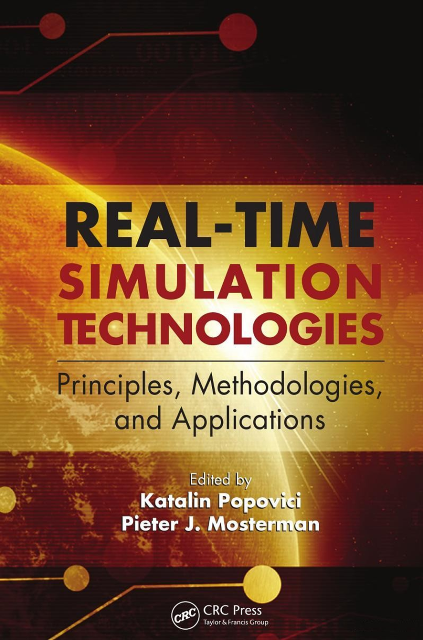

# REAL-TIME SIMULATION TECHNOLOGIES Principles, Methodologies, and Applications

Edited by Katalin Popovici Pieter J Mosterman 

## [Introduction](intro.md)

## Section i  Basic Simulation technologies and Fundamentals

### [Chapter 1](1.md). Real-Time Simulation Using Hybrid Models. 

Roy Crosbie

- [1.1](1_1.md)    Introduction: Discrete and Continuous Models
- [1.2](1_2.md)     Discrete Modeling
- [1.3](1_3.md)     Continuous Modeling
- [1.4](1_4.md)     Hybrid Models
- [1.5](1_5.md)     Real-Time Hybrid Simulation
- [1.6](1_6.md)     Concluding Remarks
- References

### [Chapter 2](2.md). Formalized Approach for the Design of Real-Time Distributed Computer Systems  

Ming Zhang, Bernard Zeigler, and Xiaolin Hu

- [2.1](2_1.md) Introduction 
- [2.2](2_2.md)   Formal Approaches to the Design of Real-Time Distributed Computer Systems
- [2.3](2_3.md)     DEVS as a Model-Based Design Formalization Tool
- [2.4](2_4.md)     DEVS-Based Formal Design Approaches for Real-Time Distributed Computing Systems
- [2.5](2_5.md)   Summary 

### [Chapter 3](3.md). Principles of DEVS Model Verification for Real-Time Embedded Applications

Hesham Saadawi, Gabriel A Wainer, and Mohammad Moallemi

### [Chapter 4](4.md). Optimizing Discrete Modeling and Simulation for Real-Time Constraints with Metaprogramming

Luc Touraille, Jonathan Caux, and David Hill

### [Chapter 5](5.md). Modeling with UML and Its Real-Time Profiles

Emilia Farcas, Ingolf H Krüger, and Massimiliano Menarini

### [Chapter 6](6.md). Modeling and Simulation of Timing Behavior with the Timing Definition Language

Josef Templ, Andreas Naderlinger, Patricia Derler, Peter Hintenaus, Wolfgang Pree, and Stefan Resmerita

## Section ii  Real-time Simulation for System Design

### [Chapter 7](7.md). Progressive Simulation-Based Design for Networked Real-Time Embedded Systems

Xiaolin Hu and Ehsan Azarnasab

### [Chapter 8](8.md). Validator Tool Suite: Filling the Gap between Conventional Software-in-the-Loop and Hardware-in-the-Loop Simulation Environments

Stefan Resmerita, Patricia Derler, Wolfgang Pree, and Kenneth Butts

### [Chapter 9](9.md). Modern Methodology of Electric System Design Using Rapid-Control Prototyping and Hardware-in-the-Loop

Jean Bélanger and Christian Dufour

### [Chapter 10](10.md). Modeling Multiprocessor Real-Time Systems at Transaction Level

Giovanni Beltrame, Gabriela Nicolescu, and Luca Fossati

### [Chapter 11](11.md). Service-Based Simulation Framework for Performance Estimation of Embedded Systems

Anders Sejer Tranberg-Hansen and Jan Madsen

### [Chapter 12](12.md). Consistency Management of UML Models

Emilia Farcas, Ingolf H Krüger, and Massimiliano Menarini

## Section iii  Parallel and Distributed Real-time Simulation

### [Chapter 13](13.md). Interactive Flight Control System Development and Validation with Real-Time Simulation. 

Hugh H T Liu

### [Chapter 14](14.md). Test Bed for Evaluation of Power Grid Cyber-Infrastructure

David C Bergman and David M Nicol

### [Chapter 15](15.md). System Approach to Simulations for Training: Instruction, Technology, and Process Engineering 

Sae Schatz, Denise Nicholson, and Rhianon Dolletski

### [Chapter 16](16.md). Concurrent Simulation for Online Optimization of Discrete Event Systems 

Christos G Cassandras and Christos G Panayiotou

## Section iV  tools and Applications

### [Chapter 17](17.md). Toward Accurate Simulation of Large-Scale Systems via Time Dilation

James Edmondson and Douglas C Schmidt

### [Chapter 18](18.md). Simulation for Operator Training in Production Machinery

Gerhard Rath 

### [Chapter 19](19.md). Real-Time Simulation Platform for Controller Design, Test, and Redesign

Savas¸ S¸ahin, Yalçın Is¸ler, and Cüneyt Güzelis¸

### [Chapter 20](20.md). Automotive Real-Time Simulation: Modeling and Applications

Johannes Scharpf, Robert Höpler, and Jeffrey Hillyard

### [Chapter 21](21.md). Specification and Simulation of Automotive Functionality Using AUTOSAR

Marco Di Natale

### [Chapter 22](22.md). Modelica as a Platform for Real-Time Simulation                

John J Batteh, Michael M Tiller, and Dietmar Winkler

### [Chapter 23](23.md). Real-Time Simulation of Physical Systems Using Simscape™ 

Steve Miller and Jeff Wendlandt

### [Chapter 24](24.md). Systematic Derivation of Hybrid System Models for Hydraulic Systems

Jeremy Hodgson, Rick Hyde, and Sanjiv Sharma