# Імітаційне моделювання в реальному часі з використанням гібридних моделей

## Дискретні та неперервні моделі

На початку розвитку імітаційного моделювання швидко виникла різниця між двома типами моделей як для імітаційного моделювання в реальному часі так і для імітаційного моделювання не в реальному часі. Їх називали:

- **дискретними моделями (discrete models)** і
- **безперервними моделями (continuous models)**, 

Пов’язані процеси назвали  дискретним імітацйним моделюванням(discrete simulation) і безперервним імітаційним моделюванням (continuous simulation). Це призвело до використання для характеристики фактичних систем, які моделювалися термінів дискретна система (discrete system) і безперервна система(continuous system), хоча часто дискретною або безперервною є не система, а модель, яка використовується для її представлення. 

Практика називання самих систем дискретними або неперервними зберігається, хоча багато фактичних систем можна представити як дискретними, так і безперервними моделями. Прикладом є транспортний потік. У дослідженнях дорожнього руху часто використовуються дискретні моделі, в яких представлено кожен транспортний засіб, і такі події, як приїзд на перехрестя або на смугу нерухомого руху, або зміна світлофора призводять до зміни стану системи. Дослідження транспортного потоку на автомагістралі, де обсяг може бути набагато більшим, однак, часто представляється безперервною моделлю, яка розглядає трафік так, ніби він є рідиною, що тече автострадою, використовуючи швидкість транспортного потоку як змінні моделі.

Дискретне та безперервне імітаційне моделювання представляють два різні підходи до моделювання динамічних систем. Обидва типи моделі вимагають, щоб система характеризувалася станом системи, який змінюється з плином часу. Саме характер цієї зміни відрізняє два підходи. Гібридна модель у свою чергу є так, яка включає елементи як дискретної, так і неперервної моделей. Перш ніж мати справу з гібридними моделями, ми розглянемо відповідні особливості дискретних і безперервних моделей.

У дискретній моделі передбачається, що стан системи змінюється в певні дискретні моменти часу і залишається незмінним між цими моментами часу. Ці зміни в стані системи відбуваються миттєво в результаті події, яка їх викликає. У дискретній моделі час рухається від події до події з відповідним оновленням стану системи під час кожної події. Пріоритезована черга майбутніх подій зазвичай підтримується як центральна структура даних, до якої вводяться нові майбутні події, коли вони ідентифікуються, і з якої береться наступна подія, коли годинник моделювання переходить до часу наступної події.

У безперервній моделі передбачається, що стан системи змінюється безперервно, як це означено диференціальними рівняннями моделі, які пов’язують миттєві швидкості зміни змінних системи з поточним станом системи. На практиці збіг часу в моделюванні є квазі-безперервним через дискретні часові кроки, прийняті алгоритмами чисельного інтегрування, які використовуються для створення наближених розв’язків диференціальних рівнянь. По суті, навіть безперервне моделювання виконується дискретно. Явища перемикання враховуються через надавання можливості відбуватися локальним розривам у змінних стану та їх похідних, у цьому випадку модель можна описати як кусково-неперервну та належить до класу гібридних систем, які обговорюються нижче. Деталі керування часом у безперервному моделюванні також обговорюються більш детально нижче.

## Дискретне моделювання

Як було сказано раніше, дискретна модель — це модель, у якій передбачається, що стан імітаційної моделі змінюється лише в певні моменти часу. Існує два основних типи систем, які можна моделювати за допомогою дискретних моделей.

- Моделі черг (Queuing Models)
- Моделі цифрових систем (digital system models)

### Моделі черг

У типовій моделі черг такі об’єкти, як замовники або деталі, надходять до пунктів обслуговування, що представляють операторів або підрозділи обслуговування, які по черзі їх обробляють. Об’єкти, що очікують, формують черги, тому як час прибуття нових об’єктів, так і час обслуговування часто генеруються зі статистичних розподілів за допомогою генераторів випадкових чисел. Зміни в стані системи, спричинені надходженням в або відправленням з черги називаються ***подіями (events)***, а час, коли відбувається подія, є ***часом події (event time)***.

Імтіаційне моделювання на основі дискретної моделі встановлює початковий стан системи та майбутню чергу подій і їх часу. Потім імітаційна модель переходить до першої з цих подій, і в стан системи вносяться відповідні зміни, які можуть генерувати зміни в записах черги, в тому числі ідентифікацію додаткових подій. Коли поточний стан системи повністю встановлено, імітаційна модель переходить до наступної події, і процес повторюється. Ця повторювана послідовність продовжується доти, доки імітаційна модель не задовольнить певну кінцеву умову. Моделі такого типу широко використовуються для представлення виробничих підприємств, розподільних мереж, об’єктів і систем обслуговування, бізнес-операцій і багатьох інших застосувань.

З часом було розроблено три основні підходи до імітаційного моделювання які використовують моделі черг:

- на основі діяльності (activity-based), 
- на основі подій (event-based) 
- на основі процесів (process-based). 

Історично термін імітаціне моделювання на основі діяльності (**activity-based**) використовувався для опису імітаційного моделювання, у якому час рухається невеликими кроками з перевіркою змін на кожному кроці. Зовсім недавно цей термін також використовувався для моделювання специфікації системи дискретних подій (DEVS, Discrete Event System Specification), де оцінюються лише компоненти, які потенційно активні (наприклад, у програмах поширення пожежі, де оцінюються лише комірки, що моделюють фронт пожежі). Оригінальний вид моделювання на основі діяльності неефективний і підходить лише для простих зстосувань. У імітаційному моделюванні на основі подій (**Event-based**) час просувається від події до події в одному програмному потоці. 

Зі збільшенням можливостей паралельних обчислень став більш популярний підхід імітаційного моделювання на основі процесів (**process-based**) з використанням паралельних процесорів і кількох програмних потоків. У цьому підході моделювання поділяється на процеси, які можна запускати паралельно. Кожен процес планує свої події в правильному порядку, але може статися виконання поза чергою, коли процес отримує подію від іншого процесу з часом події, яка виникає раніше, ніж його поточний час. Для вирішення цієї задачі використовуються дві стратегії, відомі як консервативна (conservative) та оптимістична синхронізація (optimistic synchronization). Консервативна синхронізація вимагає, щоб процес блокував свою наступну заплановану подію, поки не буде впевненим, що вона безпечна. Оптимістична синхронізація використовує підхід відкату, коли відбувається подія, яка не відповідає порядку. 

### Моделі цифрових систем (digital system models)

Моделі цифрових систем (digital system models) включають цифрові електронні схеми та системи, а також дискретні системи керування та збору даних, в яких дискретна підсистема оновлюється через типові однакові інтервали часу. Вони використовуються для представлення систем, що можна описати за допомогою різницевих рівнянь або z-перетворень.  

Цей тип дискретної моделі складається з набору різницевих рівнянь, які означують наступний стан системи з точки зору її поточного та минулого станів та її зовнішніх вхідних даних. Якщо модель означена повністю або частково за допомогою z-перетворень, зазвичай легко перетворити модель z-перетворення у форму різницевого рівняння. Враховуючи модель різницевого рівняння та коли початковий стан системи встановлено, імітаційне моделювання продовжується шляхом поступового збільшення часу на вказаний крок часу та обчислення стану системи на кожному кроці. Цей метод широко використовується при моделюванні всіх видів цифрових електронних схем, комп'ютерних систем і цифрових регуляторів. Як згадувалося раніше, безперервне імітаційне моделювання саме по собі є процесом такого роду.

### Формалізм DEVS 

**DEVS** (Discrete Event System Specification) - це формалізм, заснований на загальній теорії систем, який надає засоби опису системи, як математичного об'єкта. Концептуальна структура DEVS складається з трьох основних об’єктів: 

- *моделі (model)* - набір інструкцій, які призначені для повторення поведінки системи
- *середовище імітаційного моделювання (симулятор, simulator)* -  виконує модель (інструкції), щоб генерувати поведінку
- *експериментальної рамки (experimental frame)* - описує спосіб, у який модель виконуватиметься середовищем імітаційного моделювання

Система має часову базу, входи, стани та виходи, а також функції для означення наступних станів і виходів з урахуванням поточних станів і входів. Системи дискретних подій як і безперервні системи представляють певні плеяди таких параметрів. Наприклад, входи в системах із дискретними подіями відбуваються в довільно віддалені моменти, тоді як у неперервних системах є кусково-неперервними функціями часу. Хоча його назва та наведений вище опис свідчать про те, що DEVS обмежено моделями з дискретними подіями, його також було розширено до безперервних моделей, тому він здатний представляти гібридні моделі. 

### Керування часом для дискретного імітаційного моделювання

Керування часом при дискретному імітаційному моделюванні базується на знанні часу майбутніх подій, які або відомі *апріорі*, або зберігаються в пріоритетній черзі подій з пріоритетами, які визначаються часовим порядком подій у черзі. На початку імітаційного моделювання не обов'язково знати час усіх подій, але в багатьох випадках, поки відомий час наступної події, керування часом стає досить простим. 

Імітаційне моделювання починається зі специфікації початкового стану системи (довжина різних черг, статус серверів черг тощо). Деякі майбутні події (час надходження, час обслуговування) для різних елементів системи можна визначити за допомогою генераторів випадкових чисел. Потім час переноситься до часу наступної події та вноситься відповідні зміни до стану системи. Довжина черги може бути збільшена або зменшена за прибуттям у чергу або за завершенням обслуговування. Імітаційне моделювання продовжується по черзі між оновленнями стану системи в результаті події та просуванням часу до наступної події. Час кінцевої події означується умовою завершення, встановленою програмістом.

Використовуючи паралельне обчислення на основі методу процесів, час може рухатися несинхронізовано на різних процесорах або при використанні різних програмних потоків. Це може призвести до того, що одна частина імітаціного моделювання виходить за рамки генерації в іншому процесорі або потоці події, яка на неї впливає.  Щоб відкласти виконання процесу, поки це не стане безпечним, можна використовувати консервативне планування. Альтернативно можна використати оптимістичне планування, яке включає методи відкату часу, щоб можна було визначити вплив події, яка зайшла занадто далеко в часі щодо визнчення стану системи, але цей метод непридатний для більшості застосувань реального часу.

## Неперервне моделювання

Неперервні модель — це модель, у якій передбачається, що стан системи змінюється безперервно без миттєвих змін у значеннях станів системи або їх похідних.

Неперервні моделі зазвичай складаються з математичного опису фактичної системи за допомогою комбінації диференціальних і алгебраїчних рівнянь. Цей тип математичної моделі можна виразити у формі диференціальних рівнянь першого порядку, кожне з яких означує змінну стану системи, і додаткових рівнянь, які означують допоміжні змінні. Незалежною змінною є час, створюючи математичну модель для безперервно змінної динамічної системи. Деякі моделі можуть мати додаткові незалежні змінні (зазвичай просторові розміри), у цьому випадку математична модель формулюється як набір рівнянь у частинних похідних. Простим прикладом є моделювання змін температури вздовж тонкого металевого стрижня під час його нагрівання. Змінною стану є температура, і вона змінюється як з часом, так і з координатою уздовж стрижня. Математична модель тут — це диференціальне рівняння в частинних похідних із двома незалежними змінними — часом і просторовою координатою.

Імітаційне моделювання з використанням неперервної моделі передбачає ініціалізацію значень станів системи з наступним обчисленням початкових значень інших алгебраїчних змінних. Цей процес ініціалізації встановлює початкові значення всіх системних змінних і супроводжується повторюваним процесом покрокового збільшення часу з використанням алгоритму чисельного розв’язання диференціальних рівнянь. Часові кроки можуть мати постійний розмір (зазвичай це стосується імітаційного моделювання в реальному часі) або змінний розмір. Підпрограми зі змінними кроками зазвичай включають розрахунок похибки, що виникла на поточному кроці, і стратегію зміни розміру кроку, щоб задовольнити заданий користувачем допуск до похибки. Такі підпрограми зі змінними кроками зазвичай не підходять для імітаційного моделювання в реальному часі, оскільки час їх обчислення змінюється від кроку до кроку.

### Керування часом для неперервного моделювання

Неперервне імітаційне моделювання базується на розв’язках звичайних диференціальних рівнянь або рівнянь із частинними похідними, для яких час є змінною, що постійно змінюється, без миттєвих змін від одного значення часу до наступного. Це відрізняється від поведінки дискретного імітаційного моделювання, у якому час стрибає від одного часу події до наступного. 

У той же час комп’ютери запрограмовані на створення наближених рішень математичної моделі за допомогою чисельного наближення, у якому час рухається малими дискретними кроками. Спосіб, у який просувається час, частково означується програмістом і в основному керується алгоритмом, вибраним програмістом для вирішення рівнянь у математичній моделі. Існує багато доступних алгоритмів для розв’язування диференціальних рівнянь, і вибір алгоритму є одним із ключових рішень, які приймає користувач неперервного моделювання. Нижче коротко розглянемо різні типи та властивості алгоритмів чисельного інтегрування.

### Типи алгоритму числового інтегрування

Припустимо неперервна математична модель виражена в формі

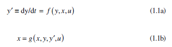

де *y* — вектор станів, *y*′ — вектор похідних за станом, *x* — вектор допоміжних змінних (алгебраїчних змінних), *u* — вектор вхідних даних, *f* і *g* є довільними, але правильними функціями.

Алгоритми числового інтегрування зазвичай обчислюють наступний стан системи в термінах поточного стану та, в деяких випадках, минулих станів. Припускається, що час просувається кінцевими кроками, що призводить до рівнянь виду

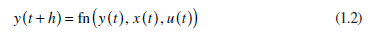

де *t* поточний час; *h* — приріст часу для поточного кроку; а *y*, *x* і *u* — стан системи, інші системні змінні та вхідні дані системи відповідно. У багатьох випадках алгоритм можна розкласти в скінченний або нескінченний ряд, який відповідає розкладу в ряд Тейлора для перших кількох членів. Ряд Тейлора можна виразити як

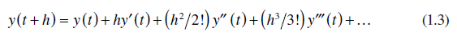

Простий метод інтегрування Ейлера, наприклад, розв’язує рівняння 1.1a та 1.1b шляхом обчислення

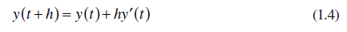

Іншими словами, інтеграція Ейлера просто екстраполює стани, *y*, припускаючи, що похідні від *y* залишаються незмінними протягом усього кроку та дорівнюють значенню на початку кроку. Процес зображено на рис. 1.1.

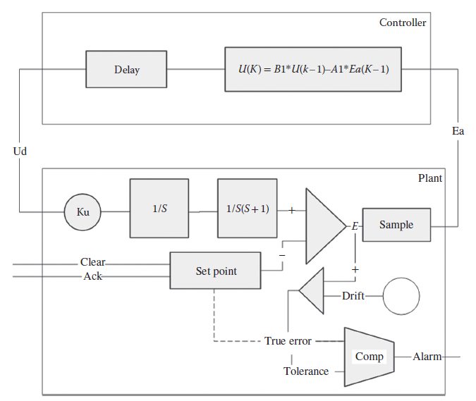

Рис. 1.1 Інтегрування Ейлера

Припустимо систему першого порядку,

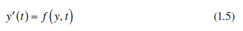 

На рис.1.1 показано частину справжнього рішення для змінної стану *y*(*t*). Початкове значення *y* дорівнює $y_0$ у момент *t* = *t*(0). Початкове значення похідної з рівняння 1.5 визначається як

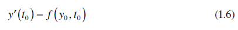

Застосовуючи інтегрування Ейлера до кроку довжиною *h*, ми маємо

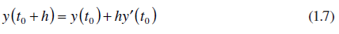

Тепер можна обчислити похідні $(t_0 + h)$

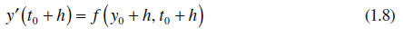

Цей процес можна повторювати до досягнення кінцевого часу.

Цей алгоритм узгоджує перші два члени ряду Тейлора (аж до члена в першій похідній *y*′) і відомий як метод першого порядку. Доступні більш складні методи, які відповідають ряду Тейлора термінам у *y*″ (методи другого порядку), *y*‴ (методи третього порядку) тощо. Ці методи на основі рядів Тейлора намагаються наблизити рішення за один крок за допомогою поліноміальної апроксимації, лінійної для першого порядку (Ейлера), квадратичної для методів другого порядку тощо.  Альтернативний підхід, заснований на експоненціальних наближеннях (HSRT), буде представлено нижче. Загалом, метод порядку *n* матиме похибку апроксимації, яка залежить від нехтованих членів ряду Тейлора, якими є члени в $h^{n+1}$ і вище. Ця похибка відома як похибка скорочення (truncation error). Додаткові похибки можуть виникати через накопичення похибок округлення, особливо при використанні форматів даних із нижчою точністю та великої кількості кроків. Як ми побачимо, це може мати особливе значення в деякому імітаційному моделюванні у реальному часі. 

Існує багато різних алгоритмів числового інтегрування. Широко використовуються методи Рунге–Кутта різних порядків. Часто обирають методи четвертого порядку Рунге–Кутта, які забезпечують хороший компроміс між точністю та обчислювальною складністю.

Двома основними факторами, які впливають на точність числового інтегрування, є порядок і розмір кроку. Загалом, похибки зменшуються зі зменшенням розміру кроку та збільшенням порядку. У крайніх випадках кроки можуть бути настільки короткими, що похибка округлення може стати проблемою, особливо з форматами даних з нижчою точністю. Зі збільшенням розміру кроку деякі алгоритми можуть стати нестабільними, навіть якщо нестабільна поведінка з’являється в точці, коли похибки до цього моменту були прийнятними. Іншими словами, прийнятні стабільні рішення можуть здійснювати швидкий перехід до неприйнятних нестабільних рішень з дуже малими збільшеннями розміру кроку.

Який би метод не було обрано для розв’язання диференціальних рівнянь у математичній моделі, результатом є їх перетворення на набір приблизно еквівалентних різницевих рівнянь. Саме ці різницеві рівняння розраховуються на кожному кроці моделювання, і спосіб реалізації цього процесу може мати значний вплив на спосіб кодування імітаційного моделювання, особливо для застосунків реального часу.

### Фіксований крок проти змінного

Один із варіантів, з якими стикаються користувачі неперервного моделювання, полягає в тому, чи використовувати алгоритм, який збільшує час рівними кроками (алгоритм із фіксованим кроком), чи той, який змінює розмір кроків часу, щоб задовольнити надані користувачем допуски похибок. Сучасні підпрограми зі змінним кроком (наприклад ODE45 в MATLAB® і Simulink® ) часто використовують підхід, у якому розраховані рішення порядку $n$ і $n − 1$ генеруються на кожному кроці, а оцінка похибки базується на різниці між ними. Обґрунтуванням цього є те, що ця різниця приблизно дорівнює значенню останнього члена в ряді Тейлора перед скороченням. Припускається, що це консервативна оцінка загальної похибки скорочення. 

Процедури з фіксованими кроками є простішими та кращими для імітаційного моделювання в реальному часі, оскільки вони призводять до постійного часу обчислення. Процедури зі змінними кроками безпечніші, популярні та часто використовуються як стандартні в тих системах моделювання, які пропонують вибір алгоритмів.

### Явні методи проти неявних

Алгоритми, які обчислюють наступний стан на основі поточних (і, можливо, попередніх) станів, мають праві частини, які можна оцінити безпосередньо, і називаються ***явними алгоритмами (explicit)***. Однак для деяких алгоритмів рівняння 1.2 змінено, щоб включити один або більше членів у $(t + h)$ у правій частині:

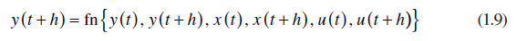

що призводить до неявної формули. 

Зазвичай це вимагає вирішення набору одночасних алгебраїчних рівнянь на кожному кроці. Якщо система рівнянь є лінійною, це часто можна зробити прямим обчисленням. Але нелінійні системи потребують ітераційної процедури вирішення на кожному кроці. Неявні методи, як правило, **непридатні** для моделювання в реальному часі, оскільки обсяг обчислень може змінюватися від кроку до кроку без *апріорі* відомої верхньої межі. Крім того, може виявитися необхідним завчасно надати вхідні дані зовнішнього апаратного забезпечення в циклі (тобто $u(t + h)$ може знадобитися в момент *t*). Однак неявні методи можуть запропонувати покращену стабільність і часто використовуються для жорстких систем.

### Однокрокові проти багатокрокових

Методи, які обговорювалися досі, є самодостатніми в межах кожного кроку та називаються однокроковими методами. Деякі методи поширюють обчислення на більш ніж один крок і називаються багатокроковими. Наприклад, значення стану системи на наступному кроці може бути визначено в термінах стану системи на поточному та попередньому кроці. Для деяких алгоритмів потрібні дані з останніх трьох або чотирьох кроків. Рівняння 1.2 тепер змінено таким чином:

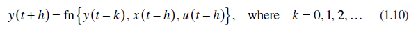 

Ці методи часто є економічно ефективними (з точки зору обсягу обчислень, необхідних для досягнення заданої точності), але вони вимагають спеціальних процедур для їх запуску, оскільки попередні дані недоступні на початку моделювання. Ці методи також можуть спричинити проблеми з гібридним імітаційним моделюванням і імітаційним моделюванням у реальному часі.

### Алгоритми зі змінним порядком і жорсткі системи

Багато алгоритмів інтеграції мають проблеми зі стабільністю при застосуванні до жорстких систем. ***Жорсткі системи (Stiff systems)*** [Wiki](https://uk.wikipedia.org/wiki/Жорстке_диференціальне_рівняння ) — це системи, які мають широку варіацію динаміки системи, яку часто описують як такі, що мають постійні часу або власні значення, що сильно відрізняються. 

Ці системи характеризуються тим, що містять як високошвидкісні, так і низькошвидкісні динамічні властивості, усі з яких повинні бути охоплені методом рішення. Коли активні високошвидкісні режими (тобто змінні швидко змінюються), для фіксації швидких змін стану необхідні короткі розміри кроків, співмірні з задіяними постійними часом. Основна проблема з жорсткими системами виникає, коли швидкі режими неактивні (тобто затухають), а траєкторії розв’язання гладкі. Як правило, для покриття плавних траєкторій використовуються більш довгі кроки, але в моделюванні жорсткої системи сплячі високочастотні режими можуть стимулюватися алгоритмом інтеграції, що спричиняє нестабільність, якщо розмір кроку не залишається коротким, що може забрати багато часу. 

Цю задачу часто вирішують за допомогою спеціальних стабільних жорстких системних алгоритмів. Одним із найвідоміших є метод Гіра, неявний метод, заснований на зворотному диференціюванні, який регулює порядок, а також розмір кроку алгоритму, щоб підтримувати як точність, так і стабільність, мінімізуючи кількість необхідних обчислень. Оригінальна процедура Gear DIFSUB була згодом вдосконалена Hindmarsh у широко використовуваній процедурі GEAR [2]. Методи зі змінним порядком та змінним кроком такого типу зазвичай не підходять для імтіаційного моделювання у реальному часі, критичних за часом.

## Гібридні моделі

Гібридна модель — це модель, яка містить характеристики як дискретної, так і безперервної моделей. Існує велика література з теорії та аналізу гібридних систем, наприклад, [3]. Для цілей розробки імітаційних моделей гібридну систему в деяких випадках можна розглядати як дискретну модель, що містить один або більше станів, які безперервно змінюються між подіями, а в інших – як безперервну модель, у якій стани змінюються безперервно протягом більшої частину часу, але в якому один або більше станів або їх похідних можуть іноді миттєво змінюватися. В інших випадках дискретні та безперервні процеси можуть бути збалансовані в інтегрованій моделі, рівномірно розподіленій між дискретними та безперервними компонентами.

Ця відмінність є важливою. Багато доступних на даний момент програмних продуктів моделювання забезпечують повну підтримку дискретних або безперервних моделей з обмеженими додатковими функціями, які підтримують альтернативний підхід. Таким чином, баланс між дискретними та неперервними елементами в моделі часто диктує вибір програмного забезпечення для імітаційного моделювання.

### Керування часом для гібридного моделювання

Незалежно від балансу між дискретними та безперервними елементами в моделі, керування часом для гібридного моделювання вимагає синхронізації між обробкою подій і неперервним випередженням часу для неперервних елементів. 

У деяких випадках період неперервного моделювання, який може мати обмежену тривалість, може бути викликаний окремою подією. У цьому випадку керування часом перемикатиметься з дискретного на безперервний режими з тривалістю часових кроків, визначеною алгоритмом інтегрування. Імітаційна модель залишатиметься в безперервному режимі, доки безперервне імітаційне моделювання не завершиться (генеруючи іншу подію) або не відбудеться подія в дискретній частині моделі, яка вплине на безперервну частину. Це може спричинити припинення безперервного моделювання або спричинити зміну вхідних даних або навіть певним чином змінити безперервну математичну модель. І навпаки, зміни в стані безперервної системи можуть генерувати нові дискретні події, наприклад, коли безперервна змінна перевищує деяке критичне значення, таке як межа температури або тиску.

Коли дискретні події відбуваються протягом періоду, в якому активний безперервний процес, важливо керувати випередженням безперервного процесу в часі так, щоб кінець кроку збігався з часом події. У цьому відношенні корисно використовувати розрізнення, між *часовими подіями* і *подіями стану*.

**Часова подія (timed event)** – це подія, для якої час події відомий заздалегідь. Прикладом може бути тактовий сигнал у системі вибірки даних. Розмір кроку чисельного інтегрування слід, де можливо, контролювати таким чином, щоб він збігався з відомим часом часових подій.

**Подія стану (state event)** – це подія, яка ініціюється умовою, яка залежить від значень стану або інших динамічних змінних у моделюванні, наприклад, підвищення температури вище встановленого значення. Природа подій стану така, що час їх подій зазвичай невідомий заздалегідь, і для їх обробки потрібні спеціальні процедури.

У застосунках, що не працюють у реальному часі, синхронізація з обома типами подій часто досягається за допомогою алгоритму інтеграції зі змінними кроками та додаткових процедур синхронізації між дискретним і безперервним моделюванням. У застосунках реального часу може знадобитися зменшити розмір кроку алгоритму інтеграції з фіксованим кроком, щоб мінімізувати похибки синхронізації. У випадку подій стану дискретна подія ініціюється безперервним моделюванням, і знову необхідно або використовувати алгоритм зі змінними кроками, щоб забезпечити точний час події, або, особливо для програм реального часу, прийняти достатньо короткий розмір кроку.

### Приклади гібридного моделювання

Розуміння методів гібридного моделювання можна полегшити, якщо спочатку розділити їх на три групи: 

- в основному неперервні з дискретними елементами, 
- в основному дискретні з неперервними елементами 
- однаково збалансовані. 

Ці відмінності найкраще можна проілюструвати простими прикладами.

Одним із прикладів в основному неперервної гібридної системи, який найчастіше цитується в літературі, є стрибаючий м’яч. Імітаційна модель стрибучого м’яча є прикладом безперервної моделі (динаміка руху м’яча) з дискретними елементами (удар об тверду поверхню). У своїй найпростішій формі неперервна модель прирівнює прискорення м’яча до прискорення сили тяжіння ($d^2x/dt^2=−g$ для *x >* 0) і передбачає сильний удар, при якому швидкість м’яча кулька змінюється миттєво ($dx/dt^+ =−k*dx/dt$), де коефіцієнт відновлення $k$ є коефіцієнтом розсіювання.

Дискретні моделі широко використовуються для представлення промислових процесів. Багато з цих моделей стосуються просування матеріалів або компонентів у процесі виробництва. Об’єкти утримуються в чергах, очікуючи, поки обладнання стане доступним для виконання наступного етапу виробничого процесу. Час обслуговування часто генерується випадковим чином за допомогою відповідного розподілу. У деяких випадках необхідно більш точно представити процес, і це може передбачати використання безперервної моделі певної частини загального виробничого процесу. Наприклад, на металургійному заводі є піч з котлом, яка використовується для нагрівання сталевих злитків. Визначено, що час між надходженнями злитків має експоненціальний розподіл із середнім значенням 1,5 години. Якщо при надходженні злитка є вільний відварний котлован, його негайно кладуть у піч. В іншому випадку його поміщають у яму для нагрівання, де передбачається, що вона зберігає свою початкову температуру, доки не буде доступна яма для замочування. У дискретному варіанті час нагрівання злитка в печі рівномірно розподіляється між 4 і 8 годинами. У гібридному варіанті вона визначається шляхом вирішення диференціального рівняння, що представляє зміну температури злитка. У подальшому варіанті моделювання температура печі вважається змінною. Зазвичай вона нагрівається до заданої кінцевої температури і також зменшується, коли в піч поміщають холодні злитки. Передбачається, що введення холодного зливка призводить до миттєвого падіння температури печі залежно від різниці між температурами печі та зливка, поділеної на кількість зливків у печі. 

Багато із задокументованих застосувань, що включають гібридне моделювання, належать до вищезазначених типів, переважно дискретних або переважно безперервних. Але є більш збалансоване гібридне моделювання.

## Гібридне імітаційне моделювання в реальному часі

Більшість імітаційних моделей у реальному часі характеризуються необхідністю включення певного фізичного компонента в імітаційну модель. Це може бути:

- апаратне забезпечення в контурі
- програмне забезпечення в контурі
- людина (або люди) в контурі. 

У всіх випадках необхідно, щоб імітаційна модель була синхронізована з годинником реального часу, щоб забезпечити правильний час взаємодії між імітаційною моделлю та зовнішнім агентом.

Виклики з якими стикаються потенційні користувачі гібридного моделювання пов'язані з виконанням в режимі реального часу. Вибір програмного забезпечення для підтримки розробки імітаційного моделювання може бути критичним, і його використання для належного представлення як неперервних, так і дискретних характеристик моделі та їх взаємодії вимагає особливої обережності. 

Важливе значення має точне керування часом, особливо точний обмін керуванням синхронізації між дискретними та безперервними процесами. На цьому етапі в імітаційній моделі в реальному часі необхідно провести різницю між розміром кроку інтеграції та часом кадру (frame time). 

**Розмір кроку інтегрування (integration step size)** – це приріст часу, на який поточний час просувається вперед за одне застосування вибраного алгоритму числового інтегрування. При моделюванні в реальному часі він зазвичай постійний. 

**Час кадру (frame time)** — це зазвичай постійний інтервал часу між передачею даних до зовнішніх елементів (інтервалу зв’язку), таких як апаратне забезпечення в контурі або інша імітаційна модель. Кадр може складатися з кількох кроків часу інтеграції. Необхідний час кадру може диктувати вибір алгоритму інтеграції, особливо для високошвидкісних імітаційних моделей у реальному часі з потребою в дуже коротких кадрах.

Основна вимога до імітаційного моделювання в реальному часі полягає в тому, що всі обчислення в кадрі повинні бути завершені протягом фіксованого часу кадру. У деяких програмах цю вимогу можна пом’якшити, дозволяючи випадкову втрату даних (можливо, спричинену затримками зв’язку, наприклад, із апаратним забезпеченням у контурі), але загалом потрібно дотримуватися вимог жорсткого реального часу.

Детальний характер гібридного моделювання в реальному часі певною мірою залежить від тривалості прийнятного часу кадру, який може варіюватися в різних типах застосувань від секунд до мікросекунд. Рідше проблемою для більш тривалого часу кадру є здатність процесора або процесорів виконувати необхідні обчислення за доступний час. Ключовою ж проблемою є синхронізація часу між різними частинами імітаційної моделі, особливо в тих випадках, коли моделювання розподілено між різними системами.

Розподілені імтаційні моделі реального часу часто включають різні компоненти програмного забезпечення, які потрібно інтегрувати в єдину імітаційну модель. Головним стає питання сумісності між програмними елементами. Для підтримки такого типу взаємодії було розроблено спеціальні програмні середовища. Однією з найбільш широко використовуваних є архітектура високого рівня (**HLA**, high-level architecture) [4]. Ця архітектура широко використовується, особливо у військових застосуваннях, де використовуються різні імітаційні моделі, що працюють на різних платформах у різних географічних місцях. Імітаційна модель в HLA відома як ***федерація (federation)***, а її компоненти — як ***федерати (federates)***. Дані, які передаються між різними федератами за допомогою техніки публікації та підписки, мають мітку часу, щоб забезпечити підтримку синхронізації часу за допомогою інтерфейсу реального часу. Wainer, Kim та ін. [5,6] описали кілька цікавих гібридних імітаційних моделей реального часу на основі DEVS. Вони використовують інтерфейс, що підтримує комбінації компонентів моделі, які використовують різне програмне забезпечення на основі DEVS. Доступно кілька комерційних систем, які підтримують гібридне моделювання в реальному часі.

## Заключення

Ми побачили, що ключ до гібридного моделювання полягає в підході до керування часом і синхронізації подій між різними частинами моделювання.

Спочатку ми розглянули вимоги не в реальному часі. Загалом, дискретне моделювання зазвичай просувається з неоднаковими кроками в часі від події до події, а безперервне моделювання також більш імовірно просувається з нерівними кроками в часі, використовуючи алгоритми зі змінними кроками. І дискретне, і неперервне моделювання можуть використовувати фіксовані кроки часу. Вони зазвичай використовуються для моделювання систем з дискретним часом, таких як цифрові контролери, і є ознакою старішого підходу до дискретного моделювання на основі діяльності. Однак, якщо це можливо, використання змінних кроків за часом може забезпечити значне покращення якості.

Для імітаційного моделювання в реальному часі важливим фактором є доступна швидкість комп’ютера. Якщо комп’ютер здатний виконувати код значно швидше, ніж відповідні реальні події, тоді йому можна дозволити простоювати, поки реальні події наздоганяють. Насправді, хоча часто зазначається, що алгоритми інтегрування зі змінним кроком непридатні для неперервного моделювання в реальному часі, їх використання, особливо в поєднанні з фіксованим часом кадру, є доцільним до тих пір, поки можна гарантувати, що найдовший можливий час виконання обчислень у кадрі буде меншим за доступний час

Для гібридного моделювання в реальному часі керування часом має бути здатним просувати неперервне моделювання з фіксованими кроками (або кадрами) до часу наступної дискретної події. Синхронізація фіксованого приросту часу, застосованого до безперервного моделювання, зі змінними приростами між подіями в дискретному моделюванні є ключовим фактором у протоколі керування часом. Якщо кроки часу неперервного моделювання є достатньо короткими, то похибки синхронізації, які є результатом застосування фіксованого кроку часу вважалися прийнятними. Є методи які допомагають компенсувати ці похибки. Альтернативою, яка ширше використовується для моделювання не в реальному часі, було б використання методів, які означують час, коли відбуваються неминучі події стану, і регулюють розмір кроку, щоб збігатися з подією. Однак у реальному часі це вводить подвійний крок, у якому час спочатку просувається до часу події стану, а потім продовжується до кінця звичайного кроку. Це можна зробити, лише якщо доступна потужність процесора може вмістити подвійний крок плюс накладні витрати, пов’язані з визначенням місця події стану. Ситуація може бути ще більше ускладнена методами багатошвидкісної передачі, які вимагають від обробника подій відстежувати різні послідовності подій фіксованого приросту для різних швидкостей, а також дискретні події для кожного сегмента багатошвидкісної передачі.

Розробка гібридних імітаційних моделей у реальному часі у багатьох випадках є складним завданням із наявними сьогодні програмними продуктами моделювання. Картина є найбільш багатообіцяючою для застосувань, які є переважно дискретними з обмеженими безперервними елементами або переважно безперервними з дискретними елементами, обмеженими подіями перемикання. Додавання потреби в більш повних і збалансованих дискретних/безперервних функціях, подібних до описаного вище прикладу, або для високошвидкісного, або для багатошвидкісного моделювання значно підвищує ступінь складності та, швидше за все, включатиме детальне програмування алгоритмів і керування часом. 

## Література

1) REAL-TIME SIMULATION TECHNOLOGIES Principles, Methodologies, and Applications. Edited by Katalin Popovici Pieter J Mosterman 2013
2) Byrne, G. D., A. C. Hindmarsh, K. R. Jackson, and H. G. Brown. 1977. “A Comparison of Two ODE Codes: GEAR and EPISODE.” *Computers & Chemical Engineering* 1 (2): 133–47.
3) Goebel, R., R. G. Sanfelice, and A. R. Teel. 2009. “Hybrid Dynamical Systems.” *IEEE Control Systems Magazine* 29 (2): 28–93.
4) Kuhl, F., R. Weatherly, and J. Dahmann. 1999. *Creating Computer Simulation Systems: An* *Introduction to the High-Level* *Architecture*. Upper Saddle River, NJ: Prentice Hall PTR.
5) Moallemi, M., and G. Wainer. 2010. “Designing an Interface for Real-Time and Embedded DEVS.” In *Proceedings of Symposium on Theory of Modeling and Simulation* *(DEVS10)*, Orlando, FL, April 11–15, 2010, SCS.
6) Cho, S. M., and T. G. Kim. 1998. “Real-Time DEVS Simulation: Concurrent, Time- Selective Execution of Combined RT-DEVS Model and Interactive Environment.” In *Proceedings of 1998 Summer Computer Simulation Conference*, Reno, NV, July 19–22, 1998, SCS. 